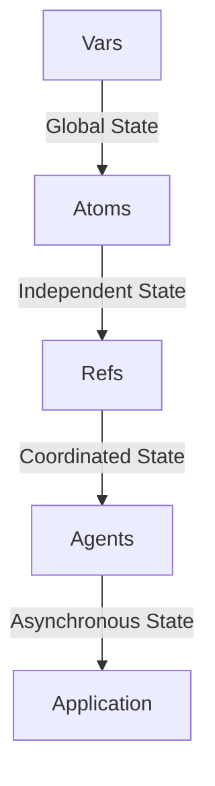

## 3.3 Variables and State Management

As experienced Java developers, you're accustomed to managing state through mutable objects and variables. Transitioning to Clojure, a functional programming language, requires a paradigm shift in how we think about state and variables. In this section, we'll explore how Clojure handles variables and state management using its unique constructs like vars, atoms, refs, and agents. We'll also delve into how these constructs align with the principles of functional programming, emphasizing immutability and concurrency.

### Understanding Variables in Clojure

In Java, variables are mutable by default, allowing their values to change over time. This mutability is often managed through encapsulation within classes. Clojure, however, embraces immutability, which means once a value is assigned to a variable, it cannot be changed. This approach simplifies reasoning about code and enhances concurrency.

#### Vars in Clojure

Vars in Clojure are similar to static variables in Java. They are used to define global bindings that can be dynamically altered. However, unlike Java's static variables, vars in Clojure are thread-safe and can be redefined at runtime, making them suitable for managing global state in a controlled manner.

```clojure
(def my-var 10) ; Define a var with an initial value of 10

(defn update-var []
  (alter-var-root #'my-var (constantly 20))) ; Update the var to a new value

(update-var)
(println my-var) ; Output: 20
```

In this example, `my-var` is a var that initially holds the value 10. The `update-var` function uses `alter-var-root` to change its value to 20. This demonstrates how vars can be dynamically updated while maintaining thread safety.

### Managing State in a Functional Paradigm

Clojure provides several constructs for managing state in a functional way, each suited for different use cases. These constructs include atoms, refs, and agents, which allow us to handle state changes in a controlled and predictable manner.

#### Atoms: Managing Independent State

Atoms are used for managing independent, synchronous state changes. They provide a way to manage state that can be updated atomically, ensuring that changes are consistent and visible to all threads.

```clojure
(def counter (atom 0)) ; Define an atom with an initial value of 0

(defn increment-counter []
  (swap! counter inc)) ; Atomically increment the counter

(increment-counter)
(println @counter) ; Output: 1
```

Here, `counter` is an atom that starts at 0. The `increment-counter` function uses `swap!` to atomically increment its value. The `@` symbol is used to dereference the atom and access its current value.

#### Refs: Coordinating Shared State

Refs are used for managing coordinated, synchronous state changes across multiple variables. They leverage Software Transactional Memory (STM) to ensure that changes are atomic and consistent.

```clojure
(def account1 (ref 1000))
(def account2 (ref 2000))

(defn transfer [amount]
  (dosync
    (alter account1 - amount)
    (alter account2 + amount)))

(transfer 100)
(println @account1) ; Output: 900
(println @account2) ; Output: 2100
```

In this example, `account1` and `account2` are refs representing bank account balances. The `transfer` function uses `dosync` to ensure that the transfer operation is atomic, preventing inconsistent state.

#### Agents: Asynchronous State Management

Agents are used for managing asynchronous state changes. They allow updates to be performed in the background, making them ideal for tasks that don't require immediate consistency.

```clojure
(def log-agent (agent [])) ; Define an agent with an initial empty vector

(defn log-message [message]
  (send log-agent conj message)) ; Asynchronously add a message to the log

(log-message "System started")
(println @log-agent) ; Output: ["System started"]
```

Here, `log-agent` is an agent that starts with an empty vector. The `log-message` function uses `send` to asynchronously add messages to the log. The state of the agent is updated in the background, allowing the program to continue executing without waiting for the update to complete.

### Comparing Java and Clojure State Management

Let's compare how Java and Clojure handle state management, highlighting the differences and similarities.

#### Java Example: Mutable State

```java
public class Counter {
    private int count = 0;

    public synchronized void increment() {
        count++;
    }

    public int getCount() {
        return count;
    }
}

Counter counter = new Counter();
counter.increment();
System.out.println(counter.getCount()); // Output: 1
```

In Java, the `Counter` class uses a mutable `count` variable, with synchronized methods to ensure thread safety. This approach can lead to complex code when managing concurrent updates.

#### Clojure Example: Immutable State

```clojure
(def counter (atom 0))

(defn increment-counter []
  (swap! counter inc))

(increment-counter)
(println @counter) ; Output: 1
```

In Clojure, the `counter` is an atom, providing a simpler and more concise way to manage state. The use of `swap!` ensures atomic updates without the need for explicit synchronization.

### Visualizing State Management in Clojure

To better understand how Clojure's state management constructs work, let's visualize the flow of data through these constructs.



**Diagram Description:** This flowchart illustrates how different Clojure constructs manage state. Vars handle global state, atoms manage independent state, refs coordinate shared state, and agents handle asynchronous state changes.

### Best Practices for State Management in Clojure

1. **Favor Immutability:** Embrace immutability wherever possible to simplify reasoning about code and enhance concurrency.
2. **Choose the Right Construct:** Use atoms for independent state, refs for coordinated state, and agents for asynchronous state changes.
3. **Minimize Global State:** Limit the use of vars to reduce complexity and potential side effects.
4. **Leverage STM:** Use refs and `dosync` for transactions that require consistency across multiple state changes.

### Knowledge Check

- **Why is immutability important in functional programming?**
- **How do atoms differ from refs in Clojure?**
- **What are the benefits of using agents for state management?**

### Try It Yourself

Experiment with the code examples provided. Try modifying the `transfer` function to handle multiple accounts, or use agents to manage a task queue. Observe how Clojure's constructs simplify state management compared to Java.

### Further Reading

- [Clojure Official Documentation](https://clojure.org/reference/atoms)
- [ClojureDocs: Atoms](https://clojuredocs.org/clojure.core/atom)
- [ClojureDocs: Refs](https://clojuredocs.org/clojure.core/ref)
- [ClojureDocs: Agents](https://clojuredocs.org/clojure.core/agent)

## **Quiz: Are You Ready to Migrate from Java to Clojure?**



### What is the primary benefit of immutability in Clojure?

- [x] Simplifies reasoning about code and enhances concurrency
- [ ] Allows for mutable state changes
- [ ] Increases code complexity
- [ ] Requires more memory

> **Explanation:** Immutability simplifies reasoning about code and enhances concurrency by ensuring that data cannot be changed unexpectedly.

### Which Clojure construct is used for managing independent state changes?

- [x] Atoms
- [ ] Refs
- [ ] Agents
- [ ] Vars

> **Explanation:** Atoms are used for managing independent, synchronous state changes in Clojure.

### How do refs ensure consistency in Clojure?

- [x] By using Software Transactional Memory (STM)
- [ ] By allowing mutable state changes
- [ ] By using asynchronous updates
- [ ] By locking resources

> **Explanation:** Refs use Software Transactional Memory (STM) to ensure atomic and consistent state changes.

### What is the purpose of agents in Clojure?

- [x] To manage asynchronous state changes
- [ ] To manage global state
- [ ] To manage coordinated state changes
- [ ] To manage independent state changes

> **Explanation:** Agents are used for managing asynchronous state changes, allowing updates to be performed in the background.

### Which Clojure construct is suitable for managing global state?

- [x] Vars
- [ ] Atoms
- [ ] Refs
- [ ] Agents

> **Explanation:** Vars are used for managing global state in Clojure, similar to static variables in Java.

### What is the role of the `swap!` function in Clojure?

- [x] To atomically update the value of an atom
- [ ] To asynchronously update the value of an agent
- [ ] To alter the value of a ref
- [ ] To define a new var

> **Explanation:** The `swap!` function is used to atomically update the value of an atom in Clojure.

### How does Clojure handle state management differently from Java?

- [x] By emphasizing immutability and using constructs like atoms, refs, and agents
- [ ] By allowing mutable state changes
- [ ] By using synchronized methods
- [ ] By using static variables

> **Explanation:** Clojure handles state management by emphasizing immutability and using constructs like atoms, refs, and agents.

### What is the benefit of using `dosync` in Clojure?

- [x] It ensures atomic and consistent state changes across multiple refs
- [ ] It allows for asynchronous updates
- [ ] It manages global state
- [ ] It defines new vars

> **Explanation:** `dosync` ensures atomic and consistent state changes across multiple refs in Clojure.

### Which construct would you use for a task that requires immediate consistency?

- [x] Refs
- [ ] Atoms
- [ ] Agents
- [ ] Vars

> **Explanation:** Refs are used for tasks that require immediate consistency, leveraging STM for atomic updates.

### True or False: Clojure's state management constructs are inherently thread-safe.

- [x] True
- [ ] False

> **Explanation:** Clojure's state management constructs, such as atoms, refs, and agents, are inherently thread-safe, ensuring consistent and predictable state changes.



Now that we've explored how immutable data structures work in Clojure, let's apply these concepts to manage state effectively in your applications. By embracing Clojure's functional paradigm, you can simplify state management and enhance the scalability and maintainability of your systems.
