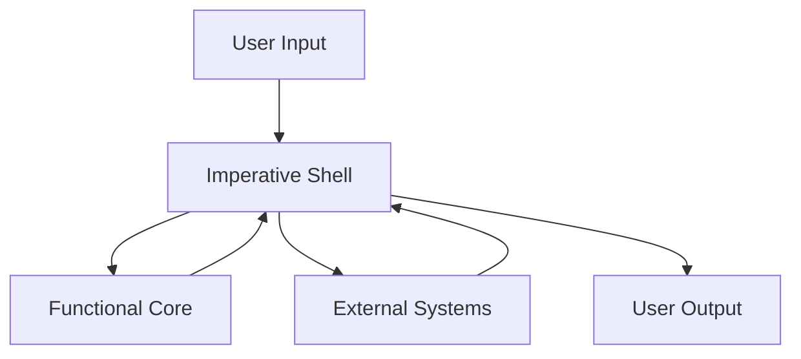

## 10.2.1 Separation of Pure and Impure Code

In the realm of software development, maintaining a clear separation between pure and impure code is a cornerstone of functional programming. This practice not only enhances code maintainability and testability but also aligns with the principles of immutability and side-effect management. In this section, we delve into the importance of this separation, introduce the "functional core and imperative shell" pattern, and provide practical guidance on implementing these concepts in Clojure.

### Understanding Pure and Impure Functions

Before we explore the separation of pure and impure code, it's essential to understand what distinguishes pure functions from impure ones.

#### Pure Functions

A pure function is characterized by the following properties:

1. **Deterministic Output**: Given the same input, a pure function will always produce the same output.
2. **No Side Effects**: Pure functions do not alter any state or interact with the outside world (e.g., no I/O operations, no modifying global variables).

Pure functions are the building blocks of functional programming. They are predictable, easy to test, and facilitate reasoning about code behavior.

#### Impure Functions

Impure functions, on the other hand, may exhibit one or both of the following traits:

1. **Non-Deterministic Output**: The output may vary even with the same input due to external factors (e.g., reading from a file or a database).
2. **Side Effects**: These functions interact with the outside world, such as performing I/O operations, modifying global state, or updating a database.

Impure functions are necessary for real-world applications, as they enable interaction with external systems and state management.

### The Importance of Separation

Separating pure and impure code is crucial for several reasons:

1. **Testability**: Pure functions are inherently easier to test because they do not depend on external state or produce side effects. This allows for isolated unit tests that are fast and reliable.

2. **Maintainability**: By isolating side effects, the core logic of the application remains clean and focused. This separation simplifies debugging and reduces the risk of unintended consequences when modifying code.

3. **Concurrency**: Pure functions are naturally thread-safe, enabling safer concurrent execution without the need for complex synchronization mechanisms.

4. **Reasoning and Refactoring**: Code that is free from side effects is easier to reason about and refactor, as it behaves predictably and consistently.

### The Functional Core and Imperative Shell Pattern

The "functional core and imperative shell" pattern is a design approach that encapsulates the separation of pure and impure code. This pattern divides the application into two distinct layers:

1. **Functional Core**: This layer contains pure functions that implement the core business logic. It is free from side effects and interacts only with data passed as arguments.

2. **Imperative Shell**: This layer handles side effects and orchestrates the flow of data between the functional core and the outside world. It is responsible for I/O operations, state management, and integration with external systems.

#### Diagram: Functional Core and Imperative Shell



In this diagram, the imperative shell acts as an intermediary between user input/output and external systems, while the functional core remains isolated and focused on pure computation.

### Implementing the Pattern in Clojure

Clojure, with its emphasis on immutability and functional programming, is well-suited for implementing the functional core and imperative shell pattern. Let's explore how to structure a Clojure application using this pattern.

#### Step 1: Define the Functional Core

The functional core should consist of pure functions that encapsulate the application's business logic. These functions should take data as input, process it, and return results without causing side effects.

**Example: Pure Function for Calculating Discounts**

```clojure
(defn calculate-discount
  [price discount-rate]
  (* price (- 1 discount-rate)))
```

In this example, `calculate-discount` is a pure function that computes the discounted price based on the original price and discount rate. It does not modify any external state or perform I/O operations.

#### Step 2: Implement the Imperative Shell

The imperative shell is responsible for managing side effects and coordinating interactions with the functional core. This layer typically includes functions that handle I/O operations, state updates, and integration with external systems.

**Example: Imperative Shell for Processing Orders**

```clojure
(defn process-order
  [order]
  (let [discounted-price (calculate-discount (:price order) (:discount-rate order))]
    (println "Processing order for" (:customer-name order) "with total price:" discounted-price)
    ;; Simulate saving to a database
    (save-order-to-db order discounted-price)))
```

In this example, `process-order` is an impure function that interacts with the functional core (`calculate-discount`) and performs side effects such as printing to the console and saving data to a database.

#### Step 3: Orchestrate the Application Flow

The application flow should be orchestrated in a way that minimizes the impact of side effects on the functional core. This involves designing the application architecture to ensure that data flows smoothly between the imperative shell and the functional core.

**Example: Main Application Entry Point**

```clojure
(defn -main
  [& args]
  (let [orders (fetch-orders-from-api)]
    (doseq [order orders]
      (process-order order))))
```

In this example, the `-main` function serves as the entry point for the application. It fetches orders from an external API and processes each order using the imperative shell (`process-order`), which in turn leverages the functional core.

### Best Practices for Separation

To effectively separate pure and impure code, consider the following best practices:

1. **Identify Side Effects Early**: During the design phase, identify which parts of the application will involve side effects and isolate them in the imperative shell.

2. **Minimize Impure Code**: Strive to keep the imperative shell as thin as possible, delegating as much logic as possible to the functional core.

3. **Use Dependency Injection**: Pass dependencies (e.g., database connections, configuration) as arguments to impure functions, rather than relying on global state.

4. **Leverage Clojure's Immutable Data Structures**: Use Clojure's persistent data structures to manage state changes without side effects.

5. **Test Pure Functions Thoroughly**: Focus on testing the functional core with unit tests, ensuring that the business logic is correct and robust.

6. **Mock External Systems**: Use mocking techniques to simulate interactions with external systems during testing, allowing you to test the imperative shell in isolation.

### Common Pitfalls and Optimization Tips

While separating pure and impure code offers numerous benefits, there are common pitfalls to be aware of:

1. **Over-Engineering**: Avoid over-complicating the separation by creating unnecessary abstractions. Focus on clear and concise boundaries between the functional core and imperative shell.

2. **Neglecting Performance**: While purity is important, don't ignore performance considerations. Optimize critical paths in the functional core for efficiency.

3. **Ignoring Error Handling**: Ensure that the imperative shell includes robust error handling to manage failures in external systems gracefully.

4. **Inconsistent Data Flow**: Maintain a consistent data flow between the functional core and imperative shell to avoid data inconsistencies and bugs.

### Conclusion

The separation of pure and impure code is a fundamental principle of functional programming that enhances the maintainability, testability, and reliability of software applications. By adopting the functional core and imperative shell pattern in Clojure, developers can create robust systems that are easier to reason about and extend.

This approach not only aligns with Clojure's functional programming paradigm but also empowers developers to build scalable and maintainable applications. By following best practices and avoiding common pitfalls, you can harness the full potential of functional programming to deliver high-quality software solutions.

## Quiz Time!



### What is a key characteristic of pure functions?

- [x] They produce the same output for the same input.
- [ ] They can modify global state.
- [ ] They perform I/O operations.
- [ ] They depend on external systems.

> **Explanation:** Pure functions are deterministic and produce the same output for the same input, without side effects.

### Which layer in the functional core and imperative shell pattern handles side effects?

- [ ] Functional Core
- [x] Imperative Shell
- [ ] Both layers
- [ ] Neither layer

> **Explanation:** The imperative shell is responsible for handling side effects and interactions with external systems.

### What is the primary benefit of separating pure and impure code?

- [x] Improved testability and maintainability
- [ ] Increased code complexity
- [ ] Reduced performance
- [ ] More global state

> **Explanation:** Separating pure and impure code improves testability and maintainability by isolating side effects.

### In Clojure, which data structure is recommended for managing state changes without side effects?

- [x] Persistent data structures
- [ ] Mutable arrays
- [ ] Global variables
- [ ] Dynamic bindings

> **Explanation:** Clojure's persistent data structures allow for state management without side effects.

### What is a common pitfall when separating pure and impure code?

- [x] Over-engineering the separation
- [ ] Using pure functions
- [ ] Minimizing side effects
- [ ] Testing pure functions

> **Explanation:** Over-engineering the separation can lead to unnecessary complexity and abstractions.

### How can you test the imperative shell in isolation?

- [x] Use mocking techniques
- [ ] Ignore external dependencies
- [ ] Test only the functional core
- [ ] Avoid testing the shell

> **Explanation:** Mocking techniques allow you to simulate interactions with external systems for isolated testing.

### What is a recommended practice for passing dependencies to impure functions?

- [x] Use dependency injection
- [ ] Use global variables
- [ ] Hardcode dependencies
- [ ] Avoid passing dependencies

> **Explanation:** Dependency injection allows for better control and testability of impure functions.

### Which of the following is NOT a property of pure functions?

- [ ] Deterministic output
- [ ] No side effects
- [x] Interaction with external systems
- [ ] Predictable behavior

> **Explanation:** Pure functions do not interact with external systems, which would introduce side effects.

### What should the functional core focus on?

- [x] Pure computation and business logic
- [ ] Managing I/O operations
- [ ] Handling external systems
- [ ] Performing side effects

> **Explanation:** The functional core should focus on pure computation and business logic, free from side effects.

### True or False: The functional core and imperative shell pattern is only applicable to Clojure.

- [ ] True
- [x] False

> **Explanation:** The functional core and imperative shell pattern is a general design approach applicable to various programming languages, not just Clojure.


