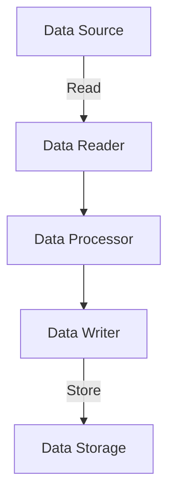

## 10.5 Case Study: Building a Data Importer with Controlled Side Effects

In the world of software development, data importers play a crucial role in integrating disparate systems by reading data from external sources, processing it, and storing the results in a structured format. This case study will guide you through the development of a data importer using Clojure, with a focus on managing side effects and maintaining functional purity. By the end of this chapter, you'll understand how to structure your code to keep side effects at the edges and ensure that the core processing logic remains pure and testable.

### Understanding the Problem Domain

Before diving into the implementation, it's essential to understand the problem domain and the requirements of our data importer. The goal is to build a system that can:

1. **Read Data from External Sources**: This could include files, databases, or APIs.
2. **Process the Data**: Apply transformations, validations, and enrichments.
3. **Store the Results**: Save the processed data into a database or another storage system.

#### Challenges in Data Importing

- **Handling Side Effects**: Reading from and writing to external systems are inherently side-effectful operations.
- **Error Handling**: Robust error handling is necessary to manage failures in data retrieval or storage.
- **Performance**: Efficiently processing large volumes of data.
- **Scalability**: The ability to scale with increasing data sizes and sources.

### Designing the Data Importer

The design of our data importer will follow the principles of functional programming, where side effects are isolated to the edges of the system. The core logic will be composed of pure functions, making it easier to test and reason about.

#### Architecture Overview

The architecture of our data importer can be visualized as follows:



- **Data Reader**: Responsible for fetching data from external sources.
- **Data Processor**: Contains pure functions for transforming and validating data.
- **Data Writer**: Handles the storage of processed data.

### Implementing the Data Reader

The data reader is responsible for fetching data from external sources. In Clojure, we can use libraries like `clj-http` for HTTP requests or `clojure.java.jdbc` for database interactions.

#### Example: Reading Data from an API

```clojure
(ns data-importer.reader
  (:require [clj-http.client :as http]))

(defn fetch-data [url]
  (try
    (let [response (http/get url)]
      (if (= 200 (:status response))
        (:body response)
        (throw (ex-info "Failed to fetch data" {:status (:status response)}))))
    (catch Exception e
      (println "Error fetching data:" (.getMessage e))
      nil)))
```

**Key Points**:
- **Side Effect Isolation**: The `fetch-data` function encapsulates the side effect of making an HTTP request.
- **Error Handling**: Uses `try-catch` to handle potential exceptions.

### Implementing the Data Processor

The data processor is the heart of our importer, where all transformations and validations occur. This component should be composed entirely of pure functions.

#### Example: Processing Data

```clojure
(ns data-importer.processor)

(defn validate-data [data]
  (filter #(and (:name %) (:age %)) data))

(defn transform-data [data]
  (map #(assoc % :full-name (str (:first-name %) " " (:last-name %))) data))

(defn process-data [raw-data]
  (-> raw-data
      validate-data
      transform-data))
```

**Key Points**:
- **Pure Functions**: `validate-data` and `transform-data` are pure, meaning they have no side effects and return the same output for the same input.
- **Function Composition**: Uses the `->` threading macro to compose functions.

### Implementing the Data Writer

The data writer is responsible for storing the processed data. This component will also involve side effects, such as writing to a database or a file.

#### Example: Writing Data to a Database

```clojure
(ns data-importer.writer
  (:require [clojure.java.jdbc :as jdbc]))

(def db-spec {:subprotocol "postgresql"
              :subname "//localhost:5432/mydb"
              :user "user"
              :password "pass"})

(defn write-data [data]
  (try
    (jdbc/with-db-transaction [t-con db-spec]
      (doseq [record data]
        (jdbc/insert! t-con :users record)))
    (catch Exception e
      (println "Error writing data:" (.getMessage e)))))
```

**Key Points**:
- **Transaction Management**: Uses `with-db-transaction` to ensure atomicity.
- **Error Handling**: Catches exceptions to handle write failures gracefully.

### Orchestrating the Data Importer

With the components in place, we can now orchestrate the data import process. The orchestration function will coordinate the reading, processing, and writing of data.

#### Example: Orchestrating the Data Import Process

```clojure
(ns data-importer.core
  (:require [data-importer.reader :as reader]
            [data-importer.processor :as processor]
            [data-importer.writer :as writer]))

(defn import-data [source-url]
  (let [raw-data (reader/fetch-data source-url)
        processed-data (processor/process-data raw-data)]
    (writer/write-data processed-data)))
```

**Key Points**:
- **Separation of Concerns**: Each component has a clear responsibility.
- **Side Effect Management**: Side effects are confined to the `reader` and `writer` namespaces.

### Testing the Data Importer

Testing is crucial to ensure the reliability of our data importer. By keeping the core logic pure, we can easily write unit tests for the processing functions.

#### Example: Testing the Data Processor

```clojure
(ns data-importer.processor-test
  (:require [clojure.test :refer :all]
            [data-importer.processor :refer :all]))

(deftest test-validate-data
  (is (= [{:name "John" :age 30}]
         (validate-data [{:name "John" :age 30} {:name nil :age 25}]))))

(deftest test-transform-data
  (is (= [{:first-name "John" :last-name "Doe" :full-name "John Doe"}]
         (transform-data [{:first-name "John" :last-name "Doe"}]))))
```

**Key Points**:
- **Unit Testing**: Focuses on testing individual functions in isolation.
- **Test Coverage**: Ensures that all edge cases are covered.

### Optimizing for Performance and Scalability

As data volumes grow, performance and scalability become critical. Here are some strategies to optimize the data importer:

#### Batch Processing

Instead of processing data one record at a time, batch processing can significantly improve performance.

```clojure
(defn batch-process-data [raw-data batch-size]
  (let [batches (partition-all batch-size raw-data)]
    (doseq [batch batches]
      (let [processed-batch (processor/process-data batch)]
        (writer/write-data processed-batch)))))
```

#### Parallel Processing

Leverage Clojure's concurrency primitives to process data in parallel.

```clojure
(defn parallel-process-data [raw-data]
  (let [processed-data (pmap processor/process-data (partition-all 100 raw-data))]
    (doseq [batch processed-data]
      (writer/write-data batch))))
```

**Key Points**:
- **Batch Processing**: Reduces the overhead of frequent I/O operations.
- **Parallel Processing**: Utilizes multiple cores for faster processing.

### Handling Errors and Retries

Robust error handling is essential for a reliable data importer. Implementing retries for transient errors can improve resilience.

```clojure
(defn retry [n f & args]
  (loop [attempts n]
    (if (zero? attempts)
      (throw (ex-info "Max retries reached" {}))
      (try
        (apply f args)
        (catch Exception e
          (println "Retrying due to error:" (.getMessage e))
          (recur (dec attempts)))))))

(defn safe-import-data [source-url]
  (retry 3 import-data source-url))
```

**Key Points**:
- **Retry Logic**: Retries the operation a specified number of times before failing.
- **Error Logging**: Provides visibility into failures for troubleshooting.

### Conclusion

Building a data importer with controlled side effects in Clojure demonstrates the power of functional programming in creating robust, maintainable systems. By isolating side effects to the edges and maintaining pure functions in the core, we achieve a design that is both testable and scalable. This approach not only enhances code quality but also aligns with modern software development practices that prioritize reliability and performance.

### Further Reading and Resources

- [Clojure Documentation](https://clojure.org/reference/documentation)
- [Functional Programming Principles](https://www.manning.com/books/functional-programming-in-scala)
- [Clojure for the Brave and True](https://www.braveclojure.com/)

## Quiz Time!



### What is the primary goal of isolating side effects in a data importer?

- [x] To maintain functional purity and testability
- [ ] To increase the complexity of the code
- [ ] To make the code harder to understand
- [ ] To reduce the performance of the application

> **Explanation:** Isolating side effects helps maintain functional purity, making the core logic easier to test and reason about.

### Which Clojure library is commonly used for making HTTP requests?

- [x] clj-http
- [ ] clojure.core
- [ ] clojure.java.jdbc
- [ ] clojure.data.json

> **Explanation:** `clj-http` is a popular library for making HTTP requests in Clojure.

### What is the purpose of using the `->` threading macro in Clojure?

- [x] To compose functions in a readable manner
- [ ] To execute functions in parallel
- [ ] To handle exceptions
- [ ] To define new functions

> **Explanation:** The `->` threading macro is used to compose functions in a readable and sequential manner.

### How does batch processing improve performance in a data importer?

- [x] By reducing the overhead of frequent I/O operations
- [ ] By increasing the complexity of the code
- [ ] By making the code harder to understand
- [ ] By reducing the number of functions

> **Explanation:** Batch processing reduces the overhead of frequent I/O operations, improving performance.

### What is the role of `with-db-transaction` in the data writer?

- [x] To ensure atomicity of database operations
- [ ] To make HTTP requests
- [ ] To transform data
- [ ] To validate data

> **Explanation:** `with-db-transaction` ensures that database operations are atomic, meaning they are completed as a single unit of work.

### Why is it important to use pure functions in the data processor?

- [x] To ensure that the functions are deterministic and easier to test
- [ ] To increase the complexity of the code
- [ ] To make the code harder to understand
- [ ] To reduce the performance of the application

> **Explanation:** Pure functions are deterministic and easier to test, which is why they are important in the data processor.

### What is the benefit of using `pmap` for parallel processing?

- [x] It utilizes multiple cores for faster processing
- [ ] It increases the complexity of the code
- [ ] It makes the code harder to understand
- [ ] It reduces the performance of the application

> **Explanation:** `pmap` utilizes multiple cores for faster processing, improving performance.

### How does retry logic improve the resilience of a data importer?

- [x] By retrying operations a specified number of times before failing
- [ ] By increasing the complexity of the code
- [ ] By making the code harder to understand
- [ ] By reducing the performance of the application

> **Explanation:** Retry logic improves resilience by retrying operations a specified number of times before failing.

### What is the main advantage of using `clojure.java.jdbc` in the data writer?

- [x] It provides a simple interface for interacting with databases
- [ ] It makes HTTP requests
- [ ] It transforms data
- [ ] It validates data

> **Explanation:** `clojure.java.jdbc` provides a simple interface for interacting with databases, making it suitable for use in the data writer.

### True or False: The core logic of a data importer should be composed of side-effectful functions.

- [ ] True
- [x] False

> **Explanation:** The core logic should be composed of pure functions to maintain functional purity and testability.


