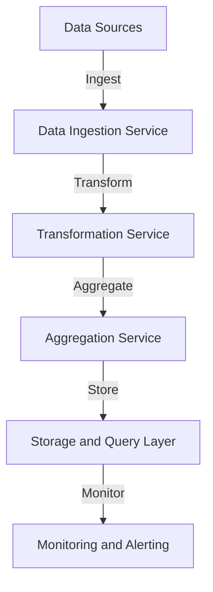

## 12.5 Case Study: High-Throughput Data Pipeline for Analytics

In today's data-driven world, the ability to process and analyze large volumes of data in real-time is crucial for businesses to gain insights and make informed decisions. This case study explores the design and implementation of a high-throughput data pipeline for analytics using Clojure. We will cover data ingestion from multiple sources, real-time transformations, and aggregation, while also addressing fault tolerance and scalability.

### Introduction to Data Pipelines

Data pipelines are essential for moving data from one system to another, transforming it along the way to make it usable for analysis. A high-throughput data pipeline must handle large volumes of data efficiently, ensuring low latency and high availability. Key components of such a pipeline include:

- **Data Ingestion**: Collecting data from various sources.
- **Data Transformation**: Processing and transforming data in real-time.
- **Data Aggregation**: Summarizing data to extract meaningful insights.
- **Fault Tolerance**: Ensuring the system can recover from failures.
- **Scalability**: Ability to handle increasing data volumes and user demands.

### Designing the Pipeline Architecture

The architecture of our high-throughput data pipeline will be based on a microservices approach, leveraging Clojure's strengths in functional programming and concurrency. The pipeline will consist of the following components:

1. **Data Ingestion Service**: Responsible for collecting data from multiple sources.
2. **Transformation Service**: Applies real-time transformations to the ingested data.
3. **Aggregation Service**: Aggregates transformed data for analytics.
4. **Storage and Query Layer**: Stores the aggregated data and provides querying capabilities.
5. **Monitoring and Alerting**: Ensures the health and performance of the pipeline.

#### Architectural Diagram



### Implementing the Data Ingestion Service

The Data Ingestion Service is the entry point of the pipeline, responsible for collecting data from various sources such as databases, APIs, and message queues. In Clojure, we can use libraries like `aleph` for handling asynchronous I/O and `manifold` for stream processing.

#### Code Example: Data Ingestion with Aleph

```clojure
(ns data-pipeline.ingestion
  (:require [aleph.http :as http]
            [manifold.stream :as s]
            [clojure.core.async :as async]))

(defn start-ingestion-service []
  (let [stream (s/stream)]
    (http/start-server
      (fn [req]
        (let [data (-> req :body slurp)]
          (s/put! stream data)
          {:status 200 :body "Data received"}))
      {:port 8080})
    stream))

(defn ingest-data [stream]
  (async/go-loop []
    (when-let [data (async/<! stream)]
      (println "Ingested data:" data)
      (recur))))
```

### Real-Time Data Transformation

Once data is ingested, it needs to be transformed in real-time to make it suitable for analysis. This involves cleaning, filtering, and enriching the data. Clojure's functional programming capabilities make it ideal for defining transformation functions that are composable and reusable.

#### Code Example: Data Transformation

```clojure
(ns data-pipeline.transformation
  (:require [clojure.string :as str]))

(defn clean-data [data]
  (-> data
      (str/trim)
      (str/lower-case)))

(defn enrich-data [data]
  (assoc data :timestamp (System/currentTimeMillis)))

(defn transform-data [data]
  (-> data
      clean-data
      enrich-data))
```

### Aggregating Data for Analytics

The Aggregation Service is responsible for summarizing the transformed data to extract insights. This can involve operations like grouping, counting, and calculating averages. Clojure's `reduce` function and transducers are powerful tools for implementing these operations efficiently.

#### Code Example: Data Aggregation

```clojure
(ns data-pipeline.aggregation
  (:require [clojure.core.reducers :as r]))

(defn aggregate-data [data]
  (r/fold
    (fn [acc item]
      (update acc (item :category) (fnil inc 0)))
    {}
    data))
```

### Ensuring Fault Tolerance

Fault tolerance is critical for maintaining the reliability of the pipeline. We can achieve this by implementing retry mechanisms, circuit breakers, and using persistent storage to prevent data loss. Clojure's `core.async` library can be used to handle retries and timeouts.

#### Code Example: Fault Tolerance with Core.Async

```clojure
(ns data-pipeline.fault-tolerance
  (:require [clojure.core.async :as async]))

(defn retry-operation [operation retries]
  (async/go-loop [attempt 1]
    (let [result (operation)]
      (if (or (nil? result) (>= attempt retries))
        result
        (do
          (async/<! (async/timeout 1000))
          (recur (inc attempt)))))))
```

### Achieving Scalability

Scalability can be achieved by distributing the workload across multiple instances of each service. This can be facilitated by containerization technologies like Docker and orchestration platforms like Kubernetes. Additionally, using a message broker like Kafka can help decouple services and manage backpressure.

#### Code Example: Scaling with Kafka

```clojure
(ns data-pipeline.scalability
  (:require [clj-kafka.producer :as producer]
            [clj-kafka.consumer :as consumer]))

(defn start-kafka-producer [topic]
  (producer/producer
    {"bootstrap.servers" "localhost:9092"}
    {"key.serializer" "org.apache.kafka.common.serialization.StringSerializer"
     "value.serializer" "org.apache.kafka.common.serialization.StringSerializer"}))

(defn start-kafka-consumer [topic]
  (consumer/consumer
    {"bootstrap.servers" "localhost:9092"
     "group.id" "data-pipeline"}
    {"key.deserializer" "org.apache.kafka.common.serialization.StringDeserializer"
     "value.deserializer" "org.apache.kafka.common.serialization.StringDeserializer"}))
```

### Monitoring and Alerting

Monitoring the pipeline's performance and health is crucial for ensuring its reliability. Tools like Prometheus and Grafana can be used to collect and visualize metrics. Alerts can be configured to notify the team of any issues.

#### Code Example: Monitoring with Prometheus

```clojure
(ns data-pipeline.monitoring
  (:require [prometheus.core :as prom]))

(def request-counter (prom/counter "http_requests_total" "Total HTTP requests"))

(defn increment-counter []
  (prom/inc! request-counter))
```

### Conclusion

Building a high-throughput data pipeline for analytics in Clojure involves leveraging its functional programming strengths to create a scalable, fault-tolerant system. By using libraries like Aleph, Manifold, and core.async, we can efficiently handle data ingestion, transformation, and aggregation. Additionally, incorporating tools like Kafka and Prometheus ensures the pipeline is both scalable and monitorable.

This case study demonstrates how Clojure's functional paradigms can be applied to real-world data engineering challenges, providing a robust solution for processing large volumes of data in real-time.

## Quiz Time!



### What is the primary role of the Data Ingestion Service in a data pipeline?

- [x] Collecting data from multiple sources
- [ ] Transforming data in real-time
- [ ] Aggregating data for analytics
- [ ] Monitoring the pipeline's performance

> **Explanation:** The Data Ingestion Service is responsible for collecting data from various sources, which is the first step in the data pipeline.

### Which Clojure library is commonly used for handling asynchronous I/O in data pipelines?

- [x] Aleph
- [ ] Ring
- [ ] Compojure
- [ ] Pedestal

> **Explanation:** Aleph is a Clojure library designed for asynchronous I/O, making it suitable for data ingestion in high-throughput pipelines.

### What is the purpose of the Transformation Service in a data pipeline?

- [ ] Collecting data from multiple sources
- [x] Applying real-time transformations to data
- [ ] Aggregating data for analytics
- [ ] Storing data for querying

> **Explanation:** The Transformation Service processes and transforms ingested data in real-time to prepare it for analysis.

### How does Clojure's `reduce` function help in data aggregation?

- [x] It summarizes data by applying a function across a collection
- [ ] It collects data from multiple sources
- [ ] It transforms data in real-time
- [ ] It monitors the pipeline's performance

> **Explanation:** The `reduce` function in Clojure applies a function across a collection to aggregate data, making it useful for summarizing data.

### What is a key benefit of using Kafka in a data pipeline?

- [x] It helps decouple services and manage backpressure
- [ ] It transforms data in real-time
- [ ] It aggregates data for analytics
- [ ] It monitors the pipeline's performance

> **Explanation:** Kafka is a message broker that helps decouple services and manage backpressure, enhancing the scalability of the pipeline.

### Which tool can be used to monitor the performance and health of a data pipeline?

- [ ] Aleph
- [ ] Kafka
- [x] Prometheus
- [ ] Manifold

> **Explanation:** Prometheus is a monitoring tool that can collect and visualize metrics, helping to monitor the performance and health of a data pipeline.

### What is the role of the Aggregation Service in a data pipeline?

- [ ] Collecting data from multiple sources
- [ ] Transforming data in real-time
- [x] Aggregating data for analytics
- [ ] Monitoring the pipeline's performance

> **Explanation:** The Aggregation Service summarizes transformed data to extract insights, making it a crucial component for analytics.

### How does Clojure's `core.async` library contribute to fault tolerance?

- [x] It handles retries and timeouts
- [ ] It collects data from multiple sources
- [ ] It transforms data in real-time
- [ ] It aggregates data for analytics

> **Explanation:** Clojure's `core.async` library can be used to implement retry mechanisms and handle timeouts, contributing to fault tolerance.

### What is a common use case for using transducers in a data pipeline?

- [ ] Collecting data from multiple sources
- [x] Applying transformations efficiently
- [ ] Aggregating data for analytics
- [ ] Monitoring the pipeline's performance

> **Explanation:** Transducers are used to apply transformations efficiently, making them suitable for processing data in a pipeline.

### True or False: Clojure's functional programming paradigms are not suitable for real-world data engineering challenges.

- [ ] True
- [x] False

> **Explanation:** Clojure's functional programming paradigms are well-suited for real-world data engineering challenges, as demonstrated in this case study.


