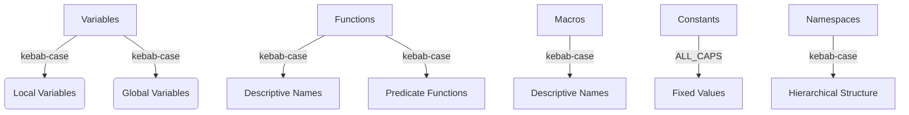

## 13.3.1 Naming Conventions

In the world of software development, naming conventions play a crucial role in ensuring code readability, maintainability, and consistency. For Java professionals transitioning to Clojure, understanding and adopting the appropriate naming conventions is essential for writing idiomatic Clojure code. This section delves into the best practices for naming variables, functions, macros, and constants in Clojure, emphasizing consistency across the codebase.

### The Importance of Naming Conventions

Naming conventions are not just about aesthetics; they are about creating a shared understanding among developers. Consistent naming helps in:

- **Improving Readability**: Clear and descriptive names make it easier for developers to understand the purpose and functionality of code.
- **Enhancing Maintainability**: Consistent naming reduces the cognitive load when navigating and modifying code, especially in large codebases.
- **Facilitating Collaboration**: When multiple developers work on the same project, a shared naming convention ensures everyone is on the same page.

### General Principles for Naming in Clojure

Before diving into specific conventions, let's outline some general principles that guide naming in Clojure:

1. **Descriptive and Meaningful Names**: Choose names that clearly describe the purpose or role of the entity being named.
2. **Consistency**: Adhere to a consistent naming style throughout the codebase to avoid confusion.
3. **Avoid Abbreviations**: Use full words instead of abbreviations unless the abbreviation is widely understood.
4. **Contextual Clarity**: Ensure that names make sense within the context they are used.

### Naming Conventions for Variables

In Clojure, variables are typically named using `kebab-case`. This convention is similar to the `snake_case` used in some other languages but uses hyphens instead of underscores. Here's how you can apply this convention:

- **Local Variables**: Use `kebab-case` for naming local variables within functions or let bindings.

  ```clojure
  (let [user-name "John Doe"
        user-age 30]
    (println user-name user-age))
  ```

- **Global Variables**: For global variables, especially those defined at the namespace level, use `kebab-case` as well. However, consider using a prefix or suffix to indicate their global nature if necessary.

  ```clojure
  (def app-version "1.0.0")
  ```

### Naming Conventions for Functions

Functions in Clojure are also named using `kebab-case`. This convention helps distinguish functions from variables and aligns with the overall style of the language:

- **Descriptive Function Names**: Ensure that function names clearly describe what the function does. Use verbs to indicate actions.

  ```clojure
  (defn calculate-total [prices]
    (reduce + prices))
  ```

- **Predicate Functions**: For functions that return a boolean value, use a trailing question mark `?` to indicate their nature.

  ```clojure
  (defn valid-user? [user]
    (and (not (nil? user))
         (:active user)))
  ```

### Naming Conventions for Macros

Macros in Clojure are powerful tools that allow you to extend the language. When naming macros, use `kebab-case` and consider prefixing the name with `with-` or `def-` to indicate their macro nature:

- **Macro Naming**: Use descriptive names that convey the macro's purpose and functionality.

  ```clojure
  (defmacro with-logging [expr]
    `(do
       (println "Executing:" '~expr)
       ~expr))
  ```

### Naming Conventions for Constants

Constants in Clojure are typically defined using `def` and are named using `ALL_CAPS` to distinguish them from variables and functions. This convention signals immutability and a fixed value:

- **Constant Naming**: Use `ALL_CAPS` with underscores to separate words.

  ```clojure
  (def PI 3.14159)
  (def MAX_USERS 100)
  ```

### Namespace Naming Conventions

Namespaces in Clojure are a way to organize code and avoid name collisions. When naming namespaces, use `kebab-case` and structure them hierarchically to reflect the project's organization:

- **Namespace Naming**: Use a hierarchical structure that reflects the project's organization and functionality.

  ```clojure
  (ns myapp.core)
  (ns myapp.utils.string)
  ```

### Best Practices for Consistency

To ensure consistency across your Clojure codebase, consider the following best practices:

1. **Adopt a Style Guide**: Establish a style guide for your team or project that outlines naming conventions and other coding standards.
2. **Code Reviews**: Use code reviews to enforce naming conventions and ensure adherence to the style guide.
3. **Automated Tools**: Leverage automated tools like linters to check for naming convention violations.

### Common Pitfalls and How to Avoid Them

While naming conventions are straightforward, there are common pitfalls to be aware of:

- **Inconsistent Naming**: Avoid mixing naming styles within the same codebase. Stick to the established conventions.
- **Overly Generic Names**: Avoid using generic names like `data`, `info`, or `temp`. Instead, use names that convey specific meaning.
- **Abbreviations and Acronyms**: Limit the use of abbreviations and acronyms unless they are widely recognized and understood.

### Practical Examples and Code Snippets

Let's explore some practical examples and code snippets that illustrate the application of naming conventions in Clojure:

#### Example 1: Naming Variables and Functions

```clojure
(defn calculate-discount [price discount-rate]
  (* price discount-rate))

(let [original-price 100
      discount-rate 0.1]
  (println "Discounted Price:" (calculate-discount original-price discount-rate)))
```

In this example, both the function and variables are named using `kebab-case`, and the function name clearly describes its purpose.

#### Example 2: Naming Macros and Constants

```clojure
(defmacro with-timing [expr]
  `(let [start-time# (System/nanoTime)]
     (let [result# ~expr]
       (println "Elapsed time:" (/ (- (System/nanoTime) start-time#) 1e6) "ms")
       result#)))

(def MAX_RETRIES 3)

(with-timing
  (Thread/sleep 1000))
```

Here, the macro `with-timing` is named to indicate its functionality, and the constant `MAX_RETRIES` is in `ALL_CAPS` to denote its fixed nature.

### Diagrams and Visual Aids

To further illustrate the naming conventions, consider the following diagram that outlines the different naming styles used in Clojure:



### Conclusion

Adopting consistent naming conventions in Clojure is a fundamental aspect of writing clean, maintainable, and idiomatic code. For Java professionals transitioning to Clojure, understanding these conventions is crucial for effective collaboration and code quality. By following the guidelines outlined in this section, you can ensure that your Clojure codebase is both readable and maintainable.

## Quiz Time!



### What is the recommended naming convention for local variables in Clojure?

- [x] kebab-case
- [ ] snake_case
- [ ] camelCase
- [ ] PascalCase

> **Explanation:** Local variables in Clojure are typically named using `kebab-case`, which uses hyphens to separate words.

### Which naming convention is used for constants in Clojure?

- [ ] kebab-case
- [ ] camelCase
- [x] ALL_CAPS
- [ ] snake_case

> **Explanation:** Constants in Clojure are named using `ALL_CAPS` to indicate their immutability and fixed nature.

### How should predicate functions be named in Clojure?

- [ ] With a trailing exclamation mark `!`
- [x] With a trailing question mark `?`
- [ ] Using camelCase
- [ ] Using ALL_CAPS

> **Explanation:** Predicate functions in Clojure are named with a trailing question mark `?` to indicate that they return a boolean value.

### What is the purpose of using `kebab-case` for function names in Clojure?

- [ ] To make them look like constants
- [x] To distinguish them from variables and align with Clojure's style
- [ ] To indicate they are macros
- [ ] To make them compatible with Java

> **Explanation:** Functions in Clojure are named using `kebab-case` to distinguish them from variables and to align with the overall style of the language.

### When naming macros, what prefix is commonly used to indicate their nature?

- [x] with-
- [ ] def-
- [ ] macro-
- [ ] func-

> **Explanation:** Macros are often prefixed with `with-` to indicate their nature and functionality.

### Why is consistency important in naming conventions?

- [ ] It makes the code look more complex
- [ ] It allows for more creative expression
- [x] It improves readability and maintainability
- [ ] It is not important

> **Explanation:** Consistency in naming conventions improves readability and maintainability, making it easier for developers to understand and modify the code.

### What is a common pitfall when naming variables?

- [ ] Using full words
- [x] Using overly generic names
- [ ] Using kebab-case
- [ ] Using ALL_CAPS

> **Explanation:** A common pitfall is using overly generic names, which can lead to confusion and lack of clarity in the code.

### How should namespaces be structured in Clojure?

- [ ] Using camelCase
- [ ] Using ALL_CAPS
- [x] Using kebab-case and a hierarchical structure
- [ ] Using snake_case

> **Explanation:** Namespaces in Clojure should be structured using `kebab-case` and a hierarchical structure to reflect the project's organization.

### What tool can be used to enforce naming conventions in a Clojure codebase?

- [ ] A debugger
- [ ] A compiler
- [x] A linter
- [ ] A profiler

> **Explanation:** A linter can be used to enforce naming conventions and check for violations in a Clojure codebase.

### True or False: Abbreviations should be used extensively in Clojure naming conventions.

- [ ] True
- [x] False

> **Explanation:** Abbreviations should be avoided unless they are widely recognized, as they can lead to confusion and lack of clarity in the code.


