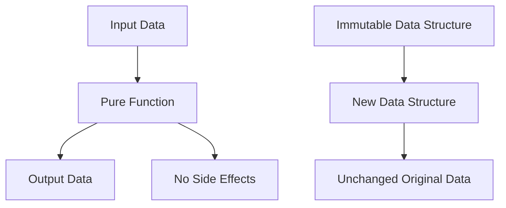

## 4.1 Pure Functions and Immutability

As we embark on the journey from Java Object-Oriented Programming (OOP) to Clojure's functional programming paradigm, two foundational concepts stand out: **pure functions** and **immutability**. These concepts are not only central to functional programming but also pivotal in realizing the benefits of scalability, maintainability, and reliability in enterprise applications. In this section, we will define pure functions, delve into their importance, and emphasize the role of immutability in writing robust code.

### Understanding Pure Functions

**Pure functions** are the building blocks of functional programming. A function is considered pure if it satisfies two main criteria:

1. **Deterministic Behavior**: Given the same input, a pure function will always produce the same output. This predictability is crucial for reasoning about code behavior and ensuring consistency across different environments.

2. **No Side Effects**: Pure functions do not alter any state outside their scope. They do not modify global variables, perform I/O operations, or change the state of mutable objects. This isolation makes them easier to test and debug.

#### Example of a Pure Function in Clojure

Let's illustrate a simple pure function in Clojure that calculates the square of a number:

```clojure
(defn square [x]
  (* x x))
```

- **Deterministic**: The function `square` will always return `4` when given the input `2`.
- **No Side Effects**: It does not modify any external state or perform any I/O operations.

#### Contrast with Java

In Java, functions (or methods) often involve state changes or rely on mutable objects, which can lead to unpredictable behavior. Consider the following Java method:

```java
public int incrementCounter() {
    counter++;
    return counter;
}
```

- **Non-Deterministic**: The output depends on the current state of `counter`.
- **Side Effects**: It modifies the state of `counter`, which can lead to unintended consequences in concurrent environments.

### Importance of Pure Functions

Pure functions offer several advantages that are particularly beneficial in enterprise applications:

- **Ease of Testing**: Since pure functions are deterministic and have no side effects, they are straightforward to test. You can test them in isolation without worrying about the state of the system.

- **Concurrency**: Pure functions are inherently thread-safe because they do not modify shared state. This makes them ideal for concurrent and parallel processing, which is crucial for scaling applications.

- **Composability**: Pure functions can be easily composed to build more complex operations. This modularity leads to cleaner and more maintainable code.

### Emphasizing Immutability

**Immutability** is another cornerstone of functional programming. In Clojure, data structures are immutable by default, meaning once they are created, they cannot be changed. Instead of modifying existing data structures, you create new ones with the desired changes.

#### Benefits of Immutability

- **Predictability**: Immutable data structures ensure that data remains consistent throughout the program's execution, reducing bugs related to unexpected state changes.

- **Concurrency**: Immutability eliminates the need for locks or synchronization when accessing shared data, as there is no risk of data being modified by other threads.

- **Simplified Reasoning**: With immutable data, you can reason about your program's behavior more easily, as the state does not change unexpectedly.

#### Example of Immutability in Clojure

Consider a simple example of working with an immutable list in Clojure:

```clojure
(def numbers [1 2 3 4 5])

(def updated-numbers (conj numbers 6))

;; numbers remains [1 2 3 4 5]
;; updated-numbers is [1 2 3 4 5 6]
```

- **Immutable**: The original `numbers` list remains unchanged.
- **New Data Structure**: `updated-numbers` is a new list with the additional element.

#### Contrast with Java

In Java, collections like `ArrayList` are mutable by default. Consider the following Java code:

```java
List<Integer> numbers = new ArrayList<>(Arrays.asList(1, 2, 3, 4, 5));
numbers.add(6); // Modifies the original list
```

- **Mutable**: The `numbers` list is modified in place, which can lead to unintended side effects if other parts of the code rely on the original list.

### Transitioning from Java OOP to Clojure

Transitioning from Java OOP to Clojure involves a paradigm shift in how we think about functions and data. Here are some strategies to facilitate this transition:

1. **Adopt a Functional Mindset**: Embrace the principles of functional programming, such as pure functions and immutability, to write more predictable and maintainable code.

2. **Refactor Java Code**: Identify parts of your Java codebase that can be refactored into pure functions. This can be a gradual process, starting with utility functions and expanding to more complex logic.

3. **Leverage Clojure's Features**: Take advantage of Clojure's immutable data structures and functional programming constructs to simplify your code and improve its reliability.

4. **Experiment and Iterate**: Encourage experimentation with Clojure's functional features. Start with small projects or components and gradually expand as your team becomes more comfortable with the paradigm.

### Code Examples and Exercises

Let's explore some more code examples and exercises to solidify our understanding of pure functions and immutability in Clojure.

#### Example: Pure Function for Filtering

Create a pure function that filters even numbers from a list:

```clojure
(defn filter-even [numbers]
  (filter even? numbers))

;; Usage
(filter-even [1 2 3 4 5 6]) ; => (2 4 6)
```

- **Deterministic**: The output is always the same for the same input.
- **No Side Effects**: It does not modify the input list.

#### Exercise: Implement a Pure Function

Implement a pure function `sum-of-squares` that calculates the sum of squares of a list of numbers.

```clojure
(defn sum-of-squares [numbers]
  (reduce + (map #(* % %) numbers)))

;; Test your function
(sum-of-squares [1 2 3 4]) ; => 30
```

### Visualizing Pure Functions and Immutability

To better understand the flow of data and the role of pure functions and immutability, let's visualize these concepts using a flowchart.



**Diagram Description**: This flowchart illustrates how input data is processed by a pure function to produce output data without side effects. It also shows how immutable data structures lead to the creation of new data structures while keeping the original data unchanged.

### Further Reading and Resources

To deepen your understanding of pure functions and immutability in Clojure, consider exploring the following resources:

- [Clojure Official Documentation](https://clojure.org/reference)
- [Clojure Community Resources](https://clojure.org/community/resources)
- [Transitioning from OOP to Functional Programming](https://www.lispcast.com/oo-to-fp/)

### Knowledge Check

Let's test your understanding of pure functions and immutability with a few questions:

1. What are the two main criteria for a function to be considered pure?
2. How does immutability contribute to concurrency?
3. Why are pure functions easier to test compared to impure functions?
4. How can you refactor a Java method with side effects into a pure function in Clojure?

### Encouraging Engagement

Embracing functional programming can be challenging, but with each step, you'll gain a deeper understanding and see tangible benefits in your codebase. As you experiment with pure functions and immutability, you'll discover new ways to write cleaner, more efficient code.

### Summary

In this section, we've explored the concepts of pure functions and immutability, highlighting their importance in functional programming and their advantages over traditional Java OOP practices. By adopting these principles, you can write more reliable, maintainable, and scalable code, paving the way for a successful transition to Clojure.

## **Quiz: Are You Ready to Migrate from Java to Clojure?**



### What is a key characteristic of a pure function?

- [x] It always produces the same output for the same input.
- [ ] It modifies global variables.
- [ ] It performs I/O operations.
- [ ] It depends on external state.

> **Explanation:** A pure function is deterministic, meaning it always produces the same output for the same input, and does not have side effects like modifying global variables or performing I/O operations.

### How does immutability benefit concurrency?

- [x] It eliminates the need for locks or synchronization.
- [ ] It allows for mutable shared state.
- [ ] It increases the complexity of code.
- [ ] It requires more memory.

> **Explanation:** Immutability ensures that data cannot be changed, eliminating the need for locks or synchronization when accessing shared data, which simplifies concurrent programming.

### Why are pure functions easier to test?

- [x] They have no side effects.
- [ ] They modify external state.
- [ ] They require complex setup.
- [ ] They depend on mutable objects.

> **Explanation:** Pure functions are easier to test because they have no side effects and do not depend on external state, allowing them to be tested in isolation.

### What is a common practice when transitioning from Java OOP to Clojure?

- [x] Refactor Java code into pure functions.
- [ ] Use mutable data structures.
- [ ] Avoid functional programming principles.
- [ ] Rely on inheritance.

> **Explanation:** A common practice is to refactor Java code into pure functions, embracing functional programming principles to improve code reliability and maintainability.

### Which of the following is an example of an immutable data structure in Clojure?

- [x] A list created with `conj`.
- [ ] An `ArrayList`.
- [ ] A mutable map.
- [ ] A synchronized collection.

> **Explanation:** In Clojure, data structures like lists created with `conj` are immutable, meaning they cannot be changed once created.

### What is a benefit of using pure functions in enterprise applications?

- [x] Improved scalability.
- [ ] Increased complexity.
- [ ] More side effects.
- [ ] Dependency on mutable state.

> **Explanation:** Pure functions improve scalability by being inherently thread-safe and composable, which is beneficial for enterprise applications.

### How can you ensure a function is pure?

- [x] Avoid modifying external state.
- [ ] Use global variables.
- [ ] Perform I/O operations.
- [ ] Depend on mutable objects.

> **Explanation:** To ensure a function is pure, avoid modifying external state, using global variables, or performing I/O operations.

### What is a key advantage of immutability?

- [x] Simplified reasoning about code.
- [ ] Increased risk of data corruption.
- [ ] More complex synchronization.
- [ ] Dependency on mutable objects.

> **Explanation:** Immutability simplifies reasoning about code by ensuring that data remains consistent and unchanged, reducing the risk of data corruption.

### How does Clojure handle data structures differently from Java?

- [x] Clojure data structures are immutable by default.
- [ ] Java data structures are immutable by default.
- [ ] Clojure relies on mutable objects.
- [ ] Java uses functional programming principles.

> **Explanation:** Clojure data structures are immutable by default, whereas Java typically uses mutable data structures, which can lead to side effects.

### True or False: Pure functions can modify global variables.

- [ ] True
- [x] False

> **Explanation:** False. Pure functions cannot modify global variables as they have no side effects and do not alter external state.



---

In this comprehensive exploration of pure functions and immutability, we've laid the groundwork for understanding how these concepts can transform your approach to programming as you transition from Java OOP to Clojure. By embracing these principles, you'll be well-equipped to tackle the challenges of modern enterprise software development.
