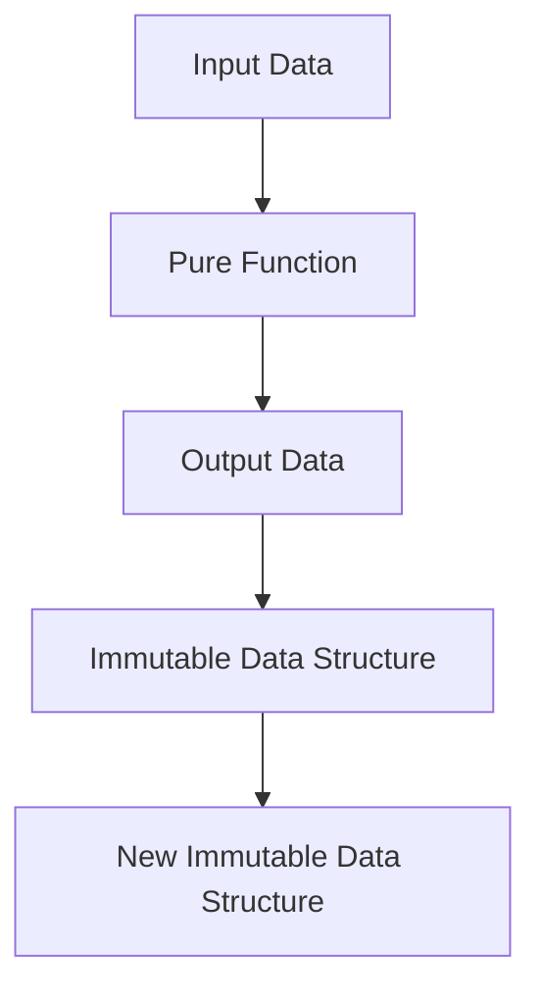

## 4.1 Pure Functions and Immutability

As experienced Java developers, you are likely accustomed to the object-oriented paradigm, where mutable state and side effects are common. Transitioning to Clojure, a functional programming language, requires a shift in mindset, particularly regarding pure functions and immutability. These concepts are foundational to writing reliable, maintainable, and scalable code in Clojure.

### Understanding Pure Functions

**Pure functions** are a cornerstone of functional programming. A function is considered pure if it satisfies two main criteria:

1. **Deterministic Output**: Given the same input, a pure function always produces the same output.
2. **No Side Effects**: A pure function does not alter any external state or interact with the outside world (e.g., modifying a global variable, writing to a file, or printing to the console).

#### Why Pure Functions Matter

Pure functions offer several advantages:

- **Predictability**: Since pure functions always produce the same output for the same input, they are easier to reason about and test.
- **Concurrency**: Pure functions can be executed in parallel without the risk of race conditions, as they do not rely on shared state.
- **Composability**: Pure functions can be composed together to build more complex operations, enhancing code modularity and reuse.

#### Pure Functions in Clojure

Let's explore how pure functions are implemented in Clojure with a simple example:

```clojure
;; Clojure example of a pure function
(defn add [x y]
  (+ x y))

;; Calling the function with the same inputs will always yield the same result
(println (add 2 3)) ; => 5
```

In this example, the `add` function is pure because it consistently returns the sum of `x` and `y` without altering any external state.

#### Java vs. Clojure: Pure Functions

In Java, achieving pure functions requires discipline, as the language does not enforce immutability or side-effect-free functions. Consider the following Java example:

```java
// Java example of a pure function
public class MathUtils {
    public static int add(int x, int y) {
        return x + y;
    }
}

// Calling the function with the same inputs will always yield the same result
System.out.println(MathUtils.add(2, 3)); // => 5
```

While the Java method `add` is pure, Java's mutable state and object-oriented nature often lead to side effects, making it challenging to maintain purity across larger systems.

### Emphasizing Immutability

**Immutability** is another key concept in functional programming. An immutable object is one whose state cannot be modified after it is created. In Clojure, immutability is the default, promoting safer and more predictable code.

#### Benefits of Immutability

- **Thread Safety**: Immutable data structures can be shared across threads without synchronization, reducing the complexity of concurrent programming.
- **Ease of Reasoning**: With immutable data, you can be confident that data will not change unexpectedly, simplifying debugging and reasoning about code.
- **Historical State**: Immutability allows you to maintain historical versions of data, enabling features like undo functionality.

#### Immutability in Clojure

Clojure provides a rich set of immutable data structures, such as lists, vectors, maps, and sets. Let's examine how immutability works in Clojure:

```clojure
;; Clojure example of immutable data structures
(def my-vector [1 2 3])

;; Attempting to "modify" the vector returns a new vector
(def new-vector (conj my-vector 4))

(println my-vector)  ; => [1 2 3]
(println new-vector) ; => [1 2 3 4]
```

In this example, `my-vector` remains unchanged after the `conj` operation, demonstrating Clojure's commitment to immutability.

#### Java vs. Clojure: Immutability

In Java, immutability is not the default, but it can be achieved using final classes and fields. Consider the following Java example:

```java
// Java example of an immutable class
public final class ImmutablePoint {
    private final int x;
    private final int y;

    public ImmutablePoint(int x, int y) {
        this.x = x;
        this.y = y;
    }

    public int getX() {
        return x;
    }

    public int getY() {
        return y;
    }
}

// ImmutablePoint instances cannot be modified after creation
ImmutablePoint point = new ImmutablePoint(1, 2);
```

While Java can achieve immutability, it requires explicit design choices, whereas Clojure's immutability is inherent and pervasive.

### Combining Pure Functions and Immutability

The combination of pure functions and immutability leads to code that is easier to test, debug, and maintain. Let's explore a practical example that combines these concepts:

```clojure
;; Clojure example combining pure functions and immutability
(defn calculate-discount [price discount-rate]
  (* price (- 1 discount-rate)))

(defn apply-discounts [prices discount-rate]
  (map #(calculate-discount % discount-rate) prices))

(def prices [100 200 300])
(def discounted-prices (apply-discounts prices 0.1))

(println discounted-prices) ; => (90.0 180.0 270.0)
```

In this example, `calculate-discount` is a pure function, and `apply-discounts` uses immutable data structures to apply the discount to a list of prices.

### Visualizing Immutability and Pure Functions

To better understand how data flows through pure functions and remains immutable, let's visualize these concepts using a flowchart:



**Diagram Description**: This flowchart illustrates how input data is processed by a pure function, resulting in output data that is stored in an immutable data structure. Any modifications result in new immutable data structures, preserving the original data.

### Try It Yourself

Now that we've explored how pure functions and immutability work in Clojure, let's apply these concepts to manage state effectively in your applications. Try modifying the `apply-discounts` function to apply different discount rates to different price ranges.

### Further Reading

For more information on pure functions and immutability in Clojure, consider exploring the following resources:

- [Official Clojure Documentation](https://clojure.org/reference/documentation)
- [ClojureDocs](https://clojuredocs.org/)
- [Functional Programming in Clojure](https://www.braveclojure.com/)

### Knowledge Check

To reinforce your understanding of pure functions and immutability, consider the following questions:

- What are the key characteristics of a pure function?
- How does immutability contribute to thread safety?
- Why is immutability the default in Clojure?
- How can you achieve immutability in Java?
- What are the benefits of combining pure functions with immutable data structures?

### Summary

In this section, we've explored the foundational concepts of pure functions and immutability in Clojure. By leveraging these principles, you can write code that is more reliable, maintainable, and scalable. As you continue your journey into functional programming, keep these concepts in mind to harness the full power of Clojure.

## **Quiz: Are You Ready to Migrate from Java to Clojure?**



### What is a key characteristic of a pure function?

- [x] It always produces the same output for the same input.
- [ ] It can modify global variables.
- [ ] It relies on mutable state.
- [ ] It interacts with the file system.

> **Explanation:** A pure function always produces the same output for the same input and does not have side effects.

### How does immutability contribute to thread safety?

- [x] Immutable data can be shared across threads without synchronization.
- [ ] Immutable data requires locks for thread safety.
- [ ] Immutable data can be modified by multiple threads.
- [ ] Immutable data is not thread-safe.

> **Explanation:** Immutable data can be safely shared across threads without the need for synchronization, reducing complexity in concurrent programming.

### Why is immutability the default in Clojure?

- [x] It promotes safer and more predictable code.
- [ ] It allows for easy modification of data.
- [ ] It is required for all programming languages.
- [ ] It is a feature specific to object-oriented programming.

> **Explanation:** Immutability is the default in Clojure because it promotes safer and more predictable code, making it easier to reason about and maintain.

### How can you achieve immutability in Java?

- [x] By using final classes and fields.
- [ ] By using mutable collections.
- [ ] By modifying object state directly.
- [ ] By using synchronized blocks.

> **Explanation:** In Java, immutability can be achieved by using final classes and fields, ensuring that objects cannot be modified after creation.

### What are the benefits of combining pure functions with immutable data structures?

- [x] Easier to test and debug.
- [x] Enhanced code modularity and reuse.
- [ ] Increased complexity and maintenance.
- [ ] Reduced code readability.

> **Explanation:** Combining pure functions with immutable data structures makes code easier to test, debug, and maintain, while enhancing modularity and reuse.

### What is a side effect in the context of pure functions?

- [x] An interaction with external state or systems.
- [ ] A consistent output for the same input.
- [ ] A modification of local variables.
- [ ] A return value from a function.

> **Explanation:** A side effect occurs when a function interacts with external state or systems, such as modifying a global variable or writing to a file.

### What is the result of attempting to modify an immutable data structure in Clojure?

- [x] A new immutable data structure is created.
- [ ] The original data structure is modified.
- [ ] An error is thrown.
- [ ] The data structure becomes mutable.

> **Explanation:** In Clojure, attempting to modify an immutable data structure results in the creation of a new immutable data structure, preserving the original.

### How does Clojure's approach to immutability differ from Java's?

- [x] Immutability is inherent and pervasive in Clojure.
- [ ] Immutability is optional in Clojure.
- [ ] Immutability is enforced by the compiler in Java.
- [ ] Immutability is achieved through mutable collections in Java.

> **Explanation:** In Clojure, immutability is inherent and pervasive, whereas in Java, it requires explicit design choices and is not the default.

### What is the primary advantage of using pure functions in concurrent programming?

- [x] They can be executed in parallel without race conditions.
- [ ] They require synchronization for thread safety.
- [ ] They rely on shared mutable state.
- [ ] They cannot be used in concurrent programming.

> **Explanation:** Pure functions can be executed in parallel without race conditions because they do not rely on shared mutable state, making them ideal for concurrent programming.

### True or False: In Clojure, all data structures are mutable by default.

- [ ] True
- [x] False

> **Explanation:** False. In Clojure, all data structures are immutable by default, promoting safer and more predictable code.


