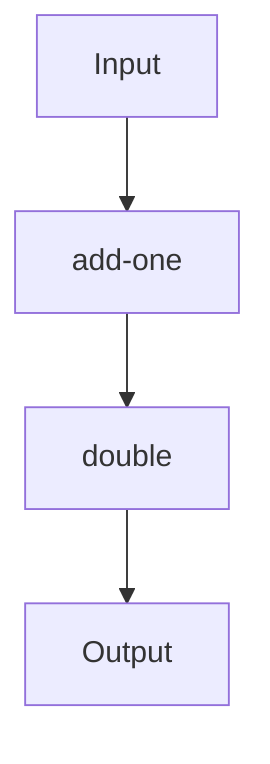

## 4.2 Higher-Order Functions and Functional Composition

In this section, we delve into the core concepts of higher-order functions and functional composition in Clojure, which are pivotal to mastering the functional programming paradigm. These concepts allow developers to create more modular, reusable, and expressive code, which is essential for building scalable enterprise applications.

### Understanding Higher-Order Functions

Higher-order functions are a fundamental concept in functional programming. They are functions that can take other functions as arguments or return them as results. This capability allows for a high degree of abstraction and code reuse.

#### Higher-Order Functions in Java vs. Clojure

In Java, higher-order functions are typically achieved using interfaces or anonymous classes. With the introduction of lambdas in Java 8, the language has become more functional, but it still lacks the elegance and simplicity of Clojure's approach.

**Java Example:**

```java
import java.util.function.Function;

public class HigherOrderFunctionExample {
    public static void main(String[] args) {
        Function<Integer, Integer> square = x -> x * x;
        System.out.println(applyFunction(square, 5)); // Output: 25
    }

    public static Integer applyFunction(Function<Integer, Integer> func, Integer value) {
        return func.apply(value);
    }
}
```

**Clojure Example:**

```clojure
(defn square [x]
  (* x x))

(defn apply-function [f value]
  (f value))

(println (apply-function square 5)) ; Output: 25
```

In Clojure, functions are first-class citizens, meaning they can be passed around just like any other data type. This makes higher-order functions more intuitive and powerful.

### Benefits of Higher-Order Functions

1. **Code Reusability**: By abstracting common patterns into higher-order functions, you can reuse code across different parts of your application.
2. **Modularity**: Higher-order functions promote modular design, making it easier to manage and understand complex systems.
3. **Expressiveness**: They allow you to express complex operations succinctly, improving code readability and maintainability.

### Functional Composition

Functional composition is the process of combining simple functions to build more complex ones. This is akin to building blocks, where small, well-defined functions are composed to achieve a desired outcome.

#### Composing Functions in Clojure

Clojure provides the `comp` function to facilitate function composition. The `comp` function takes multiple functions as arguments and returns a new function that is the composition of those functions.

**Example:**

```clojure
(defn add-one [x]
  (+ x 1))

(defn double [x]
  (* x 2))

(def composed-fn (comp double add-one))

(println (composed-fn 3)) ; Output: 8
```

In this example, `composed-fn` is a new function that first applies `add-one` to its argument, then applies `double` to the result.

### Practical Applications in Enterprise Development

Higher-order functions and functional composition are not just theoretical concepts; they have practical applications in enterprise software development.

#### Streamlining Data Processing

In enterprise applications, data processing tasks often involve applying a series of transformations to data. Higher-order functions and composition make it easy to define and apply these transformations.

**Example:**

```clojure
(defn filter-even [coll]
  (filter even? coll))

(defn square-all [coll]
  (map #(* % %) coll))

(def process-data (comp square-all filter-even))

(println (process-data [1 2 3 4 5 6])) ; Output: (4 16 36)
```

In this example, `process-data` is a composed function that filters even numbers and then squares them.

#### Enhancing Code Maintainability

By breaking down complex operations into smaller, reusable functions, you can enhance the maintainability of your codebase. This modular approach makes it easier to test, debug, and extend your application.

### Visualizing Function Composition

To better understand function composition, let's visualize how functions are composed and applied.



**Diagram Description:** This flowchart illustrates the composition of the `add-one` and `double` functions. The input is first processed by `add-one`, then by `double`, resulting in the final output.

### Advanced Concepts: Currying and Partial Application

Clojure also supports currying and partial application, which are advanced techniques related to higher-order functions.

#### Currying

Currying is the process of transforming a function that takes multiple arguments into a sequence of functions, each taking a single argument.

**Example:**

```clojure
(defn add [x y]
  (+ x y))

(def add-five (partial add 5))

(println (add-five 10)) ; Output: 15
```

In this example, `add-five` is a curried version of `add` that always adds 5 to its argument.

#### Partial Application

Partial application is similar to currying but involves fixing a few arguments of a function, producing another function of smaller arity.

### Exercises and Practice Problems

To reinforce your understanding of higher-order functions and functional composition, try the following exercises:

1. **Exercise 1**: Write a function `compose-three` that composes three functions and applies them to an input.
2. **Exercise 2**: Implement a higher-order function `apply-twice` that applies a given function twice to an input.
3. **Exercise 3**: Create a composed function that filters out odd numbers, squares the remaining numbers, and then sums them.

### Key Takeaways

- Higher-order functions and functional composition are powerful tools in Clojure that promote code reuse, modularity, and expressiveness.
- Clojure's `comp` function simplifies the process of composing functions.
- These concepts are essential for building scalable and maintainable enterprise applications.

### Further Reading

- [Clojure Official Documentation](https://clojure.org/reference)
- [Functional Programming in Clojure](https://www.lispcast.com/oo-to-fp/)
- [Clojure Community Resources](https://clojure.org/community/resources)

## **Quiz: Are You Ready to Migrate from Java to Clojure?**



### What is a higher-order function?

- [x] A function that takes other functions as arguments or returns them as results.
- [ ] A function that only performs arithmetic operations.
- [ ] A function that is only used in object-oriented programming.
- [ ] A function that cannot be composed with other functions.

> **Explanation:** Higher-order functions can take other functions as arguments or return them as results, allowing for greater abstraction and code reuse.

### How does Clojure's `comp` function work?

- [x] It composes multiple functions into a single function.
- [ ] It decomposes a function into multiple smaller functions.
- [ ] It only works with arithmetic functions.
- [ ] It is used to compare two functions.

> **Explanation:** The `comp` function in Clojure takes multiple functions as arguments and returns a new function that is the composition of those functions.

### What is the benefit of using higher-order functions?

- [x] They promote code reusability and modularity.
- [ ] They make code harder to read.
- [ ] They are only useful in small applications.
- [ ] They are not compatible with functional programming.

> **Explanation:** Higher-order functions promote code reusability and modularity, making it easier to manage and understand complex systems.

### What is functional composition?

- [x] The process of combining simple functions to build more complex ones.
- [ ] The process of breaking down complex functions into simpler ones.
- [ ] A feature exclusive to object-oriented programming.
- [ ] A method for optimizing code performance.

> **Explanation:** Functional composition involves combining simple functions to build more complex operations, enhancing code expressiveness and maintainability.

### What is currying in Clojure?

- [x] Transforming a function that takes multiple arguments into a sequence of functions, each taking a single argument.
- [ ] A method for optimizing function performance.
- [ ] A way to decompose functions into smaller parts.
- [ ] A technique for handling exceptions in functional programming.

> **Explanation:** Currying transforms a function that takes multiple arguments into a sequence of functions, each taking a single argument, allowing for more flexible function application.

### How does partial application differ from currying?

- [x] Partial application involves fixing a few arguments of a function, producing another function of smaller arity.
- [ ] Partial application is the same as currying.
- [ ] Partial application only works with arithmetic functions.
- [ ] Partial application is used to optimize function performance.

> **Explanation:** Partial application involves fixing some arguments of a function, resulting in a new function with fewer arguments, while currying transforms a function into a sequence of single-argument functions.

### What is the purpose of the `apply-function` example in Clojure?

- [x] To demonstrate how to use higher-order functions to apply a function to a value.
- [ ] To show how to perform arithmetic operations.
- [ ] To illustrate object-oriented programming concepts.
- [ ] To compare two different functions.

> **Explanation:** The `apply-function` example demonstrates how to use higher-order functions to apply a given function to a value, showcasing the power of functions as first-class citizens in Clojure.

### What is the output of the composed function `(comp double add-one)` when applied to 3?

- [x] 8
- [ ] 6
- [ ] 7
- [ ] 9

> **Explanation:** The composed function first applies `add-one` to 3, resulting in 4, and then applies `double` to 4, resulting in 8.

### Why are higher-order functions important in enterprise development?

- [x] They enable the creation of modular, reusable, and maintainable code.
- [ ] They make code harder to understand.
- [ ] They are only useful in small applications.
- [ ] They are not compatible with functional programming.

> **Explanation:** Higher-order functions enable the creation of modular, reusable, and maintainable code, which is crucial for building scalable enterprise applications.

### True or False: Higher-order functions can only be used with arithmetic functions.

- [ ] True
- [x] False

> **Explanation:** False. Higher-order functions can be used with any type of function, not just arithmetic ones, allowing for a wide range of applications in functional programming.


