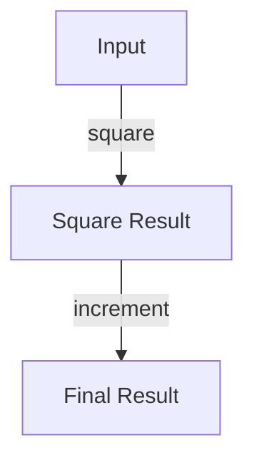

## 4.2 Higher-Order Functions and Functional Composition

In the world of functional programming, higher-order functions and functional composition are fundamental concepts that empower developers to write concise, expressive, and reusable code. As experienced Java developers transitioning to Clojure, understanding these concepts will be pivotal in leveraging the full potential of Clojure's functional programming paradigm. In this section, we will explore how Clojure treats functions as first-class citizens, how to compose complex operations from simple functions, and how these concepts compare to Java's approach.

### Understanding Higher-Order Functions

Higher-order functions are functions that can take other functions as arguments or return them as results. This capability allows for a high degree of abstraction and code reuse. In Clojure, functions are first-class citizens, meaning they can be passed around just like any other data type.

#### Java vs. Clojure: A Comparison

In Java, the concept of higher-order functions is typically achieved through the use of interfaces, such as `Function`, `Predicate`, or `Consumer`, introduced in Java 8 with lambda expressions. Let's look at a simple example of a higher-order function in Java:

```java
import java.util.function.Function;

public class HigherOrderFunctionExample {
    public static void main(String[] args) {
        Function<Integer, Integer> square = x -> x * x;
        Function<Integer, Integer> increment = x -> x + 1;

        Function<Integer, Integer> squareThenIncrement = square.andThen(increment);

        System.out.println(squareThenIncrement.apply(5)); // Outputs 26
    }
}
```

In this example, we define two functions, `square` and `increment`, and then compose them using `andThen`.

Now, let's see how we can achieve the same in Clojure:

```clojure
(defn square [x]
  (* x x))

(defn increment [x]
  (+ x 1))

(def square-then-increment
  (comp increment square))

(println (square-then-increment 5)) ; Outputs 26
```

In Clojure, we use the `comp` function to compose `increment` and `square`. Notice how the order of composition is reversed compared to Java's `andThen`.

### Functional Composition in Clojure

Functional composition is the process of combining simple functions to build more complex ones. This is a powerful technique that promotes code reuse and modularity.

#### The `comp` Function

The `comp` function in Clojure is used to compose multiple functions into a single function. The composed function applies the rightmost function first and then works its way left.

```clojure
(defn add [x y]
  (+ x y))

(defn multiply [x y]
  (* x y))

(defn add-then-multiply [x y z]
  ((comp (partial multiply z) (partial add y)) x))

(println (add-then-multiply 2 3 4)) ; Outputs 20
```

In this example, `add-then-multiply` first adds `x` and `y`, then multiplies the result by `z`.

#### The `partial` Function

The `partial` function in Clojure allows you to fix a certain number of arguments to a function, creating a new function with fewer arguments. This is particularly useful in functional composition.

```clojure
(def add-five (partial add 5))

(println (add-five 10)) ; Outputs 15
```

Here, `add-five` is a new function that adds 5 to its argument.

### Practical Applications of Higher-Order Functions

Higher-order functions are not just theoretical constructs; they have practical applications in everyday programming tasks.

#### Mapping and Filtering

One of the most common uses of higher-order functions is in data transformation tasks, such as mapping and filtering.

```clojure
(def numbers [1 2 3 4 5])

(defn square [x]
  (* x x))

(def squared-numbers (map square numbers))

(println squared-numbers) ; Outputs (1 4 9 16 25)

(defn even? [x]
  (zero? (mod x 2)))

(def even-numbers (filter even? numbers))

(println even-numbers) ; Outputs (2 4)
```

In this example, `map` applies the `square` function to each element of `numbers`, and `filter` selects only the even numbers.

#### Reducing and Folding

Another powerful application of higher-order functions is in reducing or folding operations, where a sequence is collapsed into a single value.

```clojure
(def numbers [1 2 3 4 5])

(defn sum [acc x]
  (+ acc x))

(def total (reduce sum 0 numbers))

(println total) ; Outputs 15
```

Here, `reduce` applies the `sum` function to accumulate the total of the numbers in the list.

### Visualizing Function Composition

To better understand how function composition works, let's visualize the flow of data through composed functions using a diagram.



**Diagram Description:** This flowchart illustrates the process of function composition, where the input is first passed through the `square` function, and the result is then passed through the `increment` function to produce the final result.

### Encouraging Experimentation

Now that we've explored higher-order functions and functional composition, let's encourage you to experiment with these concepts. Try modifying the code examples to create new compositions or apply different functions. For instance, you could create a function that first doubles a number and then squares it.

### References and Further Reading

- [Official Clojure Documentation](https://clojure.org/reference)
- [ClojureDocs](https://clojuredocs.org/)
- [Functional Programming in Java](https://www.oreilly.com/library/view/functional-programming-in/9781449365516/)

### Knowledge Check

To reinforce your understanding, let's pose some questions and challenges:

- What is a higher-order function, and how does it differ from a regular function?
- How does function composition in Clojure differ from Java's approach?
- Try creating a composed function that filters a list of numbers to only include those greater than 10 and then squares them.

### Key Takeaways

- Higher-order functions treat functions as first-class citizens, allowing them to be passed as arguments and returned as results.
- Functional composition enables the creation of complex operations from simple functions, promoting code reuse and modularity.
- Clojure's `comp` and `partial` functions are powerful tools for composing and partially applying functions.

Now that we've delved into higher-order functions and functional composition, let's apply these concepts to enhance the scalability and maintainability of your enterprise applications.

## **Quiz: Are You Ready to Migrate from Java to Clojure?**



### What is a higher-order function?

- [x] A function that takes other functions as arguments or returns them as results
- [ ] A function that performs arithmetic operations
- [ ] A function that is only used in object-oriented programming
- [ ] A function that cannot be composed

> **Explanation:** Higher-order functions are functions that can take other functions as arguments or return them as results, allowing for greater abstraction and code reuse.

### How does Clojure's `comp` function work?

- [x] It composes functions by applying the rightmost function first
- [ ] It composes functions by applying the leftmost function first
- [ ] It only works with two functions
- [ ] It is used for error handling

> **Explanation:** The `comp` function in Clojure composes functions by applying the rightmost function first, then working its way left.

### What is the purpose of the `partial` function in Clojure?

- [x] To fix a certain number of arguments to a function, creating a new function with fewer arguments
- [ ] To create a new function that multiplies its arguments
- [ ] To handle exceptions in functional programming
- [ ] To convert a function into a string

> **Explanation:** The `partial` function in Clojure allows you to fix a certain number of arguments to a function, creating a new function with fewer arguments.

### Which of the following is an example of a higher-order function in Java?

- [x] A function that takes a `Function` interface as an argument
- [ ] A function that performs string concatenation
- [ ] A function that uses a `for` loop
- [ ] A function that only returns integers

> **Explanation:** In Java, higher-order functions can be implemented using interfaces like `Function`, which allow functions to be passed as arguments.

### What is the result of composing the `square` and `increment` functions in Clojure?

- [x] A function that first squares a number and then increments it
- [ ] A function that first increments a number and then squares it
- [ ] A function that only squares a number
- [ ] A function that only increments a number

> **Explanation:** When composing `square` and `increment` in Clojure using `comp`, the resulting function first squares a number and then increments it.

### What is the output of the following Clojure code: `(println ((comp inc #(* % %)) 3))`?

- [x] 10
- [ ] 9
- [ ] 12
- [ ] 16

> **Explanation:** The code squares the number 3 to get 9, then increments it to get 10.

### How can you create a function in Clojure that doubles a number and then squares it?

- [x] Use `comp` to compose `square` and a doubling function
- [ ] Use `partial` to create a new function
- [ ] Use `reduce` to combine the functions
- [ ] Use `filter` to select the functions

> **Explanation:** You can use `comp` to compose a doubling function and `square` to create a new function that doubles a number and then squares it.

### What is the benefit of using higher-order functions in Clojure?

- [x] They promote code reuse and modularity
- [ ] They make code harder to read
- [ ] They are only useful for mathematical operations
- [ ] They are not supported in enterprise applications

> **Explanation:** Higher-order functions promote code reuse and modularity by allowing functions to be passed as arguments and returned as results.

### Which Clojure function is used to apply a function to each element of a collection?

- [x] `map`
- [ ] `reduce`
- [ ] `filter`
- [ ] `comp`

> **Explanation:** The `map` function in Clojure is used to apply a function to each element of a collection.

### True or False: In Clojure, functions are first-class citizens.

- [x] True
- [ ] False

> **Explanation:** In Clojure, functions are first-class citizens, meaning they can be passed around just like any other data type.


