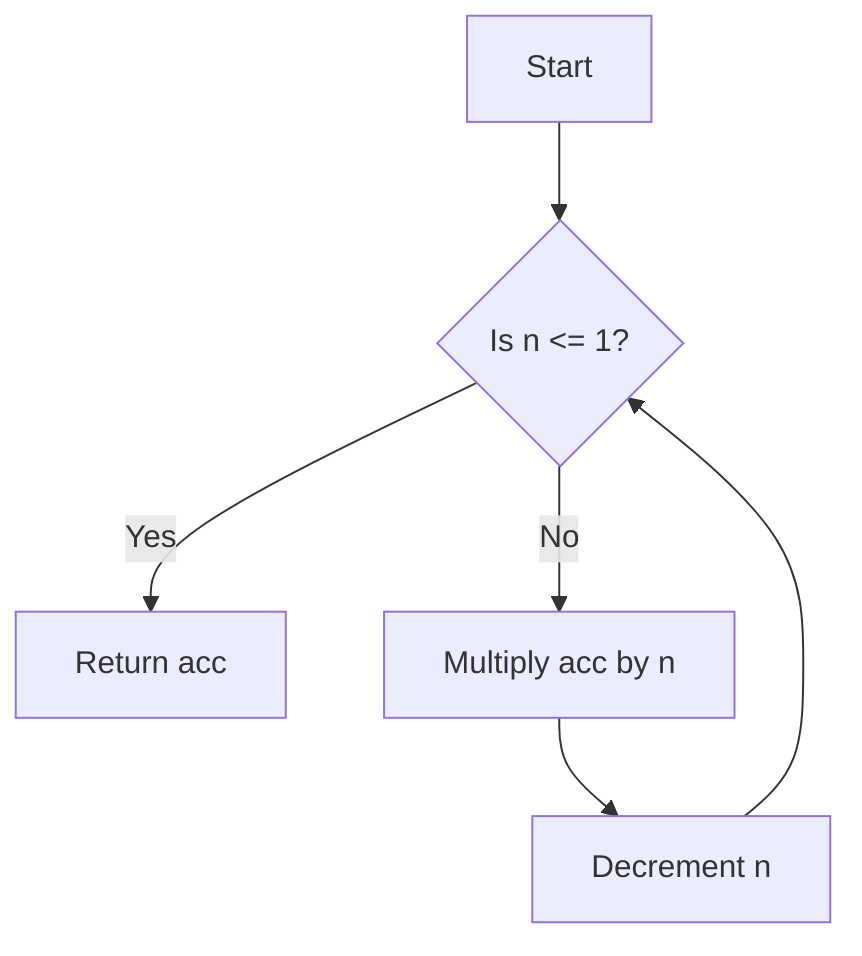

## 4.3 Recursion and Iteration

In this section, we will delve into the concepts of recursion and iteration within Clojure, providing a comprehensive understanding for developers transitioning from Java's object-oriented paradigm. We will explore how Clojure's functional programming model leverages recursion as a primary mechanism for iteration, contrasting it with Java's traditional iterative constructs such as loops.

### Understanding Recursion in Clojure

Recursion is a fundamental concept in functional programming, where a function calls itself to solve a problem. In Clojure, recursion is often preferred over traditional loops due to its alignment with immutability and statelessness. Let's explore how recursion works in Clojure and how it differs from Java's iteration mechanisms.

#### Recursive Functions

A recursive function is one that calls itself in order to solve a smaller instance of the same problem. This approach is particularly useful for problems that can be broken down into smaller, similar subproblems.

**Example: Factorial Calculation**

In Java, you might calculate the factorial of a number using a loop:

```java
public class Factorial {
    public static int factorial(int n) {
        int result = 1;
        for (int i = 1; i <= n; i++) {
            result *= i;
        }
        return result;
    }
}
```

In Clojure, the same calculation can be achieved using recursion:

```clojure
(defn factorial [n]
  (if (<= n 1)
    1
    (* n (factorial (dec n)))))
```

**Explanation:**

- **Base Case:** The recursion stops when `n` is less than or equal to 1, returning 1.
- **Recursive Case:** For other values of `n`, the function calls itself with `n-1`.

### Tail Recursion and `loop/recur`

While recursion is elegant, it can lead to stack overflow errors if not implemented carefully. Clojure provides a solution through tail recursion, which optimizes recursive calls to prevent stack overflow.

#### Tail Recursion

A recursive function is tail-recursive if the recursive call is the last operation in the function. Clojure's `recur` keyword is used to achieve tail recursion, allowing the function to reuse the current stack frame.

**Example: Tail-Recursive Factorial**

```clojure
(defn factorial [n]
  (letfn [(fact-helper [acc n]
            (if (<= n 1)
              acc
              (recur (* acc n) (dec n))))]
    (fact-helper 1 n)))
```

**Explanation:**

- **Helper Function:** `fact-helper` is a tail-recursive helper function.
- **Accumulator:** The `acc` parameter accumulates the result, allowing the function to be tail-recursive.
- **`recur` Keyword:** Replaces the recursive call, optimizing the stack usage.

#### Using `loop/recur`

Clojure's `loop/recur` construct provides a way to implement iteration using recursion. It allows you to define a loop with initial bindings and use `recur` to update those bindings.

**Example: Iterative Factorial with `loop/recur`**

```clojure
(defn factorial [n]
  (loop [acc 1, n n]
    (if (<= n 1)
      acc
      (recur (* acc n) (dec n)))))
```

**Explanation:**

- **`loop` Binding:** Initializes `acc` and `n`.
- **`recur` Call:** Updates `acc` and `n` without growing the stack.

### Iteration Constructs in Clojure

While recursion is a powerful tool in Clojure, there are scenarios where traditional iteration constructs are more intuitive. Clojure provides several constructs for iteration, such as `for`, `doseq`, and `map`.

#### Using `for`

The `for` construct in Clojure is used for list comprehensions, allowing you to iterate over collections and generate new collections.

**Example: Generating a Sequence of Squares**

```clojure
(defn squares [n]
  (for [i (range 1 (inc n))]
    (* i i)))
```

**Explanation:**

- **`range` Function:** Generates a sequence from 1 to `n`.
- **List Comprehension:** Computes the square of each number.

#### Using `doseq`

The `doseq` construct is used for side-effectful iteration, similar to Java's `for-each` loop.

**Example: Printing Numbers**

```clojure
(defn print-numbers [n]
  (doseq [i (range 1 (inc n))]
    (println i)))
```

**Explanation:**

- **`doseq` Loop:** Iterates over the sequence, executing `println` for each element.

#### Using `map`

The `map` function applies a given function to each element of a collection, returning a new collection of results.

**Example: Doubling Numbers**

```clojure
(defn double-numbers [numbers]
  (map #(* 2 %) numbers))
```

**Explanation:**

- **Anonymous Function:** `#(* 2 %)` doubles each element.
- **`map` Function:** Applies the function to each element of `numbers`.

### Recursion vs. Iteration: A Comparison

Let's compare recursion and iteration in Clojure and Java, highlighting the differences and similarities.

#### Java Iteration

Java's iteration constructs, such as `for`, `while`, and `do-while` loops, are imperative in nature. They rely on mutable state and explicit control flow.

**Example: Java Iteration**

```java
for (int i = 0; i < 10; i++) {
    System.out.println(i);
}
```

#### Clojure Recursion

Clojure's recursion, on the other hand, is declarative and functional. It emphasizes immutability and statelessness, aligning with functional programming principles.

**Example: Clojure Recursion**

```clojure
(defn print-numbers [n]
  (loop [i 0]
    (when (< i n)
      (println i)
      (recur (inc i)))))
```

### Visualizing Recursion and Iteration

To better understand the flow of recursion and iteration, let's visualize the process using a flowchart.



**Caption:** Flowchart illustrating the tail-recursive factorial calculation.

### Best Practices for Recursion and Iteration

When transitioning from Java to Clojure, consider the following best practices:

- **Embrace Immutability:** Leverage Clojure's immutable data structures to simplify recursion.
- **Use Tail Recursion:** Optimize recursive functions with `recur` to prevent stack overflow.
- **Choose the Right Construct:** Use `loop/recur` for iteration, `for` for list comprehensions, and `doseq` for side effects.
- **Test Thoroughly:** Ensure recursive functions handle edge cases and large inputs gracefully.

### Try It Yourself

Experiment with the provided code examples by modifying them to solve different problems. For instance, try implementing a recursive function to calculate the Fibonacci sequence or use `map` to transform a collection of strings to uppercase.

### Further Reading

For more information on recursion and iteration in Clojure, consider the following resources:

- [Clojure Official Documentation](https://clojure.org/reference)
- [Clojure Community Resources](https://clojure.org/community/resources)
- [Transitioning from OOP to Functional Programming](https://www.lispcast.com/oo-to-fp/)

### Knowledge Check

Let's reinforce your understanding of recursion and iteration in Clojure with a few questions:

1. What is the primary advantage of using recursion in Clojure over traditional loops in Java?
2. How does the `recur` keyword optimize recursive functions in Clojure?
3. What is the difference between `for` and `doseq` in Clojure?

### Exercises

1. Implement a recursive function to calculate the sum of a list of numbers.
2. Use `loop/recur` to implement a function that reverses a list.
3. Write a Clojure function using `map` to convert a list of temperatures from Celsius to Fahrenheit.

### Summary

In this section, we've explored the concepts of recursion and iteration in Clojure, providing a comprehensive guide for Java developers transitioning to functional programming. By embracing recursion and leveraging Clojure's powerful constructs, you can write more expressive and efficient code.

## **Quiz: Are You Ready to Migrate from Java to Clojure?**



### What is the primary advantage of using recursion in Clojure over traditional loops in Java?

- [x] Recursion aligns with immutability and functional programming principles.
- [ ] Recursion is faster than loops in all cases.
- [ ] Recursion is easier to understand than loops.
- [ ] Recursion allows for mutable state.

> **Explanation:** Recursion in Clojure aligns with immutability and functional programming principles, making it a preferred approach over traditional loops.

### How does the `recur` keyword optimize recursive functions in Clojure?

- [x] It allows for tail recursion, preventing stack overflow.
- [ ] It makes the function run faster.
- [ ] It automatically parallelizes the function.
- [ ] It adds logging to the function.

> **Explanation:** The `recur` keyword enables tail recursion, allowing the function to reuse the current stack frame and prevent stack overflow.

### What is the difference between `for` and `doseq` in Clojure?

- [x] `for` is used for list comprehensions, while `doseq` is used for side effects.
- [ ] `for` is faster than `doseq`.
- [ ] `doseq` is used for list comprehensions, while `for` is used for side effects.
- [ ] There is no difference; they are interchangeable.

> **Explanation:** `for` is used for list comprehensions to generate new collections, while `doseq` is used for side-effectful iteration.

### Which of the following is a tail-recursive function?

- [x] A function where the recursive call is the last operation.
- [ ] A function that calls itself multiple times.
- [ ] A function that uses `loop/recur`.
- [ ] A function that uses `map`.

> **Explanation:** A tail-recursive function is one where the recursive call is the last operation, allowing for stack optimization.

### What is the purpose of the `loop` construct in Clojure?

- [x] To define a loop with initial bindings for iteration.
- [ ] To create a new thread for parallel execution.
- [ ] To handle exceptions in a loop.
- [ ] To optimize memory usage.

> **Explanation:** The `loop` construct is used to define a loop with initial bindings, allowing for iterative processes using recursion.

### Which keyword is used in Clojure to achieve tail recursion?

- [x] `recur`
- [ ] `return`
- [ ] `continue`
- [ ] `break`

> **Explanation:** The `recur` keyword is used in Clojure to achieve tail recursion, optimizing stack usage.

### What is the role of an accumulator in a tail-recursive function?

- [x] To accumulate the result and allow for tail recursion.
- [ ] To store temporary variables.
- [ ] To manage state changes.
- [ ] To handle exceptions.

> **Explanation:** An accumulator is used in a tail-recursive function to accumulate the result, enabling tail recursion.

### How can you prevent stack overflow in recursive functions?

- [x] By using tail recursion with `recur`.
- [ ] By limiting the number of recursive calls.
- [ ] By using `try-catch` blocks.
- [ ] By increasing the stack size.

> **Explanation:** Using tail recursion with `recur` prevents stack overflow by reusing the current stack frame.

### Which Clojure construct is used for list comprehensions?

- [x] `for`
- [ ] `doseq`
- [ ] `map`
- [ ] `filter`

> **Explanation:** The `for` construct is used for list comprehensions in Clojure, generating new collections.

### True or False: In Clojure, recursion is preferred over iteration due to its alignment with functional programming principles.

- [x] True
- [ ] False

> **Explanation:** True. Recursion is preferred in Clojure because it aligns with functional programming principles, emphasizing immutability and statelessness.


