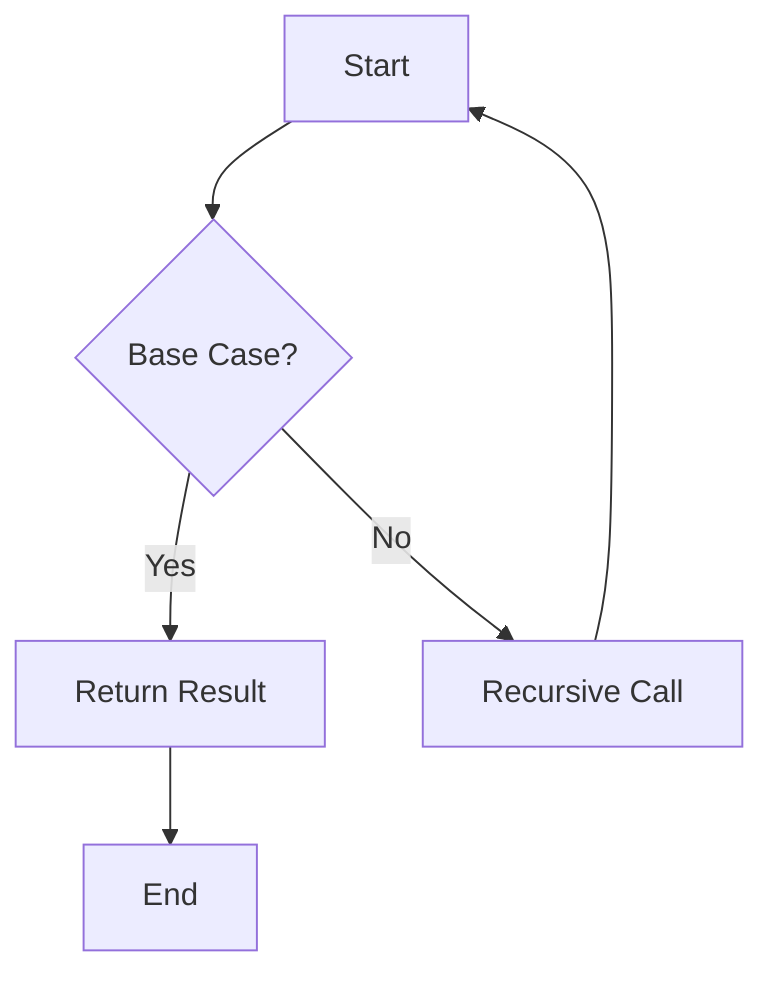

## 4.3 Recursion and Iteration

As experienced Java developers, you're likely familiar with iteration constructs such as `for`, `while`, and `do-while` loops. These constructs are staples in Java programming, allowing developers to execute a block of code repeatedly. However, in Clojure, a functional programming language, recursion takes center stage, offering a more elegant and expressive way to handle repetitive tasks. In this section, we'll explore how to transition from Java's iterative constructs to Clojure's recursion and iteration techniques, focusing on `loop/recur` and other functional constructs.

### Understanding Recursion in Clojure

Recursion is a fundamental concept in functional programming, where a function calls itself to solve smaller instances of the same problem. In Clojure, recursion is often preferred over traditional loops due to its alignment with immutability and functional purity.

#### Key Concepts of Recursion

- **Base Case**: The condition under which the recursive function stops calling itself. It prevents infinite recursion and eventual stack overflow.
- **Recursive Case**: The part of the function where the recursion occurs, typically involving a call to the function itself with modified arguments.

Let's start with a simple example of recursion in Clojure:

```clojure
(defn factorial [n]
  (if (<= n 1)
    1
    (* n (factorial (dec n)))))
```

In this example, the `factorial` function calculates the factorial of a number `n`. The base case is when `n` is less than or equal to 1, returning 1. The recursive case multiplies `n` by the factorial of `n-1`.

### Tail Recursion and `recur`

One of the challenges with recursion is the risk of stack overflow due to deep recursive calls. Clojure addresses this with tail recursion, where the recursive call is the last operation in the function. Clojure's `recur` keyword optimizes tail-recursive functions by reusing the current stack frame, preventing stack overflow.

#### Using `recur` for Tail Recursion

Here's how we can rewrite the factorial function using `recur`:

```clojure
(defn factorial [n]
  (letfn [(fact-helper [acc n]
            (if (<= n 1)
              acc
              (recur (* acc n) (dec n))))]
    (fact-helper 1 n)))
```

In this version, `fact-helper` is a helper function that accumulates the result in `acc`. The `recur` keyword ensures that the function is tail-recursive, allowing it to handle large values of `n` without stack overflow.

### Iteration with `loop/recur`

While recursion is powerful, there are cases where iteration is more intuitive. Clojure provides the `loop/recur` construct to facilitate iteration in a functional style.

#### Implementing Iterative Solutions with `loop/recur`

Consider the task of summing numbers from 1 to `n`. In Java, you might use a `for` loop:

```java
int sum = 0;
for (int i = 1; i <= n; i++) {
    sum += i;
}
```

In Clojure, you can achieve the same result using `loop/recur`:

```clojure
(defn sum-to-n [n]
  (loop [i 1
         sum 0]
    (if (> i n)
      sum
      (recur (inc i) (+ sum i)))))
```

Here, `loop` initializes the variables `i` and `sum`. The `recur` keyword updates these variables, effectively creating a loop that continues until `i` exceeds `n`.

### Comparing Recursion and Iteration

Both recursion and iteration have their place in Clojure. Recursion is often more expressive and aligns with functional programming principles, while `loop/recur` provides a familiar iterative approach for those transitioning from Java.

#### When to Use Recursion

- **Functional Purity**: Recursion is more aligned with functional programming, emphasizing immutability and statelessness.
- **Expressiveness**: Recursive solutions can be more concise and expressive, especially for problems naturally defined recursively (e.g., tree traversal).

#### When to Use `loop/recur`

- **Performance**: `loop/recur` can be more performant for certain tasks, as it avoids the overhead of function calls.
- **Familiarity**: For developers transitioning from imperative languages, `loop/recur` offers a more familiar approach to iteration.

### Advanced Recursion Techniques

#### Mutual Recursion

In mutual recursion, two or more functions call each other. This technique can be useful for problems that require alternating between different states or operations.

```clojure
(defn even? [n]
  (if (zero? n)
    true
    (odd? (dec n))))

(defn odd? [n]
  (if (zero? n)
    false
    (even? (dec n))))
```

In this example, `even?` and `odd?` are mutually recursive functions that determine the parity of a number.

#### Trampolining

Trampolining is a technique used to optimize recursive calls that are not tail-recursive. It involves returning a function from each recursive call, which is then executed by a trampoline function.

```clojure
(defn trampoline-factorial [n]
  (letfn [(fact-helper [acc n]
            (if (<= n 1)
              acc
              #(fact-helper (* acc n) (dec n))))]
    (trampoline fact-helper 1 n)))
```

The `trampoline` function repeatedly calls the returned function until a non-function value is obtained, effectively managing the recursion without growing the stack.

### Visualizing Recursion and Iteration

To better understand the flow of recursion and iteration, let's visualize the process using a flowchart.



**Caption**: This flowchart illustrates the recursive process, where the function checks for a base case and either returns a result or makes a recursive call.

### Try It Yourself

Now that we've explored recursion and iteration in Clojure, try modifying the examples to deepen your understanding:

1. **Modify the Factorial Function**: Implement a version that calculates the factorial of a number using mutual recursion.
2. **Sum of Even Numbers**: Write a function that sums all even numbers from 1 to `n` using `loop/recur`.
3. **Fibonacci Sequence**: Implement the Fibonacci sequence using both recursion and `loop/recur`, and compare their performance.

### Further Reading

For more information on recursion and iteration in Clojure, consider exploring the following resources:

- [Official Clojure Documentation on Recursion](https://clojure.org/reference/recursion)
- [ClojureDocs: Recursion Examples](https://clojuredocs.org/)
- [Functional Programming in Clojure](https://github.com/functional-programming-in-clojure)

### Knowledge Check

Before moving on, let's summarize the key takeaways:

- **Recursion** is a powerful tool in Clojure, allowing for expressive and functional solutions to problems.
- **Tail Recursion** with `recur` optimizes recursive calls, preventing stack overflow.
- **loop/recur** provides a familiar iterative approach for those transitioning from Java.
- **Mutual Recursion** and **Trampolining** are advanced techniques for managing complex recursive calls.

By mastering recursion and iteration in Clojure, you'll be well-equipped to tackle a wide range of programming challenges in a functional style.

## **Quiz: Are You Ready to Migrate from Java to Clojure?**



### What is the primary advantage of using recursion in Clojure?

- [x] It aligns with functional programming principles.
- [ ] It is faster than iteration.
- [ ] It uses less memory.
- [ ] It is easier to debug.

> **Explanation:** Recursion aligns with functional programming principles, emphasizing immutability and statelessness.

### How does `recur` optimize recursive functions in Clojure?

- [x] By reusing the current stack frame.
- [ ] By creating new stack frames.
- [ ] By using more memory.
- [ ] By slowing down execution.

> **Explanation:** `recur` reuses the current stack frame, preventing stack overflow in tail-recursive functions.

### When should you use `loop/recur` instead of recursion?

- [x] When performance is a concern.
- [ ] When you want more expressive code.
- [ ] When you have a small input size.
- [ ] When you want to use more memory.

> **Explanation:** `loop/recur` can be more performant for certain tasks, avoiding the overhead of function calls.

### What is mutual recursion?

- [x] When two or more functions call each other.
- [ ] When a function calls itself.
- [ ] When a function calls a helper function.
- [ ] When a function does not call any other function.

> **Explanation:** Mutual recursion occurs when two or more functions call each other, often used for alternating states or operations.

### What is trampolining used for in Clojure?

- [x] To optimize non-tail-recursive calls.
- [ ] To make code more readable.
- [ ] To increase memory usage.
- [ ] To slow down execution.

> **Explanation:** Trampolining optimizes non-tail-recursive calls by managing recursion without growing the stack.

### Which of the following is a base case in recursion?

- [x] The condition under which the recursive function stops.
- [ ] The part of the function where recursion occurs.
- [ ] The initial call to the function.
- [ ] The final result of the function.

> **Explanation:** The base case is the condition under which the recursive function stops calling itself.

### What does the `loop` keyword do in Clojure?

- [x] Initializes variables for iteration.
- [ ] Ends a recursive function.
- [ ] Creates a new stack frame.
- [ ] Optimizes memory usage.

> **Explanation:** The `loop` keyword initializes variables for iteration, used in conjunction with `recur`.

### How can you prevent stack overflow in recursive functions?

- [x] Use tail recursion with `recur`.
- [ ] Use more memory.
- [ ] Avoid base cases.
- [ ] Use larger input sizes.

> **Explanation:** Using tail recursion with `recur` prevents stack overflow by reusing the current stack frame.

### What is the role of a helper function in recursion?

- [x] To accumulate results or manage state.
- [ ] To increase memory usage.
- [ ] To slow down execution.
- [ ] To create new stack frames.

> **Explanation:** A helper function accumulates results or manages state, often used in tail-recursive functions.

### True or False: Recursion is always more efficient than iteration in Clojure.

- [ ] True
- [x] False

> **Explanation:** Recursion is not always more efficient than iteration; `loop/recur` can be more performant for certain tasks.


