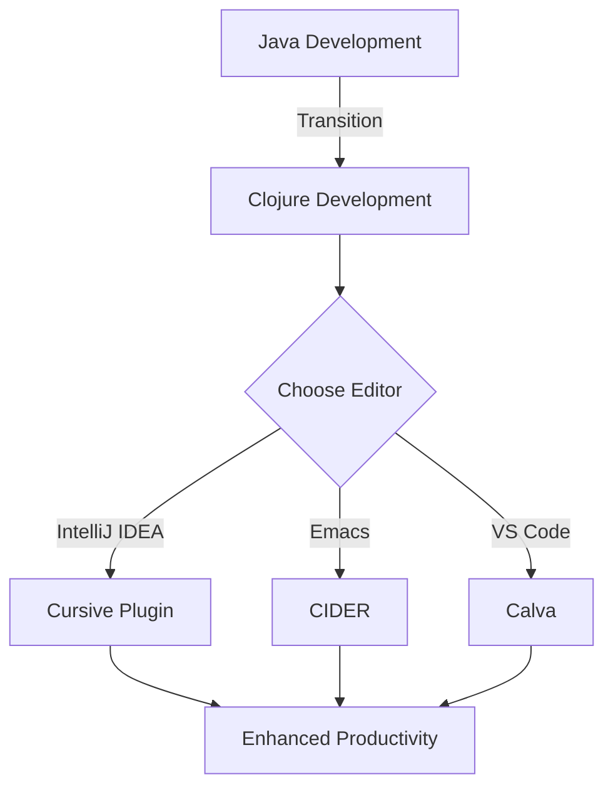

## 5.1 Tooling and Editors

As experienced Java developers, you're likely accustomed to using robust Integrated Development Environments (IDEs) like IntelliJ IDEA or Eclipse. These tools provide a comprehensive suite of features that enhance productivity, such as code completion, refactoring, and debugging. Transitioning to Clojure, a functional programming language, requires a shift not only in programming paradigms but also in the tools and editors you use. This section will guide you through selecting the right editor or IDE for Clojure development and enhancing productivity with plugins and extensions.

### Choosing the Right Editor or IDE for Clojure Development

When selecting an editor or IDE for Clojure, consider factors such as ease of use, community support, and available extensions. Here are some popular choices:

#### 1. IntelliJ IDEA with Cursive Plugin

**IntelliJ IDEA** is a powerful IDE widely used by Java developers. It supports Clojure development through the **Cursive** plugin, which provides features like syntax highlighting, code completion, and REPL integration.

- **Installation**: Install IntelliJ IDEA and add the Cursive plugin via the plugin marketplace.
- **Features**: 
  - **Syntax Highlighting**: Enhances code readability by coloring different parts of the code.
  - **Code Completion**: Offers suggestions as you type, speeding up the coding process.
  - **REPL Integration**: Allows you to run Clojure code interactively, facilitating experimentation and debugging.

```java
// Java Example: Simple Hello World
public class HelloWorld {
    public static void main(String[] args) {
        System.out.println("Hello, World!");
    }
}
```

```clojure
;; Clojure Example: Simple Hello World
(println "Hello, World!")
```

**Comparison**: While Java requires a class and a main method, Clojure's simplicity allows for direct execution of expressions.

#### 2. Emacs with CIDER

**Emacs** is a highly customizable text editor favored by many Clojure developers. When paired with **CIDER** (Clojure Interactive Development Environment that Rocks), it becomes a powerful tool for Clojure development.

- **Installation**: Install Emacs and add CIDER via the package manager.
- **Features**:
  - **Interactive Development**: Evaluate code directly in the editor.
  - **Debugging**: Provides a robust debugging environment.
  - **Customization**: Tailor the editor to your workflow with Emacs Lisp.

```clojure
;; Example: Using CIDER in Emacs
(defn greet [name]
  (str "Hello, " name "!"))

(greet "World") ;; Evaluates to "Hello, World!"
```

**Try It Yourself**: Modify the `greet` function to include a time-based greeting (e.g., "Good morning, World!").

#### 3. Visual Studio Code with Calva

**Visual Studio Code (VS Code)** is a lightweight, versatile editor with a large ecosystem of extensions. **Calva** is a popular extension for Clojure development in VS Code.

- **Installation**: Install VS Code and add the Calva extension from the marketplace.
- **Features**:
  - **Integrated REPL**: Run and test Clojure code within the editor.
  - **Linting and Formatting**: Ensure code quality with automatic linting and formatting.
  - **Git Integration**: Seamlessly manage version control.

```clojure
;; Example: Using Calva in VS Code
(defn add [x y]
  (+ x y))

(add 5 3) ;; Evaluates to 8
```

**Knowledge Check**: What are the advantages of using an integrated REPL for Clojure development?

### Enhancing Productivity with Plugins and Extensions

To maximize productivity in Clojure development, leverage plugins and extensions that enhance your chosen editor or IDE. Here are some recommendations:

#### 1. Paredit

**Paredit** is an essential tool for working with Lisp-based languages like Clojure. It helps maintain the structural integrity of your code by managing parentheses.

- **Installation**: Available for Emacs, IntelliJ IDEA, and VS Code.
- **Benefits**: 
  - **Structural Editing**: Automatically balances parentheses, reducing syntax errors.
  - **Navigation**: Easily move through code blocks.

```clojure
;; Example: Structural Editing with Paredit
(defn calculate [x y]
  (let [sum (+ x y)
        product (* x y)]
    {:sum sum :product product}))
```

**Exercise**: Use Paredit to add a division operation to the `calculate` function.

#### 2. Rainbow Parentheses

**Rainbow Parentheses** is a visual aid that colors matching parentheses, making it easier to navigate complex expressions.

- **Installation**: Available for Emacs, IntelliJ IDEA, and VS Code.
- **Benefits**: 
  - **Visual Clarity**: Quickly identify matching parentheses.
  - **Error Reduction**: Minimize syntax errors related to unmatched parentheses.

```clojure
;; Example: Visual Clarity with Rainbow Parentheses
(defn complex-calculation [a b c]
  (let [result (+ (* a b) (/ c a))]
    (println "Result:" result)))
```

**Try It Yourself**: Add more nested expressions to the `complex-calculation` function and observe the effect of Rainbow Parentheses.

#### 3. LSP (Language Server Protocol)

**LSP** provides language-specific features like auto-completion and error checking. It enhances the development experience by offering real-time feedback.

- **Installation**: Supported by Emacs, VS Code, and other editors.
- **Benefits**:
  - **Real-Time Feedback**: Immediate error detection and suggestions.
  - **Cross-Editor Support**: Consistent experience across different editors.

```clojure
;; Example: Using LSP for Error Checking
(defn divide [x y]
  (if (zero? y)
    (throw (Exception. "Division by zero"))
    (/ x y)))

(divide 10 0) ;; Throws an exception
```

**Knowledge Check**: How does LSP improve the development workflow in Clojure?

### Visual Aids

To better understand the flow of data and the structure of Clojure code, let's explore some diagrams.



**Diagram Description**: This flowchart illustrates the transition from Java development to Clojure development, highlighting the choice of editors and the path to enhanced productivity.

### References and Links

- [Official Clojure Documentation](https://clojure.org/)
- [Cursive Plugin for IntelliJ IDEA](https://cursive-ide.com/)
- [CIDER for Emacs](https://cider.mx/)
- [Calva for Visual Studio Code](https://marketplace.visualstudio.com/items?itemName=betterthantomorrow.calva)

### Summary

Choosing the right tooling and editors is crucial for a smooth transition from Java to Clojure. By leveraging powerful editors like IntelliJ IDEA, Emacs, and VS Code, along with productivity-enhancing plugins and extensions, you can create an efficient and enjoyable development environment. Remember to experiment with different tools to find the setup that best suits your workflow.

## **Quiz: Are You Ready to Migrate from Java to Clojure?**



### Which editor is known for its high customizability and is often paired with CIDER for Clojure development?

- [ ] IntelliJ IDEA
- [x] Emacs
- [ ] Visual Studio Code
- [ ] Eclipse

> **Explanation:** Emacs is highly customizable and, when paired with CIDER, becomes a powerful tool for Clojure development.

### What is the primary function of the Paredit plugin?

- [x] Structural editing of parentheses
- [ ] Syntax highlighting
- [ ] Code completion
- [ ] Version control integration

> **Explanation:** Paredit helps maintain the structural integrity of Lisp code by managing parentheses.

### Which extension is recommended for Clojure development in Visual Studio Code?

- [ ] Cursive
- [ ] CIDER
- [x] Calva
- [ ] Rainbow Parentheses

> **Explanation:** Calva is a popular extension for Clojure development in Visual Studio Code.

### What does LSP stand for in the context of development tools?

- [ ] Language Syntax Protocol
- [x] Language Server Protocol
- [ ] Language Support Package
- [ ] Language Structure Platform

> **Explanation:** LSP stands for Language Server Protocol, which provides language-specific features like auto-completion and error checking.

### Which feature is NOT typically provided by the Cursive plugin for IntelliJ IDEA?

- [ ] Syntax highlighting
- [ ] Code completion
- [x] Structural editing
- [ ] REPL integration

> **Explanation:** Structural editing is typically provided by Paredit, not Cursive.

### What is the benefit of using Rainbow Parentheses?

- [ ] Provides code completion
- [ ] Integrates version control
- [x] Colors matching parentheses
- [ ] Offers debugging tools

> **Explanation:** Rainbow Parentheses colors matching parentheses, aiding in code readability.

### How does an integrated REPL enhance Clojure development?

- [x] Allows interactive code execution
- [ ] Provides syntax highlighting
- [ ] Manages version control
- [ ] Offers code completion

> **Explanation:** An integrated REPL allows developers to run and test Clojure code interactively within the editor.

### Which tool is known for providing real-time feedback and error checking?

- [ ] Paredit
- [x] LSP
- [ ] Rainbow Parentheses
- [ ] Git

> **Explanation:** LSP provides real-time feedback and error checking, enhancing the development experience.

### What is a common feature of both IntelliJ IDEA and Visual Studio Code for Clojure development?

- [x] REPL integration
- [ ] Structural editing
- [ ] Customization with Emacs Lisp
- [ ] Built-in version control

> **Explanation:** Both IntelliJ IDEA and Visual Studio Code offer REPL integration for Clojure development.

### True or False: Emacs is primarily used for Java development.

- [ ] True
- [x] False

> **Explanation:** Emacs is not primarily used for Java development; it is more commonly associated with languages like Lisp and Clojure.


