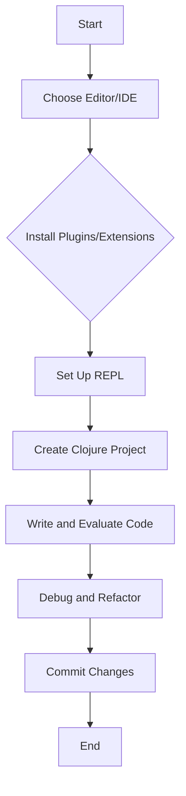

## 5.1 Tooling and Editors

As you embark on the journey of migrating from Java Object-Oriented Programming (OOP) to Clojure's functional programming paradigm, setting up an efficient development environment is crucial. This section will guide you through selecting the right tools and editors to enhance your productivity and streamline your Clojure development process.

### Choosing the Right Editor or IDE for Clojure Development

Selecting the appropriate Integrated Development Environment (IDE) or text editor is a pivotal decision that can significantly impact your development workflow. While Java developers might be accustomed to using IDEs like IntelliJ IDEA or Eclipse, Clojure offers a different set of tools that cater to its unique functional programming style.

#### Popular Editors and IDEs for Clojure

1. **Emacs with CIDER**: Emacs is a highly customizable text editor that, when combined with CIDER (Clojure Interactive Development Environment that Rocks), becomes a powerful tool for Clojure development. CIDER provides features such as interactive REPL, code evaluation, and debugging capabilities.

   - **Installation**: To set up Emacs with CIDER, first install Emacs, then add CIDER via the package manager. Configure your `.emacs` file to include CIDER settings.
   - **Advantages**: Emacs with CIDER offers a seamless integration with Clojure, allowing for real-time code evaluation and a highly interactive development experience.
   - **Resources**: [CIDER Documentation](https://cider.readthedocs.io/en/latest/)

2. **IntelliJ IDEA with Cursive**: IntelliJ IDEA is a popular choice among Java developers, and with the Cursive plugin, it becomes a robust environment for Clojure development.

   - **Installation**: Install IntelliJ IDEA and add the Cursive plugin from the plugin marketplace.
   - **Advantages**: Cursive provides excellent support for Clojure syntax, refactoring tools, and integration with build tools like Leiningen and deps.edn.
   - **Resources**: [Cursive Documentation](https://cursive-ide.com/userguide/)

3. **Visual Studio Code with Calva**: Visual Studio Code (VS Code) is a lightweight editor that, with the Calva extension, offers a modern and efficient environment for Clojure development.

   - **Installation**: Install VS Code and add the Calva extension from the extensions marketplace.
   - **Advantages**: Calva provides features such as inline evaluation, syntax highlighting, and a built-in REPL.
   - **Resources**: [Calva Documentation](https://calva.io/)

4. **Atom with Chlorine**: Atom is another versatile editor that, when paired with the Chlorine package, supports Clojure development.

   - **Installation**: Install Atom and add the Chlorine package via the package manager.
   - **Advantages**: Chlorine offers a simple setup with REPL integration and code evaluation features.
   - **Resources**: [Chlorine Documentation](https://atom.io/packages/chlorine)

5. **LightTable**: LightTable is an interactive IDE that provides real-time feedback and a unique approach to Clojure development.

   - **Installation**: Download and install LightTable from its official website.
   - **Advantages**: LightTable offers a highly interactive environment with instant feedback and inline evaluation.
   - **Resources**: [LightTable Documentation](http://lighttable.com/)

### Enhancing Productivity with Plugins and Extensions

To maximize productivity in your Clojure development environment, consider leveraging plugins and extensions that provide additional functionality and streamline your workflow.

#### Key Plugins and Extensions

1. **Paredit**: Paredit is an essential tool for working with Lisp-like languages, including Clojure. It helps maintain the structural integrity of your code by managing parentheses and other delimiters.

   - **Usage**: Paredit is available for Emacs, IntelliJ IDEA, and VS Code. It provides commands for navigating and manipulating S-expressions.
   - **Benefits**: Ensures code correctness and reduces syntax errors by automatically balancing parentheses.

2. **Rainbow Parentheses**: This extension color-codes matching parentheses, making it easier to navigate complex nested expressions.

   - **Usage**: Available for most editors, including Emacs, IntelliJ IDEA, and VS Code.
   - **Benefits**: Enhances code readability and helps prevent mismatched parentheses errors.

3. **REPL Integration**: A REPL (Read-Eval-Print Loop) is a crucial component of Clojure development, allowing you to interactively test and evaluate code.

   - **Setup**: Ensure your chosen editor supports REPL integration, enabling you to execute code snippets and receive immediate feedback.
   - **Benefits**: Facilitates rapid prototyping and debugging by allowing real-time code execution.

4. **Linting and Formatting Tools**: Tools like clj-kondo and zprint help maintain code quality by providing linting and formatting capabilities.

   - **Usage**: Integrate these tools into your development workflow to automatically check for common errors and enforce consistent code style.
   - **Benefits**: Improves code readability and reduces the likelihood of introducing bugs.

5. **Version Control Integration**: Ensure your editor supports integration with version control systems like Git, enabling seamless collaboration and code management.

   - **Setup**: Configure your editor to work with your preferred version control system, allowing you to commit, push, and pull changes directly from the editor.
   - **Benefits**: Streamlines the development process and facilitates team collaboration.

### Code Example: Setting Up a Simple Clojure Project

Let's walk through setting up a simple Clojure project using Leiningen, a popular build automation tool for Clojure.

```clojure
;; Step 1: Install Leiningen
;; Follow the instructions at https://leiningen.org/ to install Leiningen on your system.

;; Step 2: Create a new Clojure project
lein new app my-clojure-app

;; Step 3: Navigate to the project directory
cd my-clojure-app

;; Step 4: Open the project in your chosen editor (e.g., VS Code)
code .

;; Step 5: Start the REPL
lein repl

;; Step 6: Evaluate a simple expression in the REPL
(+ 1 2 3) ;; => 6
```

### Visual Aids

To better understand how these tools and editors fit into the Clojure development workflow, let's visualize the process using a flowchart.



**Figure 1**: Clojure Development Workflow

### References and Links

- [Clojure Official Documentation](https://clojure.org/reference)
- [Clojure Community Resources](https://clojure.org/community/resources)
- [Transitioning from OOP to Functional Programming](https://www.lispcast.com/oo-to-fp/)
- [CIDER Documentation](https://cider.readthedocs.io/en/latest/)
- [Cursive Documentation](https://cursive-ide.com/userguide/)
- [Calva Documentation](https://calva.io/)
- [Chlorine Documentation](https://atom.io/packages/chlorine)
- [LightTable Documentation](http://lighttable.com/)

### Knowledge Check

- What are the benefits of using Emacs with CIDER for Clojure development?
- How does the Cursive plugin enhance IntelliJ IDEA for Clojure developers?
- Why is REPL integration important in a Clojure development environment?
- What role do linting and formatting tools play in maintaining code quality?

### Encouraging Engagement

Embracing functional programming with Clojure can be a transformative experience. By setting up a robust development environment with the right tools and editors, you'll be well-equipped to tackle the challenges and reap the benefits of this powerful paradigm. Remember, each step you take in configuring your environment brings you closer to mastering Clojure and enhancing your productivity.

### Best Practices for Tags

- "Clojure"
- "Development Environment"
- "Tooling"
- "Editors"
- "IDE"
- "Plugins"
- "Extensions"
- "Functional Programming"

## **Quiz: Are You Ready to Migrate from Java to Clojure?**



### Which editor is known for its seamless integration with Clojure through CIDER?

- [x] Emacs
- [ ] IntelliJ IDEA
- [ ] Visual Studio Code
- [ ] Atom

> **Explanation:** Emacs, when combined with CIDER, provides a powerful and seamless integration for Clojure development.

### What is the primary advantage of using the Cursive plugin with IntelliJ IDEA?

- [x] Excellent support for Clojure syntax
- [ ] Built-in REPL
- [ ] Lightweight editor
- [ ] Real-time feedback

> **Explanation:** The Cursive plugin enhances IntelliJ IDEA by providing excellent support for Clojure syntax, refactoring tools, and integration with build tools.

### Which extension is essential for maintaining the structural integrity of Clojure code?

- [x] Paredit
- [ ] Rainbow Parentheses
- [ ] Calva
- [ ] Chlorine

> **Explanation:** Paredit is crucial for managing parentheses and maintaining the structural integrity of Clojure code.

### Why is REPL integration important in a Clojure development environment?

- [x] Allows interactive testing and evaluation
- [ ] Provides syntax highlighting
- [ ] Offers version control integration
- [ ] Enables code formatting

> **Explanation:** REPL integration is important because it allows developers to interactively test and evaluate code, facilitating rapid prototyping and debugging.

### Which tool is used for build automation in Clojure projects?

- [x] Leiningen
- [ ] Maven
- [ ] Gradle
- [ ] Ant

> **Explanation:** Leiningen is a popular build automation tool specifically designed for Clojure projects.

### What is the benefit of using Rainbow Parentheses?

- [x] Enhances code readability
- [ ] Provides real-time feedback
- [ ] Offers version control integration
- [ ] Enables code formatting

> **Explanation:** Rainbow Parentheses enhances code readability by color-coding matching parentheses, making it easier to navigate complex nested expressions.

### Which editor is known for its lightweight nature and modern interface?

- [x] Visual Studio Code
- [ ] Emacs
- [ ] IntelliJ IDEA
- [ ] LightTable

> **Explanation:** Visual Studio Code is known for its lightweight nature and modern interface, making it a popular choice for many developers.

### What is the role of linting tools like clj-kondo in Clojure development?

- [x] Check for common errors and enforce code style
- [ ] Provide syntax highlighting
- [ ] Offer version control integration
- [ ] Enable code formatting

> **Explanation:** Linting tools like clj-kondo help maintain code quality by checking for common errors and enforcing consistent code style.

### Which editor provides a unique approach to Clojure development with real-time feedback?

- [x] LightTable
- [ ] Atom
- [ ] IntelliJ IDEA
- [ ] Visual Studio Code

> **Explanation:** LightTable offers a unique approach to Clojure development by providing real-time feedback and a highly interactive environment.

### True or False: Atom with Chlorine is a suitable setup for Clojure development.

- [x] True
- [ ] False

> **Explanation:** Atom with the Chlorine package is a suitable setup for Clojure development, offering REPL integration and code evaluation features.



By selecting the right tools and editors, you can significantly enhance your productivity and streamline your transition from Java OOP to Clojure's functional programming paradigm. Embrace the power of Clojure and the tools that support it to unlock new levels of efficiency and innovation in your development process.
