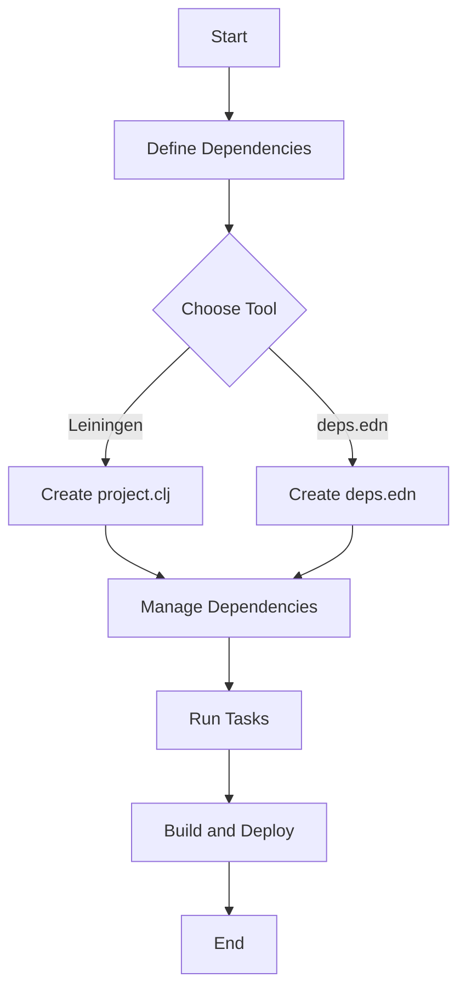

## 5.2 Build Automation with Leiningen and deps.edn

As you transition from Java to Clojure, understanding build automation tools is crucial for managing dependencies, configuring projects, and ensuring seamless team collaboration. In the Java ecosystem, tools like Maven and Gradle are prevalent, but in Clojure, Leiningen and deps.edn are the go-to solutions. This section will guide you through the essentials of using these tools effectively.

### Introduction to Build Automation in Clojure

Build automation is a critical aspect of modern software development, enabling developers to manage dependencies, compile code, run tests, and package applications efficiently. In Clojure, two primary tools facilitate these tasks: **Leiningen** and **deps.edn**. Each has its strengths and use cases, and understanding them will empower you to choose the right tool for your projects.

#### Why Build Automation Matters

- **Consistency**: Ensures that all team members work with the same project setup.
- **Efficiency**: Automates repetitive tasks, freeing developers to focus on coding.
- **Reliability**: Reduces human error by standardizing build processes.
- **Scalability**: Supports complex projects with multiple dependencies and modules.

### Leiningen: The Traditional Workhorse

Leiningen is a build automation tool specifically designed for Clojure projects. It simplifies project setup, dependency management, and task execution. If you're familiar with Maven, you'll find Leiningen's approach somewhat similar but tailored for Clojure's functional paradigm.

#### Setting Up Leiningen

1. **Installation**: Leiningen requires Java to be installed on your system. Once Java is set up, you can install Leiningen by downloading the script from [Leiningen's official site](https://leiningen.org/).

   ```bash
   curl https://raw.githubusercontent.com/technomancy/leiningen/stable/bin/lein > lein
   chmod +x lein
   ./lein
   ```

2. **Creating a New Project**: Use the `lein new` command to scaffold a new project.

   ```bash
   lein new app my-clojure-app
   ```

   This command creates a new directory `my-clojure-app` with a standard project structure.

3. **Project Configuration**: The `project.clj` file is the heart of a Leiningen project. It defines the project metadata, dependencies, and build configurations.

   ```clojure
   (defproject my-clojure-app "0.1.0-SNAPSHOT"
     :description "A simple Clojure application"
     :dependencies [[org.clojure/clojure "1.10.3"]]
     :main ^:skip-aot my-clojure-app.core
     :target-path "target/%s"
     :profiles {:uberjar {:aot :all}})
   ```

   - **Dependencies**: Specify libraries your project depends on.
   - **Profiles**: Define different build configurations, such as development and production.

#### Managing Dependencies with Leiningen

Leiningen uses Maven Central and Clojars as default repositories. You can add dependencies in the `:dependencies` vector in `project.clj`.

```clojure
:dependencies [[org.clojure/clojure "1.10.3"]
               [ring/ring-core "1.9.0"]]
```

- **Updating Dependencies**: Run `lein deps` to download and update dependencies.
- **Excluding Transitive Dependencies**: Use `:exclusions` to prevent specific transitive dependencies from being included.

#### Common Leiningen Tasks

- **Running the Application**: Use `lein run` to execute your application.
- **Testing**: Execute `lein test` to run tests defined in your project.
- **Building an Uberjar**: Create a standalone JAR with `lein uberjar`.

```bash
lein uberjar
```

This command packages your application and all its dependencies into a single JAR file.

### deps.edn: The Modern Approach

deps.edn is a more recent addition to the Clojure ecosystem, offering a lightweight and flexible way to manage dependencies and build configurations. It is part of the Clojure CLI tools and emphasizes simplicity and composability.

#### Setting Up deps.edn

1. **Installation**: Ensure you have the Clojure CLI tools installed. Follow the instructions on the [Clojure website](https://clojure.org/guides/getting_started).

2. **Creating a deps.edn File**: Unlike Leiningen, deps.edn does not scaffold projects. You manually create a `deps.edn` file in your project directory.

   ```clojure
   {:deps {org.clojure/clojure {:mvn/version "1.10.3"}
           ring/ring-core {:mvn/version "1.9.0"}}}
   ```

3. **Aliases and Paths**: Use aliases to define different configurations and paths for your project.

   ```clojure
   {:deps {org.clojure/clojure {:mvn/version "1.10.3"}}
    :paths ["src" "resources"]
    :aliases {:dev {:extra-paths ["dev"]
                    :extra-deps {cider/cider-nrepl {:mvn/version "0.25.9"}}}}}
   ```

   - **Paths**: Specify directories to include in the classpath.
   - **Aliases**: Define additional dependencies and paths for specific tasks.

#### Managing Dependencies with deps.edn

deps.edn uses a more declarative approach to dependency management. It supports Maven, Git, and local dependencies.

- **Maven Dependencies**: Specify Maven coordinates in the `:deps` map.
- **Git Dependencies**: Use `:git/url` and `:sha` to include dependencies from Git repositories.

```clojure
:deps {org.clojure/clojure {:mvn/version "1.10.3"}
       my-lib/my-lib {:git/url "https://github.com/my-lib/my-lib.git"
                      :sha "abcdef1234567890"}}
```

#### Running Tasks with deps.edn

deps.edn does not have built-in task management like Leiningen, but you can use aliases to run specific tasks.

- **Running the REPL**: Start a REPL with `clj` or `clojure`.

```bash
clj
```

- **Running a Script**: Use `-M` with an alias to execute a script.

```bash
clj -M:dev
```

### Comparing Leiningen and deps.edn

Both Leiningen and deps.edn have their place in the Clojure ecosystem. Here's a comparison to help you decide which tool to use:

| Feature                  | Leiningen                          | deps.edn                          |
|--------------------------|------------------------------------|-----------------------------------|
| **Project Scaffolding**  | Yes                                | No                                |
| **Dependency Management**| Maven-based                        | Maven, Git, Local                 |
| **Task Management**      | Built-in                           | Aliases                           |
| **Configuration**        | project.clj                        | deps.edn                          |
| **Community Support**    | Established, mature                | Growing, modern                   |

#### When to Use Leiningen

- **Complex Projects**: When you need extensive task management and project scaffolding.
- **Legacy Projects**: If you're maintaining an existing Leiningen-based project.

#### When to Use deps.edn

- **Simplicity**: For projects that prioritize simplicity and minimal configuration.
- **Flexibility**: When you need to integrate with other tools or use Git dependencies.

### Configuring Projects for Team Collaboration

Effective team collaboration requires consistent project configurations and dependency management. Both Leiningen and deps.edn support this through their configuration files.

#### Best Practices for Team Collaboration

1. **Version Control**: Keep `project.clj` or `deps.edn` under version control to ensure consistency across the team.
2. **Environment Configuration**: Use profiles (Leiningen) or aliases (deps.edn) to manage different environments (development, testing, production).
3. **Documentation**: Document build processes and dependencies to onboard new team members quickly.
4. **Continuous Integration**: Integrate build automation with CI/CD pipelines to automate testing and deployment.

### Visualizing the Build Process

To better understand how build automation works in Clojure, let's visualize the process using a flowchart.



**Diagram Description**: This flowchart illustrates the build automation process in Clojure, starting from defining dependencies to building and deploying the application.

### References and Further Reading

- [Leiningen Official Documentation](https://leiningen.org/)
- [Clojure CLI and deps.edn Guide](https://clojure.org/guides/deps_and_cli)
- [Clojure Community Resources](https://clojure.org/community/resources)
- [Transitioning from OOP to Functional Programming](https://www.lispcast.com/oo-to-fp/)

### Knowledge Check

To reinforce your understanding, consider these questions:

- What are the primary differences between Leiningen and deps.edn?
- How do you manage dependencies in a Clojure project using deps.edn?
- What are the benefits of using aliases in deps.edn?

### Practice Exercise

Try setting up a simple Clojure project using both Leiningen and deps.edn. Compare the configuration files and run a basic task in each setup. Experiment with adding a new dependency and observe how each tool handles it.

### Summary

In this section, we've explored the essentials of build automation in Clojure using Leiningen and deps.edn. Both tools offer unique advantages, and understanding them will help you manage dependencies, configure projects, and collaborate effectively with your team. As you continue your journey from Java to Clojure, mastering these tools will be invaluable in building robust and maintainable applications.

## **Quiz: Are You Ready to Migrate from Java to Clojure?**



### What is the primary purpose of build automation tools in Clojure?

- [x] To manage dependencies and automate repetitive tasks
- [ ] To write Clojure code
- [ ] To design user interfaces
- [ ] To handle network requests

> **Explanation:** Build automation tools like Leiningen and deps.edn are used to manage dependencies and automate tasks such as compiling code and running tests.

### Which file is central to a Leiningen project configuration?

- [x] project.clj
- [ ] deps.edn
- [ ] build.gradle
- [ ] pom.xml

> **Explanation:** The `project.clj` file is central to a Leiningen project, defining dependencies and build configurations.

### How does deps.edn handle Git dependencies?

- [x] By specifying a Git URL and SHA
- [ ] By downloading a ZIP file
- [ ] By using a Maven repository
- [ ] By copying files manually

> **Explanation:** deps.edn allows you to specify Git dependencies using a Git URL and SHA for versioning.

### What command is used to create a new Leiningen project?

- [x] lein new
- [ ] lein create
- [ ] lein init
- [ ] lein start

> **Explanation:** The `lein new` command is used to scaffold a new Leiningen project.

### Which tool is more suitable for projects prioritizing simplicity?

- [x] deps.edn
- [ ] Leiningen
- [ ] Maven
- [ ] Gradle

> **Explanation:** deps.edn is designed for simplicity and minimal configuration, making it suitable for projects that prioritize these aspects.

### What is the purpose of aliases in deps.edn?

- [x] To define additional configurations and dependencies for specific tasks
- [ ] To rename functions
- [ ] To create shortcuts for file paths
- [ ] To manage user permissions

> **Explanation:** Aliases in deps.edn are used to define additional configurations and dependencies for specific tasks.

### Which command starts a REPL using deps.edn?

- [x] clj
- [ ] lein repl
- [ ] java -jar
- [ ] run-repl

> **Explanation:** The `clj` command starts a REPL using the configuration defined in deps.edn.

### What is a common use case for Leiningen profiles?

- [x] Managing different build configurations for environments
- [ ] Creating user interfaces
- [ ] Writing documentation
- [ ] Handling network requests

> **Explanation:** Leiningen profiles are used to manage different build configurations for environments like development and production.

### How can you exclude a transitive dependency in Leiningen?

- [x] By using the :exclusions keyword
- [ ] By deleting the dependency manually
- [ ] By using a command-line flag
- [ ] By renaming the dependency

> **Explanation:** The `:exclusions` keyword in `project.clj` allows you to exclude specific transitive dependencies.

### True or False: deps.edn supports Maven, Git, and local dependencies.

- [x] True
- [ ] False

> **Explanation:** deps.edn supports dependencies from Maven repositories, Git repositories, and local file paths.


