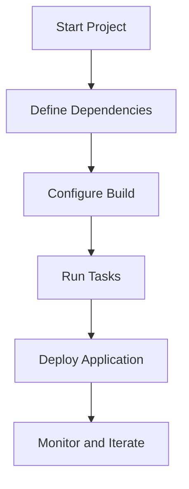

## 5.2 Build Automation with Leiningen and deps.edn

Transitioning from Java to Clojure involves not only learning a new programming paradigm but also adapting to different tools and workflows. In Java, you might be accustomed to using build tools like Maven or Gradle. In the Clojure ecosystem, **Leiningen** and **deps.edn** are the primary tools for build automation and dependency management. This section will guide you through setting up and using these tools effectively, ensuring a smooth transition and efficient project management.

### Understanding Build Automation in Clojure

Build automation is crucial for managing dependencies, compiling code, running tests, and packaging applications. In Clojure, build tools also facilitate REPL (Read-Eval-Print Loop) interactions, which are central to the language's interactive development style.

#### Key Concepts

- **Dependencies**: Libraries or modules your project relies on.
- **Build Configuration**: Instructions for compiling, testing, and packaging your code.
- **REPL Integration**: Interactive programming environment for testing and debugging.

### Leiningen: The Classic Clojure Build Tool

Leiningen is the most widely used build tool in the Clojure community. It simplifies project setup, dependency management, and task automation.

#### Installing Leiningen

To install Leiningen, follow these steps:

1. **Download the script**: Visit the [Leiningen website](https://leiningen.org/) and download the script.
2. **Make it executable**: Run `chmod +x lein` in your terminal.
3. **Move it to your PATH**: Use `mv lein /usr/local/bin/` to make it accessible globally.

#### Creating a New Project

Leiningen makes it easy to start a new Clojure project:

```bash
lein new app my-clojure-app
```

This command creates a new directory `my-clojure-app` with a standard project structure.

#### Project Configuration with `project.clj`

The `project.clj` file is the heart of a Leiningen project. It defines project metadata, dependencies, and build instructions.

```clojure
(defproject my-clojure-app "0.1.0-SNAPSHOT"
  :description "A simple Clojure application"
  :dependencies [[org.clojure/clojure "1.10.3"]]
  :main ^:skip-aot my-clojure-app.core
  :target-path "target/%s"
  :profiles {:uberjar {:aot :all}})
```

- **Dependencies**: Specify libraries your project depends on.
- **Main Namespace**: Define the entry point for your application.
- **Profiles**: Customize build configurations for different environments.

#### Running Tasks with Leiningen

Leiningen provides a variety of tasks to streamline development:

- **Run the application**: `lein run`
- **Start a REPL**: `lein repl`
- **Compile the code**: `lein compile`
- **Package as a JAR**: `lein uberjar`

### deps.edn: A Modern Approach to Dependency Management

While Leiningen is comprehensive, `deps.edn` offers a more lightweight and flexible approach, especially for dependency management and REPL-driven development.

#### Setting Up deps.edn

To use `deps.edn`, ensure you have the Clojure CLI tools installed. You can download them from the [Clojure website](https://clojure.org/guides/getting_started).

#### Creating a deps.edn File

The `deps.edn` file is used to declare dependencies and aliases for your project.

```clojure
{:deps {org.clojure/clojure {:mvn/version "1.10.3"}}
 :aliases {:dev {:extra-paths ["src/dev"]
                 :extra-deps {cider/cider-nrepl {:mvn/version "0.25.9"}}}}}
```

- **Dependencies**: Defined under the `:deps` key.
- **Aliases**: Custom configurations for different tasks or environments.

#### Running Clojure with deps.edn

The Clojure CLI provides commands to work with `deps.edn`:

- **Start a REPL**: `clj`
- **Run a script**: `clj -m my-clojure-app.core`
- **Add dependencies dynamically**: Use aliases to include additional libraries.

### Comparing Leiningen and deps.edn

Both tools have their strengths, and the choice between them depends on your project's needs.

#### Leiningen

- **Pros**: Comprehensive, supports plugins, widely adopted.
- **Cons**: Can be overkill for simple projects.

#### deps.edn

- **Pros**: Lightweight, flexible, ideal for REPL-driven development.
- **Cons**: Lacks built-in task automation (can be supplemented with tools like `make`).

### Configuring Projects for Team Collaboration

Effective collaboration requires consistent project configurations and dependency management.

#### Version Control

Ensure your `project.clj` or `deps.edn` files are included in version control to maintain consistency across team members.

#### Environment-Specific Configurations

Use profiles or aliases to manage environment-specific settings, such as development, testing, and production.

#### Continuous Integration

Integrate your build tool with CI/CD pipelines to automate testing and deployment. Both Leiningen and deps.edn can be configured to work with popular CI tools like Jenkins, Travis CI, and GitHub Actions.

### Code Examples

Let's explore some code examples to illustrate the use of Leiningen and deps.edn.

#### Leiningen Example

```clojure
;; project.clj
(defproject my-clojure-app "0.1.0-SNAPSHOT"
  :description "A simple Clojure application"
  :dependencies [[org.clojure/clojure "1.10.3"]
                 [ring/ring-core "1.9.0"]]
  :main ^:skip-aot my-clojure-app.core
  :target-path "target/%s"
  :profiles {:dev {:dependencies [[midje "1.9.9"]]}
             :uberjar {:aot :all}})
```

```clojure
;; src/my_clojure_app/core.clj
(ns my-clojure-app.core
  (:gen-class))

(defn -main
  "I don't do a whole lot ... yet."
  [& args]
  (println "Hello, World!"))
```

#### deps.edn Example

```clojure
;; deps.edn
{:deps {org.clojure/clojure {:mvn/version "1.10.3"}
        ring/ring-core {:mvn/version "1.9.0"}}
 :aliases {:dev {:extra-deps {midje/midje {:mvn/version "1.9.9"}}}}}
```

```clojure
;; src/my_clojure_app/core.clj
(ns my-clojure-app.core)

(defn -main
  [& args]
  (println "Hello, World!"))
```

### Visual Aids

Below is a diagram illustrating the flow of data and tasks in a typical Clojure project using Leiningen and deps.edn.



**Diagram Description**: This flowchart represents the typical lifecycle of a Clojure project, from starting a project and defining dependencies to deploying the application and monitoring its performance.

### References and Links

- [Leiningen Official Documentation](https://leiningen.org/)
- [Clojure CLI and deps.edn Guide](https://clojure.org/guides/deps_and_cli)
- [ClojureDocs](https://clojuredocs.org/)

### Knowledge Check

- What are the main differences between Leiningen and deps.edn?
- How can you manage environment-specific configurations in a Clojure project?
- Why is it important to include `project.clj` or `deps.edn` in version control?

### Encouraging Tone

Now that we've explored the essentials of build automation in Clojure, you're well-equipped to manage your projects efficiently. Whether you choose Leiningen or deps.edn, both tools offer robust solutions for dependency management and project configuration. Embrace the flexibility and power of Clojure's build tools to enhance your development workflow.

### Best Practices for Tags

- Use Specific and Relevant Tags
- Include 4 to 8 relevant and specific tags that reflect the article's content.
- Tags should reflect key topics, technologies, or concepts discussed in the article.
- Keep tag names consistent.
- Wrap tags in double-quotes.
- Avoid tags containing special characters like `#`.

## **Quiz: Are You Ready to Migrate from Java to Clojure?**



### What is the primary purpose of Leiningen in Clojure projects?

- [x] Build automation and dependency management
- [ ] Database management
- [ ] User interface design
- [ ] Network configuration

> **Explanation:** Leiningen is primarily used for build automation and managing dependencies in Clojure projects.

### Which file is central to a Leiningen project configuration?

- [x] project.clj
- [ ] deps.edn
- [ ] pom.xml
- [ ] build.gradle

> **Explanation:** The `project.clj` file is used to define project metadata, dependencies, and build instructions in a Leiningen project.

### How can you start a REPL using deps.edn?

- [x] clj
- [ ] lein repl
- [ ] java -jar
- [ ] mvn exec:java

> **Explanation:** The `clj` command is used to start a REPL when using deps.edn for dependency management.

### What is an advantage of using deps.edn over Leiningen?

- [x] Lightweight and flexible
- [ ] Built-in task automation
- [ ] Comprehensive plugin support
- [ ] Integrated testing framework

> **Explanation:** deps.edn is known for being lightweight and flexible, making it ideal for REPL-driven development.

### Which tool is more suitable for complex projects with extensive build requirements?

- [x] Leiningen
- [ ] deps.edn
- [ ] Ant
- [ ] Make

> **Explanation:** Leiningen is more suitable for complex projects due to its comprehensive features and plugin support.

### How do you specify additional dependencies for development in deps.edn?

- [x] Using aliases
- [ ] In the project.clj file
- [ ] Through environment variables
- [ ] By editing the classpath directly

> **Explanation:** Aliases in deps.edn allow you to specify additional dependencies for development or other specific tasks.

### What command would you use to package a Clojure application as a JAR using Leiningen?

- [x] lein uberjar
- [ ] lein package
- [ ] clj -m package
- [ ] mvn package

> **Explanation:** The `lein uberjar` command packages a Clojure application as a standalone JAR file.

### Which of the following is NOT a feature of Leiningen?

- [ ] Dependency management
- [ ] Task automation
- [x] Dynamic typing
- [ ] REPL integration

> **Explanation:** Dynamic typing is a feature of the Clojure language itself, not specific to Leiningen.

### What is the purpose of the `:profiles` key in a Leiningen project.clj file?

- [x] To define environment-specific configurations
- [ ] To list all project dependencies
- [ ] To specify the main namespace
- [ ] To set the Java version

> **Explanation:** The `:profiles` key is used to define different configurations for various environments, such as development or production.

### True or False: deps.edn can be used to manage dependencies for both Clojure and Java projects.

- [x] True
- [ ] False

> **Explanation:** deps.edn is primarily designed for Clojure projects, but it can manage dependencies that include Java libraries as well.


