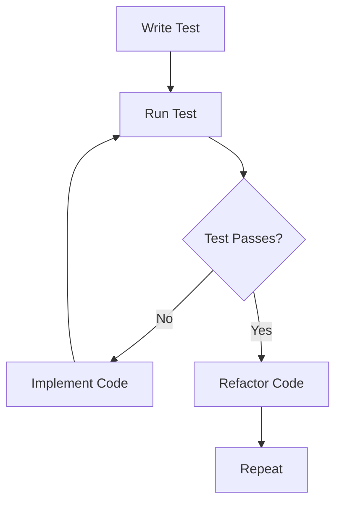

## 5.3 Testing Frameworks

As we transition from Java's Object-Oriented Programming (OOP) to Clojure's functional paradigm, it's crucial to adapt our testing strategies to ensure the reliability and robustness of our applications. Testing is a cornerstone of software development, and Clojure offers several powerful frameworks to facilitate this process. In this section, we will delve into the most prominent testing frameworks in Clojure, such as `clojure.test` and Midje, and explore how to incorporate testing into your development workflow effectively.

### Introduction to Clojure Testing Frameworks

Testing in Clojure is designed to be straightforward and expressive, aligning with the language's philosophy of simplicity and power. Clojure's immutable data structures and pure functions lend themselves well to testing, as they reduce side effects and make it easier to predict outcomes. Let's explore the primary testing frameworks available in Clojure and how they compare to Java's testing tools like JUnit.

#### clojure.test

`clojure.test` is the built-in testing library in Clojure, providing a simple yet effective way to write unit tests. It is analogous to JUnit in Java but leverages Clojure's functional features to offer a more concise and expressive syntax.

**Key Features of clojure.test:**

- **Simplicity and Integration:** As part of the Clojure core, `clojure.test` is readily available and integrates seamlessly with the language.
- **Assertions and Fixtures:** Provides a variety of assertions and setup/teardown fixtures to manage test environments.
- **Test Metadata:** Supports metadata for organizing and filtering tests.

Let's examine a basic example of a test written using `clojure.test`:

```clojure
(ns myapp.core-test
  (:require [clojure.test :refer :all]
            [myapp.core :refer :all]))

(deftest addition-test
  (testing "Addition of two numbers"
    (is (= 4 (add 2 2)))))

(run-tests)
```

In this example, we define a test namespace `myapp.core-test` and use the `deftest` macro to create a test case. The `testing` macro provides a description, and the `is` macro asserts that the expression evaluates to true.

#### Midje

Midje is another popular testing framework in Clojure, known for its readability and flexibility. It offers a more narrative style of writing tests, making them easier to understand and maintain.

**Key Features of Midje:**

- **Readable Syntax:** Midje's syntax is designed to be close to natural language, improving test readability.
- **Facts and Checks:** Uses `facts` and `checks` to define expectations and verify outcomes.
- **Mocking and Stubbing:** Provides robust support for mocking and stubbing, allowing for isolated unit tests.

Here's an example of a test written using Midje:

```clojure
(ns myapp.core-test
  (:require [midje.sweet :refer :all]
            [myapp.core :refer :all]))

(fact "Addition of two numbers"
  (add 2 2) => 4)
```

In this example, the `fact` macro is used to define a test case, and the `=>` operator specifies the expected result. Midje's syntax is concise and expressive, making it a favorite among Clojure developers.

### Incorporating Testing into the Development Workflow

Integrating testing into your development workflow is essential for maintaining code quality and ensuring that your applications behave as expected. Here are some best practices for incorporating testing into your Clojure projects:

#### Test-Driven Development (TDD)

Adopting Test-Driven Development (TDD) can significantly enhance your development process. TDD involves writing tests before implementing the corresponding functionality, ensuring that your code meets the specified requirements from the outset.

**Steps for TDD:**

1. **Write a Test:** Begin by writing a test that defines the desired behavior of a function or feature.
2. **Run the Test:** Execute the test to ensure it fails, confirming that the functionality is not yet implemented.
3. **Implement the Code:** Write the minimal amount of code necessary to pass the test.
4. **Refactor:** Refactor the code to improve its structure and readability while ensuring the test still passes.
5. **Repeat:** Continue this cycle for each new feature or change.

#### Continuous Integration (CI)

Incorporating Continuous Integration (CI) into your workflow ensures that tests are run automatically whenever changes are made to the codebase. CI tools like Jenkins, Travis CI, or GitHub Actions can be configured to execute your Clojure tests, providing immediate feedback on the impact of code changes.

**Benefits of CI:**

- **Early Detection of Issues:** CI helps identify bugs and regressions early in the development process.
- **Consistent Testing Environment:** Ensures tests are run in a consistent environment, reducing discrepancies between development and production.
- **Automated Reporting:** Provides automated reports on test results, making it easier to track and address issues.

#### Code Coverage

Measuring code coverage is an effective way to assess the completeness of your tests. Tools like Cloverage can be used to generate coverage reports for Clojure projects, highlighting areas of the codebase that are not adequately tested.

**Using Cloverage:**

1. **Add Cloverage to Your Project:** Include Cloverage as a dependency in your `project.clj` or `deps.edn` file.
2. **Run Cloverage:** Execute Cloverage to generate a coverage report, which will indicate the percentage of code covered by tests.
3. **Analyze the Report:** Review the report to identify untested code and prioritize writing additional tests.

### Advanced Testing Techniques

As you become more comfortable with Clojure's testing frameworks, you can explore advanced techniques to further enhance your testing strategy.

#### Property-Based Testing

Property-based testing is a powerful technique that involves specifying properties or invariants that should hold true for a wide range of inputs. Libraries like test.check provide support for property-based testing in Clojure.

**Example of Property-Based Testing:**

```clojure
(ns myapp.core-test
  (:require [clojure.test :refer :all]
            [clojure.test.check :as tc]
            [clojure.test.check.generators :as gen]
            [clojure.test.check.properties :as prop]))

(def addition-commutative
  (prop/for-all [a gen/int
                 b gen/int]
    (= (add a b) (add b a))))

(tc/quick-check 100 addition-commutative)
```

In this example, we define a property `addition-commutative` that asserts the commutative property of addition. The `quick-check` function is used to test this property with 100 random inputs.

#### Mocking and Stubbing

Mocking and stubbing are techniques used to isolate the unit under test by replacing dependencies with controlled substitutes. Midje provides robust support for mocking and stubbing, allowing you to test functions in isolation.

**Example of Mocking with Midje:**

```clojure
(ns myapp.core-test
  (:require [midje.sweet :refer :all]
            [myapp.core :refer :all]))

(fact "Fetching user data"
  (fetch-user 1) => {:id 1 :name "Alice"}
  (provided
    (get-user-from-db 1) => {:id 1 :name "Alice"}))
```

In this example, the `provided` clause is used to specify that the `get-user-from-db` function should return a specific value when called with the argument `1`. This allows us to test the `fetch-user` function without relying on the actual database.

### Visual Aids: Testing Workflow

To better understand how testing fits into the development workflow, let's visualize the process using a flowchart.



**Figure 1:** Test-Driven Development Workflow

This flowchart illustrates the iterative nature of TDD, emphasizing the importance of writing tests before implementing code and continuously refactoring to improve code quality.

### Conclusion

Testing is an integral part of the software development process, and Clojure offers a variety of frameworks and tools to support effective testing practices. By leveraging `clojure.test`, Midje, and other testing frameworks, you can ensure that your Clojure applications are robust, reliable, and maintainable. Incorporating testing into your development workflow through practices like TDD and CI will further enhance your ability to deliver high-quality software.

As you continue your journey from Java OOP to Clojure's functional paradigm, remember that testing is not just a task to be completed but a mindset to be embraced. By adopting a comprehensive testing strategy, you'll be well-equipped to tackle the challenges of enterprise application development in Clojure.

## **Quiz: Are You Ready to Migrate from Java to Clojure?**



### Which Clojure testing framework is built into the language and provides a simple way to write unit tests?

- [x] clojure.test
- [ ] Midje
- [ ] JUnit
- [ ] test.check

> **Explanation:** `clojure.test` is the built-in testing library in Clojure, providing a straightforward way to write unit tests.

### What is a key feature of Midje that makes it popular among Clojure developers?

- [x] Readable syntax
- [ ] Built-in to Clojure
- [ ] Requires no setup
- [ ] Provides code coverage

> **Explanation:** Midje is known for its readable syntax, which is designed to be close to natural language, improving test readability.

### What is the first step in Test-Driven Development (TDD)?

- [x] Write a test
- [ ] Implement the code
- [ ] Refactor the code
- [ ] Run the test

> **Explanation:** The first step in TDD is to write a test that defines the desired behavior of a function or feature.

### Which tool can be used to measure code coverage in Clojure projects?

- [x] Cloverage
- [ ] Midje
- [ ] JUnit
- [ ] Leiningen

> **Explanation:** Cloverage is a tool used to generate coverage reports for Clojure projects, highlighting areas of the codebase that are not adequately tested.

### What does the `provided` clause in Midje do?

- [x] Specifies a return value for a mocked function
- [ ] Runs the test
- [ ] Generates a coverage report
- [ ] Refactors the code

> **Explanation:** The `provided` clause in Midje is used to specify that a function should return a specific value when called with certain arguments, allowing for isolated unit tests.

### Which of the following is a benefit of Continuous Integration (CI)?

- [x] Early detection of issues
- [ ] Eliminates the need for testing
- [ ] Guarantees no bugs
- [ ] Provides code refactoring

> **Explanation:** Continuous Integration helps identify bugs and regressions early in the development process by running tests automatically whenever changes are made to the codebase.

### What is property-based testing?

- [x] Testing that involves specifying properties or invariants that should hold true for a wide range of inputs
- [ ] Testing that only checks specific values
- [ ] Testing that does not require any input
- [ ] Testing that is only used for UI components

> **Explanation:** Property-based testing involves specifying properties or invariants that should hold true for a wide range of inputs, and tools like test.check provide support for this in Clojure.

### Which of the following is NOT a step in the TDD cycle?

- [ ] Write a test
- [ ] Run the test
- [ ] Implement the code
- [x] Deploy the application

> **Explanation:** Deploying the application is not a step in the TDD cycle, which focuses on writing tests, running them, implementing code, and refactoring.

### What is the purpose of the `fact` macro in Midje?

- [x] To define a test case
- [ ] To run a test
- [ ] To generate a coverage report
- [ ] To refactor code

> **Explanation:** The `fact` macro in Midje is used to define a test case, specifying the expected behavior and outcome.

### True or False: Midje provides robust support for mocking and stubbing.

- [x] True
- [ ] False

> **Explanation:** True. Midje provides robust support for mocking and stubbing, allowing developers to test functions in isolation.


