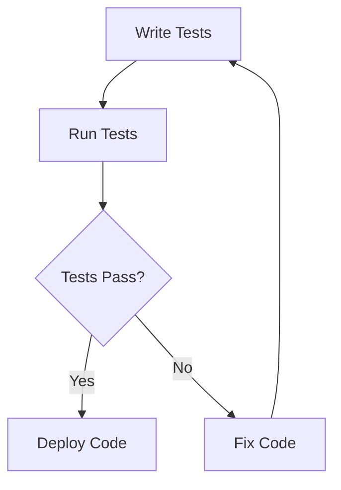

## 5.3 Testing Frameworks

As experienced Java developers, you're likely familiar with testing frameworks like JUnit and TestNG. In Clojure, testing is equally crucial, and there are several powerful frameworks available to ensure your code is robust and reliable. In this section, we'll explore the most popular testing frameworks in Clojure, such as `clojure.test` and Midje, and discuss how to incorporate testing into your development workflow effectively.

### Introduction to Clojure Testing Frameworks

Testing is an integral part of software development, ensuring that code behaves as expected and reducing the likelihood of bugs. Clojure offers several testing frameworks that cater to different needs and preferences. Let's delve into the most commonly used frameworks and how they compare to Java's testing tools.

#### clojure.test

`clojure.test` is the built-in testing framework in Clojure, similar to JUnit in Java. It provides a simple and straightforward way to write tests, making it an excellent choice for developers transitioning from Java.

**Key Features of clojure.test:**

- **Simplicity:** `clojure.test` is easy to use and integrates seamlessly with Clojure projects.
- **Assertions:** Provides a variety of assertions to validate test conditions.
- **Fixtures:** Supports setup and teardown operations for tests.
- **Integration:** Works well with build tools like Leiningen and deps.edn.

#### Midje

Midje is a more expressive testing framework that emphasizes readability and conciseness. It allows you to write tests that closely resemble natural language, making them easier to understand and maintain.

**Key Features of Midje:**

- **Expressiveness:** Tests are written in a style that reads like documentation.
- **Facts and Checks:** Uses "facts" and "checks" to define expected behavior.
- **Mocking and Stubbing:** Provides powerful tools for mocking and stubbing dependencies.
- **Integration:** Compatible with popular build tools and continuous integration systems.

### Writing Tests with clojure.test

Let's start by exploring how to write tests using `clojure.test`. We'll cover the basics of setting up tests, writing assertions, and using fixtures.

#### Setting Up clojure.test

To use `clojure.test`, you need to include it in your project. If you're using Leiningen, add the following dependency to your `project.clj` file:

```clojure
:dependencies [[org.clojure/clojure "1.10.3"]
               [org.clojure/test.check "1.1.0"]]
```

For deps.edn, add it to your dependencies map:

```clojure
{:deps {org.clojure/clojure {:mvn/version "1.10.3"}
        org.clojure/test.check {:mvn/version "1.1.0"}}}
```

#### Writing Basic Tests

Here's a simple example of a test using `clojure.test`:

```clojure
(ns myapp.core-test
  (:require [clojure.test :refer :all]
            [myapp.core :refer :all]))

(deftest addition-test
  (testing "Addition of two numbers"
    (is (= 4 (add 2 2)))))

(deftest subtraction-test
  (testing "Subtraction of two numbers"
    (is (= 0 (subtract 2 2)))))
```

**Explanation:**

- **`deftest`:** Defines a test function.
- **`testing`:** Provides a description of the test.
- **`is`:** Asserts that a condition is true.

#### Using Fixtures

Fixtures in `clojure.test` allow you to set up and tear down test environments. They are similar to `@Before` and `@After` annotations in JUnit.

```clojure
(use-fixtures :each
  (fn [f]
    (println "Setting up")
    (f)
    (println "Tearing down")))
```

**Explanation:**

- **`use-fixtures`:** Applies a fixture to each test.
- **`:each`:** Specifies that the fixture should run before and after each test.

### Writing Tests with Midje

Midje offers a more expressive way to write tests, focusing on readability and ease of understanding.

#### Setting Up Midje

To use Midje, add it to your `project.clj`:

```clojure
:dependencies [[org.clojure/clojure "1.10.3"]
               [midje "1.9.10"]]
```

#### Writing Basic Tests

Here's how you can write a test in Midje:

```clojure
(ns myapp.core-test
  (:require [midje.sweet :refer :all]
            [myapp.core :refer :all]))

(fact "Addition of two numbers"
  (add 2 2) => 4)

(fact "Subtraction of two numbers"
  (subtract 2 2) => 0)
```

**Explanation:**

- **`fact`:** Defines a test case.
- **`=>`:** Asserts that the expression on the left evaluates to the value on the right.

#### Mocking and Stubbing

Midje provides powerful tools for mocking and stubbing, allowing you to isolate tests from external dependencies.

```clojure
(fact "Mocking example"
  (provided
    (external-function) => "mocked result")
  (my-function) => "expected result")
```

**Explanation:**

- **`provided`:** Defines a mock for an external function.
- **`=>`:** Specifies the expected result of the mock.

### Incorporating Testing into the Development Workflow

Testing should be an integral part of your development workflow. Here are some best practices for incorporating testing into your Clojure projects:

#### Continuous Integration

Integrate your tests with a continuous integration (CI) system to ensure that tests are run automatically with each code change. Popular CI tools like Jenkins, Travis CI, and CircleCI support Clojure projects.

#### Test-Driven Development (TDD)

Adopt a test-driven development approach by writing tests before implementing new features. This practice helps clarify requirements and ensures that your code meets the desired specifications.

#### Code Coverage

Use tools like Cloverage to measure code coverage and identify untested parts of your codebase. Aim for high coverage to ensure that your tests are comprehensive.

### Comparing Clojure and Java Testing

Let's compare Clojure's testing frameworks with Java's to highlight similarities and differences.

#### Similarities

- **Assertions:** Both Clojure and Java provide assertions to validate test conditions.
- **Fixtures:** Both languages support setup and teardown operations for tests.
- **Integration:** Both integrate well with build tools and CI systems.

#### Differences

- **Expressiveness:** Midje offers a more expressive syntax compared to JUnit.
- **Functional Paradigm:** Clojure's functional nature encourages pure functions, making tests easier to write and reason about.
- **Mocking:** Midje provides built-in support for mocking, whereas Java often relies on external libraries like Mockito.

### Visual Aids

To better understand the flow of data through Clojure's testing frameworks, let's look at a flowchart illustrating the testing process:



**Caption:** This flowchart represents the typical testing process in Clojure, from writing tests to deploying code.

### References and Links

For further reading and resources, consider exploring the following:

- [Official Clojure Documentation](https://clojure.org/)
- [ClojureDocs](https://clojuredocs.org/)
- [Midje GitHub Repository](https://github.com/marick/Midje)

### Knowledge Check

Let's test your understanding of Clojure's testing frameworks with a few questions:

1. What is the primary purpose of `clojure.test`?
2. How does Midje differ from `clojure.test` in terms of expressiveness?
3. What is the role of fixtures in testing?
4. How can you integrate tests with a CI system?
5. What are the benefits of adopting TDD in Clojure?

### Encouraging Tone

Now that we've explored Clojure's testing frameworks, you're well-equipped to write robust and reliable tests for your Clojure applications. Remember, testing is not just about finding bugs—it's about ensuring that your code meets the desired specifications and behaves as expected. Keep experimenting with different testing techniques and frameworks to find what works best for your projects.

### Best Practices for Tags

- Use Specific and Relevant Tags
- Include 4 to 8 relevant and specific tags that reflect the article's content.
- Tags should reflect key topics, technologies, or concepts discussed in the article.
- Keep tag names consistent.
- Avoid tags containing special characters like `#`.

## **Quiz: Are You Ready to Migrate from Java to Clojure?**



### What is the primary purpose of `clojure.test`?

- [x] To provide a built-in framework for writing and running tests in Clojure.
- [ ] To compile Clojure code into Java bytecode.
- [ ] To manage dependencies in Clojure projects.
- [ ] To provide a graphical user interface for Clojure applications.

> **Explanation:** `clojure.test` is the built-in testing framework in Clojure, designed to facilitate writing and running tests.

### How does Midje differ from `clojure.test` in terms of expressiveness?

- [x] Midje allows tests to be written in a style that resembles natural language.
- [ ] Midje requires more boilerplate code than `clojure.test`.
- [ ] Midje does not support mocking and stubbing.
- [ ] Midje is only compatible with Java projects.

> **Explanation:** Midje emphasizes readability and expressiveness, allowing tests to be written in a style that closely resembles natural language.

### What is the role of fixtures in testing?

- [x] To set up and tear down test environments before and after tests.
- [ ] To compile test code into executable binaries.
- [ ] To provide a user interface for running tests.
- [ ] To manage dependencies in test projects.

> **Explanation:** Fixtures are used to set up and tear down test environments, similar to `@Before` and `@After` annotations in JUnit.

### How can you integrate tests with a CI system?

- [x] By configuring the CI system to run tests automatically with each code change.
- [ ] By manually running tests after each deployment.
- [ ] By writing tests in a separate language.
- [ ] By using a graphical user interface to manage test execution.

> **Explanation:** Integrating tests with a CI system ensures that tests are run automatically with each code change, providing continuous feedback on code quality.

### What are the benefits of adopting TDD in Clojure?

- [x] Clarifies requirements and ensures code meets desired specifications.
- [ ] Increases the amount of boilerplate code.
- [ ] Reduces the need for automated testing.
- [ ] Limits the use of functional programming concepts.

> **Explanation:** Test-driven development (TDD) helps clarify requirements and ensures that code meets the desired specifications by writing tests before implementing features.

### Which of the following is a key feature of Midje?

- [x] Expressive syntax that reads like documentation.
- [ ] Lack of support for mocking and stubbing.
- [ ] Requirement for external libraries for assertions.
- [ ] Incompatibility with build tools.

> **Explanation:** Midje offers an expressive syntax that reads like documentation, making tests easier to understand and maintain.

### What is the purpose of using `provided` in Midje?

- [x] To define a mock for an external function.
- [ ] To compile Clojure code into Java bytecode.
- [ ] To manage dependencies in Clojure projects.
- [ ] To provide a graphical user interface for Clojure applications.

> **Explanation:** `provided` is used in Midje to define a mock for an external function, allowing you to isolate tests from external dependencies.

### Which tool can be used to measure code coverage in Clojure?

- [x] Cloverage
- [ ] Leiningen
- [ ] deps.edn
- [ ] Midje

> **Explanation:** Cloverage is a tool used to measure code coverage in Clojure, helping identify untested parts of the codebase.

### What is a similarity between Clojure and Java testing frameworks?

- [x] Both provide assertions to validate test conditions.
- [ ] Both require external libraries for mocking.
- [ ] Both lack support for continuous integration.
- [ ] Both use the same syntax for writing tests.

> **Explanation:** Both Clojure and Java testing frameworks provide assertions to validate test conditions, ensuring that code behaves as expected.

### True or False: Midje is only compatible with Java projects.

- [ ] True
- [x] False

> **Explanation:** Midje is a Clojure testing framework and is not limited to Java projects. It is designed to work with Clojure code.


