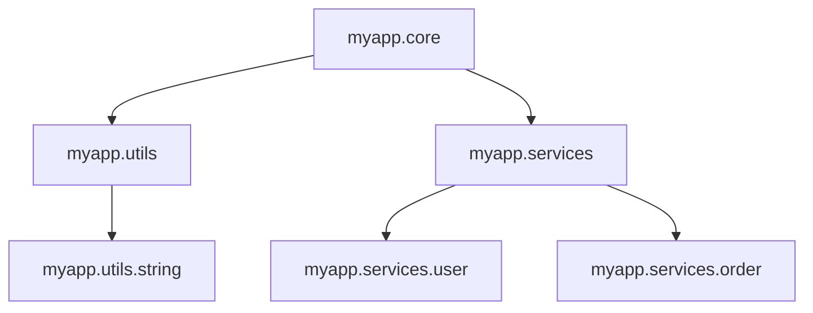

## 6.1 Organizing Code with Namespaces

As experienced Java developers, you're familiar with organizing code using packages. In Clojure, the concept of namespaces serves a similar purpose, allowing you to group related functions and data structures logically. This section will guide you through understanding how namespaces replace Java packages, best practices for namespace structure, and how to leverage namespaces to maintain clean and manageable codebases.

### Understanding Namespaces in Clojure

In Java, packages are used to group related classes and interfaces, providing a way to avoid name conflicts and control access. Similarly, Clojure uses namespaces to organize functions, macros, and variables. A namespace in Clojure is essentially a mapping from symbols to their corresponding values, which can include functions, variables, and other namespaces.

#### Key Differences Between Java Packages and Clojure Namespaces

- **Declaration**: In Java, packages are declared using the `package` keyword at the top of a file. In Clojure, namespaces are declared using the `ns` macro.
- **Scope**: Java packages are primarily used for organizing classes, while Clojure namespaces can contain functions, variables, and other namespaces.
- **Access Control**: Java uses access modifiers (e.g., `public`, `private`) to control access to classes and members. Clojure relies on conventions and the use of private symbols to manage access.

#### Declaring a Namespace

To declare a namespace in Clojure, use the `ns` macro at the beginning of your file. Here's a simple example:

```clojure
(ns myapp.core
  (:require [clojure.string :as str]))

(defn greet [name]
  (str "Hello, " name "!"))
```

In this example, `myapp.core` is the namespace, and we're requiring the `clojure.string` library with an alias `str`.

### Best Practices for Namespace Structure

Organizing your code effectively with namespaces is crucial for maintaining a scalable and manageable codebase. Here are some best practices to consider:

#### 1. **Logical Grouping**

Group related functions and data structures within the same namespace. This approach enhances readability and makes it easier to locate specific pieces of functionality.

#### 2. **Consistent Naming Conventions**

Adopt a consistent naming convention for your namespaces. A common practice is to use a hierarchical structure similar to Java packages, reflecting the project's structure. For example:

- `myapp.core`: Core functionality of the application.
- `myapp.utils`: Utility functions.
- `myapp.services`: Service-related functions.

#### 3. **Avoid Overly Large Namespaces**

Avoid cramming too many functions and variables into a single namespace. Instead, break down large namespaces into smaller, more focused ones. This modular approach improves maintainability and reduces cognitive load.

#### 4. **Use Aliases for Clarity**

When requiring other namespaces, use aliases to avoid conflicts and improve code clarity. For instance:

```clojure
(ns myapp.core
  (:require [clojure.string :as str]
            [myapp.utils :as utils]))
```

#### 5. **Leverage Private Symbols**

Use private symbols to encapsulate implementation details that should not be exposed to other namespaces. This practice helps maintain a clean public API.

```clojure
(ns myapp.core)

(defn- private-helper []
  ;; Private function logic
  )

(defn public-function []
  (private-helper))
```

### Comparing Java Packages and Clojure Namespaces

Let's compare how Java packages and Clojure namespaces handle similar scenarios:

#### Java Example

```java
package com.example.myapp;

import com.example.utils.StringUtils;

public class Main {
    public static void main(String[] args) {
        System.out.println(StringUtils.capitalize("hello"));
    }
}
```

#### Clojure Equivalent

```clojure
(ns com.example.myapp.core
  (:require [com.example.utils.string-utils :as str-utils]))

(defn -main []
  (println (str-utils/capitalize "hello")))
```

In both examples, we see how packages and namespaces are used to organize code and manage dependencies. The Clojure version uses the `require` statement with an alias for clarity.

### Visualizing Namespace Structure

To better understand how namespaces can be structured, let's visualize a simple project using a diagram:



**Diagram Description**: This diagram represents a hypothetical Clojure project with a core namespace (`myapp.core`) that depends on utility functions (`myapp.utils`) and services (`myapp.services`). The services namespace is further divided into user and order services.

### Practical Exercise: Refactoring Java Code to Clojure Namespaces

Let's practice refactoring a simple Java application to use Clojure namespaces. Consider the following Java code:

```java
package com.example.calculator;

public class Calculator {
    public int add(int a, int b) {
        return a + b;
    }

    public int subtract(int a, int b) {
        return a - b;
    }
}
```

#### Refactored Clojure Code

```clojure
(ns com.example.calculator)

(defn add [a b]
  (+ a b))

(defn subtract [a b]
  (- a b))
```

**Try It Yourself**: Extend this example by adding multiplication and division functions. Create a new namespace for advanced mathematical operations and require it in the `calculator` namespace.

### Knowledge Check

- **Question**: What is the primary purpose of namespaces in Clojure?
- **Question**: How do you declare a namespace in Clojure?
- **Question**: What are some best practices for organizing code with namespaces?

### Summary

In this section, we've explored how namespaces in Clojure serve a similar purpose to Java packages, providing a way to organize code logically and manage dependencies. By following best practices for namespace structure, you can maintain a clean and scalable codebase. As you continue your journey from Java to Clojure, remember to leverage namespaces to enhance code readability and maintainability.

## **Quiz: Are You Ready to Migrate from Java to Clojure?**



### What is the primary purpose of namespaces in Clojure?

- [x] To organize functions and variables logically
- [ ] To manage memory allocation
- [ ] To compile code faster
- [ ] To enhance graphical user interfaces

> **Explanation:** Namespaces in Clojure are used to organize functions, variables, and other namespaces logically, similar to how packages are used in Java.

### How do you declare a namespace in Clojure?

- [x] Using the `ns` macro
- [ ] Using the `package` keyword
- [ ] Using the `namespace` keyword
- [ ] Using the `import` statement

> **Explanation:** In Clojure, namespaces are declared using the `ns` macro, which is placed at the top of a file.

### What is a best practice for organizing code with namespaces?

- [x] Group related functions and data structures within the same namespace
- [ ] Place all functions in a single namespace
- [ ] Avoid using aliases for required namespaces
- [ ] Use random naming conventions for namespaces

> **Explanation:** Grouping related functions and data structures within the same namespace enhances readability and maintainability.

### What is the equivalent of Java's `package` keyword in Clojure?

- [x] `ns`
- [ ] `package`
- [ ] `namespace`
- [ ] `module`

> **Explanation:** The `ns` macro in Clojure is used to declare namespaces, serving a similar purpose to Java's `package` keyword.

### How can you avoid name conflicts when requiring other namespaces?

- [x] Use aliases
- [ ] Use global variables
- [ ] Use the `import` statement
- [ ] Use private functions

> **Explanation:** Using aliases when requiring other namespaces helps avoid name conflicts and improves code clarity.

### What is a key difference between Java packages and Clojure namespaces?

- [x] Clojure namespaces can contain functions, variables, and other namespaces
- [ ] Java packages can contain functions and variables
- [ ] Clojure namespaces are used for memory management
- [ ] Java packages are used for concurrency control

> **Explanation:** Clojure namespaces can contain functions, variables, and other namespaces, while Java packages are primarily used to organize classes and interfaces.

### Why should you avoid overly large namespaces?

- [x] To improve maintainability and reduce cognitive load
- [ ] To increase code execution speed
- [ ] To enhance graphical user interfaces
- [ ] To manage memory allocation

> **Explanation:** Avoiding overly large namespaces improves maintainability and reduces cognitive load by keeping code modular and focused.

### What is the purpose of private symbols in Clojure?

- [x] To encapsulate implementation details
- [ ] To enhance graphical user interfaces
- [ ] To manage memory allocation
- [ ] To compile code faster

> **Explanation:** Private symbols in Clojure are used to encapsulate implementation details, helping maintain a clean public API.

### How do you require a namespace with an alias in Clojure?

- [x] `(:require [namespace :as alias])`
- [ ] `(:import [namespace alias])`
- [ ] `(:use [namespace alias])`
- [ ] `(:include [namespace alias])`

> **Explanation:** The `:require` keyword is used to include a namespace with an alias, which helps avoid name conflicts and improves code clarity.

### True or False: Clojure namespaces can only contain functions.

- [ ] True
- [x] False

> **Explanation:** Clojure namespaces can contain functions, variables, and other namespaces, making them versatile for organizing code.


