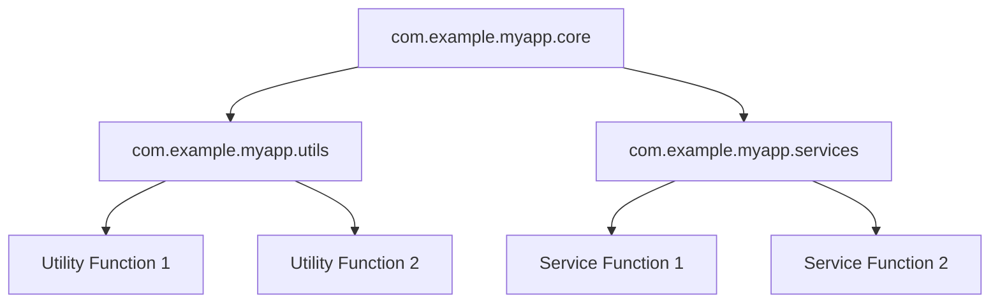

## 6.1 Organizing Code with Namespaces

In the realm of software development, organizing code is pivotal for maintainability, scalability, and collaboration. As enterprises transition from Java's Object-Oriented Programming (OOP) to Clojure's functional paradigm, understanding how to effectively organize code using namespaces is crucial. This section delves into the concept of namespaces in Clojure, drawing parallels with Java packages to facilitate a smooth transition for enterprise developers.

### Understanding Namespaces in Clojure

Namespaces in Clojure serve a similar purpose to packages in Java—they provide a way to group related functions, macros, and data structures, thereby avoiding name clashes and promoting modularity. However, namespaces in Clojure are more than just a mechanism for code organization; they are integral to the language's functional nature.

#### Key Concepts of Namespaces

- **Isolation**: Namespaces allow for the isolation of code, ensuring that functions and variables do not interfere with each other.
- **Modularity**: By grouping related code, namespaces promote modularity, making it easier to manage and understand large codebases.
- **Reusability**: Code within a namespace can be easily reused across different parts of an application or even in different projects.

### Comparing Java Packages and Clojure Namespaces

To facilitate the transition from Java to Clojure, it's helpful to draw parallels between Java packages and Clojure namespaces.

#### Java Packages

In Java, packages are used to group related classes and interfaces. They provide a namespace management mechanism that helps avoid naming conflicts. Java packages are hierarchical, and the package name reflects the directory structure of the source files.

```java
// Java package example
package com.example.myapp;

public class MyClass {
    // Class implementation
}
```

#### Clojure Namespaces

Clojure namespaces, on the other hand, are defined using the `ns` macro. They are not tied to the file system hierarchy, allowing for more flexibility in organizing code.

```clojure
;; Clojure namespace example
(ns com.example.myapp)

(defn my-function []
  ;; Function implementation
)
```

### Best Practices for Namespace Structure

Organizing code effectively in Clojure involves following best practices for namespace structure. Here are some guidelines to help you get started:

#### 1. Use Descriptive Names

Choose descriptive names for your namespaces that reflect the functionality they encapsulate. This makes it easier for developers to understand the purpose of each namespace.

#### 2. Follow a Consistent Naming Convention

Adopt a consistent naming convention for your namespaces. A common practice is to use a reverse domain name structure, similar to Java packages.

```clojure
(ns com.example.myapp.core)
```

#### 3. Group Related Functions

Group related functions within the same namespace to promote cohesion. This makes it easier to maintain and extend your code.

#### 4. Limit the Number of Functions per Namespace

Avoid overcrowding a single namespace with too many functions. Instead, break down large namespaces into smaller, more focused ones.

#### 5. Use Aliases for External Namespaces

When using functions from external namespaces, use aliases to avoid naming conflicts and improve code readability.

```clojure
(ns com.example.myapp.core
  (:require [clojure.string :as str]))

(defn process-string [s]
  (str/upper-case s))
```

#### 6. Document Your Namespaces

Provide clear documentation for each namespace, explaining its purpose and the functions it contains. This aids in code comprehension and collaboration.

### Code Examples: Organizing Code with Namespaces

Let's explore some code examples to illustrate how to organize code using namespaces in Clojure.

#### Example 1: Basic Namespace Definition

```clojure
(ns com.example.myapp.utils)

(defn add [a b]
  (+ a b))

(defn subtract [a b]
  (- a b))
```

In this example, we define a namespace `com.example.myapp.utils` that contains utility functions for basic arithmetic operations.

#### Example 2: Using Aliases for External Namespaces

```clojure
(ns com.example.myapp.core
  (:require [clojure.string :as str]))

(defn capitalize-words [sentence]
  (->> (str/split sentence #" ")
       (map str/capitalize)
       (str/join " ")))
```

Here, we use the `clojure.string` namespace with an alias `str` to perform string operations. This improves code readability and avoids potential naming conflicts.

#### Example 3: Organizing a Larger Codebase

```clojure
(ns com.example.myapp.core
  (:require [com.example.myapp.utils :as utils]
            [com.example.myapp.services :as services]))

(defn process-data [data]
  (-> data
      utils/transform
      services/validate))
```

In this example, we organize a larger codebase by dividing it into multiple namespaces: `utils` for utility functions and `services` for service-related logic. The `core` namespace orchestrates the application logic by leveraging functions from these namespaces.

### Visualizing Namespace Structure

To better understand how namespaces can be organized, let's visualize a typical namespace structure using a diagram.



**Diagram Description:** This diagram illustrates a typical namespace structure in a Clojure application. The `core` namespace depends on `utils` and `services`, which contain utility and service-related functions, respectively.

### References and Links

For further reading on namespaces and code organization in Clojure, consider exploring the following resources:

- [Clojure Official Documentation](https://clojure.org/reference/namespaces)
- [Clojure Community Resources](https://clojure.org/community/resources)
- [Transitioning from OOP to Functional Programming](https://www.lispcast.com/oo-to-fp/)

### Knowledge Check

To reinforce your understanding of namespaces in Clojure, consider the following questions:

1. What is the primary purpose of namespaces in Clojure?
2. How do namespaces in Clojure differ from packages in Java?
3. What are some best practices for organizing code with namespaces?
4. How can aliases be used to improve code readability?

### Exercises

1. **Exercise 1:** Create a new Clojure project and define a namespace for utility functions. Implement a few basic functions within this namespace and test them.

2. **Exercise 2:** Refactor an existing Java project by translating its package structure into Clojure namespaces. Identify any challenges you encounter and document your findings.

3. **Exercise 3:** Experiment with using aliases in a Clojure project. Import functions from an external namespace and use them within your code.

### Encouraging Engagement

Embracing functional programming and organizing code with namespaces can be challenging, but with each step, you'll gain a deeper understanding and see tangible benefits in your codebase. Remember, the key to mastering Clojure is practice and experimentation. Don't hesitate to explore different namespace structures and find what works best for your projects.

### Summary

In this section, we've explored the concept of namespaces in Clojure and how they compare to Java packages. We've discussed best practices for organizing code with namespaces and provided code examples to illustrate these concepts. By following these guidelines, you can effectively manage and scale your Clojure applications, making them more maintainable and modular.

## **Quiz: Are You Ready to Migrate from Java to Clojure?**



### What is the primary purpose of namespaces in Clojure?

- [x] To group related functions and avoid name clashes
- [ ] To define classes and objects
- [ ] To manage memory allocation
- [ ] To handle concurrency

> **Explanation:** Namespaces in Clojure group related functions and data structures, preventing name clashes and promoting modularity.

### How do namespaces in Clojure differ from packages in Java?

- [x] They are not tied to the file system hierarchy
- [ ] They require explicit import statements
- [ ] They support inheritance
- [ ] They are used for memory management

> **Explanation:** Unlike Java packages, Clojure namespaces are not tied to the file system hierarchy, allowing more flexibility in code organization.

### What is a common practice for naming Clojure namespaces?

- [x] Using a reverse domain name structure
- [ ] Using camelCase
- [ ] Using underscores
- [ ] Using numeric prefixes

> **Explanation:** A common practice is to use a reverse domain name structure for Clojure namespaces, similar to Java packages.

### Why should you limit the number of functions per namespace?

- [x] To promote cohesion and maintainability
- [ ] To reduce memory usage
- [ ] To increase execution speed
- [ ] To avoid syntax errors

> **Explanation:** Limiting the number of functions per namespace promotes cohesion and maintainability, making the code easier to manage.

### How can aliases improve code readability?

- [x] By providing shorter names for external namespaces
- [ ] By increasing execution speed
- [ ] By reducing memory usage
- [ ] By enforcing strict typing

> **Explanation:** Aliases provide shorter names for external namespaces, improving code readability and avoiding naming conflicts.

### What is a key benefit of using namespaces in Clojure?

- [x] Modularity and reusability of code
- [ ] Faster execution speed
- [ ] Reduced memory usage
- [ ] Simplified syntax

> **Explanation:** Namespaces promote modularity and reusability, making it easier to manage and understand large codebases.

### What should you include in namespace documentation?

- [x] The purpose and functions of the namespace
- [ ] The memory usage of the namespace
- [ ] The execution speed of the functions
- [ ] The number of lines of code

> **Explanation:** Clear documentation of the purpose and functions within a namespace aids in code comprehension and collaboration.

### How can you test the functions within a namespace?

- [x] By writing unit tests for each function
- [ ] By measuring memory usage
- [ ] By checking execution speed
- [ ] By counting lines of code

> **Explanation:** Writing unit tests for each function ensures that they work as expected and helps maintain code quality.

### What is a challenge when transitioning from Java packages to Clojure namespaces?

- [x] Adjusting to the lack of file system hierarchy
- [ ] Managing memory allocation
- [ ] Handling concurrency
- [ ] Implementing inheritance

> **Explanation:** One challenge is adjusting to the lack of a file system hierarchy, which requires a different approach to organizing code.

### True or False: Clojure namespaces are tied to the file system hierarchy.

- [ ] True
- [x] False

> **Explanation:** Clojure namespaces are not tied to the file system hierarchy, allowing more flexibility in organizing code.


