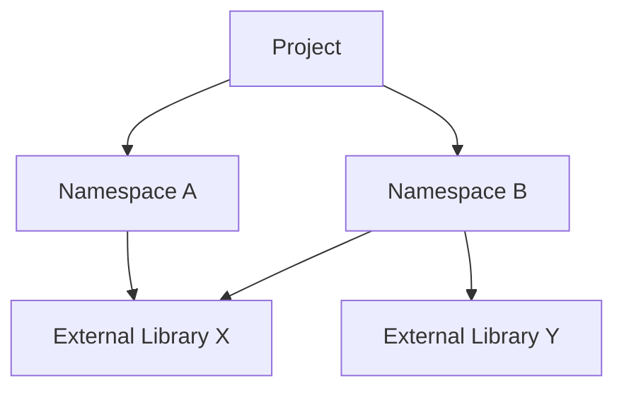

## 6.2 Dependency Management

As we transition from Java's object-oriented paradigm to Clojure's functional programming model, understanding how to manage dependencies effectively is crucial. In this section, we will explore how Clojure handles dependencies, compare it with Java's approach, and provide best practices for requiring and using namespaces.

### Introduction to Dependency Management in Clojure

Dependency management in Clojure revolves around the use of namespaces and external libraries. Unlike Java, where dependencies are often managed through build tools like Maven or Gradle, Clojure primarily uses tools like Leiningen and deps.edn. These tools not only manage external libraries but also facilitate the organization of code within projects.

### Understanding Namespaces

In Clojure, namespaces are akin to Java packages. They provide a way to organize code and manage dependencies between different parts of a program. A namespace in Clojure is a mapping from simple (unqualified) names to vars and can be thought of as a container for related functions, macros, and data.

#### Creating and Using Namespaces

To define a namespace in Clojure, we use the `ns` macro. This macro not only declares the namespace but also allows us to require other namespaces and import Java classes.

```clojure
(ns my-app.core
  (:require [clojure.string :as str])
  (:import (java.util Date)))

(defn current-date []
  (str "Today's date is: " (Date.)))
```

In this example, we define a namespace `my-app.core`, require the `clojure.string` namespace with an alias `str`, and import the `Date` class from Java's `java.util` package.

#### Requiring and Using Other Namespaces

Requiring namespaces is a fundamental part of managing dependencies in Clojure. The `:require` directive in the `ns` macro allows us to include functions from other namespaces.

```clojure
(ns my-app.utils
  (:require [clojure.set :as set]))

(defn union-sets [set1 set2]
  (set/union set1 set2))
```

Here, we require the `clojure.set` namespace and use its `union` function to combine two sets. The alias `set` makes it easy to reference functions from the `clojure.set` namespace.

### Managing Dependencies Between Modules

In larger Clojure applications, managing dependencies between modules is essential for maintaining clean and organized code. This involves understanding how to structure namespaces and use dependency management tools effectively.

#### Structuring Namespaces

Organizing namespaces in a logical and hierarchical manner can greatly enhance code readability and maintainability. A common practice is to group related functionalities into separate namespaces and use a consistent naming convention.

```clojure
(ns my-app.services.user)
(ns my-app.services.order)
(ns my-app.services.payment)
```

In this structure, each namespace handles a specific domain of the application, making it easier to manage dependencies and understand the codebase.

#### Dependency Management Tools

Clojure offers two primary tools for managing dependencies: Leiningen and deps.edn. Both tools allow you to specify dependencies, manage project configurations, and automate build processes.

##### Leiningen

Leiningen is a popular build automation tool for Clojure. It uses a `project.clj` file to define project settings and dependencies.

```clojure
(defproject my-app "0.1.0-SNAPSHOT"
  :dependencies [[org.clojure/clojure "1.10.3"]
                 [ring/ring-core "1.9.0"]]
  :main ^:skip-aot my-app.core
  :target-path "target/%s"
  :profiles {:uberjar {:aot :all}})
```

In this example, we define a project with dependencies on Clojure and the Ring library. Leiningen handles downloading and managing these dependencies.

##### deps.edn

The deps.edn tool, part of the Clojure CLI, provides a more flexible and declarative way to manage dependencies. It uses an `edn` (Extensible Data Notation) file to specify dependencies and aliases.

```clojure
{:deps {org.clojure/clojure {:mvn/version "1.10.3"}
        ring/ring-core {:mvn/version "1.9.0"}}
 :aliases {:dev {:extra-deps {cider/cider-nrepl {:mvn/version "0.25.9"}}}}}
```

The deps.edn file allows for more granular control over dependencies and is well-suited for projects that require multiple configurations or environments.

### Comparing Java and Clojure Dependency Management

Java developers are accustomed to using Maven or Gradle for dependency management. These tools use XML or Groovy-based configuration files to manage dependencies, build processes, and project settings.

#### Maven Example

```xml
<project xmlns="http://maven.apache.org/POM/4.0.0"
         xmlns:xsi="http://www.w3.org/2001/XMLSchema-instance"
         xsi:schemaLocation="http://maven.apache.org/POM/4.0.0 http://maven.apache.org/xsd/maven-4.0.0.xsd">
    <modelVersion>4.0.0</modelVersion>
    <groupId>com.example</groupId>
    <artifactId>my-app</artifactId>
    <version>1.0-SNAPSHOT</version>
    <dependencies>
        <dependency>
            <groupId>org.springframework</groupId>
            <artifactId>spring-core</artifactId>
            <version>5.3.8</version>
        </dependency>
    </dependencies>
</project>
```

#### Gradle Example

```groovy
plugins {
    id 'java'
}

group 'com.example'
version '1.0-SNAPSHOT'

repositories {
    mavenCentral()
}

dependencies {
    implementation 'org.springframework:spring-core:5.3.8'
}
```

Both Maven and Gradle provide robust dependency management features, including transitive dependencies, version conflict resolution, and repository management.

### Best Practices for Dependency Management in Clojure

To ensure a smooth transition from Java to Clojure, it's important to adopt best practices for dependency management.

#### Use Aliases for Clarity

When requiring namespaces, use aliases to avoid naming conflicts and improve code readability.

```clojure
(ns my-app.core
  (:require [clojure.string :as str]
            [clojure.set :as set]))
```

#### Keep Dependencies Minimal

Avoid unnecessary dependencies to reduce complexity and potential conflicts. Regularly review and update your dependencies to ensure compatibility and security.

#### Leverage Community Libraries

Clojure has a rich ecosystem of community libraries. Explore libraries on [Clojars](https://clojars.org/) and [GitHub](https://github.com/) to find solutions that meet your needs.

#### Document Dependencies

Maintain clear documentation of your project's dependencies, including their purpose and any specific configuration requirements. This will aid in onboarding new team members and troubleshooting issues.

### Visualizing Dependency Management

To better understand how dependencies are managed in Clojure, let's visualize the process using a Mermaid.js diagram.



**Diagram Description:** This diagram illustrates a Clojure project with two namespaces, A and B, both depending on external library X, while namespace B also depends on library Y.

### Knowledge Check

Before we conclude, let's reinforce what we've learned with a few questions:

1. What is the primary purpose of namespaces in Clojure?
2. How does the `:require` directive differ from Java's `import` statement?
3. What are the main tools for dependency management in Clojure?
4. How can you avoid naming conflicts when requiring multiple namespaces?
5. Why is it important to keep dependencies minimal?

### Conclusion

Dependency management is a critical aspect of developing robust and maintainable Clojure applications. By understanding how to effectively use namespaces and manage dependencies, you can ensure your projects are well-organized and scalable. As you continue your journey from Java to Clojure, remember to leverage the tools and best practices discussed in this section to enhance your development process.

## **Quiz: Are You Ready to Migrate from Java to Clojure?**



### What is the primary purpose of namespaces in Clojure?

- [x] To organize code and manage dependencies
- [ ] To compile code faster
- [ ] To replace Java packages
- [ ] To handle concurrency

> **Explanation:** Namespaces in Clojure are used to organize code and manage dependencies, similar to Java packages.

### How does the `:require` directive differ from Java's `import` statement?

- [x] It includes functions from other namespaces
- [ ] It compiles Java classes
- [ ] It manages memory allocation
- [ ] It handles exceptions

> **Explanation:** The `:require` directive in Clojure is used to include functions from other namespaces, unlike Java's `import` which is for classes.

### What are the main tools for dependency management in Clojure?

- [x] Leiningen and deps.edn
- [ ] Maven and Gradle
- [ ] Ant and Ivy
- [ ] NPM and Yarn

> **Explanation:** Leiningen and deps.edn are the primary tools for managing dependencies in Clojure.

### How can you avoid naming conflicts when requiring multiple namespaces?

- [x] Use aliases
- [ ] Use global variables
- [ ] Use static imports
- [ ] Use reflection

> **Explanation:** Using aliases when requiring namespaces helps avoid naming conflicts and improves code readability.

### Why is it important to keep dependencies minimal?

- [x] To reduce complexity and potential conflicts
- [ ] To increase code size
- [ ] To slow down the build process
- [ ] To limit functionality

> **Explanation:** Keeping dependencies minimal helps reduce complexity and potential conflicts, making the project easier to manage.

### What file format does deps.edn use?

- [x] EDN (Extensible Data Notation)
- [ ] XML
- [ ] JSON
- [ ] YAML

> **Explanation:** deps.edn uses EDN (Extensible Data Notation) for specifying dependencies and configurations.

### What is the purpose of the `:import` directive in Clojure?

- [x] To import Java classes
- [ ] To import Clojure functions
- [ ] To manage memory
- [ ] To handle exceptions

> **Explanation:** The `:import` directive in Clojure is used to import Java classes into a namespace.

### Which tool is more declarative for dependency management in Clojure?

- [x] deps.edn
- [ ] Leiningen
- [ ] Maven
- [ ] Gradle

> **Explanation:** deps.edn provides a more declarative approach to dependency management compared to Leiningen.

### What is a common practice for structuring namespaces in Clojure?

- [x] Group related functionalities into separate namespaces
- [ ] Use a single namespace for the entire project
- [ ] Avoid using namespaces
- [ ] Use random naming conventions

> **Explanation:** Grouping related functionalities into separate namespaces is a common practice for structuring Clojure projects.

### True or False: Clojure's dependency management tools can handle transitive dependencies.

- [x] True
- [ ] False

> **Explanation:** Clojure's dependency management tools, like Leiningen and deps.edn, can handle transitive dependencies.


