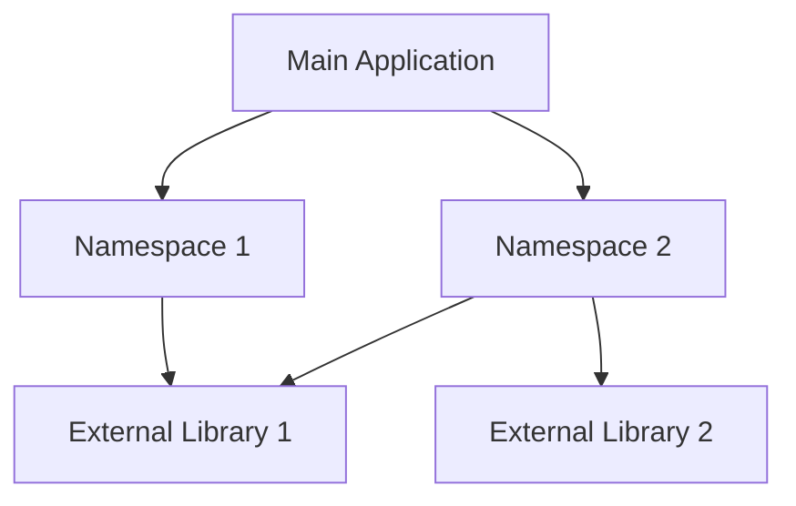

## 6.2 Dependency Management

In the transition from Java's object-oriented programming (OOP) paradigm to Clojure's functional programming model, one of the most significant changes is how dependencies are managed. Java developers are accustomed to organizing code into classes and packages, while Clojure uses namespaces to achieve similar goals. This section will guide you through the process of managing dependencies in Clojure, focusing on requiring and using other namespaces, as well as managing dependencies between modules.

### Understanding Namespaces in Clojure

In Java, classes are the primary unit of code organization, and packages group related classes together. Clojure, on the other hand, uses namespaces to organize code. A namespace in Clojure is a context for identifiers, allowing you to group related functions and data structures.

#### Creating and Using Namespaces

To create a namespace in Clojure, use the `ns` macro. This macro not only defines the namespace but also allows you to require other namespaces and import Java classes.

```clojure
(ns myapp.core
  (:require [clojure.string :as str]
            [myapp.utils :refer [helper-function]])
  (:import [java.util Date]))

(defn greet [name]
  (str "Hello, " name "! Today's date is " (.toString (Date.))))
```

- **`ns` Macro**: Defines the namespace `myapp.core`.
- **`:require`**: Brings in other Clojure namespaces. Here, `clojure.string` is required with an alias `str`, and `myapp.utils` is required with specific functions referred.
- **`:import`**: Imports Java classes, allowing you to use them directly.

### Requiring and Using Other Namespaces

Clojure's `require` and `use` functions are essential for managing dependencies between namespaces. While `require` is more commonly used, `use` can also be helpful in specific scenarios.

#### `require` vs. `use`

- **`require`**: Loads a namespace and optionally assigns it an alias. It is preferred for its explicitness and control over what is imported.

  ```clojure
  (require '[clojure.set :as set])
  ```

- **`use`**: Loads a namespace and refers all its public vars into the current namespace. It is less commonly used due to potential name clashes.

  ```clojure
  (use 'clojure.set)
  ```

#### Best Practices for Requiring Namespaces

1. **Use Aliases**: When requiring namespaces, use aliases to avoid name clashes and improve code readability.

   ```clojure
   (require '[clojure.string :as str])
   ```

2. **Refer Specific Vars**: Instead of using `use`, prefer `require` with `:refer` to import specific functions.

   ```clojure
   (require '[clojure.string :refer [join split]])
   ```

3. **Organize Requires**: Group and order your `require` statements logically, typically by external libraries, internal libraries, and Java classes.

### Managing Dependencies Between Modules

In larger Clojure applications, managing dependencies between modules is crucial for maintainability and scalability. Here are some strategies to manage these dependencies effectively:

#### Modular Design

Design your application in a modular fashion, where each module is responsible for a specific piece of functionality. This approach reduces coupling and enhances reusability.

- **Define Clear Interfaces**: Use protocols and multimethods to define clear interfaces between modules.
- **Encapsulate Implementation Details**: Keep implementation details private to the module, exposing only necessary functions.

#### Dependency Injection

While Clojure does not have a built-in dependency injection framework like Java's Spring, you can achieve similar results using higher-order functions and maps.

- **Pass Dependencies as Arguments**: Pass dependencies as arguments to functions, allowing for easy substitution and testing.

  ```clojure
  (defn process-data [data db-connection]
    ;; Use db-connection to process data
    )
  ```

- **Use Maps for Configuration**: Store dependencies in a map and pass it around your application.

  ```clojure
  (def config {:db-connection (create-db-connection)
               :cache (create-cache)})

  (defn process-data [data {:keys [db-connection cache]}]
    ;; Use db-connection and cache
    )
  ```

### Dependency Management Tools

Clojure offers several tools for managing dependencies, similar to Maven or Gradle in Java. The most popular are Leiningen and deps.edn.

#### Leiningen

Leiningen is a build automation tool for Clojure, similar to Maven for Java. It uses a `project.clj` file to manage dependencies.

```clojure
(defproject myapp "0.1.0-SNAPSHOT"
  :dependencies [[org.clojure/clojure "1.10.3"]
                 [ring/ring-core "1.9.0"]])
```

- **`:dependencies`**: Lists the libraries your project depends on, with their versions.

#### deps.edn

`deps.edn` is a newer tool for dependency management in Clojure, providing a more flexible and declarative approach.

```clojure
{:deps {org.clojure/clojure {:mvn/version "1.10.3"}
        ring/ring-core {:mvn/version "1.9.0"}}}
```

- **`:deps`**: Specifies dependencies using a map, with library coordinates and versions.

### Comparing Java and Clojure Dependency Management

Java developers are familiar with managing dependencies using tools like Maven or Gradle, which rely on XML or Groovy scripts. Clojure's approach, using either `project.clj` or `deps.edn`, is more concise and leverages Clojure's data structures for configuration.

#### Key Differences

- **Configuration Format**: Clojure uses EDN (Extensible Data Notation) for configuration, which is more readable and less verbose than XML.
- **Flexibility**: Clojure's `deps.edn` allows for more flexible dependency management, supporting multiple dependency sources and profiles.

### Visualizing Dependency Management

To better understand how dependencies are managed in Clojure, consider the following diagram illustrating the flow of dependencies in a typical Clojure application:



**Diagram Explanation**: This diagram shows a main application depending on two namespaces, each of which relies on external libraries. This modular structure allows for clear separation of concerns and easier management of dependencies.

### Try It Yourself

To solidify your understanding of dependency management in Clojure, try the following exercises:

1. **Create a New Namespace**: Define a new namespace in your Clojure project and require the `clojure.set` library with an alias.

2. **Modularize Your Code**: Refactor an existing piece of code into multiple namespaces, ensuring each namespace has a clear responsibility.

3. **Experiment with deps.edn**: Set up a new Clojure project using `deps.edn` and add dependencies for a web server library like Ring.

### Knowledge Check

- **What is the primary unit of code organization in Clojure?**
- **How do you import Java classes in a Clojure namespace?**
- **What is the difference between `require` and `use` in Clojure?**
- **How can you achieve dependency injection in Clojure?**
- **What are the benefits of using `deps.edn` over `project.clj`?**

### Summary

In this section, we've explored how dependency management in Clojure differs from Java, focusing on namespaces, requiring and using other namespaces, and managing dependencies between modules. By understanding these concepts, you can effectively organize and manage your Clojure codebase, facilitating a smooth transition from Java OOP to Clojure's functional paradigm.

For further reading, check out the [Clojure Official Documentation](https://clojure.org/reference) and explore the [Clojure Community Resources](https://clojure.org/community/resources) for additional insights and support.

## **Quiz: Are You Ready to Migrate from Java to Clojure?**



### What is the primary unit of code organization in Clojure?

- [x] Namespace
- [ ] Class
- [ ] Package
- [ ] Module

> **Explanation:** In Clojure, the primary unit of code organization is the namespace, which groups related functions and data structures.

### How do you import Java classes in a Clojure namespace?

- [x] Using the `:import` directive in the `ns` macro
- [ ] Using the `require` function
- [ ] Using the `use` function
- [ ] Using the `import` function

> **Explanation:** Java classes are imported in a Clojure namespace using the `:import` directive within the `ns` macro.

### What is the difference between `require` and `use` in Clojure?

- [x] `require` loads a namespace and optionally assigns an alias, while `use` refers all public vars into the current namespace.
- [ ] `require` is used for Java classes, while `use` is for Clojure namespaces.
- [ ] `require` is deprecated, while `use` is the recommended approach.
- [ ] There is no difference; they are interchangeable.

> **Explanation:** `require` is preferred for its explicitness, allowing you to load a namespace and assign an alias, whereas `use` refers all public vars, which can lead to name clashes.

### How can you achieve dependency injection in Clojure?

- [x] By passing dependencies as arguments to functions
- [ ] By using a built-in dependency injection framework
- [ ] By using the `use` function
- [ ] By creating global variables

> **Explanation:** In Clojure, dependency injection is achieved by passing dependencies as arguments to functions, allowing for easy substitution and testing.

### What are the benefits of using `deps.edn` over `project.clj`?

- [x] More flexible dependency management
- [x] Supports multiple dependency sources and profiles
- [ ] Uses XML for configuration
- [ ] Is less readable than `project.clj`

> **Explanation:** `deps.edn` provides more flexible dependency management, supporting multiple sources and profiles, and uses EDN for a more readable configuration format.

### Which tool is similar to Maven for managing Clojure dependencies?

- [x] Leiningen
- [ ] Gradle
- [ ] Ant
- [ ] SBT

> **Explanation:** Leiningen is a build automation tool for Clojure, similar to Maven for Java, using a `project.clj` file to manage dependencies.

### What is a best practice for requiring namespaces in Clojure?

- [x] Use aliases to avoid name clashes
- [ ] Use `use` for all namespaces
- [x] Refer specific vars instead of using `use`
- [ ] Import all Java classes

> **Explanation:** Using aliases and referring specific vars are best practices to avoid name clashes and improve code readability.

### How do you define a namespace in Clojure?

- [x] Using the `ns` macro
- [ ] Using the `namespace` function
- [ ] Using the `require` function
- [ ] Using the `import` function

> **Explanation:** The `ns` macro is used to define a namespace in Clojure, allowing you to require other namespaces and import Java classes.

### What is the purpose of the `:refer` option in the `require` function?

- [x] To import specific functions from a namespace
- [ ] To import all functions from a namespace
- [ ] To import Java classes
- [ ] To define a namespace

> **Explanation:** The `:refer` option in the `require` function is used to import specific functions from a namespace, providing control over what is imported.

### True or False: Clojure's `deps.edn` uses XML for configuration.

- [ ] True
- [x] False

> **Explanation:** False. Clojure's `deps.edn` uses EDN (Extensible Data Notation) for configuration, which is more readable and less verbose than XML.


