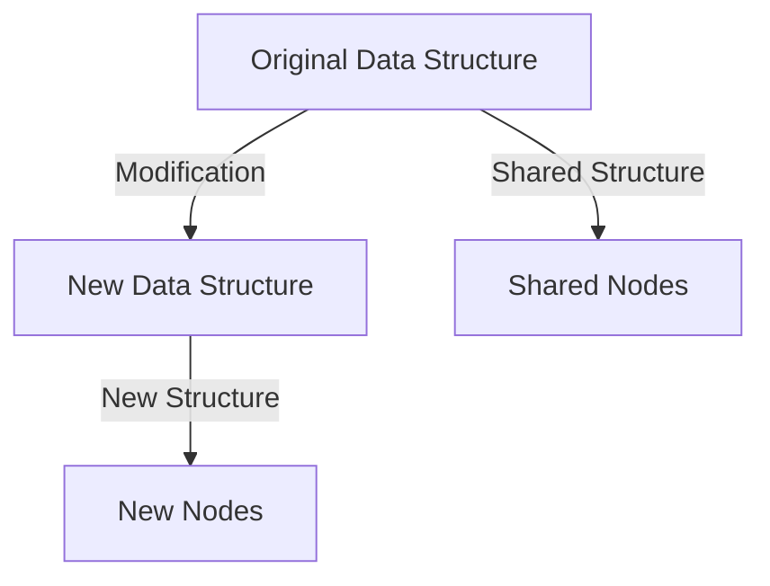

## 7.1 Working with Immutable Data Structures

As we transition from Java's object-oriented paradigm to Clojure's functional programming model, one of the most significant shifts is embracing immutable data structures. In this section, we will explore how Clojure's immutable data structures, such as maps and records, can be utilized to represent data effectively. We will also delve into the concept of data-centric design, which is central to Clojure's philosophy.

### Understanding Immutability

**Immutability** refers to the inability to change an object after it has been created. In Java, immutability is often achieved by using final fields and ensuring that no setters are provided. However, this requires discipline and can be cumbersome. In contrast, Clojure provides immutability by default, which simplifies reasoning about code and enhances concurrency.

#### Benefits of Immutability

1. **Thread Safety**: Immutable objects can be shared freely between threads without synchronization, reducing the complexity of concurrent programming.
2. **Predictability**: Functions that operate on immutable data are easier to understand and predict since they do not produce side effects.
3. **Ease of Testing**: Immutable data structures simplify testing because they ensure that data remains consistent throughout the test lifecycle.

### Clojure's Core Immutable Data Structures

Clojure provides several core immutable data structures, including lists, vectors, maps, and sets. These structures are designed to be efficient and are implemented using persistent data structures, which allow for structural sharing and efficient updates.

#### Lists and Vectors

- **Lists**: Ordered collections of elements, typically used for sequential access.
- **Vectors**: Indexed collections that provide efficient random access.

```clojure
;; Creating a list
(def my-list '(1 2 3 4 5))

;; Creating a vector
(def my-vector [1 2 3 4 5])

;; Accessing elements
(nth my-vector 2) ; => 3
```

#### Maps

Maps are key-value pairs, similar to Java's `HashMap`, but immutable by default. They are a fundamental part of Clojure's data-centric design.

```clojure
;; Creating a map
(def my-map {:name "Alice" :age 30 :city "Wonderland"})

;; Accessing values
(get my-map :name) ; => "Alice"

;; Adding a new key-value pair
(assoc my-map :email "alice@example.com")
```

#### Sets

Sets are collections of unique elements, useful for membership tests and eliminating duplicates.

```clojure
;; Creating a set
(def my-set #{1 2 3 4 5})

;; Checking membership
(contains? my-set 3) ; => true
```

### Working with Maps and Records

Maps and records are central to representing data in Clojure. While maps are flexible and dynamic, records provide a way to define fixed schemas with optional type hints.

#### Using Maps for Data Representation

Maps are versatile and can be used to represent complex data structures. They are often used in conjunction with Clojure's destructuring capabilities to extract data efficiently.

```clojure
;; Destructuring a map
(let [{:keys [name age]} my-map]
  (println "Name:" name "Age:" age))
```

#### Introducing Records

Records are a way to define structured data types with named fields. They are similar to Java classes but immutable and more lightweight.

```clojure
;; Defining a record
(defrecord Person [name age city])

;; Creating an instance of a record
(def alice (->Person "Alice" 30 "Wonderland"))

;; Accessing fields
(:name alice) ; => "Alice"
```

### Embracing Data-Centric Design

Clojure encourages a data-centric approach, where data is separated from behavior. This contrasts with Java's object-oriented design, where data and behavior are encapsulated within objects.

#### Advantages of Data-Centric Design

1. **Flexibility**: Data-centric design allows for more flexible and adaptable systems, as data can be easily transformed and manipulated.
2. **Composability**: Functions that operate on data can be composed to create complex behavior without modifying the data itself.
3. **Simplicity**: By focusing on data, systems become simpler and easier to reason about.

### Code Example: Transforming Java Classes to Clojure Data Structures

Let's consider a simple Java class and see how it can be transformed into a Clojure data structure.

**Java Class Example:**

```java
public class Person {
    private final String name;
    private final int age;
    private final String city;

    public Person(String name, int age, String city) {
        this.name = name;
        this.age = age;
        this.city = city;
    }

    public String getName() {
        return name;
    }

    public int getAge() {
        return age;
    }

    public String getCity() {
        return city;
    }
}
```

**Clojure Equivalent:**

```clojure
(defrecord Person [name age city])

(def alice (->Person "Alice" 30 "Wonderland"))

;; Accessing fields
(:name alice) ; => "Alice"
```

### Visualizing Immutability and Persistent Data Structures

To better understand how Clojure achieves immutability with efficiency, let's visualize the concept of persistent data structures.



**Diagram Explanation**: This diagram illustrates how Clojure's persistent data structures share unchanged parts of the original structure, creating a new structure with minimal overhead.

### Try It Yourself: Experiment with Clojure's Immutable Data Structures

Now that we've explored how immutable data structures work in Clojure, let's apply these concepts to manage state effectively in your applications. Try modifying the code examples above to add new fields, remove existing ones, or transform data using Clojure's powerful sequence functions.

### References and Further Reading

- [Official Clojure Documentation](https://clojure.org/reference/data_structures)
- [ClojureDocs](https://clojuredocs.org/)
- [Persistent Data Structures](https://en.wikipedia.org/wiki/Persistent_data_structure)

### Knowledge Check

1. What are the benefits of using immutable data structures in concurrent programming?
2. How do Clojure's maps differ from Java's `HashMap`?
3. Explain the concept of data-centric design in Clojure.
4. How can records be used to define structured data types in Clojure?

### Exercises

1. Create a Clojure map representing a book with fields for title, author, and year. Add a new field for genre and update the year.
2. Define a record for a `Car` with fields for make, model, and year. Create an instance and access its fields.
3. Use Clojure's destructuring to extract values from a map and print them.

### Summary

In this section, we've explored the power of immutable data structures in Clojure and how they can be leveraged for robust, scalable applications. By embracing data-centric design, we can create systems that are flexible, composable, and easy to reason about. As you continue your journey from Java to Clojure, remember that immutability is a cornerstone of functional programming, offering numerous benefits for enterprise development.

## **Quiz: Are You Ready to Migrate from Java to Clojure?**



### What is a key benefit of immutable data structures in Clojure?

- [x] Thread safety
- [ ] Increased memory usage
- [ ] Slower performance
- [ ] Complex syntax

> **Explanation:** Immutable data structures are inherently thread-safe because they cannot be modified after creation, eliminating the need for synchronization.

### How does Clojure's map differ from Java's HashMap?

- [x] Clojure's map is immutable by default
- [ ] Clojure's map allows duplicate keys
- [ ] Java's HashMap is immutable by default
- [ ] Clojure's map does not support key-value pairs

> **Explanation:** Clojure's map is immutable by default, meaning once created, it cannot be changed. Java's HashMap, on the other hand, is mutable.

### What is the primary focus of data-centric design in Clojure?

- [x] Separating data from behavior
- [ ] Encapsulating data and behavior
- [ ] Using classes to define data
- [ ] Prioritizing mutable data

> **Explanation:** Data-centric design focuses on separating data from behavior, allowing for more flexible and adaptable systems.

### Which Clojure data structure is similar to Java's ArrayList?

- [ ] List
- [x] Vector
- [ ] Set
- [ ] Map

> **Explanation:** Clojure's vector is similar to Java's ArrayList as it provides efficient random access to elements.

### How are records in Clojure different from classes in Java?

- [x] Records are immutable
- [ ] Records support inheritance
- [ ] Records encapsulate behavior
- [ ] Records are mutable

> **Explanation:** Records in Clojure are immutable and provide a way to define structured data types with named fields.

### What is a common use case for Clojure's set data structure?

- [x] Membership tests
- [ ] Sequential access
- [ ] Key-value storage
- [ ] Random access

> **Explanation:** Sets are used for membership tests and ensuring uniqueness of elements.

### How can you add a new key-value pair to a Clojure map?

- [x] Using the `assoc` function
- [ ] Using the `add` function
- [ ] Using the `insert` function
- [ ] Using the `put` function

> **Explanation:** The `assoc` function is used to add a new key-value pair to a Clojure map.

### What is the result of accessing a non-existent key in a Clojure map?

- [x] nil
- [ ] Exception
- [ ] Default value
- [ ] Empty map

> **Explanation:** Accessing a non-existent key in a Clojure map returns `nil`.

### Which of the following is a characteristic of persistent data structures?

- [x] Structural sharing
- [ ] High memory usage
- [ ] Mutable state
- [ ] Slow updates

> **Explanation:** Persistent data structures use structural sharing to efficiently manage updates without copying the entire structure.

### True or False: Clojure's immutable data structures can be modified after creation.

- [ ] True
- [x] False

> **Explanation:** Clojure's immutable data structures cannot be modified after creation, ensuring consistency and predictability.


