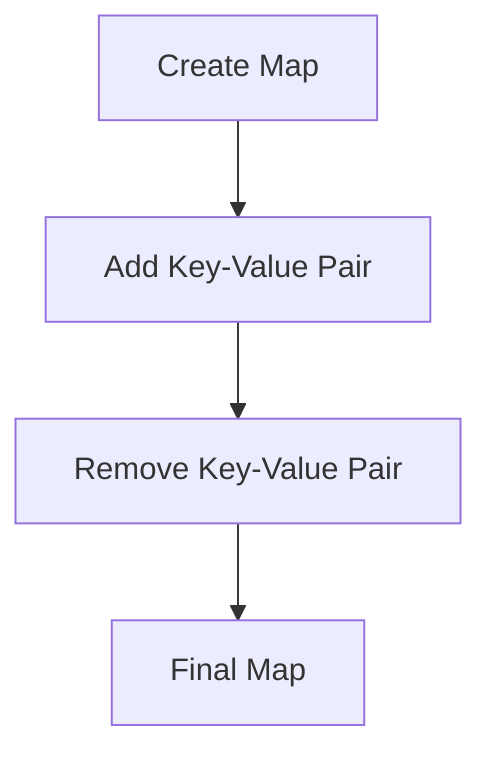

## 7.1 Working with Immutable Data Structures

As we transition from Java's object-oriented programming (OOP) paradigm to Clojure's functional programming (FP) approach, one of the most significant shifts is the move from mutable objects to immutable data structures. This chapter will guide you through understanding and utilizing Clojure's immutable data structures, such as maps and records, to represent data effectively. We'll explore the benefits of embracing a data-centric design and how it can enhance the scalability and maintainability of your enterprise applications.

### Understanding Immutability

**Immutability** refers to the concept where data structures cannot be modified after they are created. In Clojure, all core data structures are immutable by default. This is a stark contrast to Java, where objects are typically mutable, allowing their state to be changed after creation.

#### Benefits of Immutability

1. **Thread Safety**: Immutable data structures are inherently thread-safe, as they cannot be altered by concurrent operations. This eliminates the need for complex synchronization mechanisms.

2. **Predictability**: Since data does not change, functions that operate on immutable data are more predictable and easier to reason about.

3. **Ease of Testing**: Immutable data structures simplify testing, as there are no side effects to consider.

4. **Functional Programming**: Immutability is a cornerstone of functional programming, enabling functions to be pure and side-effect-free.

### Clojure's Core Immutable Data Structures

Clojure provides several core immutable data structures that are essential for functional programming:

- **Lists**: Ordered collections of elements, typically used for sequential processing.
- **Vectors**: Indexed collections that provide efficient random access.
- **Maps**: Key-value pairs, similar to Java's `HashMap`, but immutable.
- **Sets**: Collections of unique elements, similar to Java's `HashSet`, but immutable.

Let's delve deeper into maps and records, which are particularly useful for representing complex data structures in enterprise applications.

### Maps: The Backbone of Data Representation

Maps in Clojure are versatile and can be used to represent complex data structures. They are similar to Java's `HashMap`, but with the added benefit of immutability.

#### Creating and Using Maps

```clojure
(def person {:name "Alice" :age 30 :email "alice@example.com"})

;; Accessing values
(println (:name person)) ; => "Alice"

;; Adding a new key-value pair
(def updated-person (assoc person :phone "123-456-7890"))

;; Removing a key-value pair
(def person-without-email (dissoc person :email))
```

In the above example, `assoc` and `dissoc` are used to add and remove key-value pairs, respectively. These operations return new maps, leaving the original map unchanged.

#### Nested Maps

Maps can be nested to represent hierarchical data structures:

```clojure
(def company
  {:name "TechCorp"
   :location {:city "New York" :state "NY"}
   :employees [{:name "Alice" :role "Engineer"}
               {:name "Bob" :role "Manager"}]})

;; Accessing nested values
(println (get-in company [:location :city])) ; => "New York"
```

The `get-in` function is used to access nested values, providing a clean and concise way to navigate complex data structures.

### Records: Defining Structured Data

While maps are flexible, sometimes you need more structure and semantic meaning. This is where **records** come into play. Records are similar to maps but provide a way to define a fixed set of keys with optional type hints.

#### Defining and Using Records

```clojure
(defrecord Person [name age email])

;; Creating an instance of a record
(def alice (->Person "Alice" 30 "alice@example.com"))

;; Accessing fields
(println (:name alice)) ; => "Alice"

;; Updating a record
(def updated-alice (assoc alice :email "newalice@example.com"))
```

Records provide a way to define data structures with a known set of fields, making them ideal for representing entities with a fixed schema.

### Embracing Data-Centric Design

In Clojure, the focus is on data rather than objects. This data-centric design encourages you to think about the data and its transformations, rather than the objects and their behaviors.

#### Advantages of Data-Centric Design

1. **Simplicity**: By focusing on data, you simplify the design and reduce the complexity associated with managing mutable state.

2. **Flexibility**: Data-centric design allows for more flexible and adaptable systems, as changes to data structures do not require changes to the underlying code.

3. **Interoperability**: Data-centric systems are easier to integrate with other systems, as data can be easily serialized and deserialized.

### Transitioning from Java OOP to Clojure's Data Structures

Let's compare how you might represent a simple entity, such as a `Person`, in Java and Clojure.

#### Java OOP Example

```java
public class Person {
    private String name;
    private int age;
    private String email;

    public Person(String name, int age, String email) {
        this.name = name;
        this.age = age;
        this.email = email;
    }

    // Getters and setters omitted for brevity
}
```

#### Clojure Equivalent

```clojure
(defrecord Person [name age email])

(def alice (->Person "Alice" 30 "alice@example.com"))
```

In Clojure, the `Person` record is defined with a single line, and there is no need for getters and setters, as fields are accessed directly.

### Code Examples and Exercises

Let's explore some practical exercises to reinforce your understanding of immutable data structures in Clojure.

#### Exercise 1: Creating and Manipulating Maps

Create a map representing a book with keys `:title`, `:author`, and `:year`. Add a new key `:genre` and remove the `:year` key.

```clojure
(def book {:title "Clojure for the Brave and True" :author "Daniel Higginbotham" :year 2015})

;; Add :genre
(def updated-book (assoc book :genre "Programming"))

;; Remove :year
(def final-book (dissoc updated-book :year))

(println final-book)
```

#### Exercise 2: Working with Records

Define a record `Car` with fields `make`, `model`, and `year`. Create an instance and update the `year` field.

```clojure
(defrecord Car [make model year])

(def my-car (->Car "Toyota" "Camry" 2010))

;; Update year
(def updated-car (assoc my-car :year 2022))

(println updated-car)
```

### Visualizing Data Flow

To better understand how data flows in a Clojure application, let's visualize the process of creating and updating a map.



**Diagram Description**: This flowchart illustrates the process of creating a map, adding a key-value pair, removing a key-value pair, and obtaining the final map.

### Further Reading and Resources

- [Clojure Official Documentation](https://clojure.org/reference)
- [Clojure Community Resources](https://clojure.org/community/resources)
- [Transitioning from OOP to Functional Programming](https://www.lispcast.com/oo-to-fp/)

### Knowledge Check

- What are the benefits of using immutable data structures?
- How do you create and manipulate maps in Clojure?
- What is the difference between maps and records in Clojure?

### Summary

In this section, we've explored the fundamental concepts of immutable data structures in Clojure, focusing on maps and records. By embracing immutability and a data-centric design, you can create more scalable, maintainable, and predictable enterprise applications. As you continue your journey from Java OOP to Clojure, remember that the shift to immutability is not just a change in syntax but a change in mindset that can lead to more robust and efficient systems.

## **Quiz: Are You Ready to Migrate from Java to Clojure?**



### What is a key benefit of immutable data structures in Clojure?

- [x] Thread safety
- [ ] Increased complexity
- [ ] Slower performance
- [ ] Limited flexibility

> **Explanation:** Immutable data structures are inherently thread-safe, as they cannot be altered by concurrent operations.

### How do you add a key-value pair to a map in Clojure?

- [x] Using the `assoc` function
- [ ] Using the `add` function
- [ ] Using the `insert` function
- [ ] Using the `put` function

> **Explanation:** The `assoc` function is used to add key-value pairs to a map, returning a new map with the added pair.

### What is the primary difference between maps and records in Clojure?

- [x] Records provide a fixed set of keys
- [ ] Maps are mutable
- [ ] Records are mutable
- [ ] Maps require type hints

> **Explanation:** Records provide a way to define a fixed set of keys with optional type hints, whereas maps are more flexible.

### Which function is used to access nested values in a map?

- [x] `get-in`
- [ ] `get`
- [ ] `find`
- [ ] `lookup`

> **Explanation:** The `get-in` function is used to access nested values in a map, providing a clean way to navigate complex structures.

### What is a key advantage of data-centric design?

- [x] Simplicity
- [ ] Increased complexity
- [ ] More boilerplate code
- [ ] Less flexibility

> **Explanation:** Data-centric design simplifies the design and reduces complexity by focusing on data and its transformations.

### How do you define a record in Clojure?

- [x] Using the `defrecord` macro
- [ ] Using the `defclass` macro
- [ ] Using the `defstruct` macro
- [ ] Using the `defdata` macro

> **Explanation:** The `defrecord` macro is used to define records in Clojure, specifying a fixed set of fields.

### What is the result of using the `dissoc` function on a map?

- [x] A new map without the specified key
- [ ] The original map is modified
- [ ] An error is thrown
- [ ] The specified key is set to `nil`

> **Explanation:** The `dissoc` function returns a new map without the specified key, leaving the original map unchanged.

### How does immutability affect testing?

- [x] Simplifies testing by eliminating side effects
- [ ] Makes testing more complex
- [ ] Requires more test cases
- [ ] Increases the likelihood of errors

> **Explanation:** Immutability simplifies testing by eliminating side effects, making functions more predictable and easier to test.

### What is a common use case for records in Clojure?

- [x] Representing entities with a fixed schema
- [ ] Storing mutable state
- [ ] Implementing dynamic fields
- [ ] Creating variable-length collections

> **Explanation:** Records are ideal for representing entities with a fixed schema, providing structure and semantic meaning.

### True or False: In Clojure, all core data structures are immutable by default.

- [x] True
- [ ] False

> **Explanation:** In Clojure, all core data structures are immutable by default, promoting functional programming principles.


