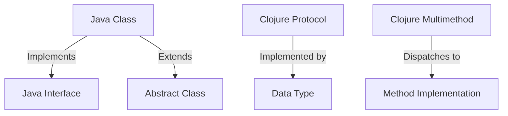

## 7.2 Polymorphism with Protocols and Multimethods

In the world of software development, polymorphism is a cornerstone concept that allows objects to be treated as instances of their parent class. In Java, polymorphism is typically achieved through interfaces and inheritance. However, as we transition to Clojure's functional paradigm, we encounter a different approach to polymorphism through protocols and multimethods. This section will guide you through understanding and implementing these concepts in Clojure, drawing parallels to Java's polymorphism to ease the transition.

### Understanding Polymorphism in Java

Before diving into Clojure's approach, let's briefly revisit how polymorphism is handled in Java. In Java, polymorphism is primarily achieved through:

- **Interfaces**: Define a contract that classes can implement, allowing for polymorphic behavior.
- **Abstract Classes**: Provide a base class with some implemented methods and some abstract methods that subclasses must implement.
- **Method Overriding**: Allows a subclass to provide a specific implementation of a method already defined in its superclass.

Java's polymorphism is tightly coupled with its class-based structure, which can sometimes lead to rigid hierarchies and less flexibility.

### Clojure's Approach to Polymorphism

Clojure, being a functional language, offers a more flexible and dynamic approach to polymorphism through **protocols** and **multimethods**. These constructs allow you to define polymorphic behavior without the constraints of class hierarchies.

#### Protocols: Interface-like Abstractions

**Protocols** in Clojure are similar to Java interfaces but are more flexible and dynamic. They allow you to define a set of functions that can be implemented by different data types. Here's how you can implement protocols for polymorphic behavior:

1. **Define a Protocol**: Use the `defprotocol` macro to define a protocol with a set of functions.

2. **Implement the Protocol**: Use the `extend` or `extend-type` macros to implement the protocol for specific data types.

3. **Invoke Protocol Functions**: Call the protocol functions on instances of the data types that implement the protocol.

Let's look at a simple example:

```clojure
;; Define a protocol with a single function
(defprotocol Drawable
  (draw [this] "Draw the object"))

;; Implement the protocol for a specific data type
(extend-type java.lang.String
  Drawable
  (draw [this]
    (println "Drawing a string:" this)))

;; Implement the protocol for another data type
(extend-type java.lang.Integer
  Drawable
  (draw [this]
    (println "Drawing an integer:" this)))

;; Invoke the protocol function
(draw "Hello, Clojure!")
(draw 42)
```

In this example, we define a `Drawable` protocol with a `draw` function. We then implement this protocol for `String` and `Integer` types, allowing us to call `draw` on instances of these types.

#### Multimethods: Flexible Function Dispatch

**Multimethods** provide a more flexible way to achieve polymorphism by allowing function dispatch based on arbitrary criteria. Unlike protocols, which are tied to specific data types, multimethods can dispatch on any aspect of the arguments.

1. **Define a Multimethod**: Use the `defmulti` macro to define a multimethod with a dispatch function.

2. **Define Methods**: Use the `defmethod` macro to define implementations for specific dispatch values.

3. **Invoke the Multimethod**: Call the multimethod with arguments, and it will dispatch to the appropriate method based on the dispatch function.

Here's an example:

```clojure
;; Define a multimethod with a dispatch function
(defmulti draw (fn [shape] (:type shape)))

;; Define methods for specific dispatch values
(defmethod draw :circle [shape]
  (println "Drawing a circle with radius:" (:radius shape)))

(defmethod draw :rectangle [shape]
  (println "Drawing a rectangle with width:" (:width shape) "and height:" (:height shape)))

;; Invoke the multimethod
(draw {:type :circle :radius 5})
(draw {:type :rectangle :width 10 :height 20})
```

In this example, we define a `draw` multimethod with a dispatch function that checks the `:type` key of the shape map. We then define methods for `:circle` and `:rectangle` types, allowing us to call `draw` on maps representing these shapes.

### Comparing Protocols and Multimethods

Both protocols and multimethods provide powerful tools for achieving polymorphism in Clojure, but they serve different purposes:

- **Protocols** are best used when you have a fixed set of functions that need to be implemented for different data types. They are similar to Java interfaces but more flexible and dynamic.

- **Multimethods** are ideal for situations where you need more flexible dispatch logic, such as dispatching based on multiple criteria or complex conditions.

### Practical Considerations for Migration

When migrating from Java to Clojure, consider the following:

- **Identify Interfaces and Abstract Classes**: Look for interfaces and abstract classes in your Java codebase that can be translated into protocols.

- **Evaluate Method Overriding**: Consider whether method overriding in your Java code can be replaced with multimethods for more flexible dispatch.

- **Leverage Clojure's Flexibility**: Take advantage of Clojure's dynamic nature to simplify complex class hierarchies and achieve more flexible polymorphism.

### Code Examples and Exercises

Let's reinforce these concepts with some exercises:

#### Exercise 1: Implementing Protocols

1. Define a protocol `Shape` with a function `area`.
2. Implement the protocol for `Circle` and `Rectangle` data types.
3. Calculate the area for instances of `Circle` and `Rectangle`.

```clojure
;; Define the protocol
(defprotocol Shape
  (area [this] "Calculate the area of the shape"))

;; Implement the protocol for Circle
(extend-type Circle
  Shape
  (area [this]
    (* Math/PI (:radius this) (:radius this))))

;; Implement the protocol for Rectangle
(extend-type Rectangle
  Shape
  (area [this]
    (* (:width this) (:height this))))

;; Create instances and calculate area
(def circle {:radius 5})
(def rectangle {:width 10 :height 20})

(println "Circle area:" (area circle))
(println "Rectangle area:" (area rectangle))
```

#### Exercise 2: Using Multimethods

1. Define a multimethod `describe` with a dispatch function based on the `:type` key.
2. Implement methods for `:circle` and `:rectangle` types.
3. Describe instances of `Circle` and `Rectangle`.

```clojure
;; Define the multimethod
(defmulti describe (fn [shape] (:type shape)))

;; Define methods for specific types
(defmethod describe :circle [shape]
  (println "This is a circle with radius:" (:radius shape)))

(defmethod describe :rectangle [shape]
  (println "This is a rectangle with width:" (:width shape) "and height:" (:height shape)))

;; Create instances and describe them
(def circle {:type :circle :radius 5})
(def rectangle {:type :rectangle :width 10 :height 20})

(describe circle)
(describe rectangle)
```

### Visual Aids

To further illustrate the concepts, let's use a diagram to compare Java's class-based polymorphism with Clojure's protocols and multimethods.



**Diagram Description**: This diagram illustrates the relationship between Java classes, interfaces, and abstract classes, compared to Clojure's protocols and multimethods. In Java, classes implement interfaces and extend abstract classes, while in Clojure, data types implement protocols, and multimethods dispatch to method implementations.

### References and Further Reading

- [Clojure Official Documentation](https://clojure.org/reference)
- [Clojure Community Resources](https://clojure.org/community/resources)
- [Transitioning from OOP to Functional Programming](https://www.lispcast.com/oo-to-fp/)
- [Clojure Protocols and Multimethods](https://clojure.org/reference/protocols)

### Knowledge Check

Let's test your understanding with some questions:

1. What are the key differences between protocols and multimethods in Clojure?
2. How can you translate a Java interface to a Clojure protocol?
3. What are the advantages of using multimethods over method overriding in Java?

### Encouraging Engagement

Embracing functional programming can be challenging, but with each step, you'll gain a deeper understanding and see tangible benefits in your codebase. Experiment with the examples provided, and don't hesitate to explore further.

### Quiz: Are You Ready to Migrate from Java to Clojure?



### What is the primary purpose of Clojure protocols?

- [x] To define a set of functions that can be implemented by different data types
- [ ] To provide a way to create classes and objects
- [ ] To handle exceptions in a functional way
- [ ] To manage state in concurrent applications

> **Explanation:** Protocols in Clojure are used to define a set of functions that can be implemented by different data types, similar to interfaces in Java.

### How do multimethods differ from protocols in Clojure?

- [x] Multimethods allow dispatch based on arbitrary criteria
- [ ] Multimethods are used for state management
- [ ] Multimethods are a type of protocol
- [ ] Multimethods are used for error handling

> **Explanation:** Multimethods in Clojure allow for function dispatch based on arbitrary criteria, providing more flexibility than protocols.

### What is the equivalent of a Java interface in Clojure?

- [x] Protocol
- [ ] Multimethod
- [ ] Namespace
- [ ] Atom

> **Explanation:** A protocol in Clojure serves a similar purpose to a Java interface, defining a set of functions that can be implemented by various data types.

### Which Clojure construct allows for dynamic dispatch based on multiple criteria?

- [x] Multimethods
- [ ] Protocols
- [ ] Atoms
- [ ] Refs

> **Explanation:** Multimethods in Clojure allow for dynamic dispatch based on multiple criteria, unlike protocols which are tied to specific data types.

### In Clojure, how do you define a protocol?

- [x] Using the `defprotocol` macro
- [ ] Using the `defmulti` macro
- [ ] Using the `defn` macro
- [ ] Using the `defmethod` macro

> **Explanation:** The `defprotocol` macro is used to define a protocol in Clojure, specifying a set of functions to be implemented.

### What is the main advantage of using multimethods over Java's method overriding?

- [x] Flexibility in dispatch logic
- [ ] Better performance
- [ ] Simpler syntax
- [ ] Easier debugging

> **Explanation:** Multimethods offer flexibility in dispatch logic, allowing for more complex and dynamic function dispatch than Java's method overriding.

### How can you implement a protocol for a specific data type in Clojure?

- [x] Using the `extend-type` macro
- [ ] Using the `defmethod` macro
- [ ] Using the `defmulti` macro
- [ ] Using the `defn` macro

> **Explanation:** The `extend-type` macro is used to implement a protocol for a specific data type in Clojure.

### What is the purpose of the `defmulti` macro in Clojure?

- [x] To define a multimethod with a dispatch function
- [ ] To define a protocol
- [ ] To create a new namespace
- [ ] To manage concurrency

> **Explanation:** The `defmulti` macro is used to define a multimethod in Clojure, specifying a dispatch function for dynamic function dispatch.

### Which of the following is a key feature of Clojure protocols?

- [x] They allow for polymorphic behavior across different data types
- [ ] They manage state in concurrent applications
- [ ] They handle exceptions in a functional way
- [ ] They provide a way to create classes and objects

> **Explanation:** Protocols in Clojure allow for polymorphic behavior across different data types, similar to interfaces in Java.

### True or False: Multimethods in Clojure can only dispatch based on the type of the first argument.

- [ ] True
- [x] False

> **Explanation:** False. Multimethods in Clojure can dispatch based on arbitrary criteria, not just the type of the first argument.



By understanding and applying protocols and multimethods, you can leverage Clojure's powerful polymorphic capabilities to create flexible and efficient enterprise applications.
