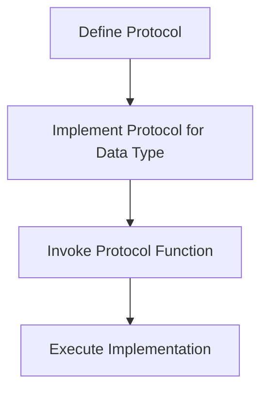
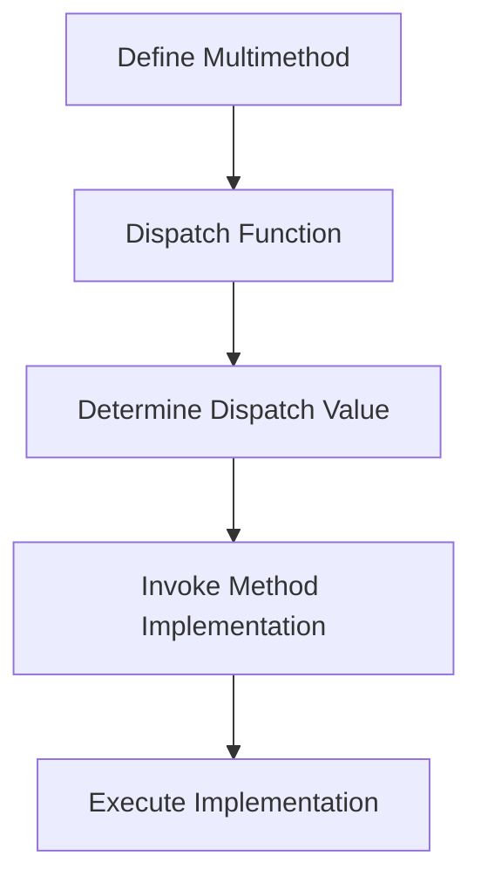

## 7.2 Polymorphism with Protocols and Multimethods

As experienced Java developers, you're likely familiar with polymorphism, a core concept in Object-Oriented Programming (OOP) that allows objects to be treated as instances of their parent class. In Java, polymorphism is typically achieved through inheritance and interfaces. However, Clojure, with its functional programming paradigm, offers a different approach to polymorphism using protocols and multimethods. This section will guide you through these concepts, illustrating how they can be leveraged to achieve flexible and dynamic behavior in your Clojure applications.

### Understanding Polymorphism in Clojure

Polymorphism in Clojure is about enabling functions to operate on different types of data structures without being tightly coupled to specific implementations. This is achieved through:

1. **Protocols**: Define a set of functions that can be implemented by different data types.
2. **Multimethods**: Allow function dispatch based on arbitrary criteria, providing a more flexible way to achieve polymorphic behavior.

Let's delve into each of these concepts, comparing them with Java's approach to polymorphism.

### Protocols: Implementing Polymorphic Behavior

**Protocols** in Clojure are akin to Java interfaces but are more flexible and dynamic. They define a set of functions that can be implemented by various data types, allowing you to achieve polymorphism without the need for inheritance.

#### Defining Protocols

To define a protocol in Clojure, use the `defprotocol` macro. This macro specifies a set of functions that any data type can implement.

```clojure
(defprotocol Shape
  (area [this])
  (perimeter [this]))
```

In this example, the `Shape` protocol defines two functions: `area` and `perimeter`. Any data type that implements this protocol must provide implementations for these functions.

#### Implementing Protocols

To implement a protocol for a specific data type, use the `extend-type` macro. This macro associates the protocol's functions with concrete implementations for the data type.

```clojure
(defrecord Circle [radius])

(extend-type Circle
  Shape
  (area [this]
    (* Math/PI (* (:radius this) (:radius this))))
  (perimeter [this]
    (* 2 Math/PI (:radius this))))
```

Here, we define a `Circle` data type using `defrecord` and implement the `Shape` protocol for it. The `area` and `perimeter` functions are provided specific implementations for circles.

#### Comparing with Java Interfaces

In Java, you would achieve similar behavior using interfaces and classes:

```java
interface Shape {
    double area();
    double perimeter();
}

class Circle implements Shape {
    private double radius;

    public Circle(double radius) {
        this.radius = radius;
    }

    public double area() {
        return Math.PI * radius * radius;
    }

    public double perimeter() {
        return 2 * Math.PI * radius;
    }
}
```

While Java interfaces require you to define a class hierarchy, Clojure's protocols allow you to extend existing data types without modifying their definitions, promoting more flexible and modular code.

#### Protocols and Data Abstraction

Protocols provide a powerful way to abstract behavior across different data types. They enable you to define a common interface for disparate data structures, facilitating code reuse and separation of concerns.

**Try It Yourself**: Extend the `Shape` protocol to include a `Rectangle` data type. Implement the `area` and `perimeter` functions for rectangles.

### Multimethods: Flexible Function Dispatch

**Multimethods** in Clojure offer a more dynamic approach to polymorphism by allowing function dispatch based on arbitrary criteria. Unlike protocols, which are tied to data types, multimethods can dispatch on any aspect of the data, providing greater flexibility.

#### Defining Multimethods

To define a multimethod, use the `defmulti` macro. This macro specifies a dispatch function that determines which method implementation to invoke based on its return value.

```clojure
(defmulti draw-shape :type)
```

In this example, `draw-shape` is a multimethod that dispatches based on the `:type` key in the data passed to it.

#### Implementing Multimethods

To provide implementations for a multimethod, use the `defmethod` macro. This macro associates a specific dispatch value with a function implementation.

```clojure
(defmethod draw-shape :circle [shape]
  (println "Drawing a circle with radius" (:radius shape)))

(defmethod draw-shape :rectangle [shape]
  (println "Drawing a rectangle with width" (:width shape) "and height" (:height shape)))
```

Here, we define two methods for the `draw-shape` multimethod: one for circles and one for rectangles. The appropriate method is invoked based on the `:type` key in the data.

#### Comparing with Java Method Overloading

In Java, you might achieve similar behavior using method overloading or the visitor pattern. However, these approaches can become cumbersome as the number of types and behaviors increases. Multimethods provide a cleaner and more scalable solution.

```java
class ShapeDrawer {
    void draw(Circle circle) {
        System.out.println("Drawing a circle with radius " + circle.getRadius());
    }

    void draw(Rectangle rectangle) {
        System.out.println("Drawing a rectangle with width " + rectangle.getWidth() + " and height " + rectangle.getHeight());
    }
}
```

#### Multimethods and Dynamic Dispatch

Multimethods allow you to decouple function behavior from data types, enabling more dynamic and adaptable code. They are particularly useful in scenarios where behavior needs to change based on multiple factors.

**Try It Yourself**: Add a new shape type, such as `Triangle`, and implement the `draw-shape` multimethod for it.

### Visualizing Protocols and Multimethods

To better understand how protocols and multimethods work, let's visualize their flow using diagrams.

#### Protocols Flow Diagram



**Diagram Description**: This flowchart illustrates the process of defining a protocol, implementing it for a data type, invoking a protocol function, and executing the corresponding implementation.

#### Multimethods Flow Diagram



**Diagram Description**: This flowchart shows the steps involved in defining a multimethod, using a dispatch function to determine the dispatch value, invoking the appropriate method implementation, and executing it.

### Best Practices for Using Protocols and Multimethods

1. **Use Protocols for Type-Based Polymorphism**: When behavior is closely tied to data types, protocols provide a clean and efficient way to achieve polymorphism.

2. **Leverage Multimethods for Dynamic Dispatch**: When behavior depends on multiple factors or when you need more flexibility, multimethods offer a powerful solution.

3. **Keep Implementations Modular**: Separate protocol and multimethod implementations into different namespaces or files to maintain modularity and readability.

4. **Document Dispatch Logic**: Clearly document the dispatch logic for multimethods to ensure maintainability and ease of understanding.

5. **Consider Performance Implications**: While protocols are generally efficient, multimethods can introduce overhead due to dynamic dispatch. Profile and optimize as needed.

### References and Further Reading

- [Official Clojure Documentation on Protocols](https://clojure.org/reference/protocols)
- [ClojureDocs: Multimethods](https://clojuredocs.org/clojure.core/defmulti)
- [GitHub: Clojure Examples and Patterns](https://github.com/clojure-examples)

### Knowledge Check

Before we wrap up, let's reinforce what we've learned with a few questions and exercises.

1. **What is the primary difference between protocols and multimethods in Clojure?**

2. **How would you implement a protocol for a new data type? Provide a code example.**

3. **Describe a scenario where multimethods would be more appropriate than protocols.**

4. **Try extending the `Shape` protocol to include a `Triangle` data type. Implement the `area` and `perimeter` functions.**

5. **Experiment with the `draw-shape` multimethod by adding a new shape type and implementing its drawing logic.**

### Summary

In this section, we've explored how Clojure's protocols and multimethods provide powerful alternatives to Java's polymorphism mechanisms. By leveraging these features, you can create flexible, dynamic, and modular applications that are well-suited to the functional programming paradigm. As you continue your journey with Clojure, remember to experiment with these concepts and apply them to real-world scenarios to fully appreciate their capabilities.

## **Quiz: Are You Ready to Migrate from Java to Clojure?**



### What is a protocol in Clojure?

- [x] A set of functions that can be implemented by different data types.
- [ ] A way to define classes and inheritance.
- [ ] A method for managing state.
- [ ] A concurrency model.

> **Explanation:** A protocol in Clojure defines a set of functions that can be implemented by various data types, similar to interfaces in Java.

### How do you define a multimethod in Clojure?

- [x] Using the `defmulti` macro.
- [ ] Using the `defprotocol` macro.
- [ ] Using the `defmethod` macro.
- [ ] Using the `defrecord` macro.

> **Explanation:** The `defmulti` macro is used to define a multimethod in Clojure, specifying a dispatch function for dynamic function dispatch.

### What is the purpose of the `extend-type` macro?

- [x] To implement a protocol for a specific data type.
- [ ] To define a new data type.
- [ ] To create a multimethod.
- [ ] To manage state.

> **Explanation:** The `extend-type` macro is used to implement a protocol for a specific data type, associating protocol functions with concrete implementations.

### Which of the following is a key advantage of multimethods?

- [x] They allow function dispatch based on arbitrary criteria.
- [ ] They provide a way to manage mutable state.
- [ ] They are more efficient than protocols.
- [ ] They enforce strict type checking.

> **Explanation:** Multimethods allow function dispatch based on arbitrary criteria, providing flexibility beyond type-based dispatch.

### In what scenario would you prefer protocols over multimethods?

- [x] When behavior is closely tied to specific data types.
- [ ] When you need to manage complex state transitions.
- [ ] When performance is not a concern.
- [ ] When you need to dispatch based on multiple factors.

> **Explanation:** Protocols are preferred when behavior is closely tied to specific data types, providing a clean and efficient way to achieve polymorphism.

### What is the `defmethod` macro used for?

- [x] To provide implementations for a multimethod.
- [ ] To define a new protocol.
- [ ] To create a new data type.
- [ ] To manage concurrency.

> **Explanation:** The `defmethod` macro is used to provide specific implementations for a multimethod based on dispatch values.

### How does Clojure's approach to polymorphism differ from Java's?

- [x] Clojure uses protocols and multimethods, while Java uses inheritance and interfaces.
- [ ] Clojure enforces strict type checking, while Java does not.
- [ ] Clojure does not support polymorphism.
- [ ] Clojure uses classes and objects, while Java uses functions.

> **Explanation:** Clojure uses protocols and multimethods for polymorphism, offering a more flexible and dynamic approach compared to Java's inheritance and interfaces.

### What is a key consideration when using multimethods?

- [x] They can introduce overhead due to dynamic dispatch.
- [ ] They require strict type checking.
- [ ] They are less flexible than protocols.
- [ ] They cannot be used with existing data types.

> **Explanation:** Multimethods can introduce overhead due to dynamic dispatch, so it's important to profile and optimize as needed.

### Can protocols be extended to existing data types in Clojure?

- [x] Yes
- [ ] No

> **Explanation:** Protocols can be extended to existing data types in Clojure, allowing you to add behavior without modifying the original data type definitions.

### True or False: Multimethods are tied to specific data types.

- [ ] True
- [x] False

> **Explanation:** Multimethods are not tied to specific data types; they allow function dispatch based on arbitrary criteria, providing greater flexibility.




