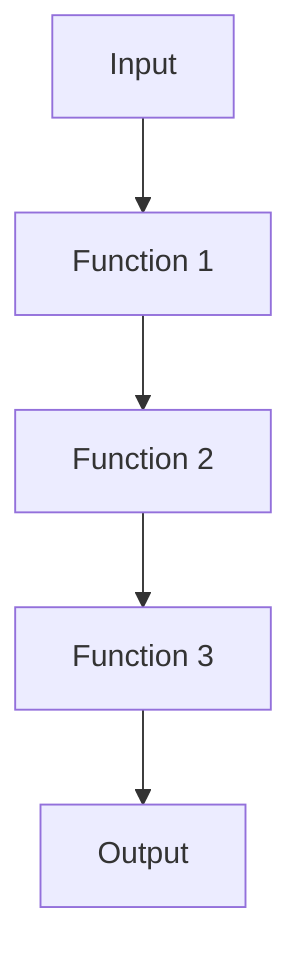

## 8.1 Favoring Composition Over Inheritance

As experienced Java developers, you're likely familiar with the concept of inheritance, a cornerstone of Object-Oriented Programming (OOP). Inheritance allows you to create a new class that is based on an existing class, inheriting its properties and behaviors. While this can be powerful, it often leads to tightly coupled code that is difficult to maintain and extend. In contrast, Clojure, a functional programming language, emphasizes composition over inheritance, promoting modularity and reusability. In this section, we'll explore why composition is favored in Clojure, how it differs from inheritance, and how you can leverage it to create more flexible and maintainable code.

### Understanding Inheritance in Java

Before diving into composition, let's briefly review inheritance in Java. Inheritance allows a class to inherit fields and methods from another class, enabling code reuse and the creation of hierarchical class structures.

```java
// Java example of inheritance
class Animal {
    void eat() {
        System.out.println("This animal eats food.");
    }
}

class Dog extends Animal {
    void bark() {
        System.out.println("The dog barks.");
    }
}

public class Main {
    public static void main(String[] args) {
        Dog dog = new Dog();
        dog.eat();  // Inherited method
        dog.bark(); // Method specific to Dog
    }
}
```

In this example, `Dog` inherits the `eat` method from `Animal`. While inheritance can simplify code by reducing redundancy, it can also lead to issues such as the fragile base class problem, where changes in the base class can inadvertently affect derived classes.

### The Case for Composition

Composition, on the other hand, involves building complex functionality by combining simpler, independent components. This approach aligns well with Clojure's functional programming paradigm, where functions and data structures are composed to achieve desired behaviors.

#### Benefits of Composition

1. **Modularity**: Composition encourages the creation of small, focused components that can be easily combined and reused.
2. **Flexibility**: Components can be replaced or extended without affecting other parts of the system.
3. **Testability**: Smaller, independent components are easier to test in isolation.
4. **Decoupling**: Reduces dependencies between components, making the system more robust to change.

### Composition in Clojure

In Clojure, composition is achieved through functions and data structures. Let's explore how you can use these tools to build modular and reusable code.

#### Composing Functions

Clojure provides several ways to compose functions, allowing you to build complex operations from simple ones.

```clojure
;; Clojure example of function composition
(defn add [x y] (+ x y))
(defn multiply [x y] (* x y))

(defn add-and-multiply [a b c]
  (multiply (add a b) c))

(println (add-and-multiply 2 3 4)) ; Output: 20
```

In this example, `add-and-multiply` composes the `add` and `multiply` functions to perform a combined operation. Clojure's `comp` function can also be used to compose multiple functions into a single function.

```clojure
(defn square [x] (* x x))
(defn increment [x] (+ x 1))

(def square-and-increment (comp increment square))

(println (square-and-increment 3)) ; Output: 10
```

Here, `square-and-increment` is a new function that first squares its input and then increments the result.

#### Composing Data Structures

Clojure's immutable data structures, such as lists, vectors, maps, and sets, can be composed to create complex data models. Let's see how you can use these structures to represent and manipulate data.

```clojure
;; Clojure example of data structure composition
(def person {:name "Alice" :age 30})
(def address {:city "New York" :zip 10001})

(def person-with-address (merge person address))

(println person-with-address)
; Output: {:name "Alice", :age 30, :city "New York", :zip 10001}
```

In this example, we use `merge` to compose two maps, `person` and `address`, into a single map representing a person with an address.

### Patterns for Composing Functions and Data Structures

Clojure offers several patterns and techniques for composing functions and data structures, enabling you to build complex systems from simple components.

#### Higher-Order Functions

Higher-order functions are functions that take other functions as arguments or return functions as results. They are a powerful tool for composition in Clojure.

```clojure
;; Clojure example of higher-order functions
(defn apply-twice [f x]
  (f (f x)))

(defn double [x] (* 2 x))

(println (apply-twice double 5)) ; Output: 20
```

In this example, `apply-twice` is a higher-order function that applies a given function `f` to an input `x` twice.

#### Protocols and Multimethods

Protocols and multimethods provide a way to achieve polymorphism in Clojure, allowing you to define behavior that varies based on the type of data.

```clojure
;; Clojure example of protocols
(defprotocol Animal
  (speak [this]))

(defrecord Dog []
  Animal
  (speak [this] "Woof!"))

(defrecord Cat []
  Animal
  (speak [this] "Meow!"))

(defn make-speak [animal]
  (speak animal))

(println (make-speak (->Dog))) ; Output: Woof!
(println (make-speak (->Cat))) ; Output: Meow!
```

In this example, we define a protocol `Animal` with a `speak` method, and implement it for `Dog` and `Cat` records. This allows us to achieve polymorphic behavior without inheritance.

### Visualizing Composition

To better understand the flow of data and function composition in Clojure, let's use a diagram to illustrate how functions can be composed.



**Diagram Description**: This flowchart represents the composition of three functions, where the output of each function is passed as the input to the next, resulting in a final output.

### Try It Yourself

Now that we've explored the concepts of composition in Clojure, try modifying the examples above to create your own compositions. For instance, experiment with different functions and data structures to see how they can be combined to achieve new behaviors.

### References and Further Reading

- [Official Clojure Documentation](https://clojure.org/)
- [ClojureDocs](https://clojuredocs.org/)
- [Functional Programming in Clojure](https://github.com/clojure-cookbook/clojure-cookbook)

### Knowledge Check

To reinforce your understanding of composition in Clojure, consider the following questions:

1. What are the key differences between inheritance and composition?
2. How can higher-order functions be used to achieve composition in Clojure?
3. What are the benefits of using immutable data structures in composition?

### Summary

In this section, we've explored the concept of favoring composition over inheritance in Clojure. By leveraging function and data structure composition, you can create modular, flexible, and reusable code. This approach aligns with Clojure's functional programming paradigm, offering numerous benefits over traditional inheritance-based designs. As you continue your journey in Clojure, remember to embrace composition as a powerful tool for building robust and maintainable systems.

## **Quiz: Are You Ready to Migrate from Java to Clojure?**



### What is a key advantage of composition over inheritance in Clojure?

- [x] Modularity
- [ ] Complexity
- [ ] Tight coupling
- [ ] Redundancy

> **Explanation:** Composition promotes modularity by allowing the creation of small, focused components that can be easily combined and reused.

### How does Clojure achieve polymorphism without inheritance?

- [x] Protocols and Multimethods
- [ ] Classes and Interfaces
- [ ] Abstract Classes
- [ ] Single Inheritance

> **Explanation:** Clojure uses protocols and multimethods to achieve polymorphism, allowing behavior to vary based on data type.

### What is a higher-order function?

- [x] A function that takes other functions as arguments or returns functions as results
- [ ] A function that only operates on numbers
- [ ] A function that is always recursive
- [ ] A function that cannot be composed

> **Explanation:** Higher-order functions are functions that take other functions as arguments or return functions as results, enabling powerful composition techniques.

### Which Clojure function is used to compose multiple functions into a single function?

- [x] comp
- [ ] merge
- [ ] map
- [ ] reduce

> **Explanation:** The `comp` function in Clojure is used to compose multiple functions into a single function.

### What is the result of `(apply-twice double 5)` in the provided example?

- [x] 20
- [ ] 10
- [ ] 15
- [ ] 25

> **Explanation:** The `apply-twice` function applies the `double` function twice to the input `5`, resulting in `20`.

### What is the purpose of the `merge` function in Clojure?

- [x] To combine maps into a single map
- [ ] To concatenate strings
- [ ] To add numbers
- [ ] To create a list

> **Explanation:** The `merge` function in Clojure is used to combine maps into a single map, as demonstrated in the data structure composition example.

### What does the `speak` method do in the protocol example?

- [x] Defines behavior for different animal types
- [ ] Prints the animal's age
- [ ] Calculates the animal's speed
- [ ] Changes the animal's color

> **Explanation:** The `speak` method in the protocol example defines behavior for different animal types, allowing polymorphic behavior.

### What is the output of `(square-and-increment 3)` in the provided example?

- [x] 10
- [ ] 9
- [ ] 12
- [ ] 16

> **Explanation:** The `square-and-increment` function first squares the input `3` to get `9`, then increments it to `10`.

### Which of the following is NOT a benefit of composition?

- [ ] Modularity
- [ ] Flexibility
- [ ] Testability
- [x] Tight coupling

> **Explanation:** Composition reduces tight coupling, making the system more robust to change, which is a benefit rather than a drawback.

### True or False: Inheritance is the preferred method for code reuse in Clojure.

- [ ] True
- [x] False

> **Explanation:** False. Composition is favored over inheritance in Clojure for code reuse, as it promotes modularity and flexibility.


