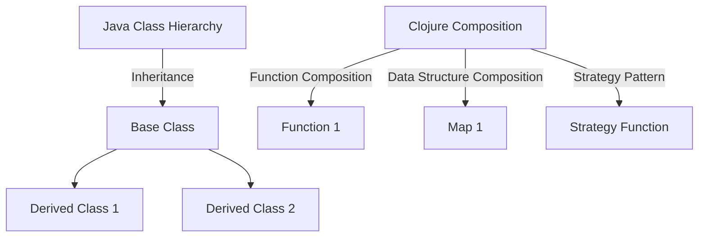

## 8.1 Favoring Composition Over Inheritance

As we transition from Java's Object-Oriented Programming (OOP) paradigm to Clojure's functional programming model, one of the most significant shifts is the move from inheritance to composition. This section will guide you through understanding why composition is favored in Clojure, how it enhances modularity and reusability, and how you can effectively apply composition patterns in your enterprise applications.

### Understanding Composition and Inheritance

**Inheritance** in Java OOP is a mechanism where a new class is derived from an existing class, inheriting its fields and methods. This allows for code reuse and the creation of hierarchical class structures. However, inheritance can lead to complex and tightly coupled systems, making maintenance and scalability challenging.

**Composition**, on the other hand, involves building complex objects by combining simpler ones. In Clojure, this is achieved through the use of functions and data structures rather than class hierarchies. Composition promotes flexibility and modularity, allowing for easier code maintenance and testing.

### Why Favor Composition Over Inheritance?

1. **Flexibility**: Composition allows you to change the behavior of a system by simply swapping out components. This is more challenging with inheritance, where changes often require modifying the class hierarchy.

2. **Reusability**: By composing functions and data structures, you can create reusable components that can be easily shared across different parts of an application.

3. **Simplicity**: Composition leads to simpler and more understandable code. It avoids the pitfalls of deep inheritance hierarchies, which can be difficult to navigate and understand.

4. **Decoupling**: Composition decouples the implementation details from the interface, allowing for more robust and adaptable systems.

### Composition in Clojure: A Functional Approach

In Clojure, composition is a natural fit due to its functional nature. Let's explore how we can leverage Clojure's features to implement composition effectively.

#### Composing Functions

In Clojure, functions are first-class citizens, meaning they can be passed as arguments, returned from other functions, and assigned to variables. This makes function composition a powerful tool.

```clojure
;; Define two simple functions
(defn add [x y]
  (+ x y))

(defn multiply [x y]
  (* x y))

;; Compose functions using the `comp` function
(def add-then-multiply (comp (partial multiply 2) (partial add 3)))

;; Use the composed function
(add-then-multiply 5) ;; => 16
```

In this example, we use the `comp` function to create a new function `add-then-multiply` that first adds 3 to its input and then multiplies the result by 2.

#### Composing Data Structures

Clojure's immutable data structures, such as maps, vectors, and sets, can be composed to create complex data models.

```clojure
;; Define a map representing a person
(def person {:name "Alice" :age 30})

;; Define a map representing an address
(def address {:street "123 Main St" :city "Springfield"})

;; Compose the person and address maps
(def person-with-address (merge person address))

;; Resulting map
;; {:name "Alice", :age 30, :street "123 Main St", :city "Springfield"}
```

Here, we use the `merge` function to compose two maps, creating a new map that combines the data from both.

#### Patterns for Composing Functions and Data Structures

1. **Pipeline Pattern**: Use the `->` (thread-first) and `->>` (thread-last) macros to create pipelines of function calls.

```clojure
;; Pipeline using the thread-first macro
(-> 5
    (add 3)
    (multiply 2)) ;; => 16
```

2. **Decorator Pattern**: Create higher-order functions that add behavior to existing functions.

```clojure
;; Define a logging decorator
(defn log-decorator [f]
  (fn [& args]
    (println "Calling function with args:" args)
    (apply f args)))

;; Decorate the add function
(def logged-add (log-decorator add))

;; Use the decorated function
(logged-add 3 4) ;; Logs: Calling function with args: (3 4) => 7
```

3. **Strategy Pattern**: Define a set of interchangeable algorithms and select one at runtime.

```clojure
;; Define strategies as functions
(defn strategy-a [x] (* x 2))
(defn strategy-b [x] (+ x 10))

;; Function to apply a strategy
(defn apply-strategy [strategy x]
  (strategy x))

;; Use different strategies
(apply-strategy strategy-a 5) ;; => 10
(apply-strategy strategy-b 5) ;; => 15
```

### Java OOP vs. Clojure Composition: A Comparison

To better understand the transition from Java OOP to Clojure's functional paradigm, let's compare how common design patterns are implemented in both languages.

#### Java Inheritance Example

```java
// Base class
class Animal {
    void makeSound() {
        System.out.println("Some sound");
    }
}

// Derived class
class Dog extends Animal {
    @Override
    void makeSound() {
        System.out.println("Bark");
    }
}

// Usage
Animal myDog = new Dog();
myDog.makeSound(); // Outputs: Bark
```

#### Clojure Composition Example

```clojure
;; Define a function for the base behavior
(defn make-sound []
  (println "Some sound"))

;; Define a function for the derived behavior
(defn dog-sound []
  (println "Bark"))

;; Compose behaviors using a map
(def animal {:make-sound make-sound})
(def dog (assoc animal :make-sound dog-sound))

;; Usage
((:make-sound dog)) ;; Outputs: Bark
```

In the Clojure example, we use a map to compose behaviors, allowing us to easily swap out or extend functionality without modifying a class hierarchy.

### Try It Yourself

Experiment with the following exercises to deepen your understanding of composition in Clojure:

1. **Modify the Function Composition**: Change the `add-then-multiply` function to first multiply by 3 and then add 5. Test it with different inputs.

2. **Create a New Data Structure Composition**: Define two maps representing a book and its author. Compose them into a single map and print the result.

3. **Implement a New Strategy**: Add a new strategy function that subtracts 5 from its input. Use `apply-strategy` to test all strategies with the input 10.

### Visual Aids

To further illustrate the concept of composition over inheritance, let's use a diagram to compare the two approaches.



**Diagram Description**: This diagram contrasts the Java class hierarchy using inheritance with Clojure's composition approach, highlighting function and data structure composition as well as the strategy pattern.

### References and Further Reading

- [Clojure Official Documentation](https://clojure.org/reference)
- [Clojure Community Resources](https://clojure.org/community/resources)
- [Transitioning from OOP to Functional Programming](https://www.lispcast.com/oo-to-fp/)
- [Effective Java: Programming Language Guide](https://www.oreilly.com/library/view/effective-java/9780134686097/)

### Knowledge Check

1. **What is the primary advantage of composition over inheritance?**
   - Flexibility and reusability of code components.

2. **How does Clojure's `comp` function work?**
   - It creates a new function by composing multiple functions together.

3. **What is a common pattern for composing data structures in Clojure?**
   - Using the `merge` function to combine maps.

4. **How can you implement a strategy pattern in Clojure?**
   - By defining interchangeable functions and selecting one at runtime.

### Summary

In this section, we've explored the benefits of favoring composition over inheritance in Clojure. By leveraging function and data structure composition, you can create modular, reusable, and flexible code. As you continue your journey from Java OOP to Clojure's functional paradigm, remember that embracing composition will lead to simpler and more maintainable systems.

## **Quiz: Are You Ready to Migrate from Java to Clojure?**



### What is a key benefit of composition over inheritance in Clojure?

- [x] Flexibility and modularity
- [ ] Increased complexity
- [ ] Tighter coupling
- [ ] More class hierarchies

> **Explanation:** Composition allows for flexible and modular code, avoiding the pitfalls of complex inheritance hierarchies.

### How does the `comp` function in Clojure work?

- [x] It composes multiple functions into a single function.
- [ ] It creates a new data structure.
- [ ] It merges two maps.
- [ ] It defines a new namespace.

> **Explanation:** The `comp` function in Clojure takes multiple functions and returns a new function that is the composition of those functions.

### Which Clojure macro is used for creating pipelines of function calls?

- [x] `->` (thread-first)
- [ ] `comp`
- [ ] `assoc`
- [ ] `merge`

> **Explanation:** The `->` macro is used to create pipelines by threading the result of one function call into the next.

### What is a common use of the `merge` function in Clojure?

- [x] Composing maps
- [ ] Composing functions
- [ ] Creating class hierarchies
- [ ] Defining protocols

> **Explanation:** The `merge` function is commonly used to compose maps by combining their key-value pairs.

### How can you implement a decorator pattern in Clojure?

- [x] By creating higher-order functions
- [ ] By using inheritance
- [ ] By defining new classes
- [ ] By using the `merge` function

> **Explanation:** In Clojure, the decorator pattern can be implemented using higher-order functions that add behavior to existing functions.

### What is the role of a strategy pattern in Clojure?

- [x] To define interchangeable algorithms
- [ ] To create class hierarchies
- [ ] To merge data structures
- [ ] To define namespaces

> **Explanation:** The strategy pattern involves defining a set of interchangeable algorithms and selecting one at runtime.

### How can you modify a composed function in Clojure?

- [x] By changing the order of functions in the composition
- [ ] By redefining the class hierarchy
- [ ] By using inheritance
- [ ] By creating a new namespace

> **Explanation:** In Clojure, you can modify a composed function by changing the order or the functions involved in the composition.

### What is a benefit of using immutable data structures in Clojure?

- [x] They promote safe and predictable code
- [ ] They increase complexity
- [ ] They require more memory
- [ ] They enforce inheritance

> **Explanation:** Immutable data structures ensure that data cannot be changed, leading to safer and more predictable code.

### How does Clojure's approach to composition differ from Java's inheritance?

- [x] Clojure uses functions and data structures, while Java uses class hierarchies.
- [ ] Clojure uses class hierarchies, while Java uses functions.
- [ ] Clojure and Java both use inheritance.
- [ ] Clojure and Java both use composition.

> **Explanation:** Clojure favors composition through functions and data structures, whereas Java relies on class hierarchies and inheritance.

### True or False: Composition in Clojure leads to tightly coupled systems.

- [ ] True
- [x] False

> **Explanation:** Composition in Clojure leads to loosely coupled systems, promoting flexibility and modularity.


