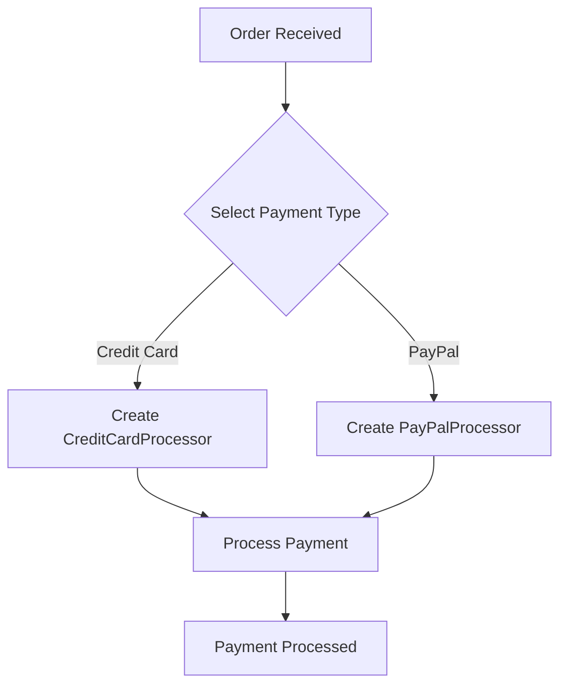

## 8.2 Designing Extensible Systems

In the realm of software development, creating systems that are both robust and adaptable is a perennial challenge. As experienced Java developers, you are likely familiar with the object-oriented paradigm, where inheritance is often used to extend functionality. However, as we transition to Clojure, a functional programming language, we will explore how composition can be a more powerful and flexible tool for designing extensible systems. This section will guide you through strategies for extending functionality without inheritance and implementing the open/closed principle in Clojure.

### Understanding the Limitations of Inheritance

Inheritance is a cornerstone of object-oriented programming (OOP), allowing developers to create a hierarchy of classes that share behavior. However, it comes with several limitations:

- **Tight Coupling**: Inheritance creates a strong dependency between the parent and child classes, making changes in the parent class potentially disruptive to the child classes.
- **Fragile Base Class Problem**: Modifications in the base class can inadvertently affect all derived classes, leading to unexpected behavior.
- **Limited Flexibility**: Inheritance is a static relationship, defined at compile-time, which can limit the ability to adapt to new requirements dynamically.

### Embracing Composition in Clojure

Clojure, with its functional programming paradigm, encourages the use of composition over inheritance. Composition involves building complex functionality by combining simpler, independent components. This approach offers several advantages:

- **Loose Coupling**: Components are independent and can be combined in various ways without creating dependencies.
- **Reusability**: Functions and data structures can be reused across different parts of the application.
- **Flexibility**: New behavior can be added by composing existing functions, allowing for dynamic adaptation to changing requirements.

### Implementing the Open/Closed Principle

The open/closed principle states that software entities should be open for extension but closed for modification. In Clojure, this can be achieved through:

- **Higher-Order Functions**: Functions that take other functions as arguments or return them as results, enabling dynamic behavior extension.
- **Protocols and Multimethods**: Mechanisms for achieving polymorphism and dynamic dispatch without relying on class hierarchies.

Let's delve deeper into these concepts with practical examples.

### Higher-Order Functions in Clojure

Higher-order functions are a fundamental concept in functional programming. They allow us to create flexible and reusable code by abstracting behavior.

#### Example: Logging Decorator

Suppose we have a simple function that processes data. We want to add logging functionality without modifying the original function.

```clojure
(defn process-data [data]
  ;; Simulate data processing
  (println "Processing data:" data)
  (* 2 data))

(defn with-logging [f]
  (fn [& args]
    (println "Calling function with args:" args)
    (let [result (apply f args)]
      (println "Function result:" result)
      result)))

(def process-data-with-logging (with-logging process-data))

;; Usage
(process-data-with-logging 10)
```

In this example, `with-logging` is a higher-order function that takes a function `f` and returns a new function that logs its input and output. This allows us to extend the functionality of `process-data` without modifying it.

### Protocols and Multimethods

Clojure's protocols and multimethods provide a way to achieve polymorphism and dynamic dispatch, similar to interfaces in Java, but with more flexibility.

#### Protocols

Protocols define a set of functions that can be implemented by different data types, allowing for polymorphic behavior.

```clojure
(defprotocol Shape
  (area [this])
  (perimeter [this]))

(defrecord Circle [radius]
  Shape
  (area [this] (* Math/PI (* radius radius)))
  (perimeter [this] (* 2 Math/PI radius)))

(defrecord Rectangle [width height]
  Shape
  (area [this] (* width height))
  (perimeter [this] (* 2 (+ width height))))

;; Usage
(def circle (->Circle 5))
(def rectangle (->Rectangle 4 6))

(println "Circle area:" (area circle))
(println "Rectangle perimeter:" (perimeter rectangle))
```

In this example, the `Shape` protocol defines two functions, `area` and `perimeter`. The `Circle` and `Rectangle` records implement these functions, allowing us to calculate the area and perimeter polymorphically.

#### Multimethods

Multimethods provide a more flexible way to achieve polymorphism by dispatching on arbitrary criteria.

```clojure
(defmulti calculate :shape-type)

(defmethod calculate :circle [shape]
  (let [radius (:radius shape)]
    {:area (* Math/PI (* radius radius))
     :perimeter (* 2 Math/PI radius)}))

(defmethod calculate :rectangle [shape]
  (let [width (:width shape)
        height (:height shape)]
    {:area (* width height)
     :perimeter (* 2 (+ width height))}))

;; Usage
(def circle {:shape-type :circle :radius 5})
(def rectangle {:shape-type :rectangle :width 4 :height 6})

(println "Circle calculations:" (calculate circle))
(println "Rectangle calculations:" (calculate rectangle))
```

Here, `calculate` is a multimethod that dispatches based on the `:shape-type` key in the shape map. This allows us to extend the behavior for new shape types without modifying existing code.

### Designing Extensible Systems with Composition

By leveraging higher-order functions, protocols, and multimethods, we can design systems that are both extensible and maintainable. Let's explore a real-world scenario to illustrate these concepts.

#### Scenario: Extensible Payment Processing System

Imagine we are building a payment processing system that needs to support multiple payment methods (e.g., credit card, PayPal, bank transfer). We want to design the system to easily add new payment methods without modifying existing code.

1. **Define a Protocol for Payment Processing**

```clojure
(defprotocol PaymentProcessor
  (process-payment [this amount]))

(defrecord CreditCardProcessor []
  PaymentProcessor
  (process-payment [this amount]
    (println "Processing credit card payment of" amount)))

(defrecord PayPalProcessor []
  PaymentProcessor
  (process-payment [this amount]
    (println "Processing PayPal payment of" amount)))
```

2. **Implement a Factory Function for Creating Processors**

```clojure
(defn create-processor [type]
  (case type
    :credit-card (->CreditCardProcessor)
    :paypal (->PayPalProcessor)
    (throw (IllegalArgumentException. "Unsupported payment type"))))
```

3. **Use the Factory Function to Process Payments**

```clojure
(defn process-order [payment-type amount]
  (let [processor (create-processor payment-type)]
    (process-payment processor amount)))

;; Usage
(process-order :credit-card 100)
(process-order :paypal 50)
```

In this example, we define a `PaymentProcessor` protocol and implement it for different payment methods. The `create-processor` function acts as a factory, creating the appropriate processor based on the payment type. This design allows us to add new payment methods by simply implementing the `PaymentProcessor` protocol for the new method, without altering existing code.

### Visualizing Composition and Extensibility

To better understand the flow of data and the composition of functions, let's visualize the payment processing system using a flowchart.



**Diagram Description**: This flowchart illustrates the process of handling an order by selecting a payment type, creating the appropriate processor, and processing the payment. The use of composition allows for easy extension by adding new paths for additional payment types.

### Try It Yourself

To deepen your understanding, try modifying the code examples:

- Add a new payment method, such as `BankTransferProcessor`, and implement the `PaymentProcessor` protocol for it.
- Experiment with adding logging functionality to the `process-payment` function using higher-order functions.
- Create a multimethod that dispatches based on the payment amount, applying different processing fees for different ranges.

### Key Takeaways

- **Composition over Inheritance**: Embrace composition to build flexible and extensible systems without the pitfalls of inheritance.
- **Higher-Order Functions**: Use higher-order functions to extend functionality dynamically and promote code reuse.
- **Protocols and Multimethods**: Leverage protocols and multimethods for polymorphism and dynamic dispatch, enabling open/closed design.
- **Extensible Design**: Design systems that are open for extension by defining clear interfaces and using composition to add new behavior.

### Further Reading

- [Clojure Official Documentation](https://clojure.org/)
- [ClojureDocs](https://clojuredocs.org/)
- [Functional Programming in Clojure](https://www.braveclojure.com/)

By adopting these strategies, you can design systems in Clojure that are not only extensible but also maintainable and adaptable to future requirements. Now, let's test your understanding with a quiz!

## **Quiz: Are You Ready to Migrate from Java to Clojure?**



### What is a key advantage of using composition over inheritance in Clojure?

- [x] Loose coupling between components
- [ ] Strong coupling between components
- [ ] Increased complexity
- [ ] Reduced flexibility

> **Explanation:** Composition allows for loose coupling, enabling components to be combined without dependencies.

### How can higher-order functions help in designing extensible systems?

- [x] By allowing functions to be passed as arguments and returned as results
- [ ] By enforcing strict type checking
- [ ] By limiting the number of functions
- [ ] By increasing code duplication

> **Explanation:** Higher-order functions enable dynamic behavior extension by allowing functions to be passed and returned.

### What is the purpose of protocols in Clojure?

- [x] To define a set of functions for polymorphic behavior
- [ ] To enforce class hierarchies
- [ ] To restrict function usage
- [ ] To increase code complexity

> **Explanation:** Protocols define a set of functions that can be implemented by different data types for polymorphic behavior.

### How do multimethods differ from protocols in Clojure?

- [x] Multimethods dispatch based on arbitrary criteria
- [ ] Multimethods enforce strict inheritance
- [ ] Multimethods are limited to one data type
- [ ] Multimethods increase code duplication

> **Explanation:** Multimethods provide flexible polymorphism by dispatching based on arbitrary criteria.

### What is the open/closed principle?

- [x] Software entities should be open for extension but closed for modification
- [ ] Software entities should be closed for extension and open for modification
- [ ] Software entities should be open for both extension and modification
- [ ] Software entities should be closed for both extension and modification

> **Explanation:** The open/closed principle states that software entities should be open for extension but closed for modification.

### Which of the following is a benefit of using protocols in Clojure?

- [x] Achieving polymorphism without class hierarchies
- [ ] Enforcing strict inheritance
- [ ] Limiting function usage
- [ ] Increasing code complexity

> **Explanation:** Protocols allow for polymorphism without relying on class hierarchies, promoting flexibility.

### How can you extend functionality in Clojure without modifying existing code?

- [x] By using higher-order functions and protocols
- [ ] By enforcing strict inheritance
- [ ] By duplicating code
- [ ] By increasing code complexity

> **Explanation:** Higher-order functions and protocols enable functionality extension without modifying existing code.

### What is a potential drawback of using inheritance in Java?

- [x] Tight coupling between parent and child classes
- [ ] Increased flexibility
- [ ] Loose coupling between components
- [ ] Simplified code structure

> **Explanation:** Inheritance creates tight coupling, making changes in the parent class potentially disruptive to child classes.

### How can you achieve polymorphism in Clojure?

- [x] By using protocols and multimethods
- [ ] By enforcing strict inheritance
- [ ] By duplicating code
- [ ] By increasing code complexity

> **Explanation:** Protocols and multimethods provide mechanisms for achieving polymorphism in Clojure.

### True or False: Composition allows for dynamic adaptation to changing requirements.

- [x] True
- [ ] False

> **Explanation:** Composition allows for dynamic adaptation by enabling components to be combined in various ways without dependencies.



By embracing these concepts, you're well on your way to mastering the art of designing extensible systems in Clojure. Keep experimenting and exploring to deepen your understanding and proficiency.
