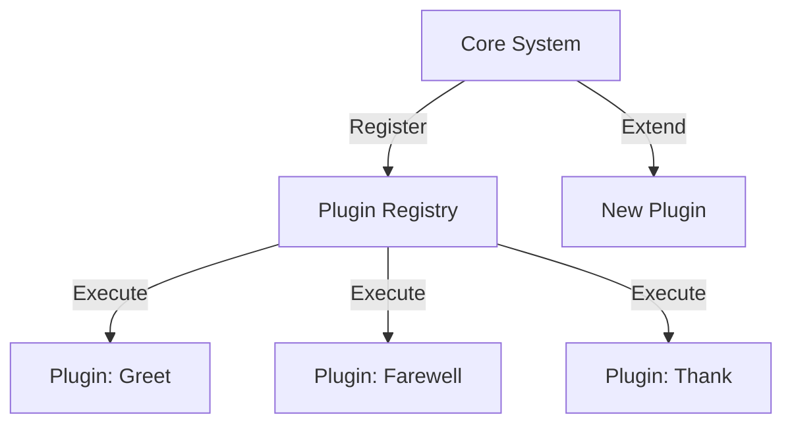

## 8.2 Designing Extensible Systems

As we transition from Java's object-oriented programming (OOP) paradigm to Clojure's functional programming model, we encounter a fundamental shift in how we design extensible systems. In Java, extensibility often relies on inheritance, a mechanism that allows new classes to be created based on existing ones. However, this approach can lead to rigid hierarchies and tightly coupled code. In contrast, Clojure encourages composition over inheritance, promoting flexibility and modularity. In this section, we will explore strategies for designing extensible systems in Clojure, focusing on implementing the open/closed principle and leveraging Clojure's powerful features.

### Understanding Extensibility in Software Design

Extensibility is a key aspect of software design that allows systems to evolve and adapt to new requirements without significant rework. In Java, extensibility is often achieved through inheritance, where subclasses extend the functionality of parent classes. However, this approach can lead to several issues:

- **Tight Coupling**: Inheritance creates a strong dependency between the subclass and its superclass, making changes to the superclass potentially disruptive to all subclasses.
- **Fragile Base Class Problem**: Changes to a base class can inadvertently affect all derived classes, leading to unexpected behavior.
- **Limited Flexibility**: Inheritance hierarchies can become rigid and difficult to modify, especially as the system grows.

Clojure, with its emphasis on immutability and functional programming, offers alternative strategies for achieving extensibility. Let's explore these strategies and how they align with the open/closed principle.

### The Open/Closed Principle in Clojure

The open/closed principle, a core tenet of software design, states that software entities should be open for extension but closed for modification. This means that we should be able to add new functionality to a system without altering existing code. In Clojure, this principle is naturally supported through the use of higher-order functions, protocols, and multimethods.

#### Implementing the Open/Closed Principle

1. **Higher-Order Functions**: Clojure's first-class functions allow us to pass functions as arguments, return them from other functions, and store them in data structures. This enables us to extend functionality by composing new functions from existing ones.

    ```clojure
    ;; Define a function that applies a discount
    (defn apply-discount [price discount-fn]
      (discount-fn price))

    ;; Define a specific discount function
    (defn ten-percent-discount [price]
      (* price 0.9))

    ;; Use the higher-order function to apply the discount
    (apply-discount 100 ten-percent-discount) ;; => 90.0
    ```

    In this example, `apply-discount` is open for extension through different discount functions, without needing modification.

2. **Protocols and Multimethods**: Clojure's protocols and multimethods provide a way to achieve polymorphism without inheritance. Protocols define a set of functions that can be implemented by different types, while multimethods allow for method dispatch based on arbitrary criteria.

    ```clojure
    ;; Define a protocol for rendering
    (defprotocol Renderable
      (render [this]))

    ;; Implement the protocol for different types
    (extend-protocol Renderable
      String
      (render [this] (println "Rendering string:" this))

      Number
      (render [this] (println "Rendering number:" this)))

    ;; Use the protocol
    (render "Hello") ;; => Rendering string: Hello
    (render 42)      ;; => Rendering number: 42
    ```

    Protocols allow us to extend functionality to new types without modifying existing code.

3. **Data-Driven Design**: Clojure encourages the use of data-driven design, where behavior is determined by data rather than code structure. This approach can be used to extend functionality by simply adding new data configurations.

    ```clojure
    ;; Define a map of operations
    (def operations
      {:add + :subtract - :multiply * :divide /})

    ;; Function to perform an operation
    (defn perform-operation [op a b]
      ((get operations op) a b))

    ;; Extend functionality by adding new operations
    (def operations
      (assoc operations :modulo mod))

    (perform-operation :modulo 10 3) ;; => 1
    ```

    By using data to drive behavior, we can easily extend the system by modifying the data structure.

### Composition Over Inheritance

Clojure's emphasis on composition over inheritance aligns with the open/closed principle by promoting the assembly of small, reusable components. This approach offers several benefits:

- **Loose Coupling**: Components are loosely coupled, making it easier to change or replace them without affecting the rest of the system.
- **Reusability**: Composable components can be reused across different parts of the system, reducing duplication.
- **Flexibility**: Systems designed with composition are more flexible and adaptable to change.

#### Strategies for Composition

1. **Function Composition**: Clojure's `comp` function allows us to compose multiple functions into a single function, enabling us to build complex behavior from simple functions.

    ```clojure
    ;; Define simple functions
    (defn square [x] (* x x))
    (defn increment [x] (+ x 1))

    ;; Compose functions
    (def square-and-increment (comp increment square))

    (square-and-increment 4) ;; => 17
    ```

    Function composition allows us to extend functionality by combining existing functions in new ways.

2. **Data Structures as Components**: In Clojure, data structures can be used as components that encapsulate state and behavior. By manipulating these data structures, we can achieve extensibility without modifying code.

    ```clojure
    ;; Define a component as a map
    (def component {:name "Button" :action (fn [] (println "Button clicked"))})

    ;; Extend functionality by modifying the map
    (def extended-component (assoc component :tooltip "Click to submit"))

    ((:action extended-component)) ;; => Button clicked
    ```

    Using data structures as components allows us to extend functionality by simply modifying the data.

3. **Event-Driven Architecture**: Clojure's functional nature makes it well-suited for event-driven architectures, where components communicate through events. This approach allows for extensibility by adding new event handlers without modifying existing components.

    ```clojure
    ;; Define an event handler map
    (def event-handlers
      {:click (fn [] (println "Clicked!"))
       :hover (fn [] (println "Hovered!"))})

    ;; Function to handle events
    (defn handle-event [event]
      ((get event-handlers event)))

    ;; Extend functionality by adding new handlers
    (def event-handlers
      (assoc event-handlers :double-click (fn [] (println "Double clicked!"))))

    (handle-event :double-click) ;; => Double clicked!
    ```

    Event-driven design allows us to extend functionality by adding new event handlers.

### Practical Example: Designing an Extensible System

Let's apply these concepts to design an extensible system in Clojure. We'll create a simple plugin system that allows users to add new functionality without modifying the core system.

#### Step 1: Define the Core System

We'll start by defining the core system, which includes a registry for plugins and a function to execute them.

```clojure
;; Define a registry for plugins
(def plugins (atom {}))

;; Function to register a plugin
(defn register-plugin [name fn]
  (swap! plugins assoc name fn))

;; Function to execute a plugin
(defn execute-plugin [name & args]
  (if-let [plugin (get @plugins name)]
    (apply plugin args)
    (println "Plugin not found")))
```

#### Step 2: Implement Plugins

Next, we'll implement some plugins that extend the functionality of the core system.

```clojure
;; Register a plugin for greeting
(register-plugin :greet (fn [name] (println "Hello," name)))

;; Register a plugin for farewell
(register-plugin :farewell (fn [name] (println "Goodbye," name)))

;; Execute plugins
(execute-plugin :greet "Alice")   ;; => Hello, Alice
(execute-plugin :farewell "Bob")  ;; => Goodbye, Bob
```

#### Step 3: Extend the System

To extend the system, we simply register new plugins without modifying the core system.

```clojure
;; Register a new plugin for thanking
(register-plugin :thank (fn [name] (println "Thank you," name)))

;; Execute the new plugin
(execute-plugin :thank "Charlie") ;; => Thank you, Charlie
```

This example demonstrates how we can design an extensible system in Clojure using composition and the open/closed principle. By leveraging Clojure's functional features, we can build systems that are flexible, modular, and easy to extend.

### Visualizing Extensibility with Diagrams

To further illustrate the concepts discussed, let's use a diagram to visualize the flow of data and control in our extensible system.



**Diagram Description**: This diagram represents the flow of data and control in our extensible system. The core system registers plugins in the plugin registry, which can then be executed. New plugins can be added to extend the system without modifying the core.

### Conclusion

Designing extensible systems in Clojure involves embracing composition over inheritance and implementing the open/closed principle. By leveraging Clojure's functional features, such as higher-order functions, protocols, and data-driven design, we can build systems that are flexible, modular, and easy to extend. As you continue your journey from Java OOP to Clojure, remember that embracing functional programming can be challenging, but with each step, you'll gain a deeper understanding and see tangible benefits in your codebase.

### Further Reading

- [Clojure Official Documentation](https://clojure.org/reference)
- [Clojure Community Resources](https://clojure.org/community/resources)
- [Transitioning from OOP to Functional Programming](https://www.lispcast.com/oo-to-fp/)

### Knowledge Check

To reinforce your understanding of designing extensible systems in Clojure, consider the following questions and exercises:

1. How does Clojure's approach to extensibility differ from Java's inheritance-based model?
2. Implement a new plugin for the example system that logs messages to a file.
3. What are the benefits of using protocols and multimethods for achieving polymorphism in Clojure?
4. Describe how data-driven design can be used to extend functionality in a Clojure application.

### Quiz: Are You Ready to Migrate from Java to Clojure?



### What is a key benefit of using composition over inheritance in Clojure?

- [x] Loose coupling and flexibility
- [ ] Strong coupling and rigidity
- [ ] Increased complexity
- [ ] Reduced reusability

> **Explanation:** Composition promotes loose coupling and flexibility, allowing components to be easily changed or replaced.

### How does Clojure's `comp` function contribute to extensibility?

- [x] By allowing function composition
- [ ] By enforcing strict type checking
- [ ] By providing inheritance
- [ ] By limiting function reuse

> **Explanation:** The `comp` function allows for function composition, enabling complex behavior to be built from simple functions.

### What is the purpose of Clojure's protocols?

- [x] To define a set of functions for polymorphism
- [ ] To enforce immutability
- [ ] To manage state
- [ ] To create inheritance hierarchies

> **Explanation:** Protocols define a set of functions that can be implemented by different types, achieving polymorphism without inheritance.

### How can data-driven design enhance extensibility in Clojure?

- [x] By using data to drive behavior
- [ ] By enforcing strict class hierarchies
- [ ] By limiting data manipulation
- [ ] By requiring code modification

> **Explanation:** Data-driven design uses data to determine behavior, allowing for easy extension by modifying data structures.

### What is a benefit of using event-driven architecture in Clojure?

- [x] Extensibility through new event handlers
- [ ] Increased code complexity
- [ ] Reduced system flexibility
- [ ] Strong coupling between components

> **Explanation:** Event-driven architecture allows for extensibility by adding new event handlers without modifying existing components.

### How does Clojure's functional nature support the open/closed principle?

- [x] By enabling extension through composition
- [ ] By enforcing inheritance
- [ ] By limiting function reuse
- [ ] By requiring code modification

> **Explanation:** Clojure's functional nature supports the open/closed principle by enabling extension through composition and higher-order functions.

### What is a potential drawback of inheritance in Java?

- [x] Tight coupling and rigidity
- [ ] Loose coupling and flexibility
- [ ] Increased reusability
- [ ] Simplified code structure

> **Explanation:** Inheritance can lead to tight coupling and rigidity, making systems difficult to modify and extend.

### How can Clojure's multimethods contribute to extensibility?

- [x] By allowing method dispatch based on arbitrary criteria
- [ ] By enforcing strict type checking
- [ ] By creating inheritance hierarchies
- [ ] By limiting function reuse

> **Explanation:** Multimethods allow for method dispatch based on arbitrary criteria, enabling extensibility without inheritance.

### What is a key characteristic of Clojure's data-driven design?

- [x] Behavior determined by data
- [ ] Strict class hierarchies
- [ ] Limited data manipulation
- [ ] Required code modification

> **Explanation:** Data-driven design determines behavior based on data, allowing for easy extension by modifying data structures.

### True or False: Clojure encourages the use of inheritance for extensibility.

- [ ] True
- [x] False

> **Explanation:** Clojure encourages composition over inheritance for extensibility, promoting flexibility and modularity.


