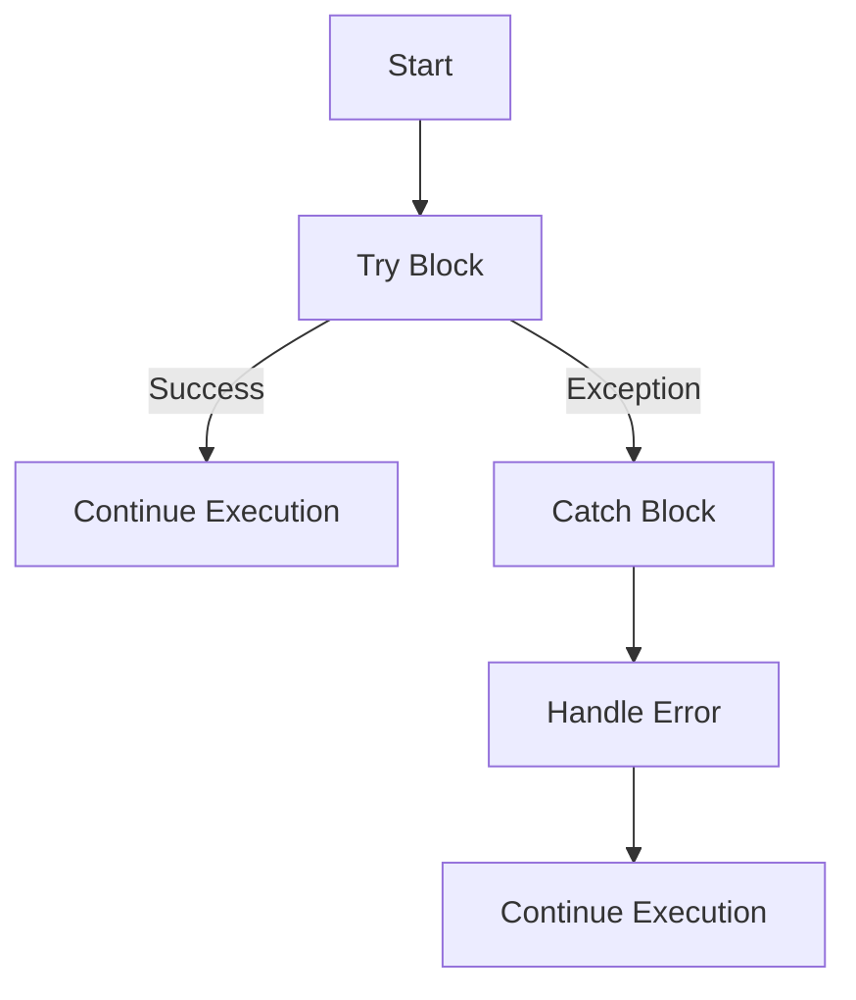

## 9.1 Error Handling Strategies in Clojure

As experienced Java developers, you're likely familiar with Java's robust exception handling mechanisms, which include `try`, `catch`, `finally`, and `throw`. Transitioning to Clojure, a functional programming language, requires a shift in mindset, especially when it comes to handling errors. In this section, we'll explore how Clojure approaches error handling, leveraging its functional nature while maintaining interoperability with Java.

### Understanding Exception Handling in Clojure

Clojure, being a hosted language on the Java Virtual Machine (JVM), inherits Java's exception handling capabilities. However, Clojure's functional paradigm encourages a different approach to error management, focusing on immutability and pure functions. Let's delve into the key concepts and strategies for handling errors in Clojure.

#### Using `try`, `catch`, and `throw` in Clojure

Clojure provides constructs similar to Java for handling exceptions: `try`, `catch`, and `throw`. These constructs allow you to manage errors gracefully and ensure your code remains robust and maintainable.

**Example: Basic Error Handling in Clojure**

```clojure
(defn divide [numerator denominator]
  (try
    (/ numerator denominator)
    (catch ArithmeticException e
      (println "Cannot divide by zero!")
      nil)))

;; Usage
(divide 10 2)  ; => 5
(divide 10 0)  ; => "Cannot divide by zero!" and returns nil
```

In this example, we define a simple division function that handles division by zero using `try` and `catch`. When an `ArithmeticException` is thrown, the `catch` block executes, printing an error message and returning `nil`.

#### Comparing Java and Clojure Error Handling

Let's compare the error handling mechanisms in Java and Clojure to highlight the differences and similarities.

**Java Example:**

```java
public class Division {
    public static Double divide(double numerator, double denominator) {
        try {
            return numerator / denominator;
        } catch (ArithmeticException e) {
            System.out.println("Cannot divide by zero!");
            return null;
        }
    }
}
```

**Clojure Example:**

```clojure
(defn divide [numerator denominator]
  (try
    (/ numerator denominator)
    (catch ArithmeticException e
      (println "Cannot divide by zero!")
      nil)))
```

In both examples, the logic is similar, but Clojure's syntax is more concise and expressive. Clojure's functional nature encourages handling errors in a way that minimizes side effects and maintains immutability.

### Advanced Error Handling Techniques

While `try`, `catch`, and `throw` are fundamental, Clojure offers additional techniques and idioms for managing errors effectively.

#### Leveraging `ex-info` for Rich Error Information

Clojure's `ex-info` function allows you to create exceptions with additional context, providing more information about the error. This is particularly useful for debugging and logging.

**Example: Using `ex-info`**

```clojure
(defn process-data [data]
  (if (valid? data)
    (do-something data)
    (throw (ex-info "Invalid data" {:data data}))))

;; Usage
(try
  (process-data nil)
  (catch Exception e
    (println "Error:" (.getMessage e))
    (println "Data:" (:data (ex-data e)))))
```

In this example, `ex-info` creates an exception with a message and a map containing additional data. The `ex-data` function retrieves this data in the `catch` block, allowing for more detailed error handling.

#### Functional Error Handling with `either` and `maybe`

Clojure's functional paradigm encourages using data structures to represent success and failure, avoiding exceptions where possible. Libraries like `cats` provide monadic structures such as `either` and `maybe` for functional error handling.

**Example: Using `either` for Error Handling**

```clojure
(require '[cats.monad.either :as either])

(defn safe-divide [numerator denominator]
  (if (zero? denominator)
    (either/left "Cannot divide by zero")
    (either/right (/ numerator denominator))))

;; Usage
(let [result (safe-divide 10 0)]
  (either/branch result
    (fn [error] (println "Error:" error))
    (fn [value] (println "Result:" value))))
```

In this example, `safe-divide` returns an `either` monad, representing either an error or a successful result. The `either/branch` function handles both cases, providing a clean and functional approach to error management.

### Visualizing Error Handling Flow

To better understand how error handling works in Clojure, let's visualize the flow of data through a `try`-`catch` block using a flowchart.



**Figure 1:** Flowchart illustrating the error handling process in Clojure using `try` and `catch`.

### Best Practices for Error Handling in Clojure

To ensure effective error management in your Clojure applications, consider the following best practices:

- **Use Pure Functions:** Strive to write pure functions that do not throw exceptions. Instead, return data structures representing success or failure.
- **Leverage `ex-info`:** Use `ex-info` to provide rich error information and context, aiding in debugging and logging.
- **Adopt Functional Idioms:** Explore functional error handling techniques, such as using `either` and `maybe` monads, to represent errors as data.
- **Minimize Side Effects:** Avoid side effects in error handling logic to maintain the purity and predictability of your functions.
- **Document Error Handling:** Clearly document the error handling strategy and expected behavior of your functions, making it easier for others to understand and maintain your code.

### References and Further Reading

- [Official Clojure Documentation on Exception Handling](https://clojure.org/reference/reader#_exceptions)
- [ClojureDocs: Exception Handling Examples](https://clojuredocs.org/clojure.core/try)
- [Cats Library for Functional Programming in Clojure](https://github.com/funcool/cats)

### Knowledge Check

Let's reinforce your understanding of error handling in Clojure with a few questions and exercises.

1. **What is the purpose of `ex-info` in Clojure?**
2. **How does Clojure's error handling differ from Java's?**
3. **Try modifying the `safe-divide` function to handle negative denominators as well.**

### Summary

In this section, we've explored the error handling strategies in Clojure, focusing on the use of `try`, `catch`, and `throw`. We've also introduced advanced techniques such as `ex-info` and functional error handling with monads. By adopting these strategies, you can write robust and maintainable Clojure code that gracefully handles errors.

Now that we've covered error handling, let's continue our journey into Clojure's concurrency models in the next section.

## **Quiz: Are You Ready to Migrate from Java to Clojure?**



### What is the primary purpose of `ex-info` in Clojure?

- [x] To create exceptions with additional context
- [ ] To handle concurrency issues
- [ ] To optimize performance
- [ ] To manage state

> **Explanation:** `ex-info` is used to create exceptions with additional context, providing more information about the error.

### How does Clojure's error handling differ from Java's?

- [x] Clojure encourages functional error handling with data structures
- [ ] Clojure uses `finally` blocks extensively
- [ ] Clojure does not support `try` and `catch`
- [ ] Clojure relies on checked exceptions

> **Explanation:** Clojure encourages functional error handling using data structures like `either` and `maybe`, unlike Java's traditional exception handling.

### Which function retrieves additional data from an `ex-info` exception?

- [x] `ex-data`
- [ ] `ex-info`
- [ ] `ex-message`
- [ ] `ex-context`

> **Explanation:** `ex-data` retrieves additional data from an `ex-info` exception.

### What is a key benefit of using pure functions for error handling?

- [x] They minimize side effects
- [ ] They increase code verbosity
- [ ] They require more memory
- [ ] They are slower to execute

> **Explanation:** Pure functions minimize side effects, making code more predictable and easier to maintain.

### Which library provides monadic structures for functional error handling in Clojure?

- [x] Cats
- [ ] Ring
- [ ] Compojure
- [ ] Luminus

> **Explanation:** The Cats library provides monadic structures like `either` and `maybe` for functional error handling.

### What does the `either/branch` function do?

- [x] It handles both success and error cases in an `either` monad
- [ ] It creates an `either` monad
- [ ] It throws an exception
- [ ] It logs errors

> **Explanation:** `either/branch` handles both success and error cases in an `either` monad, providing a clean way to manage errors.

### How can you represent errors as data in Clojure?

- [x] Using monads like `either` and `maybe`
- [ ] Using `finally` blocks
- [ ] Using `try` and `catch` exclusively
- [ ] Using `println` statements

> **Explanation:** Monads like `either` and `maybe` allow you to represent errors as data, aligning with Clojure's functional paradigm.

### What is a common practice to maintain code purity in error handling?

- [x] Avoid side effects
- [ ] Use global variables
- [ ] Rely on mutable state
- [ ] Use `println` for debugging

> **Explanation:** Avoiding side effects helps maintain code purity, ensuring functions remain predictable and easy to test.

### What should you document in your error handling strategy?

- [x] Expected behavior and error handling logic
- [ ] Only the success cases
- [ ] The number of exceptions thrown
- [ ] The performance metrics

> **Explanation:** Documenting expected behavior and error handling logic makes it easier for others to understand and maintain your code.

### True or False: Clojure's `try` and `catch` are identical to Java's in functionality.

- [ ] True
- [x] False

> **Explanation:** While Clojure's `try` and `catch` are similar to Java's, Clojure's functional paradigm encourages different error handling approaches, such as using data structures to represent errors.


