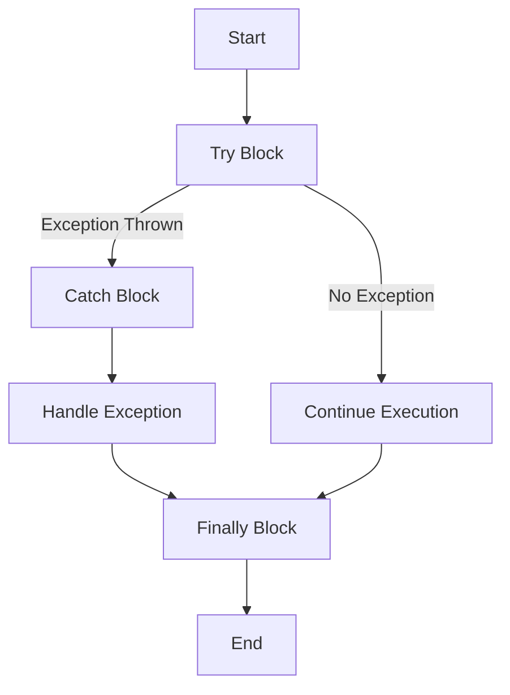

## 9.1 Error Handling Strategies in Clojure

As we transition from Java's Object-Oriented Programming (OOP) to Clojure's functional paradigm, understanding error handling is crucial for building robust applications. In this section, we'll explore how Clojure approaches error handling, drawing parallels with Java's exception management mechanisms. We'll delve into using `try`, `catch`, and `throw` effectively in Clojure, and provide practical examples to illustrate these concepts.

### Understanding Exception Handling Mechanisms

In Java, exception handling is a fundamental part of the language, allowing developers to manage errors and exceptional conditions gracefully. Java uses `try`, `catch`, and `finally` blocks to handle exceptions, providing a structured way to separate error handling code from regular code flow.

In Clojure, error handling is approached differently due to its functional nature. While Clojure also provides `try`, `catch`, and `finally` constructs, the emphasis is on immutability and pure functions. This requires a shift in mindset from Java's imperative style to Clojure's declarative style.

#### Java's Exception Handling

Let's briefly review Java's exception handling to set the stage for understanding Clojure's approach. In Java, you typically use `try`, `catch`, and `finally` blocks as follows:

```java
try {
    // Code that may throw an exception
    int result = divide(10, 0);
} catch (ArithmeticException e) {
    // Handle the exception
    System.out.println("Cannot divide by zero.");
} finally {
    // Code that will always execute
    System.out.println("Execution completed.");
}
```

In this example, the `try` block contains code that might throw an exception. The `catch` block handles specific exceptions, and the `finally` block executes regardless of whether an exception was thrown.

#### Clojure's Error Handling

Clojure's error handling is similar in syntax but different in philosophy. Clojure encourages handling errors in a way that aligns with functional programming principles. Here's a basic example of error handling in Clojure:

```clojure
(try
  ;; Code that may throw an exception
  (/ 10 0)
  (catch ArithmeticException e
    ;; Handle the exception
    (println "Cannot divide by zero."))
  (finally
    ;; Code that will always execute
    (println "Execution completed.")))
```

In this Clojure example, we use `try`, `catch`, and `finally` in a similar manner to Java. However, Clojure's emphasis on immutability and pure functions often leads to different error handling strategies, such as using error values or monads like `Either` or `Maybe`.

### Using `try`, `catch`, and `throw` Effectively

Let's explore how to use `try`, `catch`, and `throw` effectively in Clojure, and how these constructs differ from their Java counterparts.

#### The `try` Block

In Clojure, the `try` block is used to wrap code that might throw an exception. The syntax is straightforward:

```clojure
(try
  ;; Code that may throw an exception
  (/ 10 0)
  (catch ArithmeticException e
    ;; Handle the exception
    (println "Cannot divide by zero.")))
```

The `try` block evaluates the expressions within it. If an exception occurs, Clojure looks for a matching `catch` block to handle the exception.

#### The `catch` Block

The `catch` block in Clojure is used to handle specific exceptions. You can have multiple `catch` blocks to handle different types of exceptions:

```clojure
(try
  ;; Code that may throw an exception
  (/ 10 0)
  (catch ArithmeticException e
    ;; Handle ArithmeticException
    (println "Cannot divide by zero."))
  (catch Exception e
    ;; Handle any other exceptions
    (println "An error occurred:" (.getMessage e))))
```

In this example, the first `catch` block handles `ArithmeticException`, while the second `catch` block handles any other exceptions.

#### The `finally` Block

The `finally` block in Clojure is optional and is used to execute code regardless of whether an exception was thrown. It's useful for cleanup tasks:

```clojure
(try
  ;; Code that may throw an exception
  (/ 10 0)
  (catch ArithmeticException e
    ;; Handle the exception
    (println "Cannot divide by zero."))
  (finally
    ;; Code that will always execute
    (println "Execution completed.")))
```

The `finally` block is executed after the `try` and `catch` blocks, making it ideal for releasing resources or performing cleanup operations.

#### Throwing Exceptions with `throw`

In Clojure, you can throw exceptions using the `throw` function. This is similar to Java's `throw` statement:

```clojure
(throw (Exception. "An error occurred"))
```

You can use `throw` within a `try` block to signal an error condition:

```clojure
(try
  (throw (Exception. "An error occurred"))
  (catch Exception e
    (println "Caught exception:" (.getMessage e))))
```

### Error Handling Strategies in Clojure

While Clojure provides constructs similar to Java for error handling, the functional programming paradigm encourages different strategies. Let's explore some common error handling strategies in Clojure.

#### Using Error Values

One approach to error handling in Clojure is to use error values instead of exceptions. This involves returning a value that indicates an error condition, allowing the caller to handle the error gracefully.

For example, you might return `nil` or a special error value to indicate an error:

```clojure
(defn safe-divide [numerator denominator]
  (if (zero? denominator)
    nil
    (/ numerator denominator)))

(let [result (safe-divide 10 0)]
  (if result
    (println "Result:" result)
    (println "Cannot divide by zero.")))
```

In this example, `safe-divide` returns `nil` if the denominator is zero, allowing the caller to check for the error condition.

#### Using Monads for Error Handling

Clojure's functional programming paradigm encourages the use of monads for error handling. Monads like `Either` or `Maybe` can encapsulate error conditions and provide a way to compose functions that may fail.

While Clojure doesn't have built-in monads, libraries like `cats` provide monadic constructs. Here's an example using the `cats` library:

```clojure
(require '[cats.monad.either :as either])

(defn safe-divide [numerator denominator]
  (if (zero? denominator)
    (either/left "Cannot divide by zero.")
    (either/right (/ numerator denominator))))

(let [result (safe-divide 10 0)]
  (either/branch result
    (fn [error] (println "Error:" error))
    (fn [value] (println "Result:" value))))
```

In this example, `safe-divide` returns an `Either` monad, allowing the caller to handle the error or success case using `either/branch`.

#### Leveraging `ex-info` for Rich Error Information

Clojure provides the `ex-info` function to create exceptions with additional context. This allows you to attach metadata to exceptions, providing more information about the error condition.

Here's an example of using `ex-info`:

```clojure
(defn divide [numerator denominator]
  (if (zero? denominator)
    (throw (ex-info "Cannot divide by zero." {:numerator numerator :denominator denominator}))
    (/ numerator denominator)))

(try
  (divide 10 0)
  (catch Exception e
    (println "Caught exception:" (.getMessage e))
    (println "Exception data:" (ex-data e))))
```

In this example, `ex-info` is used to create an exception with additional data, which can be retrieved using `ex-data`.

### Visualizing Error Handling in Clojure

To better understand how error handling works in Clojure, let's visualize the flow of error handling using a flowchart.



**Figure 1:** Error Handling Flow in Clojure

This flowchart illustrates the flow of execution in a Clojure error handling scenario. The `try` block is executed first. If no exception is thrown, execution continues normally. If an exception is thrown, the appropriate `catch` block handles the exception. The `finally` block is executed regardless of whether an exception was thrown.

### References and Further Reading

For more information on Clojure's error handling mechanisms, consider exploring the following resources:

- [Clojure Official Documentation](https://clojure.org/reference)
- [Clojure Error Handling Guide](https://clojure.org/guides/error_handling)
- [Functional Programming with Clojure](https://www.lispcast.com/functional-programming-with-clojure)
- [Clojure Community Resources](https://clojure.org/community/resources)

### Knowledge Check

To reinforce your understanding of error handling in Clojure, consider the following questions:

1. How does Clojure's error handling differ from Java's exception handling?
2. What are some common strategies for handling errors in Clojure?
3. How can you use `ex-info` to provide additional context for exceptions?
4. What are the benefits of using monads for error handling in Clojure?

### Exercises

1. Modify the `safe-divide` function to return a custom error message instead of `nil`.
2. Implement a function that uses `ex-info` to throw an exception with metadata, and write a `try-catch` block to handle it.
3. Explore the `cats` library and implement a function that uses the `Either` monad for error handling.

### Summary

In this section, we've explored error handling strategies in Clojure, focusing on using `try`, `catch`, and `throw` effectively. We've compared Clojure's approach to Java's exception handling and discussed strategies like using error values, monads, and `ex-info` for rich error information. By understanding these concepts, you'll be better equipped to handle errors gracefully in your Clojure applications.

## **Quiz: Are You Ready to Migrate from Java to Clojure?**



### How does Clojure's error handling differ from Java's?

- [x] Clojure emphasizes immutability and functional programming principles.
- [ ] Clojure uses `try`, `catch`, and `finally` blocks exclusively.
- [ ] Clojure does not support error handling.
- [ ] Clojure requires all exceptions to be caught.

> **Explanation:** Clojure's error handling aligns with functional programming principles, emphasizing immutability and pure functions.

### What is a common strategy for handling errors in Clojure?

- [x] Using error values instead of exceptions.
- [ ] Ignoring errors and proceeding with execution.
- [ ] Throwing exceptions for all errors.
- [ ] Using global variables to track errors.

> **Explanation:** Clojure often uses error values to indicate error conditions, allowing for graceful handling.

### How can you provide additional context for exceptions in Clojure?

- [x] Using `ex-info` to attach metadata to exceptions.
- [ ] Using global variables to store error information.
- [ ] Using `println` to log errors.
- [ ] Using `try` blocks to encapsulate error context.

> **Explanation:** `ex-info` allows you to attach metadata to exceptions, providing additional context.

### What is the benefit of using monads for error handling in Clojure?

- [x] Monads encapsulate error conditions and allow function composition.
- [ ] Monads eliminate the need for error handling.
- [ ] Monads are only used for logging errors.
- [ ] Monads replace the need for `try` blocks.

> **Explanation:** Monads like `Either` encapsulate error conditions and enable function composition, aligning with functional programming.

### Which library provides monadic constructs for Clojure?

- [x] `cats`
- [ ] `core.async`
- [ ] `clojure.set`
- [ ] `clojure.java.io`

> **Explanation:** The `cats` library provides monadic constructs for Clojure, including `Either` and `Maybe`.

### What does the `finally` block do in Clojure?

- [x] Executes code regardless of whether an exception was thrown.
- [ ] Handles exceptions that were not caught.
- [ ] Logs error messages.
- [ ] Terminates the program.

> **Explanation:** The `finally` block executes code regardless of whether an exception was thrown, useful for cleanup tasks.

### How can you handle multiple exception types in Clojure?

- [x] Use multiple `catch` blocks for different exception types.
- [ ] Use a single `catch` block for all exceptions.
- [ ] Use `finally` blocks to handle exceptions.
- [ ] Use global error handlers.

> **Explanation:** You can use multiple `catch` blocks to handle different exception types in Clojure.

### What is the purpose of the `throw` function in Clojure?

- [x] To signal an error condition by throwing an exception.
- [ ] To catch exceptions.
- [ ] To log error messages.
- [ ] To execute code unconditionally.

> **Explanation:** The `throw` function is used to signal an error condition by throwing an exception.

### How can you test error handling in Clojure?

- [x] Use `try-catch` blocks to simulate error conditions.
- [ ] Use `println` to log errors.
- [ ] Use global variables to track errors.
- [ ] Use `finally` blocks to handle errors.

> **Explanation:** You can use `try-catch` blocks to simulate and test error handling in Clojure.

### True or False: Clojure's error handling is identical to Java's.

- [ ] True
- [x] False

> **Explanation:** Clojure's error handling is not identical to Java's; it aligns with functional programming principles and emphasizes immutability.


