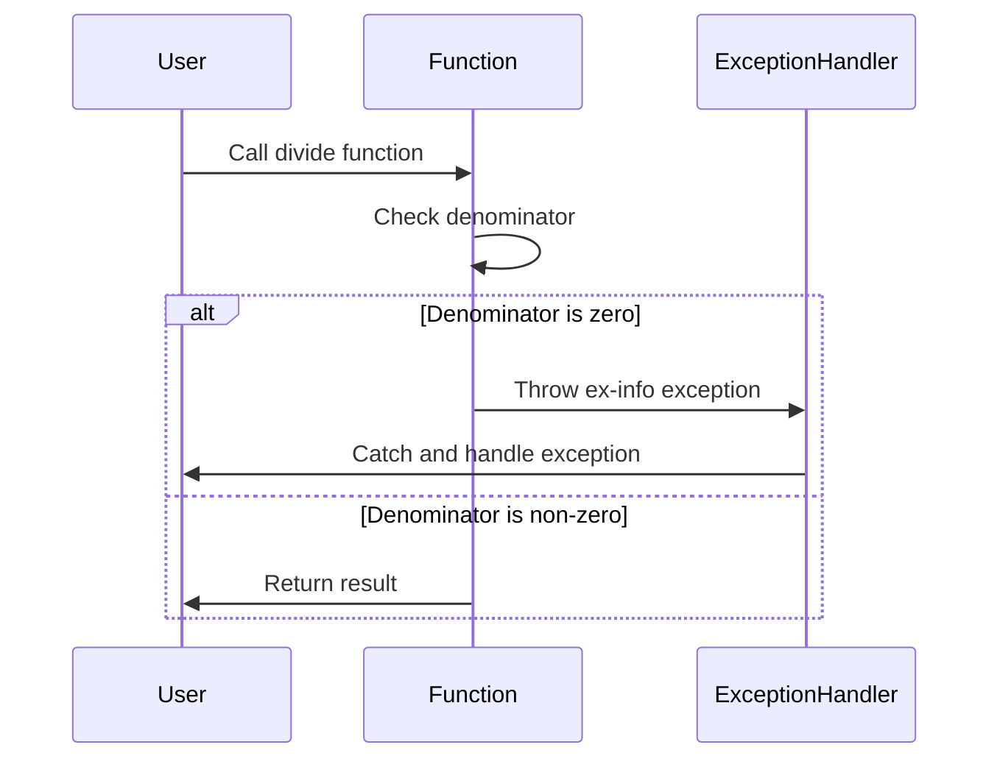

## 9.2 Leveraging `ex-info` and Custom Exceptions in Clojure for Effective Error Handling

As you transition from Java's object-oriented programming (OOP) paradigm to Clojure's functional programming model, understanding how to handle exceptions effectively is crucial. In Java, exceptions are a fundamental part of error handling, with a rich hierarchy of exception classes that developers can extend to create custom exceptions. Clojure, being a functional language, approaches error handling differently, offering tools like `ex-info` to create informative error messages and manage exceptions in a way that aligns with functional programming principles.

In this section, we will explore how to leverage `ex-info` and custom exceptions in Clojure to enhance error handling in your applications. We will draw parallels between Java's exception handling mechanisms and Clojure's approach, providing you with a comprehensive understanding of how to manage errors effectively in a functional programming context.

### Creating Informative Error Messages with `ex-info`

In Clojure, the `ex-info` function is a powerful tool for creating exceptions that carry additional context. Unlike Java, where exceptions are typically represented by classes, Clojure uses data to represent exceptions, allowing you to attach arbitrary metadata to an exception. This metadata can include information such as the function name, input parameters, or any other relevant data that can help diagnose the issue.

#### Understanding `ex-info`

The `ex-info` function creates an instance of `clojure.lang.ExceptionInfo`, which is a subclass of `java.lang.RuntimeException`. This allows you to throw exceptions with additional context, making it easier to understand the cause of the error.

Here's the basic syntax of `ex-info`:

```clojure
(ex-info "Error message" {:key1 "value1" :key2 "value2"})
```

- **Error message**: A string describing the error.
- **Data map**: A map containing additional context about the error.

#### Example: Using `ex-info` in Clojure

Let's consider a simple example where we use `ex-info` to handle an error in a function that divides two numbers:

```clojure
(defn divide [numerator denominator]
  (if (zero? denominator)
    (throw (ex-info "Division by zero" {:numerator numerator :denominator denominator}))
    (/ numerator denominator)))

;; Usage
(try
  (divide 10 0)
  (catch Exception e
    (println "Caught exception:" (.getMessage e))
    (println "Exception data:" (ex-data e))))
```

In this example, we define a `divide` function that throws an exception using `ex-info` if the denominator is zero. The exception includes a message and a data map with the numerator and denominator values. In the `try-catch` block, we catch the exception and print the message and data.

#### Benefits of Using `ex-info`

- **Rich Context**: By attaching metadata to exceptions, you can provide more context about the error, making it easier to diagnose and fix issues.
- **Flexibility**: You can include any data in the metadata map, allowing you to tailor the information to your specific needs.
- **Integration with Java**: Since `ExceptionInfo` is a subclass of `RuntimeException`, it integrates seamlessly with Java's exception handling mechanisms.

### Defining and Using Custom Exception Types

While `ex-info` provides a flexible way to create exceptions with additional context, there are scenarios where you might want to define custom exception types. In Java, custom exceptions are typically created by extending the `Exception` class. In Clojure, you can achieve similar functionality by defining custom exception types using `deftype` or `defrecord`.

#### Creating Custom Exceptions with `deftype`

The `deftype` construct in Clojure allows you to define new types, which can be used to create custom exceptions. Here's an example of how to define a custom exception type:

```clojure
(deftype CustomException [message data]
  clojure.lang.IExceptionInfo
  (getMessage [this] message)
  (getData [this] data))

(defn throw-custom-exception []
  (throw (CustomException. "Custom error" {:info "Additional data"})))

;; Usage
(try
  (throw-custom-exception)
  (catch CustomException e
    (println "Caught custom exception:" (.getMessage e))
    (println "Exception data:" (.getData e))))
```

In this example, we define a `CustomException` type that implements the `IExceptionInfo` interface, providing methods to retrieve the message and data. We then define a function `throw-custom-exception` that throws an instance of `CustomException`.

#### Creating Custom Exceptions with `defrecord`

Alternatively, you can use `defrecord` to define custom exception types. `defrecord` is similar to `deftype` but provides additional features, such as automatic implementation of `clojure.lang.IRecord` and `clojure.lang.ILookup`.

```clojure
(defrecord CustomRecordException [message data]
  clojure.lang.IExceptionInfo
  (getMessage [this] message)
  (getData [this] data))

(defn throw-record-exception []
  (throw (->CustomRecordException "Record error" {:info "More data"})))

;; Usage
(try
  (throw-record-exception)
  (catch CustomRecordException e
    (println "Caught record exception:" (.getMessage e))
    (println "Exception data:" (.getData e))))
```

In this example, we define a `CustomRecordException` using `defrecord`, which provides similar functionality to `deftype` but with additional features.

### Comparing Java and Clojure Exception Handling

Java's exception handling model is based on a hierarchy of exception classes, with checked and unchecked exceptions. Clojure, on the other hand, uses a more flexible approach that emphasizes data over class hierarchies. This aligns with Clojure's functional programming principles, where data is often preferred over complex object hierarchies.

#### Key Differences

- **Class Hierarchy vs. Data**: Java relies on a class hierarchy for exceptions, while Clojure uses data to represent exceptions, allowing for more flexibility and context.
- **Checked vs. Unchecked**: Java distinguishes between checked and unchecked exceptions, whereas Clojure primarily uses unchecked exceptions, simplifying error handling.
- **Custom Exceptions**: In Java, custom exceptions are created by extending the `Exception` class. In Clojure, you can use `deftype` or `defrecord` to define custom exception types.

### Best Practices for Exception Handling in Clojure

1. **Use `ex-info` for Contextual Information**: Leverage `ex-info` to attach metadata to exceptions, providing additional context that can aid in debugging and error resolution.

2. **Define Custom Exceptions When Necessary**: Use `deftype` or `defrecord` to define custom exceptions when you need to represent specific error conditions that are not covered by standard exceptions.

3. **Catch Specific Exceptions**: Use `catch` blocks to handle specific exceptions, allowing you to provide targeted error handling logic.

4. **Log Exceptions**: Ensure that exceptions are logged with sufficient detail to facilitate troubleshooting and root cause analysis.

5. **Avoid Overusing Exceptions**: Use exceptions for exceptional conditions, not for regular control flow. This aligns with functional programming principles and helps maintain clean and efficient code.

### Visualizing Exception Handling Flow

To better understand the flow of exception handling in Clojure, let's visualize the process using a sequence diagram:



**Diagram Description**: This sequence diagram illustrates the flow of exception handling in the `divide` function. When the function is called, it checks the denominator. If the denominator is zero, an `ex-info` exception is thrown and caught by the exception handler, which then handles the exception. If the denominator is non-zero, the function returns the result.

### References and Further Reading

- [Clojure Official Documentation](https://clojure.org/reference)
- [Clojure Community Resources](https://clojure.org/community/resources)
- [Transitioning from OOP to Functional Programming](https://www.lispcast.com/oo-to-fp/)
- [Clojure Exception Handling Guide](https://clojure.org/guides/exception_handling)

### Knowledge Check

To reinforce your understanding of leveraging `ex-info` and custom exceptions in Clojure, consider the following questions:

1. What is the primary purpose of the `ex-info` function in Clojure?
2. How does Clojure's approach to exception handling differ from Java's?
3. When should you define custom exception types in Clojure?
4. What are the benefits of attaching metadata to exceptions using `ex-info`?
5. How can you visualize the flow of exception handling in a Clojure application?

### Exercises

1. Modify the `divide` function to include additional metadata in the `ex-info` exception, such as the function name and timestamp.
2. Define a custom exception type using `defrecord` for handling invalid user input in a Clojure application.
3. Create a Clojure function that simulates a network request and throws an `ex-info` exception if the request fails. Include metadata such as the URL and response code.

### Summary

In this section, we've explored how to leverage `ex-info` and custom exceptions in Clojure to create informative error messages and manage errors effectively. By understanding the differences between Java's and Clojure's exception handling models, you can transition smoothly to Clojure's functional programming paradigm and enhance the robustness of your applications.

## **Quiz: Are You Ready to Migrate from Java to Clojure?**



### What is the primary purpose of the `ex-info` function in Clojure?

- [x] To create exceptions with additional context
- [ ] To define custom exception types
- [ ] To handle exceptions automatically
- [ ] To log exceptions to a file

> **Explanation:** The `ex-info` function is used to create exceptions with additional context by attaching metadata to the exception.

### How does Clojure's approach to exception handling differ from Java's?

- [x] Clojure uses data to represent exceptions, while Java uses a class hierarchy
- [ ] Clojure has checked exceptions, while Java does not
- [ ] Clojure requires all exceptions to be caught, while Java does not
- [ ] Clojure does not support custom exceptions

> **Explanation:** Clojure uses data to represent exceptions, allowing for more flexibility and context, whereas Java relies on a class hierarchy.

### When should you define custom exception types in Clojure?

- [x] When you need to represent specific error conditions not covered by standard exceptions
- [ ] When you want to log exceptions to a database
- [ ] When you need to handle exceptions automatically
- [ ] When you want to avoid using `ex-info`

> **Explanation:** Custom exception types should be defined when you need to represent specific error conditions that are not covered by standard exceptions.

### What are the benefits of attaching metadata to exceptions using `ex-info`?

- [x] Provides additional context for debugging
- [x] Allows for more informative error messages
- [ ] Automatically resolves exceptions
- [ ] Prevents exceptions from occurring

> **Explanation:** Attaching metadata to exceptions using `ex-info` provides additional context for debugging and allows for more informative error messages.

### How can you visualize the flow of exception handling in a Clojure application?

- [x] Using sequence diagrams
- [ ] Using class diagrams
- [ ] Using state diagrams
- [ ] Using activity diagrams

> **Explanation:** Sequence diagrams can be used to visualize the flow of exception handling in a Clojure application.

### What is the role of the `catch` block in Clojure's exception handling?

- [x] To handle specific exceptions
- [ ] To throw exceptions
- [ ] To log exceptions
- [ ] To prevent exceptions

> **Explanation:** The `catch` block is used to handle specific exceptions in Clojure's exception handling.

### Which construct can be used to define custom exception types in Clojure?

- [x] `deftype`
- [x] `defrecord`
- [ ] `defclass`
- [ ] `defexception`

> **Explanation:** Both `deftype` and `defrecord` can be used to define custom exception types in Clojure.

### What is a key difference between checked and unchecked exceptions?

- [x] Checked exceptions must be declared or caught, while unchecked exceptions do not
- [ ] Unchecked exceptions must be declared or caught, while checked exceptions do not
- [ ] Both must be declared or caught
- [ ] Neither must be declared or caught

> **Explanation:** Checked exceptions must be declared or caught, while unchecked exceptions do not have this requirement.

### What is the benefit of using `defrecord` over `deftype` for custom exceptions?

- [x] Provides additional features like automatic implementation of `ILookup`
- [ ] Simplifies exception handling
- [ ] Prevents exceptions from occurring
- [ ] Automatically logs exceptions

> **Explanation:** `defrecord` provides additional features like automatic implementation of `ILookup`, which can be beneficial for custom exceptions.

### True or False: Clojure's `ex-info` function can only be used for runtime exceptions.

- [x] True
- [ ] False

> **Explanation:** Clojure's `ex-info` function creates instances of `clojure.lang.ExceptionInfo`, which is a subclass of `java.lang.RuntimeException`.



By mastering the use of `ex-info` and custom exceptions, you can enhance the robustness and maintainability of your Clojure applications, making your transition from Java OOP to functional programming smoother and more effective. Embrace the power of functional programming and take your error handling to the next level with Clojure!
