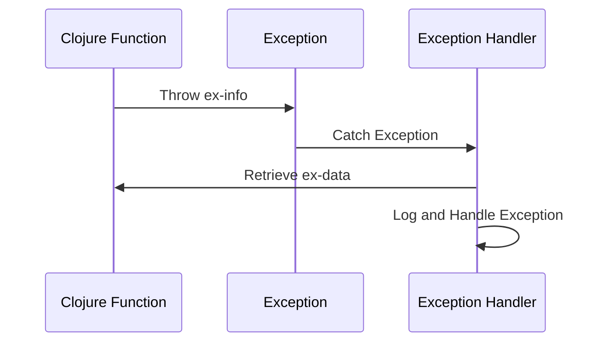

## 9.2 Leveraging `ex-info` and Custom Exceptions

As experienced Java developers, you're familiar with the robust exception handling mechanisms in Java, which allow you to create custom exceptions and provide detailed error messages. In Clojure, while the approach to error handling is different due to its functional nature, it offers powerful tools like `ex-info` to create informative error messages and define custom exception types. This section will guide you through leveraging `ex-info` and custom exceptions in Clojure, enhancing your error management capabilities.

### Understanding `ex-info` in Clojure

Clojure's `ex-info` function is a versatile tool for creating exceptions with additional context. Unlike Java, where exceptions are typically classes that extend `Exception`, Clojure uses data-driven exceptions. This approach aligns with Clojure's philosophy of treating data as a first-class citizen.

#### Creating Informative Error Messages with `ex-info`

The `ex-info` function allows you to attach a map of additional data to an exception, providing more context about the error. This is particularly useful in complex systems where understanding the state of the application at the time of the error is crucial.

Here's a basic example of using `ex-info`:

```clojure
;; Define a function that throws an exception with additional context
(defn divide [numerator denominator]
  (if (zero? denominator)
    (throw (ex-info "Division by zero error"
                    {:numerator numerator
                     :denominator denominator}))
    (/ numerator denominator)))

;; Example usage
(try
  (divide 10 0)
  (catch Exception e
    (println "Caught exception:" (.getMessage e))
    (println "Exception data:" (ex-data e))))
```

In this example, the `divide` function throws an exception if the denominator is zero. The `ex-info` function is used to create an exception with a message and a map containing the numerator and denominator. The `ex-data` function retrieves this map when the exception is caught, allowing you to access the additional context.

#### Comparing with Java Exception Handling

In Java, you might define a custom exception class to achieve similar functionality:

```java
// Define a custom exception class
public class DivisionByZeroException extends Exception {
    private final int numerator;
    private final int denominator;

    public DivisionByZeroException(String message, int numerator, int denominator) {
        super(message);
        this.numerator = numerator;
        this.denominator = denominator;
    }

    public int getNumerator() {
        return numerator;
    }

    public int getDenominator() {
        return denominator;
    }
}

// Example usage
try {
    throw new DivisionByZeroException("Division by zero error", 10, 0);
} catch (DivisionByZeroException e) {
    System.out.println("Caught exception: " + e.getMessage());
    System.out.println("Numerator: " + e.getNumerator());
    System.out.println("Denominator: " + e.getDenominator());
}
```

While Java requires defining a new class to add context to an exception, Clojure's `ex-info` allows you to achieve this with less boilerplate, focusing on the data rather than the class hierarchy.

### Defining and Using Custom Exception Types

In Clojure, while you can use `ex-info` for most error handling needs, there are scenarios where defining custom exception types might be beneficial, especially when interoperating with Java code or when specific exception types are required by a library or framework.

#### Creating Custom Exception Types

To define a custom exception type in Clojure, you can extend Java's `Exception` class. Here's how you can create a custom exception:

```clojure
;; Define a custom exception type
(deftype CustomException [message data]
  Exception
  (getMessage [this] message)
  clojure.lang.IExceptionInfo
  (getData [this] data))

;; Example usage
(try
  (throw (->CustomException "Custom error occurred" {:info "Additional data"}))
  (catch CustomException e
    (println "Caught custom exception:" (.getMessage e))
    (println "Exception data:" (.getData e))))
```

In this example, `CustomException` is a new type that implements the `Exception` interface and the `IExceptionInfo` protocol, allowing it to carry additional data similar to `ex-info`.

#### When to Use Custom Exceptions

Custom exceptions in Clojure are typically used when:

- Interoperating with Java code that expects specific exception types.
- Implementing libraries or APIs where specific exception types are part of the contract.
- Providing more semantic meaning to exceptions in a domain-specific context.

### Best Practices for Exception Handling in Clojure

When handling exceptions in Clojure, consider the following best practices:

- **Use `ex-info` for Rich Context**: Leverage `ex-info` to provide detailed context with your exceptions. This approach is idiomatic in Clojure and aligns with its data-centric philosophy.
- **Limit the Use of Custom Exception Types**: Define custom exception types only when necessary, such as when interoperating with Java or when specific exception types are required by a library.
- **Catch Specific Exceptions**: Use `catch` to handle specific exceptions when possible, providing more precise error handling.
- **Log and Monitor Exceptions**: Ensure that exceptions are logged and monitored, especially in production systems, to facilitate debugging and improve system reliability.

### Visualizing Exception Flow with Mermaid.js

To better understand how exceptions flow in a Clojure application, let's visualize the process using a Mermaid.js sequence diagram:



**Diagram Description**: This sequence diagram illustrates the flow of an exception in a Clojure application. The function throws an exception using `ex-info`, which is caught by an exception handler. The handler retrieves the additional data using `ex-data` and logs or handles the exception accordingly.

### Try It Yourself: Experimenting with `ex-info`

To deepen your understanding, try modifying the `divide` function example:

- **Add More Context**: Include additional keys in the `ex-info` map, such as a timestamp or user ID.
- **Handle Multiple Exceptions**: Extend the example to handle different types of exceptions, such as `ArithmeticException`.
- **Integrate with Java**: Create a Java class that calls the Clojure `divide` function and handles the exception.

### References and Further Reading

- [Official Clojure Documentation on `ex-info`](https://clojure.org/reference/exceptions)
- [ClojureDocs: `ex-info`](https://clojuredocs.org/clojure.core/ex-info)
- [Effective Exception Handling in Clojure](https://www.braveclojure.com/error-handling/)

### Knowledge Check

Before moving on, let's reinforce what we've learned with a few questions:

- What is the primary advantage of using `ex-info` in Clojure?
- How does Clojure's approach to exceptions differ from Java's?
- When should you define custom exception types in Clojure?

### Summary

In this section, we've explored how to leverage `ex-info` and custom exceptions in Clojure to create informative error messages and manage exceptions effectively. By understanding these concepts, you can enhance the robustness and maintainability of your Clojure applications, especially when transitioning from Java.

## **Quiz: Are You Ready to Migrate from Java to Clojure?**



### What is the primary advantage of using `ex-info` in Clojure?

- [x] It allows attaching additional context to exceptions using a map.
- [ ] It automatically logs exceptions to a file.
- [ ] It provides a graphical interface for debugging.
- [ ] It integrates with Java's exception handling seamlessly.

> **Explanation:** `ex-info` allows attaching additional context to exceptions using a map, which is a powerful feature for debugging and understanding errors.

### How does Clojure's approach to exceptions differ from Java's?

- [x] Clojure uses data-driven exceptions with `ex-info`.
- [ ] Clojure requires defining a new class for each exception.
- [ ] Clojure does not support exception handling.
- [ ] Clojure exceptions are automatically resolved.

> **Explanation:** Clojure uses data-driven exceptions with `ex-info`, focusing on attaching data to exceptions rather than defining new classes.

### When should you define custom exception types in Clojure?

- [x] When interoperating with Java code that expects specific exception types.
- [ ] When you want to avoid using `ex-info`.
- [ ] When you need to log exceptions to a database.
- [ ] When exceptions are not critical to the application.

> **Explanation:** Custom exception types are useful when interoperating with Java code or when specific exception types are required by a library.

### What function is used to retrieve additional data from an `ex-info` exception?

- [x] `ex-data`
- [ ] `ex-info`
- [ ] `ex-retrieve`
- [ ] `ex-context`

> **Explanation:** The `ex-data` function is used to retrieve additional data from an `ex-info` exception.

### Which of the following is a best practice for exception handling in Clojure?

- [x] Use `ex-info` for rich context.
- [ ] Define custom exception types for every error.
- [x] Catch specific exceptions when possible.
- [ ] Avoid logging exceptions.

> **Explanation:** Using `ex-info` for rich context and catching specific exceptions are best practices in Clojure.

### What is the purpose of the `IExceptionInfo` protocol in Clojure?

- [x] It allows custom exceptions to carry additional data.
- [ ] It logs exceptions automatically.
- [ ] It provides a graphical interface for debugging.
- [ ] It integrates with Java's exception handling seamlessly.

> **Explanation:** The `IExceptionInfo` protocol allows custom exceptions to carry additional data, similar to `ex-info`.

### How can you visualize exception flow in a Clojure application?

- [x] Using a Mermaid.js sequence diagram.
- [ ] Using a Java class diagram.
- [ ] Using a Clojure REPL.
- [ ] Using a spreadsheet.

> **Explanation:** A Mermaid.js sequence diagram can be used to visualize exception flow in a Clojure application.

### What should you do if you catch an exception in Clojure?

- [x] Log and handle the exception appropriately.
- [ ] Ignore the exception and continue execution.
- [ ] Automatically restart the application.
- [ ] Convert the exception to a warning.

> **Explanation:** Logging and handling the exception appropriately is crucial for maintaining application reliability.

### Which function is used to throw an exception in Clojure?

- [x] `throw`
- [ ] `catch`
- [ ] `raise`
- [ ] `error`

> **Explanation:** The `throw` function is used to throw an exception in Clojure.

### True or False: Clojure requires defining a new class for each exception.

- [ ] True
- [x] False

> **Explanation:** False. Clojure uses `ex-info` for data-driven exceptions, which does not require defining a new class for each exception.


