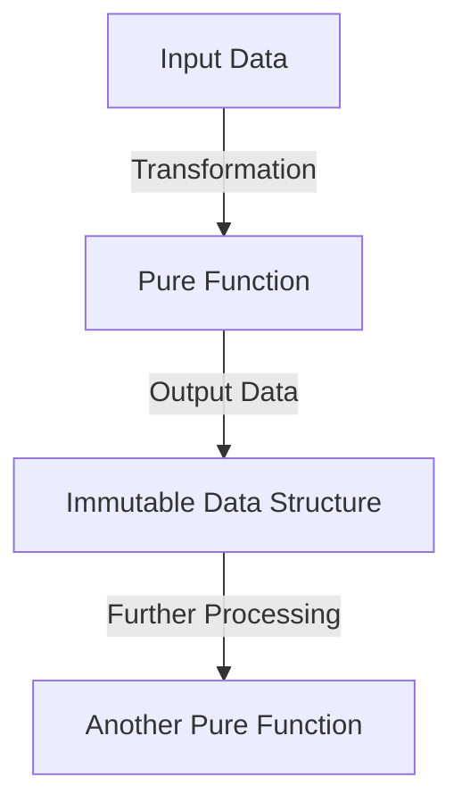

## 1.2 Benefits of Functional Programming with Clojure

In the realm of enterprise software development, where complexity and scale are constants, the choice of programming language and paradigm can significantly impact the success of a project. Clojure, a modern, dynamic, and functional dialect of Lisp on the Java platform, offers a compelling approach to tackling these challenges. In this section, we will delve into the benefits of functional programming with Clojure, focusing on immutability, concurrency support, and code simplicity. We will explore how these features contribute to building robust, maintainable, and scalable enterprise applications.

### Immutability: Safer and More Predictable Code

Immutability is a cornerstone of functional programming, and Clojure embraces this concept wholeheartedly. In traditional imperative programming, data is mutable, meaning it can be changed after it is created. This mutability can lead to unpredictable behavior, especially in concurrent environments where multiple threads may attempt to modify the same data simultaneously.

In contrast, Clojure's data structures are immutable by default. Once a data structure is created, it cannot be changed. Instead, any "modification" results in the creation of a new data structure. This immutability offers several advantages:

1. **Thread Safety:** Immutable data structures eliminate the need for locks or other synchronization mechanisms, as they cannot be altered. This makes concurrent programming safer and less error-prone.

2. **Predictability:** With immutable data, functions always produce the same output given the same input, leading to more predictable and reliable code.

3. **Ease of Reasoning:** Immutability simplifies reasoning about code, as developers do not need to track changes to data over time.

#### Example: Immutable Data Structures in Clojure

Consider a simple example of working with a list of numbers:

```clojure
(def numbers [1 2 3 4 5])

; Adding an element to the list
(def new-numbers (conj numbers 6))

; Original list remains unchanged
(println numbers)       ; Output: [1 2 3 4 5]
(println new-numbers)   ; Output: [1 2 3 4 5 6]
```

In this example, the `conj` function adds an element to the list, but the original list `numbers` remains unchanged. Instead, a new list `new-numbers` is created, demonstrating the immutability of Clojure's data structures.

### Concurrency Support: Harnessing the Power of Modern Hardware

As enterprise applications grow in complexity and scale, leveraging the power of modern multicore processors becomes essential. Clojure provides robust tools for managing concurrency, allowing developers to write efficient and scalable applications.

#### Atoms, Refs, Agents, and STM

Clojure offers several concurrency primitives that simplify the management of shared state:

- **Atoms:** Atoms provide a way to manage shared, synchronous, and independent state. They are suitable for managing simple, single-threaded state changes.

- **Refs and Software Transactional Memory (STM):** Refs are used for coordinated, synchronous updates to shared state. Clojure's STM system ensures that transactions are atomic, consistent, and isolated, making it easier to reason about complex state changes.

- **Agents:** Agents are designed for asynchronous updates to shared state. They are ideal for tasks that can be performed independently and do not require immediate consistency.

#### Example: Using Atoms for Concurrency

Let's explore a simple example of using atoms to manage shared state:

```clojure
(def counter (atom 0))

; Increment the counter atomically
(defn increment-counter []
  (swap! counter inc))

; Simulate concurrent updates
(doseq [_ (range 100)]
  (future (increment-counter)))

(Thread/sleep 1000) ; Wait for all futures to complete

(println @counter) ; Output: 100
```

In this example, we define an atom `counter` initialized to 0. The `increment-counter` function uses `swap!` to atomically increment the counter. We then simulate concurrent updates using `future`, demonstrating how atoms provide a simple and effective way to manage shared state in a concurrent environment.

### Code Simplicity: Reducing Complexity and Improving Readability

Functional programming emphasizes the use of pure functions and declarative code, which can lead to simpler and more readable codebases. In Clojure, functions are first-class citizens, and the language encourages a functional style that minimizes side effects and mutable state.

#### Imperative vs. Functional Approaches

To illustrate the simplicity of functional programming, let's compare imperative and functional approaches to solving a common problem: filtering even numbers from a list.

**Imperative Approach (Java):**

```java
List<Integer> numbers = Arrays.asList(1, 2, 3, 4, 5);
List<Integer> evens = new ArrayList<>();

for (Integer number : numbers) {
    if (number % 2 == 0) {
        evens.add(number);
    }
}

System.out.println(evens); // Output: [2, 4]
```

**Functional Approach (Clojure):**

```clojure
(def numbers [1 2 3 4 5])
(def evens (filter even? numbers))

(println evens) ; Output: (2 4)
```

In the functional approach, the `filter` function is used to declaratively specify the transformation, resulting in more concise and readable code. The absence of mutable state and side effects further enhances code clarity and maintainability.

### Practical Code Examples and Step-by-Step Guidance

To further illustrate the benefits of functional programming with Clojure, let's explore a practical example: implementing a simple web server that responds with a greeting message.

#### Step 1: Setting Up the Project

First, create a new Clojure project using Leiningen:

```bash
lein new app greeting-server
```

Navigate to the project directory:

```bash
cd greeting-server
```

#### Step 2: Defining the Web Server

Edit the `src/greeting_server/core.clj` file to define a simple web server using the Ring library:

```clojure
(ns greeting-server.core
  (:require [ring.adapter.jetty :refer [run-jetty]]
            [ring.util.response :refer [response]]))

(defn handler [request]
  (response "Hello, World!"))

(defn -main []
  (run-jetty handler {:port 3000}))
```

In this example, we define a `handler` function that returns a greeting message. The `run-jetty` function is used to start the server on port 3000.

#### Step 3: Running the Server

Start the server by running the following command:

```bash
lein run
```

Visit `http://localhost:3000` in your web browser to see the greeting message.

### Diagrams and Visual Aids

To enhance understanding, let's visualize the flow of data in a functional program using a Mermaid diagram:



This diagram illustrates how data flows through a series of pure functions, resulting in immutable data structures that can be further processed.

### Best Practices, Common Pitfalls, and Optimization Tips

#### Best Practices

- **Embrace Immutability:** Use immutable data structures to simplify reasoning about code and ensure thread safety.
- **Leverage Concurrency Primitives:** Use atoms, refs, and agents to manage shared state effectively in concurrent environments.
- **Favor Pure Functions:** Write pure functions that minimize side effects and enhance code readability.

#### Common Pitfalls

- **Overusing Atoms:** While atoms are useful, overusing them can lead to performance bottlenecks. Consider using refs or agents for more complex state management.
- **Ignoring Lazy Evaluation:** Clojure's sequences are lazy by default. Be mindful of this when working with large datasets to avoid unexpected performance issues.

#### Optimization Tips

- **Use Transducers:** For efficient data processing, use transducers to compose transformations without creating intermediate collections.
- **Profile and Optimize:** Use profiling tools to identify performance bottlenecks and optimize critical sections of code.

### Conclusion

Functional programming with Clojure offers numerous benefits for enterprise development, including safer and more predictable code through immutability, robust concurrency support, and simplified codebases. By embracing these principles, developers can build scalable, maintainable, and efficient applications that meet the demands of modern enterprises.

## Quiz Time!



### What is a key advantage of using immutable data structures in Clojure?

- [x] They provide thread safety without locks.
- [ ] They allow direct modification of data.
- [ ] They require complex synchronization mechanisms.
- [ ] They are slower than mutable data structures.

> **Explanation:** Immutable data structures provide thread safety without the need for locks, as they cannot be changed once created.

### Which Clojure concurrency primitive is best suited for asynchronous updates?

- [ ] Atoms
- [ ] Refs
- [x] Agents
- [ ] STM

> **Explanation:** Agents are designed for asynchronous updates to shared state, making them suitable for tasks that do not require immediate consistency.

### How does functional programming improve code readability?

- [x] By using pure functions and minimizing side effects.
- [ ] By increasing the use of mutable state.
- [ ] By relying on complex control structures.
- [ ] By using imperative loops.

> **Explanation:** Functional programming improves readability by using pure functions and minimizing side effects, resulting in clearer and more maintainable code.

### What is the purpose of the `swap!` function in Clojure?

- [x] To atomically update the value of an atom.
- [ ] To create a new immutable data structure.
- [ ] To synchronize threads.
- [ ] To define a pure function.

> **Explanation:** The `swap!` function is used to atomically update the value of an atom, ensuring thread safety.

### Which of the following is a common pitfall when using Clojure's concurrency primitives?

- [x] Overusing atoms for complex state management.
- [ ] Ignoring lazy evaluation.
- [ ] Using pure functions excessively.
- [ ] Avoiding immutable data structures.

> **Explanation:** Overusing atoms for complex state management can lead to performance bottlenecks. Refs or agents may be more appropriate for such cases.

### What is a benefit of using transducers in Clojure?

- [x] They allow efficient data processing without intermediate collections.
- [ ] They increase the complexity of code.
- [ ] They require mutable data structures.
- [ ] They are only useful for small datasets.

> **Explanation:** Transducers allow efficient data processing by composing transformations without creating intermediate collections, improving performance.

### Which concurrency primitive in Clojure is associated with Software Transactional Memory (STM)?

- [ ] Atoms
- [x] Refs
- [ ] Agents
- [ ] Futures

> **Explanation:** Refs are associated with Software Transactional Memory (STM) in Clojure, providing coordinated, synchronous updates to shared state.

### What is a key characteristic of pure functions in functional programming?

- [x] They always produce the same output for the same input.
- [ ] They modify global state.
- [ ] They rely on mutable data structures.
- [ ] They have side effects.

> **Explanation:** Pure functions always produce the same output for the same input, making them predictable and easy to reason about.

### How does Clojure handle "modifications" to immutable data structures?

- [x] By creating new data structures.
- [ ] By directly changing the original data structure.
- [ ] By using complex synchronization mechanisms.
- [ ] By allowing mutable state.

> **Explanation:** Clojure handles "modifications" to immutable data structures by creating new data structures, leaving the original unchanged.

### True or False: Clojure's sequences are eager by default.

- [ ] True
- [x] False

> **Explanation:** False. Clojure's sequences are lazy by default, meaning they are not evaluated until needed.


