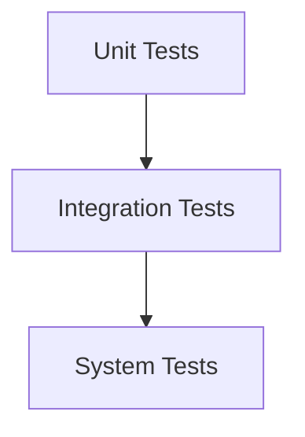

## 11.1.2 Types of Tests: Unit, Integration, and System Testing in Clojure

In the realm of software development, testing is a crucial practice that ensures the reliability and quality of applications. For Clojure developers, understanding the different types of tests—unit, integration, and system—is essential for building robust enterprise applications. This section delves into each type of test, providing comprehensive insights, practical examples, and best practices tailored for Clojure developers.

### Unit Tests: The Foundation of Reliable Code

Unit tests are the cornerstone of any testing strategy. They focus on testing individual functions or components in isolation, ensuring that each part of the code behaves as expected. In Clojure, unit tests are typically written using the `clojure.test` library, which provides a straightforward way to define test cases and assertions.

#### Defining Unit Tests

A unit test aims to validate the behavior of a single function or method. It should cover various input scenarios, including edge cases, to ensure comprehensive coverage. Here's a simple example of a unit test in Clojure:

```clojure
(ns my-app.core-test
  (:require [clojure.test :refer :all]
            [my-app.core :refer :all]))

(deftest test-addition
  (testing "Addition of two numbers"
    (is (= 4 (add 2 2)))
    (is (= 0 (add -1 1)))
    (is (= -3 (add -1 -2)))))
```

In this example, the `test-addition` function tests the `add` function from the `my-app.core` namespace. Each `is` form represents an assertion that checks if the function's output matches the expected result.

#### Guidelines for Writing Effective Unit Tests

1. **Isolate Tests:** Ensure that each test is independent and does not rely on external state or other tests.
2. **Use Descriptive Names:** Name your tests clearly to indicate what behavior they are verifying.
3. **Cover Edge Cases:** Test with a variety of inputs, including edge cases, to ensure robustness.
4. **Keep Tests Simple:** Focus on testing one aspect of the function's behavior per test case.

### Integration Tests: Verifying Component Interactions

Integration tests go beyond individual functions to verify the interactions between multiple components or systems. They ensure that the components work together as expected, which is crucial in a microservices architecture or when integrating with external systems.

#### Setting Up Integration Tests in Clojure

Integration tests often require setting up a test environment that mimics the production setup. This might involve using in-memory databases, mock services, or test containers. Here's an example of an integration test using a mock HTTP server:

```clojure
(ns my-app.integration-test
  (:require [clojure.test :refer :all]
            [clj-http.client :as client]
            [ring.mock.request :as mock]))

(deftest test-api-endpoint
  (testing "API endpoint integration"
    (let [response (client/get "http://localhost:3000/api/resource")]
      (is (= 200 (:status response)))
      (is (= "application/json" (get-in response [:headers "Content-Type"])))
      (is (= {:id 1 :name "Resource"} (json/parse-string (:body response) true))))))
```

In this example, the `test-api-endpoint` function tests an API endpoint by sending an HTTP GET request and verifying the response status, headers, and body.

#### Best Practices for Integration Testing

1. **Use Realistic Data:** Use data that closely resembles production data to catch potential issues.
2. **Mock External Dependencies:** Use mock servers or libraries to simulate external services and reduce test flakiness.
3. **Automate Setup and Teardown:** Automate the setup and teardown of the test environment to ensure consistency.

### System Tests: Validating the Entire System

System tests validate the entire application's functionality in a production-like environment. They are the most comprehensive type of test, covering end-to-end scenarios to ensure the system meets business requirements.

#### Conducting System Tests

System tests often involve deploying the application to a staging environment and running automated test scripts. Tools like Selenium or Cypress can be used for web applications to simulate user interactions.

```clojure
;; Example of a system test using a hypothetical Clojure testing framework
(deftest test-user-login
  (testing "User login flow"
    (navigate-to "/login")
    (fill-input "username" "testuser")
    (fill-input "password" "password123")
    (click-button "Login")
    (is (visible? "Welcome, testuser"))))
```

In this example, the `test-user-login` function simulates a user logging into the application and verifies that the welcome message is displayed.

#### Tools and Best Practices for System Testing

1. **Use Staging Environments:** Conduct system tests in environments that closely resemble production.
2. **Automate Tests:** Use automation tools to run tests consistently and efficiently.
3. **Monitor Performance:** Include performance monitoring to identify bottlenecks and ensure scalability.

### The Test Pyramid Concept

The test pyramid is a concept that emphasizes having more unit tests than integration tests, and more integration tests than system tests. This approach ensures a solid foundation of reliable unit tests, with integration and system tests providing additional coverage.



The pyramid highlights the importance of focusing on unit tests, as they are faster to execute and easier to maintain. Integration and system tests, while valuable, are more complex and should be used judiciously.

### Balancing Test Types

Achieving the right balance of test types is crucial for comprehensive coverage without redundancy. Here are some strategies:

1. **Prioritize Unit Tests:** Focus on writing thorough unit tests for all critical functions.
2. **Strategic Integration Tests:** Use integration tests to cover key interactions between components.
3. **Selective System Tests:** Reserve system tests for critical end-to-end scenarios that cannot be covered by unit or integration tests.

### Conclusion

Testing is an integral part of software development, and understanding the different types of tests is essential for building reliable applications. By leveraging unit, integration, and system tests effectively, Clojure developers can ensure their applications are robust and meet enterprise standards. The test pyramid provides a useful framework for balancing these test types, ensuring comprehensive coverage and efficient testing practices.

## Quiz Time!



### What is the primary focus of unit tests?

- [x] Testing individual functions or components in isolation
- [ ] Testing interactions between multiple components
- [ ] Validating the entire system's functionality
- [ ] Testing in a production-like environment

> **Explanation:** Unit tests focus on testing individual functions or components in isolation to ensure they behave as expected.

### What is a key characteristic of integration tests?

- [ ] They test individual functions
- [x] They verify interactions between multiple components
- [ ] They validate the entire system
- [ ] They are conducted in a production environment

> **Explanation:** Integration tests verify the interactions between multiple components or systems to ensure they work together correctly.

### What is the purpose of system tests?

- [ ] To test individual functions
- [ ] To verify component interactions
- [x] To validate the entire system's functionality
- [ ] To mock external dependencies

> **Explanation:** System tests validate the entire system's functionality in a production-like environment, covering end-to-end scenarios.

### Which type of test is typically the fastest to execute?

- [x] Unit tests
- [ ] Integration tests
- [ ] System tests
- [ ] Performance tests

> **Explanation:** Unit tests are typically the fastest to execute because they focus on individual functions or components in isolation.

### What is the testing pyramid concept?

- [x] Emphasizing more unit tests than integration and system tests
- [ ] Conducting all tests in a production environment
- [ ] Using only system tests for validation
- [ ] Prioritizing performance tests over other types

> **Explanation:** The testing pyramid emphasizes having more unit tests than integration and system tests to ensure a solid foundation of reliable tests.

### What is a best practice for integration testing?

- [ ] Use production data
- [x] Mock external dependencies
- [ ] Avoid automating setup and teardown
- [ ] Focus only on unit tests

> **Explanation:** Mocking external dependencies is a best practice for integration testing to reduce test flakiness and ensure consistency.

### What tool can be used for system testing web applications?

- [ ] clojure.test
- [ ] Ring
- [x] Selenium
- [ ] Leiningen

> **Explanation:** Selenium is a tool commonly used for system testing web applications by simulating user interactions.

### What is a strategy for balancing test types?

- [x] Prioritize unit tests
- [ ] Focus only on system tests
- [ ] Avoid integration tests
- [ ] Use manual testing for all scenarios

> **Explanation:** Prioritizing unit tests is a strategy for balancing test types to ensure comprehensive coverage without redundancy.

### What should be included in system tests?

- [ ] Only unit test scenarios
- [ ] Mock data
- [x] End-to-end scenarios
- [ ] Only integration test scenarios

> **Explanation:** System tests should include end-to-end scenarios to validate the entire system's functionality.

### True or False: System tests are typically faster to execute than unit tests.

- [ ] True
- [x] False

> **Explanation:** System tests are typically slower to execute than unit tests because they cover the entire system and involve more complex setups.


