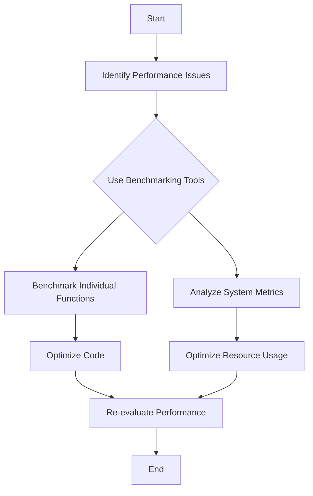

---

linkTitle: "11.5.1 Identifying Bottlenecks"
title: "Identifying Bottlenecks in Clojure Applications: Techniques and Tools"
description: "Learn how to identify and resolve performance bottlenecks in Clojure applications using benchmarking tools like Criterium, system monitoring, and key performance metrics."
categories:
- Performance Optimization
- Clojure Development
- Enterprise Integration
tags:
- Clojure
- Performance
- Benchmarking
- System Monitoring
- JVM
date: 2024-10-25
type: docs
nav_weight: 1151000
canonical: "https://clojureforjava.com/4/11/5/1"
license: "© 2024 Tokenizer Inc. CC BY-NC-SA 4.0"
---

## 11.5.1 Identifying Bottlenecks

In the realm of enterprise software development, performance is a critical factor that can significantly impact user experience and operational efficiency. Identifying and resolving bottlenecks in your Clojure applications is essential to ensure they run smoothly and efficiently. This section will guide you through various techniques and tools to pinpoint performance issues, focusing on benchmarking, microbenchmarking, and system monitoring.

### Understanding Bottlenecks

Before diving into tools and techniques, it's important to understand what bottlenecks are. In software systems, a bottleneck is a point of congestion or limitation that reduces the overall performance. Bottlenecks can occur at various levels, including CPU, memory, disk I/O, network, or within the application code itself.

### Benchmarking Tools: Introducing Criterium

One of the most effective ways to identify bottlenecks in your Clojure application is through benchmarking. Benchmarking involves measuring the performance of your code to identify areas that need optimization. In Clojure, the `criterium` library is a powerful tool for accurate benchmarking.

#### Installing Criterium

To get started with Criterium, you need to add it to your project's dependencies. In your `project.clj` file, include:

```clojure
:dependencies [[org.clojure/clojure "1.10.3"]
               [criterium "0.4.6"]]
```

#### Basic Benchmarking with Criterium

Criterium provides a simple API to benchmark your functions. Here's a basic example:

```clojure
(require '[criterium.core :refer [quick-bench]])

(defn example-function [n]
  (reduce + (range n)))

(quick-bench (example-function 1000))
```

This code snippet benchmarks the `example-function` by measuring its execution time over multiple iterations to provide statistically significant results.

#### Understanding Criterium's Output

Criterium's output includes several metrics:

- **Execution Time:** The time taken to execute the function.
- **Standard Deviation:** Indicates variability in execution time.
- **Percentiles:** Show the distribution of execution times.

These metrics help you understand the performance characteristics of your functions and identify potential bottlenecks.

### Microbenchmarking: Writing Benchmarks for Individual Functions

Microbenchmarking focuses on measuring the performance of individual functions or small code segments. This approach is useful for isolating specific areas of your code that may be causing performance issues.

#### Writing Effective Microbenchmarks

When writing microbenchmarks, consider the following best practices:

1. **Isolate the Code:** Ensure the benchmarked code is isolated from external dependencies.
2. **Warm-Up:** Allow the JVM to warm up before measuring to avoid skewed results.
3. **Repeat Measurements:** Perform multiple iterations to get reliable data.

Here's an example of a microbenchmark for a sorting function:

```clojure
(defn sort-numbers [numbers]
  (sort numbers))

(quick-bench (sort-numbers (shuffle (range 1000))))
```

This benchmark measures the performance of the `sort-numbers` function, providing insights into its efficiency.

### System Monitoring: Using System and JVM Tools

While benchmarking helps identify code-level bottlenecks, system monitoring tools provide a broader view of your application's performance. These tools help you understand how your application interacts with the underlying system resources.

#### System Monitoring Tools

- **`top` and `htop`:** These command-line tools provide real-time insights into CPU and memory usage, helping you identify resource-intensive processes.
- **`iostat`:** Monitors disk I/O performance, useful for identifying bottlenecks related to disk operations.

#### JVM Monitoring Tools

- **VisualVM:** A powerful tool for monitoring and profiling Java applications. It provides insights into memory usage, thread activity, and CPU consumption.
- **JConsole:** Offers a graphical interface to monitor JVM performance metrics, including heap memory, thread count, and garbage collection.

#### Using VisualVM for JVM Monitoring

VisualVM is a versatile tool that provides detailed insights into your application's performance. Here's how to use it:

1. **Launch VisualVM:** Start VisualVM and connect it to your running Clojure application.
2. **Monitor Memory Usage:** Analyze heap memory usage to identify memory leaks or excessive allocation.
3. **Profile CPU Usage:** Identify methods consuming the most CPU time, helping you pinpoint inefficient code.

### Key Metrics: Identifying Critical Performance Metrics

When identifying bottlenecks, focus on key performance metrics that impact your application's overall performance:

#### Latency

Latency refers to the time taken to process a request. High latency can degrade user experience, especially in real-time applications. Use tools like Criterium to measure and optimize latency.

#### Throughput

Throughput measures the number of requests processed per unit of time. It's crucial for applications with high traffic volumes. Monitor throughput using system tools and optimize code to handle more requests efficiently.

#### Memory Usage

Memory usage impacts both performance and stability. Excessive memory consumption can lead to garbage collection overhead and out-of-memory errors. Use JVM monitoring tools to track memory usage and optimize data structures.

### Practical Code Examples

Let's explore a practical example of identifying and resolving a bottleneck in a Clojure application.

#### Example: Optimizing a Data Processing Function

Consider a function that processes a large dataset:

```clojure
(defn process-data [data]
  (map #(do-some-heavy-computation %) data))

(quick-bench (process-data (range 10000)))
```

The `process-data` function may be a bottleneck due to inefficient computation. To optimize it, consider:

1. **Parallel Processing:** Use Clojure's `pmap` to parallelize the computation.
2. **Algorithm Optimization:** Review the algorithm for potential improvements.

Here's the optimized version:

```clojure
(defn optimized-process-data [data]
  (pmap #(do-some-heavy-computation %) data))

(quick-bench (optimized-process-data (range 10000)))
```

By parallelizing the computation, you can significantly reduce execution time and improve throughput.

### Diagrams and Visualizations

To better understand the flow of identifying bottlenecks, consider the following flowchart:



This flowchart outlines the process of identifying and resolving bottlenecks, from initial identification to optimization and re-evaluation.

### Best Practices and Common Pitfalls

#### Best Practices

- **Regular Monitoring:** Continuously monitor performance metrics to catch issues early.
- **Incremental Optimization:** Focus on optimizing one bottleneck at a time.
- **Holistic Approach:** Consider both code-level and system-level optimizations.

#### Common Pitfalls

- **Over-Optimization:** Avoid optimizing code prematurely without evidence of bottlenecks.
- **Ignoring System Resources:** Don't overlook the impact of system resources on application performance.

### Conclusion

Identifying bottlenecks in your Clojure applications is a critical step towards achieving optimal performance. By leveraging tools like Criterium for benchmarking, system monitoring tools for resource analysis, and focusing on key performance metrics, you can effectively pinpoint and resolve performance issues. Remember to adopt a holistic approach, considering both code-level and system-level optimizations to ensure your applications run efficiently in an enterprise environment.

## Quiz Time!



### What is a bottleneck in software systems?

- [x] A point of congestion or limitation that reduces overall performance
- [ ] A tool for measuring application performance
- [ ] A type of memory leak
- [ ] A method for optimizing code

> **Explanation:** A bottleneck is a point of congestion or limitation in a system that reduces its overall performance.

### Which library is used for accurate benchmarking in Clojure?

- [x] Criterium
- [ ] Leiningen
- [ ] Ring
- [ ] Pedestal

> **Explanation:** Criterium is a library used for accurate benchmarking in Clojure applications.

### What is microbenchmarking?

- [x] Measuring the performance of individual functions or small code segments
- [ ] Monitoring system resources
- [ ] Analyzing network traffic
- [ ] Profiling memory usage

> **Explanation:** Microbenchmarking focuses on measuring the performance of individual functions or small code segments to identify specific bottlenecks.

### Which tool provides real-time insights into CPU and memory usage?

- [x] htop
- [ ] JConsole
- [ ] Criterium
- [ ] Leiningen

> **Explanation:** `htop` is a command-line tool that provides real-time insights into CPU and memory usage.

### What does latency refer to in performance metrics?

- [x] The time taken to process a request
- [ ] The number of requests processed per unit of time
- [ ] The amount of memory used by an application
- [ ] The frequency of garbage collection

> **Explanation:** Latency refers to the time taken to process a request, impacting user experience.

### Which tool is used for monitoring JVM performance metrics?

- [x] VisualVM
- [ ] Criterium
- [ ] Leiningen
- [ ] Ring

> **Explanation:** VisualVM is a tool used for monitoring JVM performance metrics, including memory usage and CPU consumption.

### What is the purpose of using `pmap` in Clojure?

- [x] To parallelize computation and improve performance
- [ ] To measure execution time
- [ ] To monitor system resources
- [ ] To handle HTTP requests

> **Explanation:** `pmap` is used in Clojure to parallelize computation, which can improve performance by utilizing multiple CPU cores.

### What should you avoid when optimizing code?

- [x] Over-optimization without evidence of bottlenecks
- [ ] Regular monitoring of performance metrics
- [ ] Incremental optimization
- [ ] Holistic approach to optimization

> **Explanation:** Over-optimization without evidence of bottlenecks can lead to wasted effort and complexity without tangible benefits.

### What is throughput in performance metrics?

- [x] The number of requests processed per unit of time
- [ ] The time taken to process a request
- [ ] The amount of memory used by an application
- [ ] The frequency of garbage collection

> **Explanation:** Throughput measures the number of requests processed per unit of time, indicating the capacity of the application to handle traffic.

### True or False: System monitoring tools can help identify code-level bottlenecks.

- [ ] True
- [x] False

> **Explanation:** System monitoring tools provide insights into resource usage but do not directly identify code-level bottlenecks. They help understand the impact of the code on system resources.


