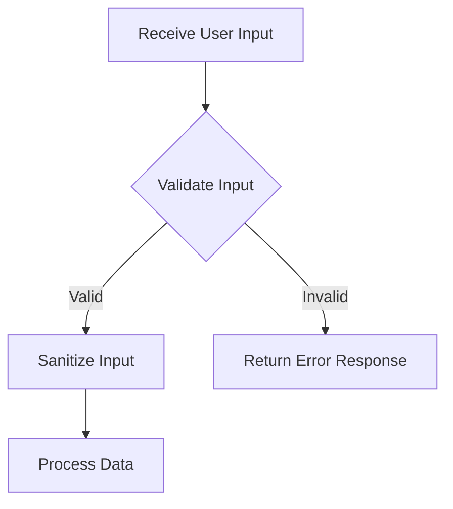

## 12.3.1 Input Validation and Sanitization

In the realm of enterprise application development, ensuring the integrity and security of data is paramount. Input validation and sanitization are critical components in safeguarding applications against malicious attacks and ensuring data consistency. This section delves into the methodologies and tools available in Clojure for effective input validation and sanitization, focusing on the use of `clojure.spec` and `plumatic/schema`.

### Understanding Input Validation and Sanitization

Input validation is the process of verifying that the data provided by users or external systems meets the expected format and constraints before it is processed by an application. Sanitization, on the other hand, involves cleaning the input data to remove or neutralize any harmful elements that could lead to security vulnerabilities such as SQL injection or cross-site scripting (XSS).

#### Key Objectives:
- **Accuracy:** Ensure that input data is accurate and conforms to expected formats.
- **Security:** Protect the application from injection attacks and other vulnerabilities.
- **Reliability:** Maintain the reliability of the application by preventing invalid data from causing errors.

### Validation Libraries in Clojure

Clojure offers powerful libraries for input validation, notably `clojure.spec` and `plumatic/schema`. These libraries provide robust mechanisms for defining and enforcing data specifications.

#### clojure.spec

`clojure.spec` is a core library in Clojure that provides a rich set of tools for describing the structure of data and functions. It allows developers to define specifications for data structures and validate data against these specifications.

**Key Features:**
- **Declarative Specifications:** Define what valid data looks like using predicates.
- **Automatic Validation:** Validate data against specifications at runtime.
- **Generative Testing:** Automatically generate test data that conforms to specifications.

**Example:**

```clojure
(require '[clojure.spec.alpha :as s])

(s/def ::username (s/and string? #(re-matches #"\w+" %)))
(s/def ::age (s/and int? #(>= % 18)))

(defn validate-user [user]
  (if (s/valid? ::username (:username user))
    (if (s/valid? ::age (:age user))
      :valid
      :invalid-age)
    :invalid-username))

(validate-user {:username "john_doe" :age 25}) ; => :valid
(validate-user {:username "john doe" :age 25}) ; => :invalid-username
```

#### plumatic/schema

`plumatic/schema` is another popular library for data validation in Clojure. It provides a straightforward way to define schemas and validate data against them.

**Key Features:**
- **Simple Syntax:** Define schemas using Clojure data structures.
- **Comprehensive Error Messages:** Provides detailed error messages for invalid data.

**Example:**

```clojure
(require '[schema.core :as schema])

(def User
  {:username schema/Str
   :age (schema/pred #(and (integer? %) (>= % 18)) 'adult)})

(defn validate-user [user]
  (schema/validate User user))

(validate-user {:username "john_doe" :age 25}) ; => {:username "john_doe", :age 25}
(validate-user {:username "john doe" :age 17}) ; => Exception: Value does not match schema
```

### Defensive Programming: Validating External Inputs

Defensive programming is a practice that involves anticipating potential errors and vulnerabilities in software. In the context of input validation, this means rigorously validating all external inputs to prevent invalid or malicious data from compromising the application.

#### Best Practices:
- **Validate Early and Often:** Perform validation as soon as data is received.
- **Whitelist Approach:** Define what is allowed rather than what is disallowed.
- **Layered Validation:** Implement validation at multiple layers (e.g., client-side, server-side).

### Preventing Injection Attacks

Injection attacks, such as SQL injection and XSS, are common threats that exploit vulnerabilities in input handling. Sanitization is crucial in preventing these attacks by ensuring that input data is safe to process.

#### Techniques for Preventing Injection Attacks:

1. **SQL Injection:**
   - Use parameterized queries or prepared statements to prevent SQL injection.
   - Sanitize inputs that are used in SQL queries.

**Example:**

```clojure
(defn safe-query [db username]
  (jdbc/query db ["SELECT * FROM users WHERE username = ?" username]))
```

2. **Cross-Site Scripting (XSS):**
   - Escape HTML characters in user input before rendering it in the browser.
   - Use libraries like `hiccup` for safe HTML rendering.

**Example:**

```clojure
(require '[hiccup.core :refer [html]])

(defn render-comment [comment]
  (html [:div {:class "comment"} (hiccup.util/escape-html comment)]))
```

### Error Handling: Avoiding Exposure of Sensitive Information

Error handling is an integral part of input validation and sanitization. It is crucial to handle errors gracefully without exposing sensitive information, such as stack traces or internal logic, to the end-users.

#### Strategies for Secure Error Handling:
- **Generic Error Messages:** Provide generic error messages to users while logging detailed errors internally.
- **Logging:** Log errors with sufficient detail for debugging but avoid logging sensitive data.
- **Graceful Degradation:** Ensure the application continues to function in a degraded mode if an error occurs.

**Example:**

```clojure
(defn handle-error [e]
  (log/error e "An error occurred")
  {:status 500 :body "An unexpected error occurred. Please try again later."})
```

### Practical Code Examples and Implementations

Let's explore a practical example of building a secure user registration form using `clojure.spec` for validation and implementing sanitization techniques to prevent injection attacks.

**User Registration Example:**

```clojure
(ns user.registration
  (:require [clojure.spec.alpha :as s]
            [hiccup.util :refer [escape-html]]
            [ring.util.response :refer [response]]))

;; Define specs for user input
(s/def ::username (s/and string? #(re-matches #"\w+" %)))
(s/def ::password (s/and string? #(>= (count %) 8)))
(s/def ::email (s/and string? #(re-matches #".+@.+\..+" %)))

(defn validate-user [user]
  (s/valid? (s/keys :req [::username ::password ::email]) user))

(defn sanitize-input [input]
  (escape-html input))

(defn register-user [user]
  (if (validate-user user)
    (let [sanitized-user (update user :username sanitize-input)]
      ;; Proceed with user registration
      (response {:status 200 :body "User registered successfully"}))
    (response {:status 400 :body "Invalid user data"})))

;; Example usage
(register-user {:username "<script>alert('xss')</script>" :password "securePass123" :email "user@example.com"})
```

### Diagrams and Flowcharts

To better understand the flow of input validation and sanitization, consider the following flowchart illustrating the process:



### Best Practices, Common Pitfalls, and Optimization Tips

#### Best Practices:
- **Consistent Validation:** Ensure that validation logic is consistent across the application.
- **Centralized Validation Logic:** Centralize validation logic to avoid duplication and ensure maintainability.
- **Use Established Libraries:** Leverage well-established libraries like `clojure.spec` and `plumatic/schema` for validation.

#### Common Pitfalls:
- **Overlooking Edge Cases:** Ensure that validation logic accounts for edge cases and unusual input scenarios.
- **Inadequate Error Handling:** Avoid exposing sensitive information in error messages.

#### Optimization Tips:
- **Optimize Performance:** Consider the performance impact of validation logic, especially in high-throughput applications.
- **Asynchronous Validation:** For complex validation tasks, consider using asynchronous processing to improve responsiveness.

### Conclusion

Input validation and sanitization are critical components in building secure and reliable enterprise applications. By leveraging Clojure's powerful libraries like `clojure.spec` and `plumatic/schema`, developers can define robust validation logic and implement effective sanitization techniques to protect against injection attacks and other vulnerabilities. Adhering to best practices and being mindful of common pitfalls will ensure that your applications remain secure and resilient in the face of evolving threats.

## Quiz Time!



### Which Clojure library is used for defining data specifications and validation?

- [x] clojure.spec
- [ ] clojure.core
- [ ] clojure.data
- [ ] clojure.string

> **Explanation:** `clojure.spec` is a core library in Clojure used for defining data specifications and validation.

### What is the primary purpose of input sanitization?

- [x] To remove or neutralize harmful elements in input data
- [ ] To format data for display
- [ ] To compress data for storage
- [ ] To encrypt data for security

> **Explanation:** Input sanitization involves cleaning input data to remove or neutralize harmful elements that could lead to security vulnerabilities.

### What is a common technique to prevent SQL injection attacks?

- [x] Use parameterized queries
- [ ] Use string concatenation
- [ ] Use dynamic SQL
- [ ] Use inline SQL comments

> **Explanation:** Parameterized queries or prepared statements are used to prevent SQL injection attacks by separating SQL code from data.

### Which library can be used for safe HTML rendering in Clojure?

- [x] hiccup
- [ ] clojure.xml
- [ ] clojure.json
- [ ] clojure.data.csv

> **Explanation:** The `hiccup` library is used for safe HTML rendering by escaping HTML characters.

### What is the recommended approach for error messages in secure applications?

- [x] Provide generic error messages to users
- [ ] Display detailed stack traces
- [ ] Include sensitive data
- [ ] Use technical jargon

> **Explanation:** Providing generic error messages to users while logging detailed errors internally is recommended for security.

### Which validation library provides generative testing capabilities?

- [x] clojure.spec
- [ ] plumatic/schema
- [ ] clojure.core
- [ ] clojure.data

> **Explanation:** `clojure.spec` provides generative testing capabilities by automatically generating test data that conforms to specifications.

### What is a key benefit of centralized validation logic?

- [x] Avoids duplication and ensures maintainability
- [ ] Increases code complexity
- [ ] Reduces performance
- [ ] Limits flexibility

> **Explanation:** Centralized validation logic avoids duplication and ensures maintainability by having a single source of truth for validation rules.

### Which of the following is a common pitfall in input validation?

- [x] Overlooking edge cases
- [ ] Using established libraries
- [ ] Consistent validation
- [ ] Centralized validation logic

> **Explanation:** Overlooking edge cases is a common pitfall in input validation, leading to potential vulnerabilities.

### What is the purpose of using `plumatic/schema` in Clojure?

- [x] To define schemas and validate data
- [ ] To manage database connections
- [ ] To handle HTTP requests
- [ ] To perform asynchronous processing

> **Explanation:** `plumatic/schema` is used to define schemas and validate data in Clojure applications.

### True or False: Input validation should only be performed on the client-side.

- [ ] True
- [x] False

> **Explanation:** Input validation should be performed on both the client-side and server-side to ensure data integrity and security.


