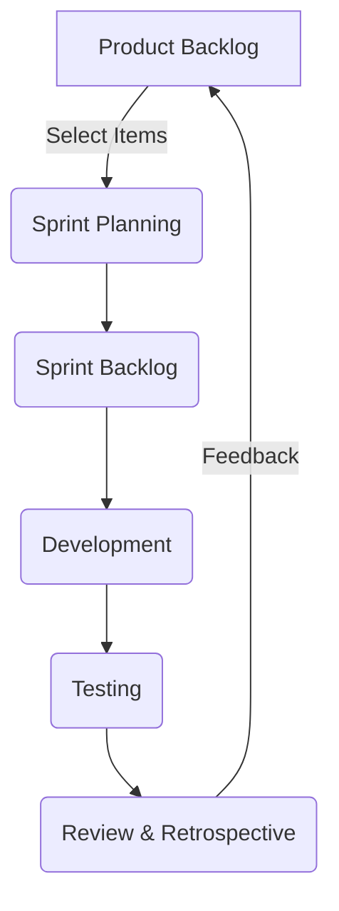

## 13.5.2 Recommendations for Future Projects

In the rapidly evolving landscape of enterprise software development, leveraging the power of Clojure and its robust ecosystem can significantly enhance your project's success. However, to truly harness this potential, it's crucial to adopt a strategic approach that encompasses best practices, continuous improvement, proactive planning, and comprehensive documentation. This section delves into these key areas, providing actionable insights and recommendations for future projects.

### Adopt Best Practices

#### Importance of Coding Standards

Adhering to coding standards is a cornerstone of software quality and maintainability. In Clojure, this involves embracing idiomatic constructs and leveraging the language's functional programming paradigms. Establishing a set of coding guidelines tailored to your team's needs ensures consistency and readability across the codebase.

- **Consistency:** Uniform coding styles reduce cognitive load, making it easier for developers to read and understand code written by others. This is particularly important in Clojure, where concise and expressive code can sometimes be cryptic to the uninitiated.
- **Readability:** Clear and consistent code is easier to debug and extend. By following established conventions, such as those outlined in the [Clojure Style Guide](https://github.com/bbatsov/clojure-style-guide), teams can improve the readability of their code.

#### Code Reviews

Code reviews are an essential practice for maintaining code quality and fostering a culture of continuous learning. They provide an opportunity for developers to share knowledge, identify potential issues early, and ensure adherence to coding standards.

- **Collaborative Learning:** Code reviews facilitate knowledge sharing and mentorship, helping team members learn from each other's experiences and expertise.
- **Quality Assurance:** By systematically reviewing code changes, teams can catch bugs and design flaws before they reach production, reducing the risk of costly post-deployment fixes.

### Continuous Improvement

#### Ongoing Learning and Adaptation

In the fast-paced world of software development, staying current with emerging technologies and methodologies is vital. Encourage your team to engage in continuous learning through various channels:

- **Workshops and Training:** Regularly organize workshops and training sessions to introduce new tools, libraries, and techniques. This not only enhances individual skills but also aligns the team with the latest industry trends.
- **Conferences and Meetups:** Encourage attendance at conferences and meetups, such as [Clojure/conj](https://clojure.org/community/events) and local Clojure user groups. These events provide valuable networking opportunities and insights into the latest advancements in the Clojure ecosystem.

#### Experimentation and Innovation

Foster a culture of experimentation by allocating time for developers to explore new ideas and technologies. This can lead to innovative solutions and improvements in existing processes.

- **Hackathons:** Organize internal hackathons to encourage creative problem-solving and experimentation. These events can spark new ideas and foster a sense of camaraderie among team members.
- **Innovation Time:** Allow developers dedicated time each week to work on personal projects or explore new technologies. This can lead to valuable insights and innovations that benefit the entire team.

### Proactive Planning

#### Early Identification of Potential Issues

Proactive planning involves anticipating potential challenges and addressing them before they escalate. This requires a thorough understanding of project requirements, potential risks, and mitigation strategies.

- **Risk Assessment:** Conduct regular risk assessments to identify potential issues and develop contingency plans. This can involve analyzing dependencies, evaluating third-party libraries, and assessing the impact of potential changes.
- **Prototyping:** Develop prototypes to validate assumptions and test new ideas before committing to full-scale implementation. This can help identify potential issues early and reduce the risk of costly rework.

#### Agile Methodologies

Adopting agile methodologies, such as Scrum or Kanban, can enhance your team's ability to respond to changing requirements and deliver value incrementally.

- **Iterative Development:** Break down projects into smaller, manageable iterations, allowing for regular feedback and course corrections. This approach enables teams to adapt to changing requirements and deliver value incrementally.
- **Continuous Feedback:** Encourage regular feedback from stakeholders and end-users to ensure that the project remains aligned with business goals and user needs.

### Documentation

#### Thorough Documentation for Maintainability

Comprehensive documentation is essential for maintaining and scaling enterprise applications. It serves as a valuable resource for current and future team members, ensuring that knowledge is preserved and easily accessible.

- **Code Documentation:** Use tools like [Codox](https://github.com/weavejester/codox) to generate API documentation from your Clojure code. This provides a clear reference for developers and helps ensure that code is used correctly.
- **Project Documentation:** Maintain detailed project documentation, including architecture diagrams, design decisions, and configuration details. This helps new team members quickly get up to speed and reduces the risk of knowledge loss.

#### Living Documentation

Treat documentation as a living artifact that evolves alongside the codebase. Regularly update documentation to reflect changes in the code and ensure that it remains accurate and relevant.

- **Automated Documentation:** Integrate documentation generation into your build process to ensure that it is always up-to-date. This can involve using tools like [Leiningen](https://leiningen.org/) to automate the generation of API docs and other project artifacts.
- **Version Control:** Store documentation in version control alongside the codebase, allowing for easy tracking of changes and collaboration among team members.

### Practical Code Examples

To illustrate these recommendations, consider the following practical code examples and configurations.

#### Example: Establishing Coding Standards

```clojure
(ns myproject.core
  (:require [clojure.string :as str]))

(defn greet
  "Returns a greeting message for the given name."
  [name]
  (str "Hello, " name "!"))

;; Usage
(greet "Clojure Developer")
```

In this example, we follow Clojure's naming conventions and use docstrings to document the function's purpose. This enhances readability and provides valuable context for future developers.

#### Example: Implementing Code Reviews

Integrate code reviews into your development workflow using platforms like GitHub or GitLab. Encourage team members to provide constructive feedback and discuss potential improvements.

```markdown

## Description

Please include a summary of the changes and the issue being addressed.

## Checklist

- [ ] Code follows the project's coding standards
- [ ] Tests have been added or updated
- [ ] Documentation has been updated
- [ ] Changes have been reviewed by at least one other team member
```

This template ensures that key aspects of the code change are considered and reviewed before merging.

#### Example: Prototyping with Clojure

```clojure
(ns myproject.prototype
  (:require [ring.adapter.jetty :refer [run-jetty]]
            [compojure.core :refer [defroutes GET]]
            [compojure.route :as route]))

(defroutes app-routes
  (GET "/" [] "Hello, Prototype!")
  (route/not-found "Not Found"))

(defn -main []
  (run-jetty app-routes {:port 3000}))
```

This simple web server prototype allows you to quickly test ideas and gather feedback before committing to a full implementation.

### Diagrams and Visualizations

To further enhance understanding, consider incorporating diagrams and visualizations using the Mermaid format.

#### Example: Agile Development Workflow



This diagram illustrates the iterative nature of agile development, emphasizing the importance of continuous feedback and improvement.

### Conclusion

By adopting best practices, fostering a culture of continuous improvement, engaging in proactive planning, and maintaining thorough documentation, you can significantly enhance the success of your enterprise integration projects using Clojure. These recommendations provide a solid foundation for future projects, enabling your team to deliver high-quality software that meets the evolving needs of your organization.

## Quiz Time!



### What is the primary benefit of adhering to coding standards in Clojure?

- [x] Consistency and readability across the codebase
- [ ] Faster code execution
- [ ] Reduced memory usage
- [ ] Increased code obfuscation

> **Explanation:** Adhering to coding standards ensures consistency and readability, making it easier for developers to understand and maintain the code.

### How do code reviews contribute to a team's success?

- [x] They facilitate knowledge sharing and quality assurance.
- [ ] They eliminate the need for testing.
- [ ] They reduce the number of developers needed.
- [ ] They increase code complexity.

> **Explanation:** Code reviews help in knowledge sharing and ensure code quality by catching issues early.

### What is a key aspect of continuous improvement in software development?

- [x] Ongoing learning and adaptation of new technologies
- [ ] Sticking to the same tools and methods
- [ ] Avoiding experimentation
- [ ] Limiting team communication

> **Explanation:** Continuous improvement involves ongoing learning and adapting to new technologies to stay current and innovative.

### What is the purpose of conducting risk assessments in proactive planning?

- [x] To identify potential issues and develop contingency plans
- [ ] To delay project timelines
- [ ] To increase project costs
- [ ] To reduce team size

> **Explanation:** Risk assessments help identify potential issues early and develop plans to mitigate them, reducing the risk of project delays and failures.

### How can agile methodologies benefit a development team?

- [x] By allowing for iterative development and continuous feedback
- [ ] By enforcing rigid processes
- [ ] By eliminating the need for documentation
- [ ] By reducing collaboration

> **Explanation:** Agile methodologies promote iterative development and continuous feedback, enabling teams to adapt to changes and deliver value incrementally.

### Why is documentation important for maintainability?

- [x] It serves as a valuable resource for current and future team members.
- [ ] It increases the complexity of the codebase.
- [ ] It is only useful for new developers.
- [ ] It reduces the need for testing.

> **Explanation:** Documentation provides a reference for understanding the codebase, ensuring that knowledge is preserved and accessible.

### What is a benefit of treating documentation as a living artifact?

- [x] It remains accurate and relevant as the codebase evolves.
- [ ] It becomes obsolete quickly.
- [ ] It requires no updates.
- [ ] It is stored separately from the codebase.

> **Explanation:** Treating documentation as a living artifact ensures it is regularly updated to reflect changes in the code, maintaining its accuracy and relevance.

### How can automated documentation benefit a development team?

- [x] By ensuring documentation is always up-to-date
- [ ] By reducing the need for code reviews
- [ ] By eliminating the need for testing
- [ ] By increasing project costs

> **Explanation:** Automated documentation ensures that the documentation is always current, reducing the manual effort required to keep it updated.

### What is the role of prototyping in proactive planning?

- [x] To validate assumptions and test ideas before full implementation
- [ ] To finalize project requirements
- [ ] To increase project complexity
- [ ] To delay project timelines

> **Explanation:** Prototyping helps validate assumptions and test ideas early, reducing the risk of costly rework during full-scale implementation.

### True or False: Hackathons are a way to foster innovation and experimentation within a team.

- [x] True
- [ ] False

> **Explanation:** Hackathons encourage creative problem-solving and experimentation, fostering innovation and camaraderie among team members.


