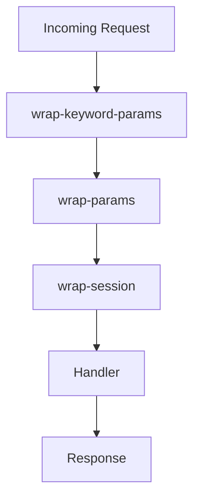

## 3.1.1 The Ring Spec and Middleware Concept

In the realm of Clojure web development, the Ring library plays a pivotal role as the foundational layer for building web applications. Understanding the Ring specification and middleware concept is crucial for developers aiming to leverage Clojure's functional programming paradigm in enterprise environments. This section delves into the intricacies of the Ring spec, explores the power of middleware as higher-order functions, and demonstrates how to compose middleware to create a robust request processing pipeline.

### Understanding the Ring Specification

The Ring specification is a Clojure-centric approach to handling HTTP requests and responses. It defines a simple, yet powerful, protocol for web applications, enabling developers to build modular and composable web services. At its core, the Ring spec revolves around the concept of request and response maps.

#### The Request Map

A Ring request is represented as a Clojure map, encapsulating all the necessary information about an incoming HTTP request. This map includes keys such as:

- `:server-port` - The port on which the server is running.
- `:server-name` - The server's hostname.
- `:remote-addr` - The IP address of the client.
- `:uri` - The request URI.
- `:query-string` - The query string, if present.
- `:scheme` - The scheme used (e.g., `:http` or `:https`).
- `:request-method` - The HTTP method (`:get`, `:post`, etc.).
- `:headers` - A map of HTTP headers.
- `:body` - The request body, typically an input stream.

Here's an example of a typical Ring request map:

```clojure
{:server-port 8080
 :server-name "localhost"
 :remote-addr "127.0.0.1"
 :uri "/api/data"
 :query-string "id=123"
 :scheme :http
 :request-method :get
 :headers {"accept" "application/json"}
 :body nil}
```

#### The Response Map

Similarly, a Ring response is a map that dictates how the server should respond to the client. The response map includes:

- `:status` - The HTTP status code (e.g., `200` for OK, `404` for Not Found).
- `:headers` - A map of response headers.
- `:body` - The response body, which can be a string, a byte array, or an input stream.

An example of a Ring response map is as follows:

```clojure
{:status 200
 :headers {"Content-Type" "application/json"}
 :body "{\"message\": \"Success\"}"}
```

### Middleware Functionality: Higher-Order Functions in Action

Middleware in Ring is a powerful concept that leverages Clojure's functional programming capabilities. Middleware functions are higher-order functions that take a handler function as an argument and return a new handler function. This allows developers to wrap additional functionality around existing handlers, enabling features such as logging, authentication, and session management.

#### The Anatomy of Middleware

A typical middleware function has the following structure:

```clojure
(defn wrap-example-middleware [handler]
  (fn [request]
    ;; Pre-processing logic
    (let [response (handler request)]
      ;; Post-processing logic
      response)))
```

In this example, `wrap-example-middleware` is a middleware function that takes a `handler` function as an argument. It returns a new function that processes a `request`, applies pre-processing logic, invokes the original `handler`, and then applies post-processing logic to the `response`.

### Common Middleware: Enhancing Functionality

Ring provides several built-in middleware components that address common web application needs. These middleware functions simplify tasks such as parameter parsing, session management, and security.

#### `wrap-params`

The `wrap-params` middleware is used to parse query parameters and form-encoded request bodies, making them easily accessible in the request map. This middleware adds a `:params` key to the request map, which contains a merged map of query and form parameters.

Example usage:

```clojure
(require '[ring.middleware.params :refer [wrap-params]])

(def app
  (wrap-params
    (fn [request]
      {:status 200
       :headers {"Content-Type" "text/plain"}
       :body (str "Parameters: " (:params request))})))
```

#### `wrap-session`

The `wrap-session` middleware provides session management capabilities, allowing developers to store and retrieve session data across requests. It adds a `:session` key to the request map, which can be used to access session data.

Example usage:

```clojure
(require '[ring.middleware.session :refer [wrap-session]])

(def app
  (wrap-session
    (fn [request]
      (let [session (:session request)]
        {:status 200
         :headers {"Content-Type" "text/plain"}
         :body (str "Session data: " session)}))))
```

#### `wrap-keyword-params`

The `wrap-keyword-params` middleware automatically converts string keys in the `:params` map to keywords, providing a more idiomatic way to access parameters in Clojure.

Example usage:

```clojure
(require '[ring.middleware.keyword-params :refer [wrap-keyword-params]])

(def app
  (wrap-keyword-params
    (fn [request]
      {:status 200
       :headers {"Content-Type" "text/plain"}
       :body (str "Keyword params: " (:params request))})))
```

### Middleware Composition: Building the Request Processing Pipeline

One of the most powerful features of Ring middleware is the ability to compose multiple middleware functions to form a request processing pipeline. This composition allows developers to layer functionality in a modular and reusable manner.

#### Composing Middleware

Middleware functions can be composed using the `->` threading macro, which passes the result of each function as the first argument to the next function. This composition creates a linear flow of request processing.

Example of middleware composition:

```clojure
(def app
  (-> handler
      wrap-keyword-params
      wrap-params
      wrap-session))
```

In this example, the `handler` function is wrapped with `wrap-keyword-params`, `wrap-params`, and `wrap-session` middleware, creating a processing pipeline that handles parameter parsing and session management.

#### Visualizing Middleware Composition

To better understand middleware composition, consider the following flowchart illustrating the request processing pipeline:



In this flowchart, the incoming request passes through each middleware function in sequence before reaching the final handler, which generates the response.

### Best Practices and Common Pitfalls

When working with Ring middleware, it's important to follow best practices to ensure maintainability and performance:

- **Order Matters:** The order in which middleware is composed can affect the behavior of the application. Ensure that middleware is applied in the correct sequence to achieve the desired functionality.
- **Avoid Side Effects:** Middleware should be designed to minimize side effects and maintain the purity of functions. This approach aligns with Clojure's functional programming principles.
- **Test Middleware Independently:** Write unit tests for individual middleware components to verify their behavior in isolation. This practice simplifies debugging and ensures reliability.

### Conclusion

The Ring specification and middleware concept are foundational to building scalable and maintainable web applications in Clojure. By understanding the structure of request and response maps, leveraging middleware as higher-order functions, and composing middleware effectively, developers can create powerful and flexible web services. As you continue your journey in Clojure web development, keep these principles in mind to harness the full potential of the Ring library.

## Quiz Time!



### What is a key characteristic of a Ring request map?

- [x] It includes keys such as `:server-port`, `:uri`, and `:headers`.
- [ ] It only contains the HTTP method and URI.
- [ ] It is a list of HTTP headers.
- [ ] It is a string representation of the request.

> **Explanation:** A Ring request map includes various keys such as `:server-port`, `:uri`, and `:headers`, providing comprehensive details about the HTTP request.

### What does the `wrap-params` middleware do?

- [x] Parses query parameters and form-encoded request bodies.
- [ ] Encrypts the request body.
- [ ] Logs request details to the console.
- [ ] Validates JSON payloads.

> **Explanation:** The `wrap-params` middleware parses query parameters and form-encoded request bodies, making them accessible in the request map.

### How does middleware composition work in Ring?

- [x] Middleware functions are composed using the `->` threading macro.
- [ ] Middleware functions are composed using the `+` operator.
- [ ] Middleware functions are composed using a for loop.
- [ ] Middleware functions are composed using the `*` operator.

> **Explanation:** Middleware functions in Ring are composed using the `->` threading macro, allowing for a linear flow of request processing.

### What is the purpose of the `wrap-session` middleware?

- [x] Provides session management capabilities.
- [ ] Encrypts session data.
- [ ] Logs session details to a file.
- [ ] Validates session tokens.

> **Explanation:** The `wrap-session` middleware provides session management capabilities, allowing developers to store and retrieve session data across requests.

### Which of the following is a best practice when working with Ring middleware?

- [x] Test middleware independently.
- [ ] Use middleware only for logging.
- [ ] Avoid using middleware in production.
- [ ] Compose middleware in random order.

> **Explanation:** Testing middleware independently is a best practice, ensuring that each component behaves as expected in isolation.

### What is a common pitfall when composing middleware?

- [x] Incorrect order of middleware composition.
- [ ] Using too many middleware functions.
- [ ] Not using middleware at all.
- [ ] Using middleware only for authentication.

> **Explanation:** The order of middleware composition matters, as it can affect the behavior of the application. Ensure middleware is applied in the correct sequence.

### What is a higher-order function in the context of Ring middleware?

- [x] A function that takes a handler function as an argument and returns a new handler function.
- [ ] A function that only processes HTTP headers.
- [ ] A function that modifies the HTTP method.
- [ ] A function that logs request details.

> **Explanation:** In Ring middleware, a higher-order function takes a handler function as an argument and returns a new handler function, allowing for additional functionality to be wrapped around existing handlers.

### Which key is added to the request map by the `wrap-session` middleware?

- [x] `:session`
- [ ] `:cookies`
- [ ] `:auth`
- [ ] `:cache`

> **Explanation:** The `wrap-session` middleware adds a `:session` key to the request map, which can be used to access session data.

### What is the primary purpose of the Ring specification?

- [x] To define a protocol for handling HTTP requests and responses in Clojure.
- [ ] To provide a logging framework for Clojure applications.
- [ ] To encrypt HTTP requests and responses.
- [ ] To manage database connections.

> **Explanation:** The Ring specification defines a protocol for handling HTTP requests and responses in Clojure, enabling modular and composable web services.

### True or False: Middleware functions in Ring can only be used for security purposes.

- [ ] True
- [x] False

> **Explanation:** Middleware functions in Ring can be used for a variety of purposes, including logging, authentication, session management, and more, not just for security.


