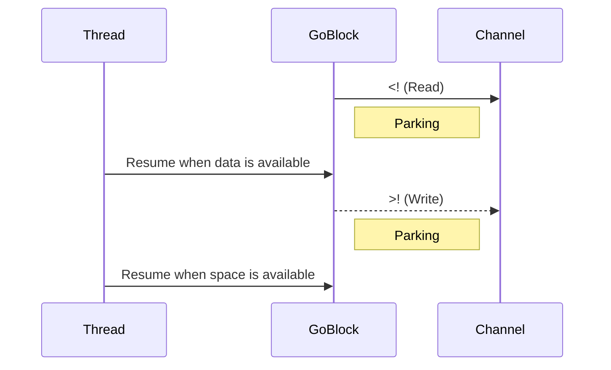

## 5.2.2 Go Blocks and Threading

In the realm of modern software development, the ability to handle asynchronous operations efficiently is crucial. Clojure's `core.async` library provides a robust framework for managing concurrency through the use of channels and `go` blocks. This section delves into the intricacies of `go` blocks, exploring how they enable asynchronous code execution, manage thread pools, and handle exceptions. By understanding these concepts, you'll be equipped to build highly responsive and efficient applications in Clojure.

### Understanding the `go` Macro

The `go` macro is a cornerstone of Clojure's `core.async` library, designed to facilitate asynchronous programming by allowing code to be executed in a non-blocking manner. Unlike traditional threading models where threads are blocked during I/O operations, `go` blocks leverage a concept known as "parking" to yield control and resume execution later, thus optimizing resource utilization.

#### How `go` Blocks Work

A `go` block is essentially a lightweight thread that executes code asynchronously. When a `go` block encounters an operation that would typically block, such as reading from or writing to a channel, it "parks" the execution. This means the `go` block's state is saved, and the underlying thread is freed to perform other tasks. Once the blocking operation can proceed, the `go` block is resumed, continuing from where it left off.

Here's a simple example of a `go` block:

```clojure
(require '[clojure.core.async :refer [go chan <! >!]])

(defn async-operation []
  (let [c (chan)]
    (go
      (let [result (<! (async-task))]
        (>! c result)))
    c))

(defn async-task []
  (go
    (Thread/sleep 1000) ; Simulate a delay
    "Task completed"))
```

In this example, the `async-operation` function creates a channel `c` and a `go` block. The `go` block waits for the result of `async-task` using the `<!` operator, which is a non-blocking read from the channel returned by `async-task`. Once the result is available, it is put onto channel `c` using `>!`.

### Parking vs. Blocking

The distinction between parking and blocking is fundamental to understanding the efficiency of `go` blocks. 

- **Blocking:** In traditional threading models, a blocked thread is unable to perform any other task until the blocking operation completes. This can lead to inefficient resource usage, especially when dealing with numerous concurrent operations.
  
- **Parking:** In contrast, parking allows a `go` block to yield control when it encounters a blocking operation. The thread executing the `go` block is freed, allowing it to execute other tasks. This approach maximizes CPU utilization and improves the responsiveness of applications.

#### Visualizing Parking and Blocking



In this sequence diagram, the `GoBlock` parks when it attempts to read from or write to a `Channel`. The `Thread` is freed during this time and only resumes the `GoBlock` when the operation can proceed.

### Thread Pool Management in core.async

Clojure's `core.async` library manages concurrency using a thread pool, which is a collection of threads that can be reused to execute tasks. This approach reduces the overhead associated with creating and destroying threads, leading to more efficient execution of concurrent operations.

#### Default Thread Pools

By default, `core.async` uses two thread pools:

1. **Go Block Thread Pool:** This pool is used for executing `go` blocks. It is optimized for tasks that involve asynchronous I/O operations and can handle a large number of parked operations efficiently.

2. **Blocking Thread Pool:** This pool is used for operations that may block, such as those involving synchronous I/O. It is designed to handle a smaller number of threads to prevent resource exhaustion.

#### Customizing Thread Pools

In some cases, you may need to customize the thread pools to better suit your application's needs. This can be achieved by configuring the `core.async` library to use custom thread pools, allowing you to control the number of threads and their behavior.

Here's an example of how to configure a custom thread pool:

```clojure
(require '[clojure.core.async :refer [thread-call]])

(defn custom-thread-pool []
  (let [executor (java.util.concurrent.Executors/newFixedThreadPool 10)]
    (fn [f]
      (.execute executor f))))

(set! clojure.core.async/thread-call custom-thread-pool)
```

In this example, a fixed thread pool with 10 threads is created using Java's `Executors` class. The `custom-thread-pool` function is then set as the thread pool for `core.async` operations using `set!`.

### Exception Handling in `go` Blocks

Handling exceptions in asynchronous code can be challenging, as errors may occur at any point during execution. In `go` blocks, exceptions are not automatically propagated to the calling context, so it is essential to handle them explicitly.

#### Catching Exceptions

To handle exceptions within a `go` block, you can use the `try-catch` construct. This allows you to catch and process exceptions, ensuring that your application can recover gracefully from errors.

Here's an example of exception handling in a `go` block:

```clojure
(require '[clojure.core.async :refer [go chan <! >!]])

(defn safe-async-operation []
  (let [c (chan)]
    (go
      (try
        (let [result (<! (async-task))]
          (>! c result))
        (catch Exception e
          (println "Error occurred:" (.getMessage e))
          (>! c :error))))
    c))
```

In this example, the `safe-async-operation` function includes a `try-catch` block within the `go` block. If an exception occurs during the execution of `async-task`, it is caught, and an error message is printed. The channel `c` is then used to signal an error condition by putting `:error` onto it.

#### Propagating Exceptions

In some cases, you may want to propagate exceptions to the calling context. This can be achieved by using a combination of channels and exception handling logic.

```clojure
(defn async-with-exception []
  (let [c (chan)]
    (go
      (try
        (let [result (<! (async-task))]
          (>! c result))
        (catch Exception e
          (>! c (ex-info "Async error" {:cause e})))))
    c))

(defn handle-result []
  (let [result-chan (async-with-exception)]
    (go
      (let [result (<! result-chan)]
        (if (instance? clojure.lang.ExceptionInfo result)
          (println "Caught exception:" (:cause (ex-data result)))
          (println "Result:" result))))))
```

In this example, the `async-with-exception` function propagates exceptions by putting an `ExceptionInfo` object onto the channel. The `handle-result` function then checks if the result is an exception and handles it accordingly.

### Best Practices for Using `go` Blocks

When working with `go` blocks and asynchronous programming in Clojure, consider the following best practices:

1. **Minimize Blocking Operations:** Avoid performing blocking operations within `go` blocks. Use non-blocking I/O and leverage channels for communication.

2. **Limit Side Effects:** Keep `go` blocks pure and free of side effects whenever possible. This makes your code easier to reason about and test.

3. **Use Channels for Coordination:** Use channels to coordinate between `go` blocks and other parts of your application. This promotes decoupling and improves maintainability.

4. **Monitor Thread Pool Usage:** Keep an eye on thread pool usage to ensure that your application remains responsive. Adjust thread pool sizes as needed to accommodate varying workloads.

5. **Handle Exceptions Gracefully:** Always handle exceptions within `go` blocks to prevent unexpected crashes and ensure that your application can recover from errors.

### Conclusion

The `go` macro and threading model in Clojure's `core.async` library provide powerful tools for building asynchronous applications. By understanding the concepts of parking, thread pool management, and exception handling, you can create efficient and responsive systems that leverage the full potential of Clojure's concurrency capabilities. With these skills, you'll be well-equipped to tackle the challenges of modern enterprise development.

## Quiz Time!



### What is the primary purpose of the `go` macro in Clojure's core.async library?

- [x] To enable asynchronous code execution
- [ ] To block threads during I/O operations
- [ ] To manage database transactions
- [ ] To perform synchronous computations

> **Explanation:** The `go` macro is used to enable asynchronous code execution by allowing code to be executed in a non-blocking manner.

### How does a `go` block handle operations that would typically block?

- [x] By parking the execution and freeing the thread
- [ ] By blocking the thread until the operation completes
- [ ] By terminating the operation
- [ ] By creating a new thread for each operation

> **Explanation:** A `go` block parks the execution when it encounters a blocking operation, freeing the thread to perform other tasks.

### What is the difference between parking and blocking in the context of `go` blocks?

- [x] Parking yields control and resumes later, while blocking halts execution
- [ ] Parking halts execution, while blocking yields control
- [ ] Both parking and blocking halt execution
- [ ] Both parking and blocking yield control

> **Explanation:** Parking yields control and resumes execution later, while blocking halts execution until the operation completes.

### Which thread pool is used for executing `go` blocks in core.async?

- [x] Go Block Thread Pool
- [ ] Blocking Thread Pool
- [ ] Main Thread Pool
- [ ] Custom Thread Pool

> **Explanation:** The Go Block Thread Pool is used for executing `go` blocks, optimized for asynchronous I/O operations.

### How can you customize the thread pool used by core.async?

- [x] By configuring a custom thread pool and setting it with `set!`
- [ ] By modifying the default thread pool directly
- [ ] By using a different library for threading
- [ ] By increasing the number of threads in the default pool

> **Explanation:** You can configure a custom thread pool and set it for core.async operations using `set!`.

### What construct is used to handle exceptions within a `go` block?

- [x] try-catch
- [ ] if-else
- [ ] loop-recur
- [ ] let-binding

> **Explanation:** The `try-catch` construct is used to handle exceptions within a `go` block.

### How can exceptions be propagated from a `go` block to the calling context?

- [x] By putting an ExceptionInfo object onto a channel
- [ ] By throwing the exception directly
- [ ] By logging the exception
- [ ] By ignoring the exception

> **Explanation:** Exceptions can be propagated by putting an `ExceptionInfo` object onto a channel, allowing the calling context to handle it.

### What is a best practice when working with `go` blocks?

- [x] Minimize blocking operations within `go` blocks
- [ ] Perform all I/O operations within `go` blocks
- [ ] Use `go` blocks for synchronous computations
- [ ] Avoid using channels for communication

> **Explanation:** It is best practice to minimize blocking operations within `go` blocks to ensure efficient execution.

### Why is it important to handle exceptions within `go` blocks?

- [x] To prevent unexpected crashes and ensure recovery
- [ ] To increase the execution speed
- [ ] To block other threads from executing
- [ ] To simplify the code

> **Explanation:** Handling exceptions within `go` blocks prevents unexpected crashes and ensures that the application can recover from errors.

### True or False: A `go` block automatically propagates exceptions to the calling context.

- [ ] True
- [x] False

> **Explanation:** False. A `go` block does not automatically propagate exceptions; they must be handled explicitly.


