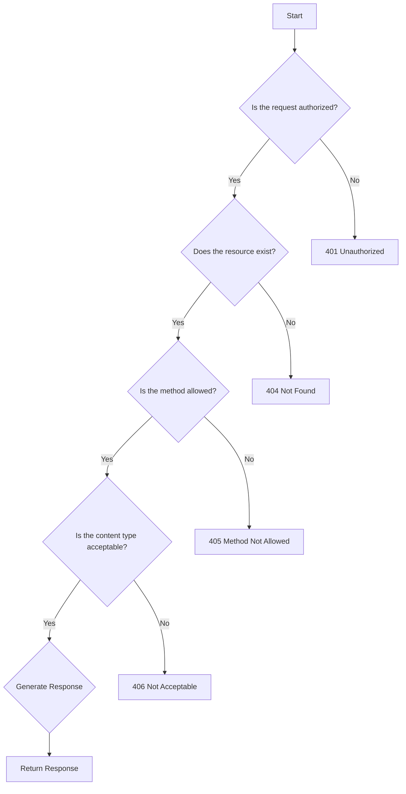

## 7.2.1 Introducing Liberator

In the realm of web development, RESTful APIs have become a cornerstone for enabling communication between distributed systems. Clojure, with its functional programming paradigm, offers a unique approach to building these APIs. Among the tools available, Liberator stands out as a powerful library designed to simplify the creation of RESTful services by handling the complexities of HTTP semantics. In this section, we will delve into the intricacies of Liberator, exploring its features, installation process, and how it leverages the HTTP decision graph to streamline request processing.

### Liberator Overview

Liberator is a Clojure library that abstracts the intricacies of HTTP protocol management, allowing developers to focus on the business logic of their applications. It provides a declarative approach to defining resources, where each resource is a function of the request, response, and the state of the application. By handling the nuances of HTTP, such as content negotiation, caching, and status code generation, Liberator enables developers to build robust and compliant RESTful APIs with minimal boilerplate code.

#### Key Features of Liberator

1. **Declarative Resource Definition:** Liberator allows you to define resources in a declarative manner, specifying how requests should be processed and responses generated based on the state of the application.

2. **HTTP Semantics Handling:** It automates the management of HTTP semantics, including content negotiation, caching, and status code generation, ensuring compliance with REST principles.

3. **Decision Graph:** Liberator uses an HTTP decision graph to process requests, making it easy to implement complex decision-making logic in a structured way.

4. **Extensibility:** The library is highly extensible, allowing developers to customize behavior and integrate with other Clojure libraries seamlessly.

5. **Rich Ecosystem:** Liberator integrates well with other Clojure web development tools, such as Ring and Compojure, providing a comprehensive solution for building web applications.

### Decision Graph: The Core of Liberator

At the heart of Liberator's functionality is the HTTP decision graph, a structured flowchart that models the process of handling an HTTP request. This decision graph is based on the HTTP specification and provides a clear path for determining the appropriate response for a given request. By following this graph, Liberator ensures that all aspects of HTTP semantics are considered, including authentication, authorization, content negotiation, and caching.

#### Understanding the HTTP Decision Graph

The HTTP decision graph is a series of decision points that guide the processing of an HTTP request. Each decision point represents a specific aspect of the request that needs to be evaluated, such as whether the request is authorized or if the requested resource exists. The outcome of each decision point determines the next step in the process, ultimately leading to the generation of an appropriate HTTP response.

Here is a simplified representation of the HTTP decision graph:



In this graph, each node represents a decision point, and the edges represent the possible outcomes of those decisions. By following this structured approach, Liberator can handle complex request processing logic while ensuring compliance with HTTP standards.

### Installation: Adding Liberator to Your Project

Getting started with Liberator is straightforward, thanks to Clojure's robust build tool, Leiningen. To add Liberator to your project, you need to include it as a dependency in your `project.clj` file. Here are the steps to install Liberator:

1. **Create a New Clojure Project:**

   If you haven't already created a Clojure project, you can do so using Leiningen. Open your terminal and run the following command:

   ```bash
   lein new app my-liberator-app
   ```

   This command will create a new Clojure application named `my-liberator-app`.

2. **Add Liberator as a Dependency:**

   Open the `project.clj` file in your project's root directory and add Liberator to the `:dependencies` vector. As of the latest version, you can include Liberator like this:

   ```clojure
   (defproject my-liberator-app "0.1.0-SNAPSHOT"
     :description "A simple RESTful API using Liberator"
     :dependencies [[org.clojure/clojure "1.10.3"]
                    [liberator "0.15.3"]]
     :main ^:skip-aot my-liberator-app.core
     :target-path "target/%s"
     :profiles {:uberjar {:aot :all}})
   ```

3. **Run Leiningen to Fetch Dependencies:**

   After updating the `project.clj` file, run the following command in your terminal to fetch the Liberator library and its dependencies:

   ```bash
   lein deps
   ```

   This command will download and install all necessary dependencies, making Liberator available for use in your project.

4. **Verify Installation:**

   To verify that Liberator has been installed correctly, you can start a REPL session and require the Liberator namespace:

   ```bash
   lein repl
   ```

   Once the REPL is running, enter the following command:

   ```clojure
   (require '[liberator.core :refer [defresource]])
   ```

   If there are no errors, Liberator is successfully installed and ready to use in your project.

### Building a Simple RESTful API with Liberator

Now that Liberator is installed, let's build a simple RESTful API to demonstrate its capabilities. We will create a basic API that manages a collection of books, allowing clients to perform CRUD (Create, Read, Update, Delete) operations.

#### Step 1: Define the Resource

In Liberator, a resource is defined using the `defresource` macro. This macro allows you to specify how requests should be processed and responses generated. Here's an example of defining a resource for managing books:

```clojure
(ns my-liberator-app.core
  (:require [liberator.core :refer [defresource]]
            [ring.adapter.jetty :refer [run-jetty]]))

(def books (atom {}))

(defresource book-resource [id]
  :available-media-types ["application/json"]
  :allowed-methods [:get :put :delete]
  :exists? (fn [ctx] (get @books id))
  :handle-ok (fn [ctx] (get @books id))
  :put! (fn [ctx] (swap! books assoc id (get-in ctx [:request :body])))
  :delete! (fn [ctx] (swap! books dissoc id)))
```

In this example, we define a `book-resource` that handles GET, PUT, and DELETE requests. The resource uses an atom `books` to store book data, and the `exists?`, `handle-ok`, `put!`, and `delete!` functions define how requests are processed.

#### Step 2: Start the Server

To serve the resource, we need to start an HTTP server. We'll use Ring's Jetty adapter to run the server:

```clojure
(defn -main []
  (run-jetty (book-resource) {:port 8080 :join? false}))
```

This code starts a Jetty server on port 8080, serving the `book-resource`.

#### Step 3: Test the API

With the server running, you can test the API using a tool like `curl` or Postman. Here are some example requests:

- **Create or Update a Book:**

  ```bash
  curl -X PUT -H "Content-Type: application/json" -d '{"title": "Clojure for the Brave and True"}' http://localhost:8080/books/1
  ```

- **Retrieve a Book:**

  ```bash
  curl -X GET http://localhost:8080/books/1
  ```

- **Delete a Book:**

  ```bash
  curl -X DELETE http://localhost:8080/books/1
  ```

### Best Practices and Common Pitfalls

When working with Liberator, it's important to follow best practices to ensure your API is robust and maintainable. Here are some tips:

1. **Leverage the Decision Graph:** Take advantage of Liberator's decision graph to handle complex request processing logic. This approach ensures your API is compliant with HTTP standards.

2. **Use Middleware Wisely:** Integrate Liberator with Ring middleware to add functionality such as logging, authentication, and error handling.

3. **Test Thoroughly:** Write comprehensive tests for your API to ensure it behaves as expected under various conditions. Use tools like `clojure.test` and `ring-mock` for testing.

4. **Optimize for Performance:** Monitor the performance of your API and optimize as needed. Consider using caching strategies to reduce server load and improve response times.

5. **Document Your API:** Provide clear documentation for your API, including endpoint descriptions, request/response formats, and example usage. Tools like Swagger can help automate this process.

### Conclusion

Liberator is a powerful tool for building RESTful APIs in Clojure, offering a declarative approach to resource definition and comprehensive handling of HTTP semantics. By leveraging the HTTP decision graph, Liberator simplifies the process of request processing, allowing developers to focus on the business logic of their applications. With its extensibility and integration capabilities, Liberator is an excellent choice for building robust and compliant RESTful services.

## Quiz Time!



### What is the primary purpose of Liberator in Clojure?

- [x] To simplify the creation of RESTful APIs by handling HTTP semantics
- [ ] To provide a database abstraction layer
- [ ] To manage user authentication
- [ ] To serve static files

> **Explanation:** Liberator is designed to simplify RESTful API development by managing HTTP semantics, such as content negotiation and status code generation.

### What is the HTTP decision graph used for in Liberator?

- [x] To process HTTP requests and determine the appropriate response
- [ ] To manage database transactions
- [ ] To handle user authentication
- [ ] To serve static content

> **Explanation:** The HTTP decision graph is a structured flowchart used by Liberator to process HTTP requests and ensure compliance with HTTP standards.

### How do you add Liberator to a Clojure project using Leiningen?

- [x] By adding it to the `:dependencies` vector in the `project.clj` file
- [ ] By installing it via npm
- [ ] By downloading a JAR file and adding it to the classpath
- [ ] By including it in the `pom.xml` file

> **Explanation:** Liberator is added to a Clojure project by specifying it as a dependency in the `project.clj` file used by Leiningen.

### Which of the following is a key feature of Liberator?

- [x] Declarative resource definition
- [ ] Automatic database migration
- [ ] Built-in user authentication
- [ ] Static file serving

> **Explanation:** Liberator allows for declarative resource definition, enabling developers to specify how requests should be processed and responses generated.

### What is the role of the `defresource` macro in Liberator?

- [x] To define a RESTful resource and its behavior
- [ ] To create a new database connection
- [ ] To manage user sessions
- [ ] To serve static files

> **Explanation:** The `defresource` macro is used to define a RESTful resource in Liberator, specifying how it should handle requests and generate responses.

### Which HTTP status code does Liberator return if a resource does not exist?

- [x] 404 Not Found
- [ ] 200 OK
- [ ] 401 Unauthorized
- [ ] 500 Internal Server Error

> **Explanation:** If a resource does not exist, Liberator returns a 404 Not Found status code, indicating that the requested resource could not be found.

### What is the purpose of the `exists?` function in a Liberator resource?

- [x] To check if the requested resource exists
- [ ] To authenticate the user
- [ ] To validate the request body
- [ ] To log the request details

> **Explanation:** The `exists?` function is used to determine if the requested resource exists, influencing the response generated by Liberator.

### How can you test a Liberator API locally?

- [x] By using tools like `curl` or Postman to send HTTP requests
- [ ] By writing SQL queries
- [ ] By running a JavaScript test suite
- [ ] By deploying to a production server

> **Explanation:** You can test a Liberator API locally by using tools like `curl` or Postman to send HTTP requests and verify the responses.

### True or False: Liberator automatically handles content negotiation for RESTful APIs.

- [x] True
- [ ] False

> **Explanation:** Liberator automatically manages content negotiation, ensuring that the response format matches the client's preferences as specified in the request headers.

### Which of the following is a best practice when using Liberator?

- [x] Write comprehensive tests for your API
- [ ] Avoid using middleware
- [ ] Hardcode all response data
- [ ] Disable content negotiation

> **Explanation:** Writing comprehensive tests for your API is a best practice to ensure it behaves correctly under various conditions and scenarios.


