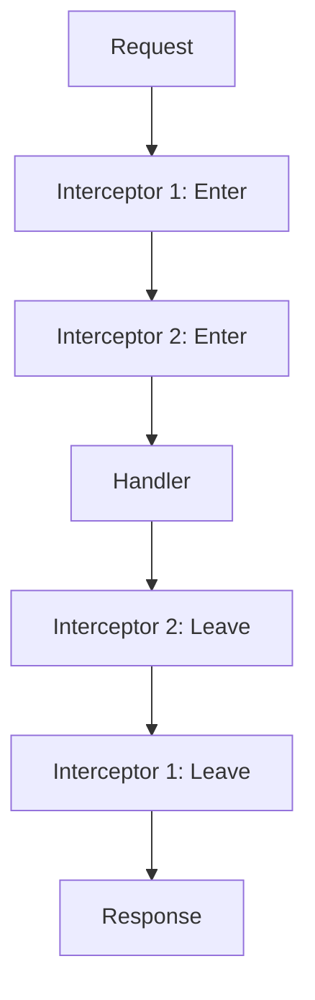

## 8.3.1 The Interceptor Chain

In the realm of web development, particularly when dealing with complex enterprise applications, managing the flow of requests and responses efficiently is paramount. Pedestal, a powerful Clojure framework, introduces the concept of interceptors to facilitate this process. Interceptors provide a flexible and modular way to handle cross-cutting concerns such as authentication, logging, and error handling, enhancing the overall architecture of web services.

### Understanding the Interceptor Concept

Interceptors in Pedestal are akin to middleware in other web frameworks, but with a more structured approach. They are designed to intercept requests and responses, allowing developers to insert custom logic at various points in the processing pipeline. This modularity enables developers to compose complex behaviors from simple, reusable components.

An interceptor is essentially a map with two primary functions: `:enter` and `:leave`. The `:enter` function is executed when a request enters the interceptor chain, while the `:leave` function is executed when a response leaves the chain. This dual-phase execution allows interceptors to modify both the incoming request and the outgoing response, providing a comprehensive mechanism for request/response manipulation.

### Execution Flow of Interceptors

The execution flow of interceptors is a key aspect of their functionality. When a request is received, it traverses the interceptor chain in a forward direction, executing the `:enter` function of each interceptor. Once the request reaches the handler, it is processed, and the response begins its journey back through the chain in reverse, executing the `:leave` function of each interceptor.

This bidirectional flow can be visualized as follows:



#### Forward Phase

- **Request Processing:** As the request moves forward through the chain, each interceptor's `:enter` function is executed. This phase is typically used for tasks such as request validation, authentication, and logging.
- **Handler Execution:** Once the request reaches the end of the chain, it is passed to the handler, which processes the request and generates a response.

#### Reverse Phase

- **Response Processing:** The response travels back through the chain, executing each interceptor's `:leave` function. This phase is often used for response transformation, adding headers, or logging response details.
- **Final Response:** After passing through all interceptors, the final response is sent back to the client.

### Built-In Interceptors in Pedestal

Pedestal provides a set of built-in interceptors that cover common use cases, allowing developers to leverage existing functionality without reinventing the wheel. Some of the most commonly used built-in interceptors include:

#### 1. `pedestal.interceptor.chain/terminator`

The terminator interceptor is responsible for terminating the interceptor chain. It ensures that once the response is generated, it is not further processed by any additional interceptors. This is particularly useful for handling errors or short-circuiting the chain when certain conditions are met.

#### 2. `pedestal.interceptor.helpers/before`

This interceptor allows developers to execute custom logic before the request reaches the handler. It is commonly used for authentication, authorization, and request validation.

#### 3. `pedestal.interceptor.helpers/after`

The `after` interceptor is executed after the handler has processed the request. It is typically used for response transformation, such as adding headers or modifying the response body.

#### 4. `pedestal.interceptor.helpers/on-error`

Error handling is a crucial aspect of web development, and the `on-error` interceptor provides a mechanism to handle exceptions gracefully. It allows developers to define custom error handling logic, ensuring that errors are logged and appropriate responses are returned to the client.

#### 5. `pedestal.interceptor.helpers/log`

Logging is an essential part of any application, and the `log` interceptor provides a simple way to log requests and responses. It can be configured to log specific details, such as request parameters, headers, and response status codes.

### Practical Code Examples

To illustrate the use of interceptors in Pedestal, let's consider a simple example of a web service that authenticates requests and logs request details.

```clojure
(ns my-app.service
  (:require [io.pedestal.http :as http]
            [io.pedestal.interceptor :as interceptor]
            [io.pedestal.interceptor.helpers :refer [before after log]]))

(defn authenticate [context]
  (let [auth-header (get-in context [:request :headers "authorization"])]
    (if (valid-auth? auth-header)
      context
      (assoc context :response {:status 401 :body "Unauthorized"}))))

(defn valid-auth? [auth-header]
  ;; Placeholder for authentication logic
  (= auth-header "Bearer valid-token"))

(defn handler [request]
  {:status 200 :body "Hello, World!"})

(def interceptors
  [(before ::authenticate authenticate)
   (log)
   (after ::log-response (fn [context]
                           (println "Response:" (:response context))
                           context))])

(def service
  {:env :prod
   ::http/routes #{["/hello" :get (conj interceptors handler)]}
   ::http/type :jetty
   ::http/port 8080})

(defn start []
  (http/start service))
```

In this example:

- The `authenticate` interceptor checks the `Authorization` header and returns a 401 response if the authentication fails.
- The `log` interceptor logs the request details.
- The `after` interceptor logs the response details after the handler has processed the request.

### Best Practices for Using Interceptors

When working with interceptors, it's essential to follow best practices to ensure maintainability and scalability:

1. **Modularity:** Keep interceptors small and focused on a single responsibility. This makes them easier to test and reuse across different parts of the application.

2. **Order Matters:** The order of interceptors in the chain is crucial. Ensure that interceptors are arranged logically, with authentication and validation interceptors placed before others.

3. **Error Handling:** Implement comprehensive error handling using the `on-error` interceptor to catch and log exceptions, providing meaningful responses to clients.

4. **Testing:** Write unit tests for each interceptor to verify their behavior in isolation. This ensures that changes to one interceptor do not inadvertently affect others.

5. **Performance:** Be mindful of the performance impact of interceptors, especially those that perform I/O operations. Consider using asynchronous processing where appropriate.

### Common Pitfalls and Optimization Tips

While interceptors offer significant benefits, there are common pitfalls to avoid:

- **Overloading Interceptors:** Avoid packing too much logic into a single interceptor. This can lead to complex and hard-to-maintain code.
- **Ignoring Error Handling:** Failing to handle errors properly can result in uninformative responses and a poor user experience.
- **Neglecting Performance:** Interceptors that perform heavy computations or I/O operations can become bottlenecks. Profile and optimize these interceptors to ensure they do not degrade performance.

### Conclusion

The interceptor chain in Pedestal is a powerful tool for managing request and response processing in Clojure web applications. By understanding the execution flow and leveraging built-in interceptors, developers can create robust and scalable web services. Following best practices and avoiding common pitfalls will ensure that interceptors enhance the application's architecture, providing a solid foundation for enterprise integration.

## Quiz Time!



### What is the primary role of interceptors in Pedestal?

- [x] To manage request and response processing
- [ ] To handle database connections
- [ ] To generate HTML templates
- [ ] To configure server settings

> **Explanation:** Interceptors are designed to manage request and response processing, allowing developers to insert custom logic at various points in the processing pipeline.

### How are interceptors executed in Pedestal?

- [x] In a chain, with a forward and reverse phase
- [ ] Only in a forward phase
- [ ] Only in a reverse phase
- [ ] Randomly

> **Explanation:** Interceptors are executed in a chain, with a forward phase for request processing and a reverse phase for response processing.

### Which function is executed when a request enters an interceptor?

- [x] :enter
- [ ] :leave
- [ ] :error
- [ ] :finalize

> **Explanation:** The `:enter` function is executed when a request enters an interceptor, allowing for request manipulation.

### What is the purpose of the `:leave` function in an interceptor?

- [x] To process the response as it leaves the interceptor
- [ ] To initialize the interceptor
- [ ] To handle errors
- [ ] To terminate the chain

> **Explanation:** The `:leave` function is executed as the response leaves the interceptor, allowing for response manipulation.

### Which built-in interceptor is used for logging requests and responses?

- [x] pedestal.interceptor.helpers/log
- [ ] pedestal.interceptor.chain/terminator
- [ ] pedestal.interceptor.helpers/before
- [ ] pedestal.interceptor.helpers/on-error

> **Explanation:** The `log` interceptor is used for logging requests and responses, providing a simple way to capture request details.

### What is a common use case for the `before` interceptor?

- [x] Authentication and request validation
- [ ] Response transformation
- [ ] Error handling
- [ ] Logging

> **Explanation:** The `before` interceptor is commonly used for tasks such as authentication and request validation before the request reaches the handler.

### How can errors be handled in the interceptor chain?

- [x] Using the on-error interceptor
- [ ] Using the log interceptor
- [ ] Using the before interceptor
- [ ] Using the after interceptor

> **Explanation:** The `on-error` interceptor provides a mechanism to handle exceptions gracefully, ensuring that errors are logged and appropriate responses are returned.

### What is a best practice when arranging interceptors in the chain?

- [x] Place authentication and validation interceptors before others
- [ ] Place logging interceptors at the end
- [ ] Place error handling interceptors at the start
- [ ] Place all interceptors in alphabetical order

> **Explanation:** Authentication and validation interceptors should be placed early in the chain to ensure requests are validated before further processing.

### What should be avoided when using interceptors?

- [x] Packing too much logic into a single interceptor
- [ ] Using built-in interceptors
- [ ] Writing unit tests for interceptors
- [ ] Logging requests and responses

> **Explanation:** Packing too much logic into a single interceptor can lead to complex and hard-to-maintain code. It's better to keep interceptors small and focused.

### True or False: Interceptors can only modify requests, not responses.

- [ ] True
- [x] False

> **Explanation:** Interceptors can modify both requests and responses, allowing for comprehensive manipulation of the request/response lifecycle.


