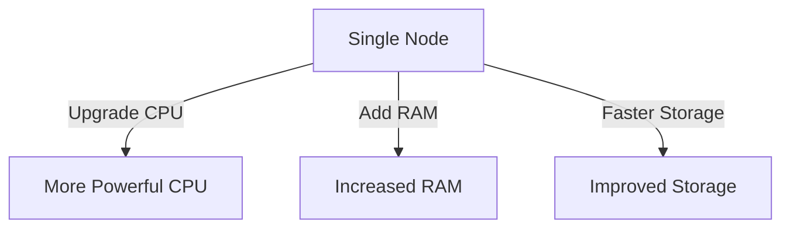
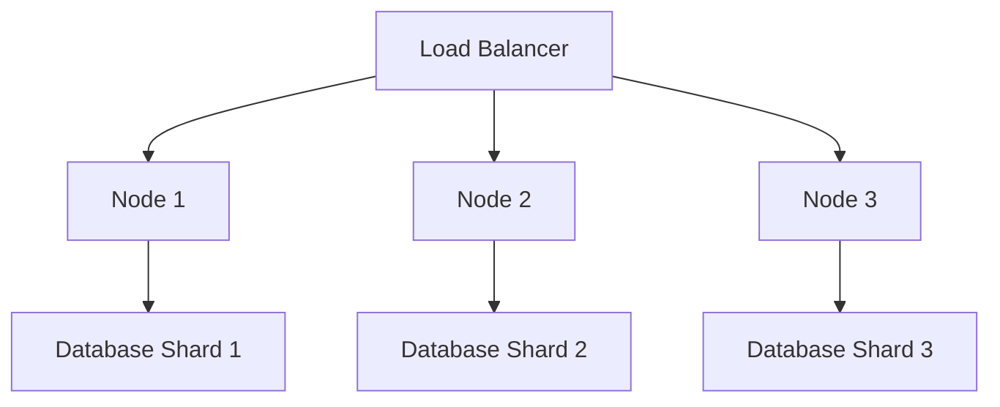

## 1.3.1 Scaling Vertically vs. Horizontally

In the realm of distributed systems and NoSQL databases, scalability is a paramount concern. As data volumes grow and application demands increase, the ability to scale efficiently becomes crucial for maintaining performance and ensuring availability. This section delves into the two primary scaling strategies: vertical scaling and horizontal scaling. We will explore their differences, limitations, and benefits, providing you with a comprehensive understanding of how to apply these strategies effectively in your Clojure and NoSQL projects.

### Understanding Vertical Scaling

Vertical scaling, also known as "scaling up," involves adding more resources to a single node in a system. This could mean upgrading the server with more powerful CPUs, additional RAM, or faster storage. The goal is to enhance the capacity of the existing hardware to handle increased load.

#### Advantages of Vertical Scaling

1. **Simplicity**: Vertical scaling is often easier to implement than horizontal scaling. It involves upgrading existing hardware rather than adding new nodes to the system.
2. **Reduced Complexity**: Since the architecture remains unchanged, there is no need to modify the application to handle distributed processes or data partitioning.
3. **Consistency**: Maintaining data consistency is simpler in a single-node environment, as there are no concerns about data synchronization across multiple nodes.

#### Limitations of Vertical Scaling

1. **Finite Limits**: There is a physical limit to how much you can scale vertically. Once you reach the maximum capacity of your hardware, further scaling requires a complete system overhaul.
2. **Cost**: High-performance hardware can be expensive, and the cost increases exponentially as you approach the upper limits of technology.
3. **Single Point of Failure**: Relying on a single node increases the risk of a complete system failure if that node experiences issues.

### Exploring Horizontal Scaling

Horizontal scaling, or "scaling out," involves adding more nodes to a system, distributing the load across multiple machines. This approach is fundamental to building distributed systems and is a key feature of many NoSQL databases.

#### Benefits of Horizontal Scaling

1. **Unlimited Growth**: In theory, you can continue to add nodes indefinitely, allowing for virtually unlimited growth.
2. **Cost Efficiency**: Instead of investing in high-end hardware, you can use commodity servers, which are often more cost-effective.
3. **Fault Tolerance**: With multiple nodes, the system can continue to operate even if one node fails, enhancing reliability and availability.

#### Challenges of Horizontal Scaling

1. **Complexity**: Managing a distributed system is inherently more complex. It requires careful planning around data partitioning, replication, and consistency.
2. **Network Overhead**: Communication between nodes introduces latency and requires robust network infrastructure.
3. **Consistency Models**: Ensuring data consistency across nodes can be challenging, often requiring trade-offs between consistency, availability, and partition tolerance (CAP theorem).

### Scaling Strategies and Their Impact

#### Vertical Scaling Strategies

1. **Hardware Upgrades**: This involves replacing existing components with more powerful ones. For example, upgrading from a quad-core to an octa-core processor or increasing RAM from 16GB to 64GB.
2. **Virtualization**: Using virtual machines or containers to optimize resource usage on a single physical server.

#### Horizontal Scaling Strategies

1. **Sharding**: Distributing data across multiple nodes, where each node is responsible for a subset of the data. This is common in NoSQL databases like MongoDB and Cassandra.
2. **Replication**: Copying data across multiple nodes to ensure availability and fault tolerance. This is often used in conjunction with sharding.
3. **Load Balancing**: Distributing incoming requests across multiple nodes to ensure no single node is overwhelmed.

#### Impact on Performance and Cost

- **Performance**: Horizontal scaling can significantly improve performance by distributing the load. However, it requires careful management to avoid bottlenecks, such as network latency or database contention.
- **Cost**: While horizontal scaling can be more cost-effective in terms of hardware, it often incurs additional costs in terms of network infrastructure and management complexity.

### Practical Code Examples

#### Vertical Scaling in Practice

Consider a scenario where you have a Clojure application running on a single server. To scale vertically, you might upgrade the server's hardware:

```shell
sudo upgrade-server --cpu 8 --ram 64GB --storage 1TB
```

This command illustrates the simplicity of vertical scaling, where you enhance the existing server's capabilities.

#### Horizontal Scaling with Clojure and NoSQL

For horizontal scaling, let's explore a simple example using MongoDB with Clojure. Suppose you have a distributed setup with multiple MongoDB instances:

```clojure
(ns myapp.db
  (:require [monger.core :as mg]
            [monger.collection :as mc]))

(defn connect-to-mongo []
  (let [conn (mg/connect {:hosts ["node1.example.com" "node2.example.com" "node3.example.com"]})]
    (mg/get-db conn "mydatabase")))

(defn insert-document [db doc]
  (mc/insert db "mycollection" doc))

(defn find-documents [db query]
  (mc/find-maps db "mycollection" query))
```

In this example, we connect to a MongoDB cluster with multiple nodes, distributing data and queries across them. This setup enhances fault tolerance and scalability.

### Diagrams and Visualizations

To better understand the differences between vertical and horizontal scaling, consider the following diagrams:

#### Vertical Scaling Diagram



#### Horizontal Scaling Diagram



### Best Practices and Common Pitfalls

#### Best Practices

1. **Plan for Growth**: Anticipate future scaling needs and design your architecture to accommodate both vertical and horizontal scaling.
2. **Monitor Performance**: Use monitoring tools to track system performance and identify bottlenecks early.
3. **Automate Scaling**: Implement automation to dynamically scale resources based on demand, especially in cloud environments.

#### Common Pitfalls

1. **Ignoring Network Latency**: In horizontally scaled systems, network latency can become a significant bottleneck if not managed properly.
2. **Overlooking Consistency**: Ensure that your data consistency model aligns with your application's requirements, especially in distributed systems.
3. **Underestimating Complexity**: Horizontal scaling introduces complexity that requires careful management and expertise.

### Conclusion

Understanding the differences between vertical and horizontal scaling is crucial for designing scalable data solutions. While vertical scaling offers simplicity and ease of implementation, it is limited by hardware constraints and cost. Horizontal scaling, on the other hand, provides virtually unlimited growth potential and fault tolerance but requires careful management of distributed systems.

By leveraging the strengths of both strategies, you can build robust, scalable applications that meet the demands of modern data-intensive environments. Whether you're scaling a Clojure application with MongoDB, Cassandra, or another NoSQL database, the key is to balance performance, cost, and complexity to achieve optimal results.

## Quiz Time!



### What is vertical scaling?

- [x] Adding more resources to a single node
- [ ] Adding more nodes to a system
- [ ] Distributing data across multiple nodes
- [ ] Implementing load balancing

> **Explanation:** Vertical scaling involves enhancing the capacity of a single node by adding more resources such as CPU, RAM, or storage.

### What is a primary limitation of vertical scaling?

- [x] Finite limits on hardware upgrades
- [ ] Increased network latency
- [ ] Complexity in managing distributed systems
- [ ] Difficulty in maintaining data consistency

> **Explanation:** Vertical scaling is limited by the maximum capacity of the hardware, beyond which further scaling requires a complete system overhaul.

### What is horizontal scaling?

- [x] Adding more nodes to a system
- [ ] Upgrading the hardware of a single node
- [ ] Implementing virtualization
- [ ] Increasing the storage capacity of a server

> **Explanation:** Horizontal scaling involves adding more nodes to a system, distributing the load across multiple machines.

### Which of the following is a benefit of horizontal scaling?

- [x] Fault tolerance
- [ ] Simplicity
- [ ] Reduced network overhead
- [ ] Easier consistency management

> **Explanation:** Horizontal scaling enhances fault tolerance by allowing the system to continue operating even if one node fails.

### What is sharding in the context of horizontal scaling?

- [x] Distributing data across multiple nodes
- [ ] Copying data across multiple nodes
- [ ] Upgrading server hardware
- [ ] Implementing load balancing

> **Explanation:** Sharding involves distributing data across multiple nodes, where each node is responsible for a subset of the data.

### Which scaling strategy is often more cost-effective in terms of hardware?

- [ ] Vertical scaling
- [x] Horizontal scaling
- [ ] Both are equally cost-effective
- [ ] Neither is cost-effective

> **Explanation:** Horizontal scaling is often more cost-effective as it allows the use of commodity servers instead of high-end hardware.

### What is a common pitfall of horizontal scaling?

- [x] Ignoring network latency
- [ ] Limited growth potential
- [ ] High cost of hardware
- [ ] Simplicity in implementation

> **Explanation:** In horizontally scaled systems, network latency can become a significant bottleneck if not managed properly.

### What is a common advantage of vertical scaling?

- [x] Simplicity
- [ ] Unlimited growth potential
- [ ] Fault tolerance
- [ ] Cost efficiency

> **Explanation:** Vertical scaling is often simpler to implement as it involves upgrading existing hardware rather than adding new nodes.

### What is a key consideration when implementing horizontal scaling?

- [x] Managing data consistency
- [ ] Upgrading server hardware
- [ ] Reducing network latency
- [ ] Simplifying architecture

> **Explanation:** Ensuring data consistency across nodes is a key consideration in horizontally scaled systems.

### True or False: Horizontal scaling allows for virtually unlimited growth by adding more nodes.

- [x] True
- [ ] False

> **Explanation:** Horizontal scaling allows for virtually unlimited growth by adding more nodes to the system, distributing the load across them.


