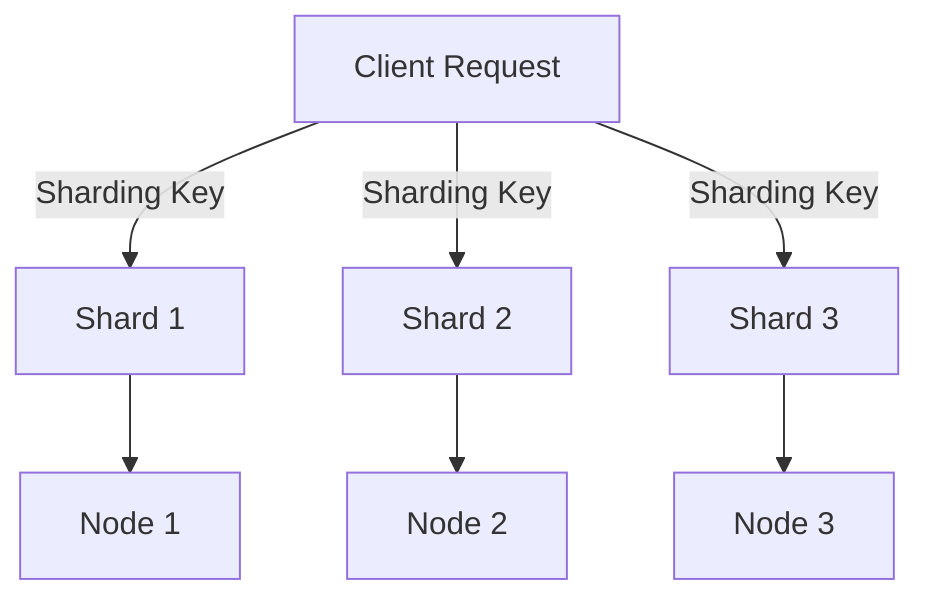

## 10.1.1 Horizontal Scaling Fundamentals

In the realm of modern data management, the ability to scale applications seamlessly is paramount. As data volumes grow exponentially, traditional vertical scaling approaches—adding more power to a single server—often fall short. Horizontal scaling, which involves distributing data and workloads across multiple nodes, emerges as a robust solution. This section delves into the fundamentals of horizontal scaling with a focus on sharding, a key technique used in NoSQL databases to manage large datasets efficiently. We will explore the principles of sharding, its benefits, challenges, and how it can be effectively implemented using Clojure.

### Understanding Horizontal Scaling

Horizontal scaling, also known as scale-out, refers to the process of adding more machines or nodes to a system to handle increased load. Unlike vertical scaling, which enhances the capacity of a single machine, horizontal scaling distributes the load across multiple nodes, thereby improving fault tolerance, availability, and performance. This approach is particularly suited for NoSQL databases, which are designed to operate in distributed environments.

#### Key Characteristics of Horizontal Scaling

1. **Decentralization**: Data and processing are distributed across multiple nodes, reducing the risk of a single point of failure.
2. **Elasticity**: Nodes can be added or removed dynamically based on demand, providing flexibility and cost-efficiency.
3. **Fault Tolerance**: The system can continue to function even if some nodes fail, as data is replicated across multiple nodes.
4. **Load Balancing**: Workloads are evenly distributed across nodes, preventing bottlenecks and ensuring optimal resource utilization.

### Sharding: The Backbone of Horizontal Scaling

Sharding is a database architecture pattern that involves partitioning data into smaller, more manageable pieces called shards. Each shard is a subset of the entire dataset and is stored on a separate node. Sharding is crucial for horizontal scaling as it allows databases to handle large volumes of data by distributing it across multiple nodes.

#### How Sharding Works

Sharding involves dividing a dataset into distinct shards based on a sharding key. The sharding key is a field or set of fields that determine how data is partitioned. Each shard is stored on a different node, and the database management system ensures that queries are routed to the appropriate shard based on the sharding key.



#### Benefits of Sharding

1. **Scalability**: Sharding enables databases to scale horizontally by adding more nodes, thus accommodating growing data volumes and user loads.
2. **Performance**: By distributing data across multiple nodes, sharding reduces the load on individual nodes, leading to faster query response times.
3. **Availability**: Sharded databases can continue to operate even if some nodes fail, as data is replicated across multiple shards.
4. **Cost-Effectiveness**: Horizontal scaling through sharding allows organizations to use commodity hardware, reducing infrastructure costs.

#### Challenges of Sharding

1. **Complexity**: Implementing and managing a sharded architecture can be complex, requiring careful planning and maintenance.
2. **Data Distribution**: Ensuring even distribution of data across shards is challenging and requires an effective sharding key.
3. **Cross-Shard Queries**: Queries that span multiple shards can be inefficient and require additional processing.
4. **Consistency**: Maintaining data consistency across shards can be difficult, especially in systems with high write loads.

### Implementing Sharding in NoSQL Databases

NoSQL databases, such as MongoDB, Cassandra, and DynamoDB, are designed to support sharding natively. Each database has its own approach to sharding, and understanding these differences is crucial for effective implementation.

#### MongoDB Sharding

MongoDB uses a range-based sharding strategy, where data is partitioned based on a sharding key. The sharding key is a field that determines how data is distributed across shards. MongoDB's sharding architecture consists of three main components:

1. **Shards**: Each shard is a replica set that stores a subset of the data.
2. **Config Servers**: These servers store metadata and configuration settings for the sharded cluster.
3. **Query Routers**: Also known as mongos instances, these route client requests to the appropriate shards.

```clojure
(ns myapp.mongodb
  (:require [monger.core :as mg]
            [monger.collection :as mc]))

(defn connect-to-mongo []
  (mg/connect!)
  (mg/set-db! (mg/get-db "mydatabase")))

(defn shard-collection [collection-name sharding-key]
  (mc/ensure-index collection-name {sharding-key 1})
  (mc/shard-collection collection-name sharding-key))

(connect-to-mongo)
(shard-collection "users" "user_id")
```

#### Cassandra Sharding

Cassandra employs a consistent hashing mechanism for sharding, where data is distributed across nodes based on a partition key. This approach ensures even distribution of data and minimizes the risk of hotspots.

```clojure
(ns myapp.cassandra
  (:require [clojurewerkz.cassaforte.client :as client]
            [clojurewerkz.cassaforte.query :as q]))

(defn connect-to-cassandra []
  (client/connect ["127.0.0.1"]))

(defn create-keyspace []
  (q/create-keyspace "mykeyspace"
                     (q/with {:replication {:class "SimpleStrategy"
                                            :replication_factor 3}})))

(defn create-table []
  (q/create-table "users"
                  (q/with {:partition-key [:user_id]
                           :columns {:user_id :int
                                     :name :text
                                     :email :text}})))

(connect-to-cassandra)
(create-keyspace)
(create-table)
```

#### DynamoDB Sharding

DynamoDB uses a partition key to determine how data is distributed across shards. The partition key is a primary key that uniquely identifies each item in a table. DynamoDB automatically manages data distribution and scaling.

```clojure
(ns myapp.dynamodb
  (:require [amazonica.aws.dynamodbv2 :as dynamodb]))

(defn create-table []
  (dynamodb/create-table
    :table-name "users"
    :attribute-definitions [{:attribute-name "user_id" :attribute-type "S"}]
    :key-schema [{:attribute-name "user_id" :key-type "HASH"}]
    :provisioned-throughput {:read-capacity-units 5
                             :write-capacity-units 5}))

(create-table)
```

### Best Practices for Sharding

1. **Choose the Right Sharding Key**: The sharding key should ensure even distribution of data and minimize cross-shard queries.
2. **Monitor and Optimize**: Regularly monitor shard performance and re-balance shards as needed to maintain optimal performance.
3. **Plan for Growth**: Design the sharding architecture with future growth in mind, allowing for easy addition of new shards.
4. **Ensure Data Consistency**: Implement mechanisms to maintain data consistency across shards, especially in systems with high write loads.

### Conclusion

Horizontal scaling through sharding is a powerful technique for managing large datasets in NoSQL databases. By distributing data across multiple nodes, sharding enhances scalability, performance, and availability. However, it also introduces complexity and challenges that require careful planning and management. By understanding the principles of sharding and implementing best practices, developers can build scalable, resilient data solutions using Clojure and NoSQL databases.

## Quiz Time!



### What is horizontal scaling?

- [x] Adding more machines to a system to handle increased load
- [ ] Adding more power to a single machine
- [ ] Reducing the number of machines in a system
- [ ] Decreasing the load on a single machine

> **Explanation:** Horizontal scaling involves adding more machines or nodes to a system to distribute the load and improve performance and availability.

### What is sharding?

- [x] Partitioning data into smaller pieces stored on separate nodes
- [ ] Combining data from multiple nodes into a single node
- [ ] Encrypting data across multiple nodes
- [ ] Backing up data to multiple locations

> **Explanation:** Sharding is a technique that partitions data into smaller, more manageable pieces called shards, which are stored on separate nodes.

### What is a sharding key?

- [x] A field that determines how data is partitioned across shards
- [ ] A key used to encrypt data across shards
- [ ] A key that identifies a specific node in a cluster
- [ ] A field that combines data from multiple shards

> **Explanation:** The sharding key is a field or set of fields that determine how data is partitioned across shards in a sharded database.

### What is a benefit of sharding?

- [x] Improved scalability and performance
- [ ] Increased complexity and maintenance
- [ ] Reduced data availability
- [ ] Higher infrastructure costs

> **Explanation:** Sharding improves scalability and performance by distributing data across multiple nodes, reducing load on individual nodes.

### Which NoSQL database uses range-based sharding?

- [x] MongoDB
- [ ] Cassandra
- [ ] DynamoDB
- [ ] Redis

> **Explanation:** MongoDB uses a range-based sharding strategy, where data is partitioned based on a sharding key.

### What is a challenge of sharding?

- [x] Ensuring even data distribution across shards
- [ ] Reducing system complexity
- [ ] Decreasing the number of nodes in a cluster
- [ ] Simplifying data queries

> **Explanation:** Ensuring even data distribution across shards is a challenge, as it requires an effective sharding key and careful planning.

### What is a characteristic of horizontal scaling?

- [x] Elasticity and fault tolerance
- [ ] Centralization of data
- [ ] Increased reliance on a single node
- [ ] Reduced flexibility

> **Explanation:** Horizontal scaling is characterized by elasticity and fault tolerance, as it distributes data and workloads across multiple nodes.

### How does Cassandra implement sharding?

- [x] Using a consistent hashing mechanism
- [ ] Using range-based sharding
- [ ] Using a partition key for encryption
- [ ] Using a single-node architecture

> **Explanation:** Cassandra uses a consistent hashing mechanism to distribute data across nodes based on a partition key.

### What is a best practice for sharding?

- [x] Choosing the right sharding key
- [ ] Ignoring shard performance
- [ ] Planning for reduced data growth
- [ ] Ensuring data inconsistency

> **Explanation:** Choosing the right sharding key is a best practice, as it ensures even data distribution and minimizes cross-shard queries.

### Horizontal scaling is more cost-effective than vertical scaling.

- [x] True
- [ ] False

> **Explanation:** Horizontal scaling is often more cost-effective than vertical scaling, as it allows organizations to use commodity hardware and scale out as needed.


