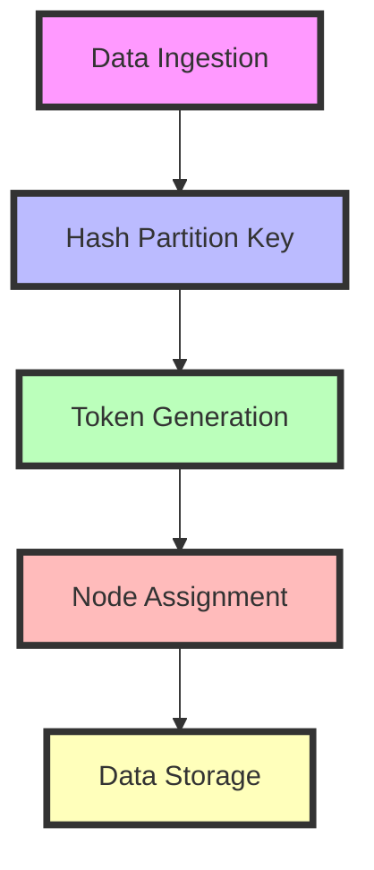

## 10.2.1 Partition Keys and Data Distribution

In the realm of NoSQL databases, the concept of partition keys is pivotal for determining how data is distributed across nodes in a cluster. Understanding how partition keys influence data placement is essential for designing scalable, high-performance applications. This section delves into the mechanics of partition keys, explores best practices for their selection, and provides practical insights into optimizing data distribution in NoSQL systems.

### Understanding Partition Keys

Partition keys are a fundamental component of NoSQL databases like Apache Cassandra, Amazon DynamoDB, and others. They serve as the primary mechanism for distributing data across multiple nodes in a cluster. By determining the node on which data is stored, partition keys play a crucial role in ensuring balanced data distribution and efficient query performance.

#### How Partition Keys Determine Data Placement

The process of data placement in NoSQL databases typically involves hashing the partition key to generate a token. This token is then used to determine the specific node or partition where the data should reside. The hashing mechanism ensures that data is evenly distributed across the cluster, minimizing hotspots and maximizing resource utilization.

For example, in Apache Cassandra, the partition key is hashed using a partitioner, such as Murmur3Partitioner, to produce a token. This token is mapped to a specific range in the token ring, which corresponds to a node in the cluster. The node responsible for that token range stores the data associated with the partition key.

In Amazon DynamoDB, partition keys (also known as hash keys) are used in conjunction with optional sort keys to organize data within partitions. The partition key is hashed to determine the partition in which the data is stored. This approach allows DynamoDB to scale horizontally by distributing data across multiple partitions.

#### Importance of Effective Partitioning

Effective partitioning is critical for achieving optimal performance and scalability in NoSQL databases. Poorly chosen partition keys can lead to uneven data distribution, resulting in hotspots where certain nodes become overloaded while others remain underutilized. This imbalance can degrade performance, increase latency, and limit the scalability of the system.

### Best Practices for Choosing Partition Keys

Selecting the right partition key is a nuanced process that requires careful consideration of the data access patterns, query requirements, and scalability goals of the application. Here are some best practices to guide the selection of partition keys:

#### 1. Understand Your Access Patterns

The first step in choosing an effective partition key is to thoroughly understand the access patterns of your application. Consider the types of queries that will be executed most frequently and the data that will be accessed together. The partition key should be chosen to align with these access patterns, ensuring that related data is co-located on the same node.

For instance, if you are designing a social media application where users frequently access their own posts, using the user ID as the partition key can ensure that all posts by a user are stored together, enabling efficient retrieval.

#### 2. Ensure Even Data Distribution

To prevent hotspots and ensure even data distribution, the partition key should have a high cardinality, meaning it should be capable of generating a large number of unique values. This diversity helps distribute data evenly across the cluster, balancing the load on each node.

For example, using a timestamp as a partition key might lead to uneven distribution if data is ingested in bursts. Instead, combining a high-cardinality attribute, such as a user ID, with a timestamp can provide a more balanced distribution.

#### 3. Avoid Large Partitions

While it is important to co-locate related data, creating overly large partitions can lead to performance issues. Large partitions can increase the time required to read or write data and may exceed the storage capacity of a single node. Aim to keep partitions at a manageable size by considering the volume of data associated with each partition key.

#### 4. Consider Composite Keys

In some cases, a single attribute may not suffice as a partition key. Composite keys, which combine multiple attributes, can provide greater flexibility and control over data distribution. By combining attributes, you can achieve a balance between co-locating related data and distributing data evenly.

For instance, in a multi-tenant application, you might use a combination of tenant ID and user ID as a composite partition key to ensure that data is distributed across tenants while keeping user data together.

#### 5. Plan for Future Growth

When designing partition keys, consider the future growth of your application. Choose keys that can accommodate an increase in data volume and user base without requiring significant re-architecting. This foresight can prevent costly migrations and downtime as your application scales.

### Practical Code Examples

To illustrate the application of these best practices, let's explore some practical code examples using Clojure and NoSQL databases.

#### Example 1: Choosing a Partition Key in Cassandra

```clojure
(ns myapp.cassandra
  (:require [qbits.alia :as alia]))

(def cluster (alia/cluster {:contact-points ["127.0.0.1"]}))
(def session (alia/connect cluster))

(defn create-table []
  (alia/execute session
    "CREATE TABLE IF NOT EXISTS user_posts (
       user_id UUID,
       post_id UUID,
       content TEXT,
       PRIMARY KEY (user_id, post_id)
     )"))

(defn insert-post [user-id post-id content]
  (alia/execute session
    "INSERT INTO user_posts (user_id, post_id, content) VALUES (?, ?, ?)"
    [user-id post-id content]))

(defn get-user-posts [user-id]
  (alia/execute session
    "SELECT * FROM user_posts WHERE user_id = ?"
    [user-id]))
```

In this example, the `user_id` is chosen as the partition key to ensure that all posts by a user are stored together. The `post_id` serves as a clustering column, allowing posts to be ordered and retrieved efficiently.

#### Example 2: Using Composite Keys in DynamoDB

```clojure
(ns myapp.dynamodb
  (:require [amazonica.aws.dynamodbv2 :as dynamodb]))

(defn create-table []
  (dynamodb/create-table
    :table-name "TenantData"
    :key-schema [{:attribute-name "tenant_id" :key-type "HASH"}
                 {:attribute-name "user_id" :key-type "RANGE"}]
    :attribute-definitions [{:attribute-name "tenant_id" :attribute-type "S"}
                            {:attribute-name "user_id" :attribute-type "S"}]
    :provisioned-throughput {:read-capacity-units 5 :write-capacity-units 5}))

(defn put-item [tenant-id user-id data]
  (dynamodb/put-item
    :table-name "TenantData"
    :item {:tenant_id {:s tenant-id}
           :user_id {:s user-id}
           :data {:s data}}))

(defn query-items [tenant-id]
  (dynamodb/query
    :table-name "TenantData"
    :key-condition-expression "tenant_id = :tenant_id"
    :expression-attribute-values {":tenant_id" {:s tenant-id}}))
```

In this DynamoDB example, a composite key consisting of `tenant_id` and `user_id` is used. This approach ensures that data is distributed across tenants while keeping user-specific data together within each tenant.

### Diagrams and Visualizations

To further enhance understanding, let's visualize the concept of partition keys and data distribution using a diagram.



This diagram illustrates the flow of data from ingestion to storage, highlighting the role of partition keys in determining node assignment through token generation.

### Common Pitfalls and Optimization Tips

While selecting partition keys, developers may encounter several pitfalls. Here are some common mistakes and tips to optimize data distribution:

#### Pitfall 1: Low Cardinality Keys

Using low cardinality keys, such as boolean values or small integer ranges, can lead to uneven data distribution. Always aim for high cardinality keys to ensure balanced load distribution.

#### Pitfall 2: Ignoring Access Patterns

Failing to consider access patterns can result in inefficient queries and increased latency. Design partition keys with query patterns in mind to optimize data retrieval.

#### Optimization Tip: Monitor and Adjust

Regularly monitor the distribution of data across nodes and adjust partition keys as needed. Tools like Apache Cassandra's nodetool and AWS CloudWatch can provide insights into data distribution and performance.

### Conclusion

Partition keys are a critical aspect of NoSQL database design, influencing data distribution, performance, and scalability. By understanding the mechanics of partition keys and following best practices for their selection, developers can design robust data architectures that meet the demands of modern applications. As you continue to explore NoSQL databases and Clojure, keep these principles in mind to optimize your data solutions.

## Quiz Time!



### What is the primary role of a partition key in NoSQL databases?

- [x] To determine the node on which data is stored
- [ ] To encrypt data in the database
- [ ] To define the schema of the database
- [ ] To manage user access permissions

> **Explanation:** The partition key is used to determine the node or partition where data is stored, ensuring balanced distribution across the cluster.

### Why is high cardinality important for partition keys?

- [x] It ensures even data distribution across nodes
- [ ] It simplifies the database schema
- [ ] It reduces the need for data encryption
- [ ] It improves data compression

> **Explanation:** High cardinality helps distribute data evenly across nodes, preventing hotspots and balancing the load.

### What is a composite key?

- [x] A key that combines multiple attributes
- [ ] A key that is used for encryption
- [ ] A key that defines the database schema
- [ ] A key that manages user permissions

> **Explanation:** A composite key combines multiple attributes to provide greater flexibility and control over data distribution.

### Which of the following is a common pitfall when choosing partition keys?

- [x] Using low cardinality keys
- [ ] Using high cardinality keys
- [ ] Considering access patterns
- [ ] Monitoring data distribution

> **Explanation:** Low cardinality keys can lead to uneven data distribution and should be avoided.

### How can you optimize data distribution in a NoSQL database?

- [x] Monitor and adjust partition keys as needed
- [ ] Use low cardinality keys
- [ ] Ignore access patterns
- [ ] Avoid monitoring tools

> **Explanation:** Regular monitoring and adjustment of partition keys can help optimize data distribution and performance.

### What is the benefit of using a composite key in a multi-tenant application?

- [x] It ensures data is distributed across tenants while keeping user data together
- [ ] It simplifies the database schema
- [ ] It reduces storage costs
- [ ] It improves data encryption

> **Explanation:** Composite keys can help distribute data across tenants while ensuring user-specific data is co-located.

### What is the purpose of hashing a partition key?

- [x] To generate a token for node assignment
- [ ] To encrypt the partition key
- [ ] To define the database schema
- [ ] To manage user access permissions

> **Explanation:** Hashing the partition key generates a token used to determine the node or partition for data storage.

### What should you consider when designing partition keys for future growth?

- [x] Choose keys that can accommodate increased data volume
- [ ] Use low cardinality keys
- [ ] Ignore access patterns
- [ ] Avoid monitoring tools

> **Explanation:** Designing partition keys with future growth in mind can prevent costly migrations and downtime.

### Which tool can provide insights into data distribution in Apache Cassandra?

- [x] nodetool
- [ ] AWS CloudWatch
- [ ] MongoDB Compass
- [ ] Redis CLI

> **Explanation:** Apache Cassandra's nodetool can provide insights into data distribution and performance.

### True or False: Partition keys are used to encrypt data in NoSQL databases.

- [ ] True
- [x] False

> **Explanation:** Partition keys are not used for encryption; they are used to determine data placement and distribution.


