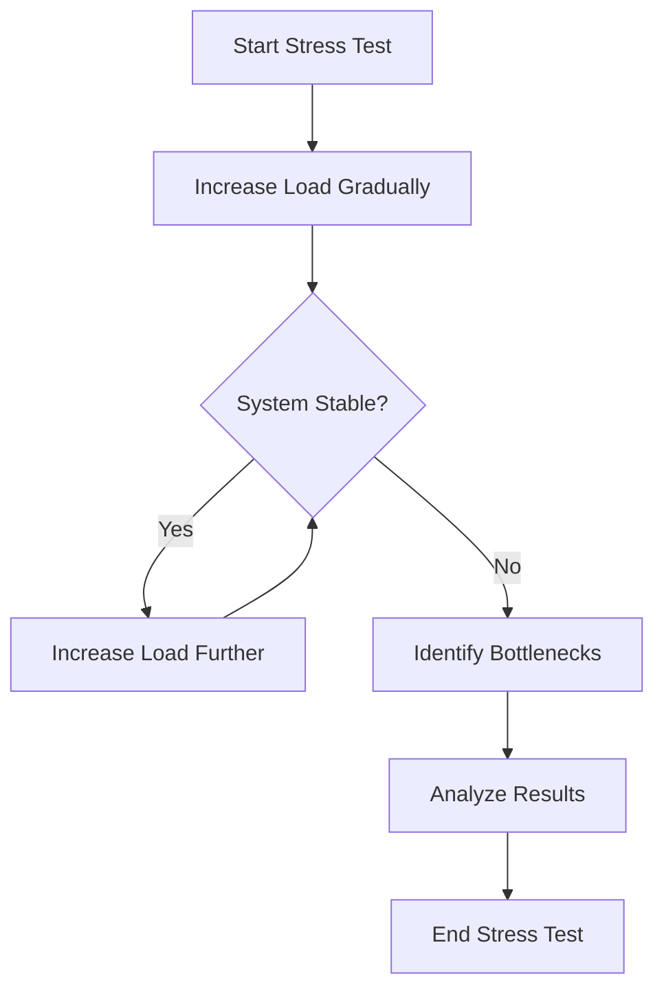

## 11.5.1 Performance Testing Methodologies

In the realm of software development, performance testing is a critical aspect that ensures applications meet the necessary speed, scalability, and stability requirements. For Java developers transitioning to Clojure and working with NoSQL databases, understanding performance testing methodologies becomes even more crucial. This section delves into the intricacies of performance testing, focusing on defining performance goals, exploring different types of performance tests, and developing effective test plans.

### Defining Performance Goals

Before embarking on performance testing, it's essential to establish clear performance goals. These goals serve as benchmarks against which the application's performance is measured. Key objectives include:

- **Response Times:** Define acceptable response times for various operations. For instance, database queries should return results within a specified time frame to ensure a smooth user experience.
- **Throughput:** Determine the number of transactions or operations the system can handle per unit time. This is crucial for applications expected to process large volumes of data.
- **Resource Utilization:** Set limits on acceptable CPU, memory, and network usage. Efficient resource utilization ensures that the system can scale without unnecessary hardware costs.

#### Practical Example: Setting Performance Goals

Consider an e-commerce platform built using Clojure and a NoSQL database like MongoDB. Performance goals might include:

- **Response Time:** Product search queries should return results within 200 milliseconds.
- **Throughput:** The system should handle 5000 transactions per minute during peak hours.
- **Resource Utilization:** CPU usage should not exceed 70% under normal operating conditions.

### Types of Performance Tests

Performance testing encompasses various types of tests, each serving a unique purpose. Understanding these tests helps in selecting the appropriate strategy for your application.

#### Load Testing

Load testing evaluates the system's performance under expected load conditions. It helps identify bottlenecks and ensures the application can handle anticipated user traffic.

- **Objective:** Verify that the system performs well under normal load conditions.
- **Tools:** Apache JMeter, Gatling, and Locust are popular tools for load testing.
- **Metrics:** Response time, throughput, and error rates are key metrics to monitor.

##### Code Example: Load Testing with Gatling

```scala
import io.gatling.core.Predef._
import io.gatling.http.Predef._

class BasicLoadSimulation extends Simulation {

  val httpProtocol = http
    .baseUrl("http://localhost:8080") // Base URL for the application
    .acceptHeader("application/json")

  val scn = scenario("Basic Load Test")
    .exec(
      http("Get Products")
        .get("/api/products")
        .check(status.is(200))
    )

  setUp(
    scn.inject(atOnceUsers(1000)) // Simulate 1000 users at once
  ).protocols(httpProtocol)
}
```

#### Stress Testing

Stress testing assesses the system's behavior under extreme conditions, often beyond normal operational capacity. This test helps identify the breaking point of the application and its ability to recover gracefully.

- **Objective:** Determine the system's robustness and error-handling capabilities under high load.
- **Tools:** Apache JMeter, k6, and Tsung are commonly used for stress testing.
- **Metrics:** Monitor response time, error rates, and system stability.

##### Diagram: Stress Testing Process



#### Endurance Testing

Endurance testing, also known as soak testing, evaluates the system's performance over an extended period. It helps identify memory leaks and performance degradation issues.

- **Objective:** Ensure the system remains stable and efficient over long durations.
- **Tools:** Apache JMeter and LoadRunner are suitable for endurance testing.
- **Metrics:** Monitor memory usage, response time, and resource utilization over time.

##### Practical Example: Endurance Testing Scenario

For a social media application using Clojure and Cassandra, an endurance test might simulate continuous user activity over 48 hours to ensure the system maintains performance without degradation.

### Developing Test Plans

A well-structured test plan is crucial for effective performance testing. It outlines the testing strategy, scenarios, and metrics to measure.

#### Identify Critical Scenarios

Identify the most critical scenarios that need testing. These scenarios typically involve high-traffic operations or complex transactions.

- **Example Scenarios:**
  - User login and authentication
  - Product search and filtering
  - Checkout process in an e-commerce application

#### Determine the Scale of Load

Define the scale of load for each scenario. This includes the number of virtual users, the duration of the test, and the ramp-up period.

- **Example Load Scale:**
  - Simulate 1000 users for a product search scenario with a ramp-up period of 5 minutes.

#### Metrics to Measure

Identify the key metrics to monitor during the tests. These metrics provide insights into the system's performance and help identify areas for improvement.

- **Key Metrics:**
  - Response time
  - Throughput
  - Error rates
  - Resource utilization

### Best Practices for Performance Testing

To ensure effective performance testing, adhere to the following best practices:

- **Automate Tests:** Use automation tools to run tests consistently and efficiently.
- **Test in Production-like Environments:** Ensure the testing environment closely resembles the production environment to obtain accurate results.
- **Monitor Continuously:** Implement continuous monitoring to detect performance issues early.
- **Analyze Results Thoroughly:** Analyze test results to identify bottlenecks and areas for optimization.

### Common Pitfalls and Optimization Tips

Performance testing can be challenging, and avoiding common pitfalls is crucial for success:

- **Pitfall:** Ignoring the impact of network latency.
  - **Tip:** Include network latency in your test scenarios to simulate real-world conditions.

- **Pitfall:** Overlooking data variability.
  - **Tip:** Use diverse datasets to ensure tests reflect actual usage patterns.

- **Pitfall:** Focusing solely on load testing.
  - **Tip:** Incorporate stress and endurance testing to gain a comprehensive understanding of system performance.

### Conclusion

Performance testing is a vital component of developing scalable and efficient applications with Clojure and NoSQL databases. By setting clear performance goals, understanding different types of performance tests, and developing comprehensive test plans, developers can ensure their applications meet the necessary performance standards. Adhering to best practices and avoiding common pitfalls further enhances the effectiveness of performance testing efforts.

## Quiz Time!



### What is the primary objective of load testing?

- [x] Verify system performance under expected load conditions.
- [ ] Assess system behavior under extreme conditions.
- [ ] Evaluate system performance over an extended period.
- [ ] Determine the system's breaking point.

> **Explanation:** Load testing focuses on verifying that the system performs well under normal load conditions.

### Which tool is commonly used for stress testing?

- [ ] Gatling
- [x] k6
- [ ] LoadRunner
- [ ] Selenium

> **Explanation:** k6 is a popular tool used for stress testing, designed to handle high loads and simulate extreme conditions.

### What is the main goal of endurance testing?

- [ ] Identify system bottlenecks.
- [ ] Verify system performance under expected load.
- [x] Ensure system stability over long durations.
- [ ] Assess system behavior under extreme conditions.

> **Explanation:** Endurance testing aims to ensure the system remains stable and efficient over extended periods.

### What should be included in a performance test plan?

- [x] Critical scenarios, load scale, and metrics to measure.
- [ ] Only the number of virtual users.
- [ ] The expected response time.
- [ ] The system's breaking point.

> **Explanation:** A performance test plan should include critical scenarios, the scale of load, and the metrics to measure.

### Which of the following is a best practice for performance testing?

- [ ] Test in a different environment than production.
- [x] Automate tests for consistency.
- [ ] Focus only on load testing.
- [ ] Ignore network latency.

> **Explanation:** Automating tests ensures consistency and efficiency, making it a best practice for performance testing.

### What is a common pitfall in performance testing?

- [x] Ignoring network latency.
- [ ] Automating tests.
- [ ] Testing in production-like environments.
- [ ] Monitoring continuously.

> **Explanation:** Ignoring network latency can lead to inaccurate test results, making it a common pitfall.

### What is the purpose of stress testing?

- [ ] Verify system performance under expected load.
- [x] Assess system behavior under extreme conditions.
- [ ] Ensure system stability over long durations.
- [ ] Determine the system's breaking point.

> **Explanation:** Stress testing assesses how the system behaves under extreme conditions, often beyond normal operational capacity.

### What is a key metric to monitor during performance tests?

- [x] Response time
- [ ] User interface design
- [ ] Code readability
- [ ] Database schema

> **Explanation:** Response time is a critical metric to monitor during performance tests to ensure the system meets performance goals.

### Which type of testing helps identify memory leaks?

- [ ] Load testing
- [ ] Stress testing
- [x] Endurance testing
- [ ] Unit testing

> **Explanation:** Endurance testing helps identify memory leaks by evaluating the system's performance over an extended period.

### True or False: Performance testing should only focus on load testing.

- [ ] True
- [x] False

> **Explanation:** Performance testing should include load, stress, and endurance testing to gain a comprehensive understanding of system performance.


