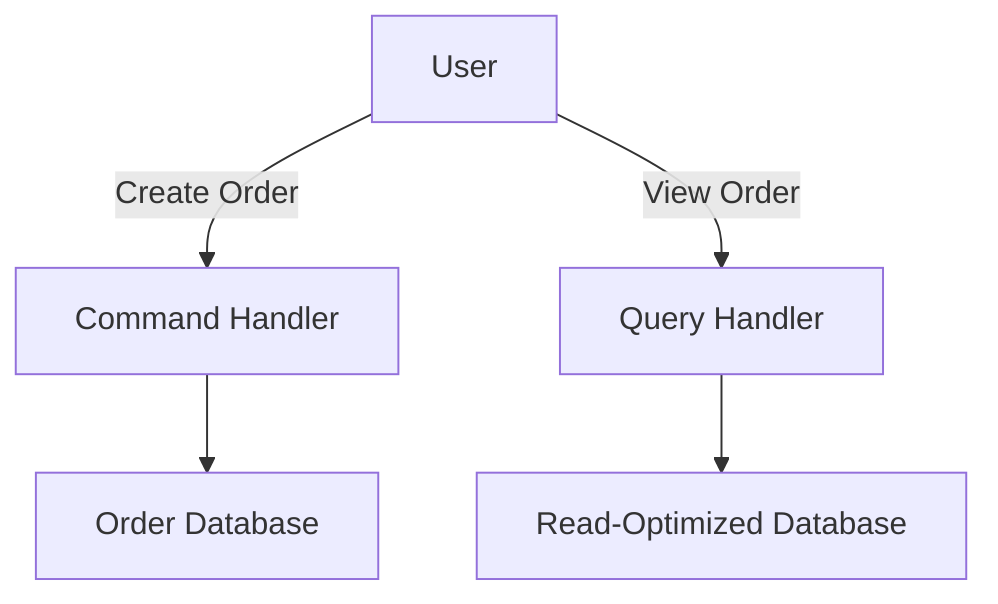

## 12.4.1 Understanding CQRS

Command Query Responsibility Segregation (CQRS) is a powerful architectural pattern that plays a pivotal role in designing scalable and maintainable systems, particularly when dealing with complex data solutions. By separating the responsibilities of command and query operations, CQRS allows developers to optimize the performance, scalability, and maintainability of their applications. In this section, we will delve into the core principles of CQRS, explore its advantages, and discuss the design considerations necessary for implementing this pattern effectively. We will also provide practical examples using Clojure and NoSQL databases to illustrate how CQRS can be applied in real-world scenarios.

### Separation of Concerns

At the heart of CQRS is the principle of separation of concerns, which involves dividing the system into two distinct parts: commands and queries.

#### Commands (Writes)

Commands are responsible for performing actions that change the state of the system. They encapsulate all the logic required to validate and execute state-changing operations. In a CQRS architecture, commands are typically handled by a command handler, which processes the command and updates the underlying data store.

Here is a simple example of a command in Clojure:

```clojure
(defn create-order-command [order-data]
  ;; Validate and process the order creation
  (if (valid-order? order-data)
    (save-order! order-data)
    (throw (ex-info "Invalid order data" {:order order-data}))))
```

#### Queries (Reads)

Queries, on the other hand, are responsible for retrieving data without altering the state of the system. They are designed to be efficient and optimized for read operations, often using different data models or even separate databases from those used for commands.

An example of a query in Clojure might look like this:

```clojure
(defn get-order-by-id [order-id]
  ;; Retrieve order details from the database
  (find-order order-id))
```

### Advantages of CQRS

Implementing CQRS offers several advantages that can significantly enhance the performance and scalability of your applications.

#### Optimized Models

One of the key benefits of CQRS is the ability to tailor read and write models for performance and scalability. By separating the read and write sides, you can optimize each for its specific workload. For instance, the write model can focus on ensuring data consistency and integrity, while the read model can be denormalized and optimized for fast query performance.

#### Scalability

CQRS enables independent scaling of the read and write sides of the application. This means you can scale the read side to handle high query loads without affecting the performance of the write side, and vice versa. This separation is particularly beneficial in distributed systems where different parts of the system may have varying scalability requirements.

### Design Considerations

While CQRS offers numerous benefits, it also introduces certain complexities that must be carefully managed.

#### Consistency Trade-offs

One of the primary design considerations when implementing CQRS is the trade-off between consistency and availability. In a CQRS architecture, the read and write models are often eventually consistent, meaning there may be a delay between when a command is executed and when the corresponding query reflects the updated state. This trade-off is acceptable in many scenarios, but it's important to understand the implications and design your system accordingly.

#### Complexity Management

CQRS can increase the complexity of your system, particularly in terms of managing the boundaries between the command and query sides. To mitigate this complexity, it's essential to establish clear boundaries and responsibilities for each part of the system. This can be achieved through well-defined interfaces, clear separation of data models, and robust testing strategies.

### Practical Implementation in Clojure

To illustrate the practical implementation of CQRS in Clojure, let's consider a simple e-commerce application that uses a NoSQL database for data storage. We'll demonstrate how to separate the command and query responsibilities and optimize each for its specific workload.

#### Setting Up the Environment

Before we begin, ensure you have a Clojure development environment set up. You can refer to [Appendix A: Setting Up Development Environments](#) for detailed instructions on installing Clojure and configuring your IDE.

#### Command Side Implementation

The command side of our application will handle operations such as creating orders, updating inventory, and processing payments. We'll use a NoSQL database like MongoDB to store the data.

```clojure
(ns ecommerce.commands
  (:require [monger.core :as mg]
            [monger.collection :as mc]))

(defn create-order [order-data]
  (let [conn (mg/connect)
        db (mg/get-db conn "ecommerce")]
    (mc/insert db "orders" order-data)))
```

In this example, we use the Monger library to connect to a MongoDB database and insert a new order document. The `create-order` function encapsulates the logic for handling order creation commands.

#### Query Side Implementation

The query side of our application will focus on retrieving data efficiently. We can use a separate data model optimized for read operations, such as a denormalized view of the order data.

```clojure
(ns ecommerce.queries
  (:require [monger.core :as mg]
            [monger.collection :as mc]))

(defn get-order-summary [order-id]
  (let [conn (mg/connect)
        db (mg/get-db conn "ecommerce")]
    (mc/find-one-as-map db "order_summaries" {:order-id order-id})))
```

Here, we retrieve an order summary from a separate collection designed for fast read access. This separation allows us to optimize the query side for performance without impacting the command side.

### Diagrams and Flowcharts

To better understand the flow of data in a CQRS architecture, let's visualize the process using a flowchart. We'll use the Mermaid format for compatibility with Hugo.



In this diagram, the user interacts with the system by creating an order, which is processed by the command handler and stored in the order database. When the user views an order, the query handler retrieves the data from a read-optimized database.

### Best Practices and Common Pitfalls

When implementing CQRS, consider the following best practices and common pitfalls:

- **Define Clear Boundaries:** Clearly define the responsibilities of the command and query sides to avoid overlap and confusion.
- **Embrace Eventual Consistency:** Design your system to handle eventual consistency gracefully, using techniques such as event sourcing or compensating actions.
- **Optimize for Performance:** Tailor your data models and database configurations to optimize performance for both read and write operations.
- **Test Thoroughly:** Implement robust testing strategies to ensure the correctness and reliability of both the command and query sides.

### Conclusion

CQRS is a powerful pattern that can greatly enhance the scalability and maintainability of your applications. By separating the responsibilities of commands and queries, you can optimize each for its specific workload and scale them independently. While CQRS introduces certain complexities, careful design and adherence to best practices can help you manage these effectively. With Clojure and NoSQL databases, you have the tools to implement CQRS in a way that leverages the strengths of functional programming and modern data storage technologies.

## Quiz Time!



### What is the primary purpose of CQRS?

- [x] To separate the responsibilities of command and query operations
- [ ] To integrate SQL and NoSQL databases
- [ ] To enhance security in applications
- [ ] To simplify data models

> **Explanation:** CQRS stands for Command Query Responsibility Segregation, which separates the responsibilities of command (write) and query (read) operations.

### What is a key advantage of using CQRS?

- [x] Optimized models for performance and scalability
- [ ] Simplified database schema
- [ ] Reduced code complexity
- [ ] Enhanced security protocols

> **Explanation:** CQRS allows for optimized models tailored for specific workloads, enhancing performance and scalability.

### How does CQRS affect scalability?

- [x] It allows independent scaling of read and write sides
- [ ] It requires more resources for scaling
- [ ] It limits scalability to a single database
- [ ] It reduces the need for scaling

> **Explanation:** CQRS enables independent scaling of the read and write sides, allowing each to be optimized and scaled according to its specific needs.

### What is a common trade-off when implementing CQRS?

- [x] Eventual consistency between read and write models
- [ ] Increased security risks
- [ ] Reduced data accuracy
- [ ] Simplified application logic

> **Explanation:** CQRS often involves eventual consistency, where there may be a delay between when a command is executed and when the query reflects the updated state.

### What is a potential downside of CQRS?

- [x] Increased complexity
- [ ] Reduced performance
- [ ] Limited database support
- [ ] Decreased scalability

> **Explanation:** CQRS can increase the complexity of the system, requiring careful management of boundaries and responsibilities.

### In CQRS, what is the role of commands?

- [x] To perform actions that change the state
- [ ] To retrieve data without changing the state
- [ ] To manage database connections
- [ ] To handle user authentication

> **Explanation:** Commands in CQRS are responsible for performing actions that change the state of the system.

### What is the role of queries in CQRS?

- [x] To retrieve data without changing the state
- [ ] To perform actions that change the state
- [ ] To manage database connections
- [ ] To handle user authentication

> **Explanation:** Queries in CQRS are responsible for retrieving data without altering the state of the system.

### How can eventual consistency be managed in a CQRS system?

- [x] Using event sourcing or compensating actions
- [ ] By avoiding database transactions
- [ ] By using a single database for reads and writes
- [ ] By implementing strict consistency models

> **Explanation:** Eventual consistency can be managed using techniques like event sourcing or compensating actions to ensure data integrity over time.

### What is a best practice when implementing CQRS?

- [x] Define clear boundaries between command and query sides
- [ ] Use a single data model for both reads and writes
- [ ] Avoid using NoSQL databases
- [ ] Implement strict consistency across all operations

> **Explanation:** Defining clear boundaries between the command and query sides is crucial to avoid overlap and confusion in a CQRS system.

### True or False: CQRS requires the use of NoSQL databases.

- [ ] True
- [x] False

> **Explanation:** CQRS does not require the use of NoSQL databases; it can be implemented with various types of databases, including SQL and NoSQL.


