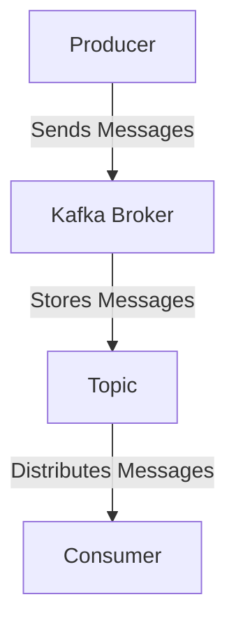
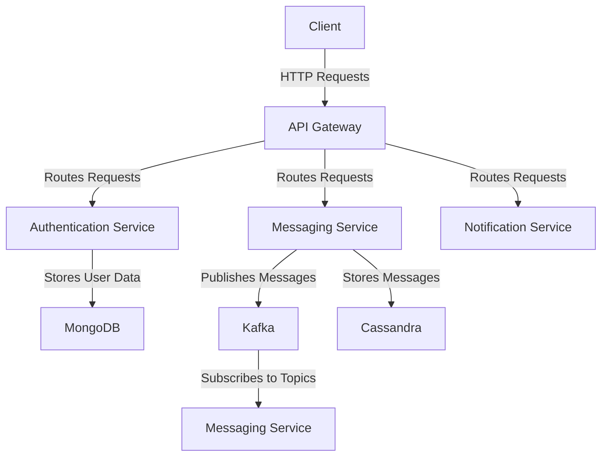

## 12.5.2 Architecture Design

In the realm of modern software development, designing a scalable architecture is crucial for handling growing user demands and data volumes. This section delves into the architectural design principles for building scalable applications using Clojure and NoSQL databases. We will explore service-oriented components and make informed technology choices that align with the needs of a high-throughput messaging platform.

### Service-Oriented Components

The architecture of a scalable application often involves decomposing the system into service-oriented components. This approach enhances modularity, scalability, and maintainability. Let's examine the key components of this architecture:

#### API Gateway

The API Gateway acts as the entry point for client requests, managing traffic and routing it to the appropriate services. It serves as a reverse proxy, handling tasks such as request authentication, rate limiting, and response transformation. By centralizing these responsibilities, the API Gateway simplifies client interactions and enhances security.

**Key Responsibilities:**
- **Request Routing:** Directs incoming requests to the appropriate backend services.
- **Authentication and Authorization:** Verifies user credentials and permissions.
- **Load Balancing:** Distributes requests evenly across service instances.
- **Protocol Translation:** Converts requests between different protocols (e.g., HTTP to gRPC).

**Implementation in Clojure:**
Using Clojure's Ring library, you can implement a simple API Gateway. Here's a basic example:

```clojure
(ns api-gateway.core
  (:require [ring.adapter.jetty :refer [run-jetty]]
            [ring.middleware.defaults :refer [wrap-defaults site-defaults]]
            [ring.util.response :refer [response]]))

(defn handler [request]
  (response "Welcome to the API Gateway"))

(def app
  (wrap-defaults handler site-defaults))

(defn -main []
  (run-jetty app {:port 8080}))
```

This code sets up a basic HTTP server that can be extended to include routing logic and middleware for authentication and load balancing.

#### Authentication Service

The Authentication Service is responsible for managing user sessions and tokens. It ensures that only authenticated users can access protected resources, maintaining the security and integrity of the system.

**Key Responsibilities:**
- **User Authentication:** Validates user credentials during login.
- **Token Management:** Issues, refreshes, and revokes authentication tokens.
- **Session Management:** Tracks user sessions and activity.

**Technology Choice:**
Clojure's immutability and concurrency features make it an excellent choice for implementing secure and efficient authentication mechanisms. Libraries like Buddy can be used for handling authentication and authorization.

**Example with Buddy:**

```clojure
(ns auth-service.core
  (:require [buddy.auth :refer [authenticated?]]
            [buddy.auth.backends.session :refer [session-backend]]
            [buddy.auth.middleware :refer [wrap-authentication]]))

(defn login-handler [request]
  ;; Logic to authenticate user and issue token
  )

(def app
  (-> handler
      (wrap-authentication (session-backend))))

(defn -main []
  ;; Start the authentication service
  )
```

#### Messaging Service

The Messaging Service handles message queuing and routing, ensuring reliable communication between different parts of the system. Apache Kafka is a popular choice for this component due to its high throughput and fault-tolerant capabilities.

**Key Responsibilities:**
- **Message Queuing:** Buffers messages for asynchronous processing.
- **Topic Management:** Organizes messages into topics for efficient routing.
- **Stream Processing:** Processes data streams in real-time.

**Kafka Integration with Clojure:**
Clojure's Kafka client libraries, such as `clj-kafka`, facilitate seamless integration with Kafka. Here's an example of producing and consuming messages:

```clojure
(ns messaging-service.core
  (:require [clj-kafka.producer :as producer]
            [clj-kafka.consumer :as consumer]))

(defn produce-message [topic message]
  (producer/send-message {:topic topic :value message}))

(defn consume-messages [topic]
  (consumer/consume {:topic topic}))

(defn -main []
  ;; Initialize Kafka producer and consumer
  )
```

#### Notification Service

The Notification Service is responsible for sending push notifications or emails to users. It ensures timely delivery of messages, enhancing user engagement and communication.

**Key Responsibilities:**
- **Push Notifications:** Sends real-time alerts to user devices.
- **Email Notifications:** Delivers transactional and promotional emails.
- **Delivery Tracking:** Monitors the status of sent notifications.

**Implementation in Clojure:**
Using libraries like Postal for email and Pushy for push notifications, you can implement a robust notification service.

**Example with Postal:**

```clojure
(ns notification-service.core
  (:require [postal.core :refer [send-message]]))

(defn send-email [recipient subject body]
  (send-message {:from "noreply@example.com"
                 :to recipient
                 :subject subject
                 :body body}))

(defn -main []
  ;; Start the notification service
  )
```

### Technology Choices

Selecting the right technologies is crucial for building a scalable and efficient architecture. Let's explore the technology choices for our service-oriented components:

#### Clojure for Services

Clojure's strengths in concurrency, simplicity, and functional programming make it an ideal choice for developing microservices. Its immutable data structures and robust concurrency primitives, such as agents and atoms, enable developers to build reliable and scalable services.

**Benefits of Using Clojure:**
- **Concurrency:** Clojure's concurrency model simplifies the development of multi-threaded applications.
- **Simplicity:** A concise syntax and powerful abstractions reduce boilerplate code.
- **Interoperability:** Seamless integration with Java libraries and frameworks.

#### Kafka for Messaging

Apache Kafka is a distributed streaming platform that excels in handling large volumes of data with low latency. It is well-suited for building messaging systems that require high throughput and fault tolerance.

**Key Features of Kafka:**
- **Scalability:** Kafka can scale horizontally by adding more brokers.
- **Durability:** Messages are persisted to disk, ensuring reliable delivery.
- **Real-Time Processing:** Supports stream processing with low latency.

**Kafka Architecture:**



#### NoSQL Databases

NoSQL databases offer flexible data models and horizontal scalability, making them suitable for handling diverse data types and large datasets. In our architecture, we use MongoDB for user data and Cassandra for message storage.

**MongoDB for User Data:**
- **Document Model:** Stores data in JSON-like documents, allowing for flexible schemas.
- **Indexing:** Supports rich query capabilities with secondary indexes.
- **Replication:** Provides high availability through replica sets.

**Cassandra for Message Storage:**
- **Wide-Column Store:** Optimized for write-heavy workloads and time-series data.
- **Partitioning:** Distributes data across multiple nodes for scalability.
- **Consistency:** Offers tunable consistency levels to balance availability and performance.

### Designing the Architecture

With the service-oriented components and technology choices defined, we can design the architecture for our scalable application. The architecture should facilitate seamless communication between services, efficient data storage, and real-time processing.

#### Architectural Diagram



#### Data Flow

1. **Client Interaction:** Clients interact with the system through the API Gateway, which routes requests to the appropriate services.
2. **Authentication:** The Authentication Service verifies user credentials and issues tokens for secure access.
3. **Messaging:** The Messaging Service publishes messages to Kafka, which handles message distribution and stream processing.
4. **Notification:** The Notification Service sends alerts to users via push notifications or emails.
5. **Data Storage:** User data is stored in MongoDB, while messages are stored in Cassandra for efficient retrieval and analysis.

#### Scalability Considerations

To ensure scalability, the architecture should support horizontal scaling, allowing services to be deployed across multiple instances. Load balancing and auto-scaling mechanisms can be implemented to manage traffic and resource utilization effectively.

**Best Practices:**
- **Decouple Services:** Use asynchronous communication and message queues to decouple services, reducing dependencies and improving fault tolerance.
- **Optimize Data Access:** Leverage indexing and partitioning strategies to optimize data access and retrieval.
- **Monitor Performance:** Implement monitoring and logging to track system performance and identify bottlenecks.

### Conclusion

Designing a scalable architecture with Clojure and NoSQL databases involves careful consideration of service-oriented components and technology choices. By leveraging Clojure's concurrency capabilities, Kafka's messaging infrastructure, and the flexibility of NoSQL databases, you can build robust and efficient applications that meet the demands of modern users. This architecture not only supports high throughput and low latency but also ensures maintainability and scalability for future growth.

## Quiz Time!



### What is the primary role of an API Gateway in a service-oriented architecture?

- [x] Entry point for client requests, managing traffic and routing to services
- [ ] Storing user data and managing sessions
- [ ] Handling message queuing and routing
- [ ] Sending push notifications and emails

> **Explanation:** The API Gateway acts as the entry point for client requests, managing traffic and routing it to the appropriate backend services.

### Which library can be used in Clojure for handling authentication and authorization?

- [x] Buddy
- [ ] Ring
- [ ] Compojure
- [ ] Luminus

> **Explanation:** Buddy is a Clojure library that provides tools for handling authentication and authorization.

### What is a key feature of Apache Kafka that makes it suitable for messaging systems?

- [x] High throughput and fault tolerance
- [ ] Document-based storage
- [ ] Relational data modeling
- [ ] Strong consistency guarantees

> **Explanation:** Apache Kafka is known for its high throughput and fault tolerance, making it ideal for messaging systems.

### Which NoSQL database is recommended for storing user data in the discussed architecture?

- [x] MongoDB
- [ ] Cassandra
- [ ] Redis
- [ ] Neo4j

> **Explanation:** MongoDB is recommended for storing user data due to its flexible document model.

### What is the primary advantage of using Clojure for developing microservices?

- [x] Concurrency capabilities and simplicity
- [ ] Strong typing and static analysis
- [ ] Built-in support for relational databases
- [ ] Extensive GUI libraries

> **Explanation:** Clojure's concurrency capabilities and simplicity make it an excellent choice for developing microservices.

### What is the role of the Messaging Service in the architecture?

- [x] Handles message queuing and routing
- [ ] Manages user sessions and tokens
- [ ] Sends push notifications or emails
- [ ] Stores user data

> **Explanation:** The Messaging Service handles message queuing and routing, ensuring reliable communication between system components.

### How does Cassandra optimize for write-heavy workloads?

- [x] Wide-column store and partitioning
- [ ] Document-based storage
- [ ] Strong consistency guarantees
- [ ] Built-in caching mechanisms

> **Explanation:** Cassandra's wide-column store and partitioning make it well-suited for write-heavy workloads.

### Which component is responsible for sending real-time alerts to user devices?

- [x] Notification Service
- [ ] API Gateway
- [ ] Authentication Service
- [ ] Messaging Service

> **Explanation:** The Notification Service is responsible for sending real-time alerts to user devices.

### What is a benefit of using NoSQL databases in a scalable architecture?

- [x] Flexible data models and horizontal scalability
- [ ] Strong consistency and ACID transactions
- [ ] Built-in support for SQL queries
- [ ] Extensive support for joins and complex queries

> **Explanation:** NoSQL databases offer flexible data models and horizontal scalability, making them suitable for scalable architectures.

### True or False: Clojure's immutability and concurrency features make it a poor choice for implementing secure and efficient authentication mechanisms.

- [ ] True
- [x] False

> **Explanation:** Clojure's immutability and concurrency features make it an excellent choice for implementing secure and efficient authentication mechanisms.


