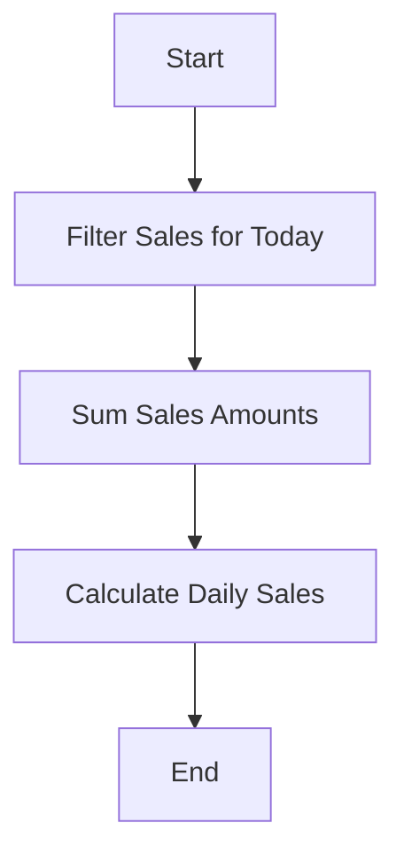

## 13.2.3 Documentation and Readability

In the realm of software development, particularly when dealing with complex systems like NoSQL databases and functional programming with Clojure, documentation and readability are paramount. They not only facilitate collaboration among developers but also ensure that the codebase remains maintainable and scalable over time. This section delves into the best practices for enhancing documentation and readability in Clojure, focusing on docstrings, comments, and strategies to avoid over-complexity.

### The Importance of Documentation and Readability

Documentation serves as the bridge between the developer's intent and the code's functionality. It helps new team members onboard quickly, assists in debugging, and ensures that the software can evolve without losing its original purpose. Readability, on the other hand, is about writing code that is easy to understand at a glance, reducing cognitive load and minimizing errors.

#### Benefits of Good Documentation and Readability

1. **Improved Collaboration:** Clear documentation allows team members to understand each other's code, facilitating better teamwork.
2. **Ease of Maintenance:** Well-documented and readable code is easier to maintain, reducing the time and cost associated with software updates.
3. **Error Reduction:** Readable code helps in identifying and fixing bugs more efficiently.
4. **Knowledge Transfer:** Documentation captures the knowledge of the original developers, aiding in knowledge transfer when team members change.

### Writing Effective Docstrings

In Clojure, docstrings are an integral part of documenting functions. They provide a concise description of what a function does, its parameters, return values, and any side effects. Docstrings are written using the `defn` syntax and are essential for generating automated documentation.

#### Structure of a Good Docstring

A well-crafted docstring should include:

- **Purpose:** A brief description of what the function does.
- **Parameters:** A list of parameters with their expected types and purpose.
- **Return Value:** Description of what the function returns.
- **Side Effects:** Any side effects the function may have.

Here is an example of a well-documented function using docstrings:

```clojure
(defn calculate-total
  "Calculates the total price of items in a shopping cart.
  
  Parameters:
  - cart: A vector of maps, each representing an item with keys :price and :quantity.
  
  Returns:
  - The total price as a double.
  
  Side Effects:
  - None."
  [cart]
  (reduce (fn [total item]
            (+ total (* (:price item) (:quantity item))))
          0
          cart))
```

### Using Comments Wisely

Comments are another tool for enhancing code readability, but they should be used judiciously. Over-commenting can clutter the code, while under-commenting can leave critical parts of the code unexplained.

#### Best Practices for Comments

1. **Explain Why, Not What:** Comments should explain the reasoning behind a piece of code, not what the code is doing. The code itself should be clear enough to convey what it does.
2. **Keep Comments Up-to-Date:** Outdated comments can be misleading. Always update comments when the associated code changes.
3. **Use Comments Sparingly:** Only comment on complex or non-obvious code. If the code is straightforward, comments may be unnecessary.

Example of effective commenting:

```clojure
;; Calculate the discount based on the user's membership level.
(defn calculate-discount
  [membership-level price]
  (let [discount-rate (case membership-level
                        :gold 0.20
                        :silver 0.10
                        :bronze 0.05
                        0.0)] ;; Default discount for non-members
    (* price (- 1 discount-rate))))
```

### Avoiding Over-Complexity

Complexity in code can hinder readability and maintainability. In Clojure, it's crucial to break down complex functions into smaller, reusable pieces and adhere to the single responsibility principle.

#### Strategies to Reduce Complexity

1. **Decompose Functions:** Break down large functions into smaller, more manageable pieces that each handle a specific task.
2. **Use Descriptive Names:** Choose clear and descriptive names for functions and variables to convey their purpose.
3. **Adopt Consistent Naming Conventions:** Consistency in naming conventions helps in understanding the code structure quickly.
4. **Leverage Clojure's Functional Paradigms:** Use higher-order functions, immutability, and pure functions to simplify logic.

Example of decomposing a complex function:

```clojure
;; Original complex function
(defn process-orders
  [orders]
  (let [filtered-orders (filter #(> (:amount %) 100) orders)
        sorted-orders (sort-by :date filtered-orders)]
    (map #(assoc % :status "processed") sorted-orders)))

;; Decomposed version
(defn filter-large-orders
  "Filters orders with an amount greater than 100."
  [orders]
  (filter #(> (:amount %) 100) orders))

(defn sort-orders-by-date
  "Sorts orders by their date."
  [orders]
  (sort-by :date orders))

(defn mark-orders-as-processed
  "Marks each order as processed."
  [orders]
  (map #(assoc % :status "processed") orders))

(defn process-orders
  "Processes a list of orders by filtering, sorting, and marking them."
  [orders]
  (-> orders
      filter-large-orders
      sort-orders-by-date
      mark-orders-as-processed))
```

### Practical Code Examples and Snippets

To further illustrate these concepts, let's explore some practical examples that demonstrate how to apply these documentation and readability practices in real-world Clojure applications.

#### Example: Documenting a Clojure Function for NoSQL Integration

Consider a function that interacts with a MongoDB database to retrieve user data. Proper documentation and readability practices are crucial here to ensure that the function's purpose and behavior are clear to other developers.

```clojure
(defn fetch-user-data
  "Fetches user data from the MongoDB database.
  
  Parameters:
  - db-connection: The database connection object.
  - user-id: The ID of the user to fetch.
  
  Returns:
  - A map containing user data, or nil if the user is not found.
  
  Side Effects:
  - Logs an error message if the database query fails."
  [db-connection user-id]
  (try
    (let [query {:user-id user-id}
          user-data (monger.collection/find-one-as-map db-connection "users" query)]
      user-data)
    (catch Exception e
      (log/error e "Failed to fetch user data for user-id:" user-id)
      nil)))
```

#### Example: Refactoring for Readability

Let's refactor a function that calculates the total sales for a given day, originally written as a single complex function, into smaller, more readable components.

```clojure
;; Original complex function
(defn calculate-daily-sales
  [sales-data]
  (reduce (fn [total sale]
            (if (= (:date sale) (today))
              (+ total (:amount sale))
              total))
          0
          sales-data))

;; Refactored version
(defn filter-sales-for-today
  "Filters sales data to include only today's sales."
  [sales-data]
  (filter #(= (:date %) (today)) sales-data))

(defn sum-sales-amounts
  "Sums the amounts of the given sales."
  [sales]
  (reduce (fn [total sale] (+ total (:amount sale))) 0 sales))

(defn calculate-daily-sales
  "Calculates the total sales for today."
  [sales-data]
  (-> sales-data
      filter-sales-for-today
      sum-sales-amounts))
```

### Diagrams and Visual Aids

Visual aids such as diagrams and flowcharts can significantly enhance the understanding of complex logic and workflows. Here, we use the Mermaid syntax to illustrate the process of filtering and processing sales data.



### Best Practices, Common Pitfalls, and Optimization Tips

#### Best Practices

- **Consistent Style:** Adhere to a consistent coding style and format to improve readability.
- **Code Reviews:** Regular code reviews can help identify areas for improvement in documentation and readability.
- **Automated Documentation Tools:** Use tools like Codox to generate documentation from docstrings automatically.

#### Common Pitfalls

- **Over-Commenting:** Avoid excessive comments that can clutter the code and become outdated.
- **Ignoring Readability for Performance:** While performance is important, it should not come at the cost of readability.

#### Optimization Tips

- **Use Descriptive Names:** Choose names that convey the purpose and usage of variables and functions.
- **Simplify Logic:** Break down complex logic into simpler, more understandable pieces.

### Conclusion

Enhancing documentation and readability in Clojure is crucial for developing scalable and maintainable NoSQL data solutions. By writing effective docstrings, using comments wisely, and avoiding over-complexity, developers can create code that is not only functional but also easy to understand and maintain. These practices, combined with regular code reviews and the use of automated tools, will ensure that your Clojure codebase remains robust and adaptable to future changes.

## Quiz Time!



### What is the primary purpose of a docstring in Clojure?

- [x] To provide a concise description of a function's purpose, parameters, return values, and side effects.
- [ ] To replace comments in the code.
- [ ] To serve as a placeholder for future documentation.
- [ ] To enforce coding standards.

> **Explanation:** Docstrings in Clojure are used to describe the purpose of a function, its parameters, return values, and any side effects it may have, aiding in documentation and readability.

### Which of the following is a best practice for using comments in Clojure?

- [x] Use comments to explain the reasoning behind complex code.
- [ ] Use comments to describe every line of code.
- [ ] Use comments to replace docstrings.
- [ ] Avoid using comments altogether.

> **Explanation:** Comments should be used to explain the reasoning behind complex or non-obvious code, not to describe every line, which can clutter the code.

### How can complex functions be made more readable in Clojure?

- [x] By decomposing them into smaller, reusable pieces.
- [ ] By adding more comments to explain the logic.
- [ ] By using more nested expressions.
- [ ] By increasing the number of parameters.

> **Explanation:** Breaking down complex functions into smaller, reusable pieces helps improve readability and maintainability.

### What is a common pitfall when using comments in code?

- [x] Over-commenting, which can clutter the code and become outdated.
- [ ] Using comments to explain complex logic.
- [ ] Keeping comments up-to-date.
- [ ] Using comments sparingly.

> **Explanation:** Over-commenting can clutter the code and lead to outdated comments, which can be misleading.

### Which tool can be used to generate documentation from Clojure docstrings?

- [x] Codox
- [ ] Javadoc
- [ ] Swagger
- [ ] Doxygen

> **Explanation:** Codox is a tool used to generate documentation from Clojure docstrings, helping automate the documentation process.

### What is the benefit of using descriptive names in code?

- [x] They convey the purpose and usage of variables and functions, improving readability.
- [ ] They reduce the need for comments.
- [ ] They increase the performance of the code.
- [ ] They enforce coding standards.

> **Explanation:** Descriptive names help convey the purpose and usage of variables and functions, making the code more readable and understandable.

### What should be included in a docstring for a function?

- [x] Purpose, parameters, return value, and side effects.
- [ ] Only the purpose of the function.
- [ ] Only the parameters and return value.
- [ ] Only the side effects.

> **Explanation:** A comprehensive docstring should include the function's purpose, parameters, return value, and any side effects.

### Why is readability important in code?

- [x] It reduces cognitive load and minimizes errors.
- [ ] It increases the execution speed of the code.
- [ ] It replaces the need for documentation.
- [ ] It allows for more complex logic.

> **Explanation:** Readability reduces cognitive load, making it easier to understand and maintain the code, which helps minimize errors.

### What is the role of code reviews in improving documentation and readability?

- [x] They help identify areas for improvement in documentation and readability.
- [ ] They are used to enforce coding standards.
- [ ] They replace the need for comments.
- [ ] They are only necessary for performance optimization.

> **Explanation:** Code reviews help identify areas for improvement in documentation and readability, ensuring the codebase remains maintainable.

### True or False: Readability should be sacrificed for performance.

- [ ] True
- [x] False

> **Explanation:** While performance is important, it should not come at the cost of readability. Readable code is easier to maintain and less prone to errors.


