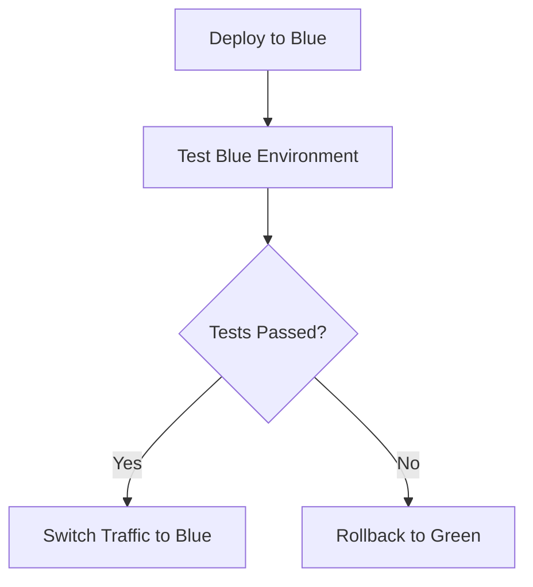
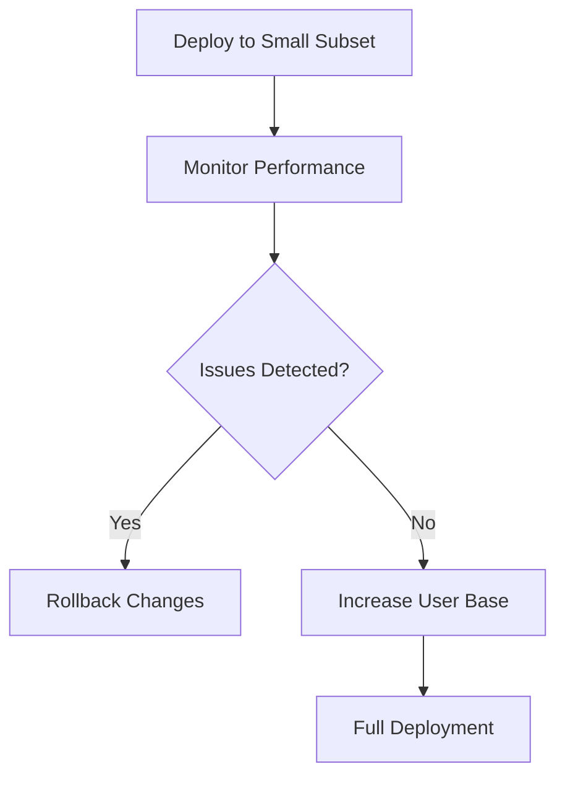

## 13.6.2 Deploying Clojure Applications

Deploying Clojure applications effectively is crucial for ensuring scalability, reliability, and maintainability in production environments. This section delves into the best practices and strategies for deploying Clojure applications, with a focus on containerization, infrastructure as code, and advanced deployment strategies. By the end of this chapter, you will have a comprehensive understanding of how to deploy Clojure applications using modern DevOps practices.

### Containerization with Docker

Containerization has revolutionized the way applications are deployed and managed. Docker, a leading containerization platform, allows developers to package applications and their dependencies into a single, portable container. This ensures consistency across development, testing, and production environments.

#### Using Docker to Package Clojure Applications

Docker simplifies the deployment process by encapsulating the application and its environment. Here's how you can containerize a Clojure application using Docker:

1. **Create a Dockerfile:**
   A Dockerfile is a script that contains a series of instructions on how to build a Docker image. For Clojure applications, you can base your Dockerfile on official JVM or Clojure images.

   ```dockerfile
   # Use the official Clojure image as a base
   FROM clojure:openjdk-11-lein

   # Set the working directory
   WORKDIR /app

   # Copy the project files
   COPY . .

   # Install dependencies and build the application
   RUN lein uberjar

   # Specify the command to run the application
   CMD ["java", "-jar", "target/myapp.jar"]
   ```

2. **Build the Docker Image:**
   Use the Docker CLI to build the image from the Dockerfile.

   ```bash
   docker build -t my-clojure-app .
   ```

3. **Run the Docker Container:**
   Once the image is built, you can run it as a container.

   ```bash
   docker run -d -p 8080:8080 my-clojure-app
   ```

#### Best Practices for Dockerizing Clojure Applications

- **Use Multi-Stage Builds:** To reduce the size of the final image, use multi-stage builds to separate the build environment from the runtime environment.
- **Keep Images Lightweight:** Start with a minimal base image and only add necessary dependencies.
- **Leverage Docker Compose:** For applications with multiple services, use Docker Compose to manage multi-container applications.

### Infrastructure as Code (IaC)

Infrastructure as Code (IaC) is a practice that involves managing and provisioning infrastructure through code, rather than manual processes. Tools like Terraform and AWS CloudFormation enable developers to define infrastructure in a declarative manner, allowing for version control and automated deployments.

#### Defining Infrastructure with Terraform

Terraform is an open-source tool that allows you to define and provision infrastructure using a simple, human-readable configuration language. Here's an example of how to define a basic infrastructure setup for a Clojure application:

```hcl
provider "aws" {
  region = "us-west-2"
}

resource "aws_instance" "web" {
  ami           = "ami-0c55b159cbfafe1f0"
  instance_type = "t2.micro"

  tags = {
    Name = "ClojureAppServer"
  }
}
```

#### Version Control for Infrastructure Configurations

- **Use Git for Version Control:** Store your Terraform or CloudFormation scripts in a Git repository to track changes and collaborate with team members.
- **Implement CI/CD Pipelines:** Automate the deployment of infrastructure changes using continuous integration and continuous deployment (CI/CD) pipelines.

### Deployment Strategies

Choosing the right deployment strategy is essential for minimizing downtime and ensuring a smooth transition between application versions. Here are some advanced deployment strategies to consider:

#### Blue-Green Deployments

Blue-Green Deployments involve maintaining two identical environments, known as Blue and Green. At any time, one environment is live, while the other is idle. When deploying a new version, you switch traffic to the idle environment, minimizing downtime.

- **Implementation Steps:**
  1. Deploy the new version to the idle environment.
  2. Run tests to ensure the new version is functioning correctly.
  3. Switch traffic to the new environment.
  4. Keep the old environment as a backup in case of issues.

- **Benefits:**
  - Zero downtime during deployment.
  - Easy rollback in case of failures.

#### Canary Releases

Canary Releases involve gradually rolling out a new version to a small subset of users before deploying it to the entire user base. This strategy allows you to monitor the new version's performance and catch potential issues early.

- **Implementation Steps:**
  1. Deploy the new version to a small percentage of servers.
  2. Monitor metrics and user feedback.
  3. Gradually increase the percentage of users receiving the new version.
  4. Fully deploy once confidence is gained.

- **Benefits:**
  - Reduced risk of widespread issues.
  - Ability to test in a real-world environment.

#### Rolling Updates

Rolling Updates involve updating a subset of instances or containers at a time, ensuring that the application remains available throughout the deployment process.

- **Implementation Steps:**
  1. Update a small number of instances.
  2. Monitor the application for any issues.
  3. Continue updating in small batches until all instances are updated.

- **Benefits:**
  - Minimal impact on application availability.
  - Gradual transition to the new version.

### Practical Code Examples and Configurations

Let's explore some practical examples and configurations for deploying Clojure applications using the strategies discussed above.

#### Docker Compose for Multi-Container Applications

For applications that consist of multiple services, Docker Compose can be used to define and run multi-container Docker applications.

```yaml
version: '3'
services:
  app:
    build: .
    ports:
      - "8080:8080"
  database:
    image: postgres
    environment:
      POSTGRES_USER: user
      POSTGRES_PASSWORD: password
```

#### Terraform for Automated Infrastructure Provisioning

Here's a more advanced Terraform configuration that includes networking and security groups:

```hcl
provider "aws" {
  region = "us-west-2"
}

resource "aws_vpc" "main" {
  cidr_block = "10.0.0.0/16"
}

resource "aws_subnet" "subnet" {
  vpc_id     = aws_vpc.main.id
  cidr_block = "10.0.1.0/24"
}

resource "aws_security_group" "web" {
  vpc_id = aws_vpc.main.id

  ingress {
    from_port   = 80
    to_port     = 80
    protocol    = "tcp"
    cidr_blocks = ["0.0.0.0/0"]
  }
}

resource "aws_instance" "web" {
  ami           = "ami-0c55b159cbfafe1f0"
  instance_type = "t2.micro"
  subnet_id     = aws_subnet.subnet.id
  security_groups = [aws_security_group.web.name]

  tags = {
    Name = "ClojureAppServer"
  }
}
```

### Diagrams and Flowcharts

To better understand the deployment strategies, let's visualize them using flowcharts.

#### Blue-Green Deployment Flowchart



#### Canary Release Flowchart



### Best Practices and Common Pitfalls

- **Automate Everything:** Use CI/CD pipelines to automate testing, building, and deployment processes.
- **Monitor Continuously:** Implement monitoring and logging to detect and resolve issues quickly.
- **Test Thoroughly:** Always test new versions in a staging environment before deploying to production.
- **Plan for Rollbacks:** Ensure you have a rollback plan in place in case of deployment failures.

### Conclusion

Deploying Clojure applications requires a combination of modern tools and strategies to ensure reliability and scalability. By leveraging containerization with Docker, defining infrastructure as code with Terraform, and implementing advanced deployment strategies like Blue-Green Deployments and Canary Releases, you can achieve seamless and efficient deployments. Remember to automate processes, monitor applications, and plan for contingencies to maintain high availability and performance.

## Quiz Time!



### What is the primary benefit of using Docker for deploying Clojure applications?

- [x] Consistency across environments
- [ ] Faster execution speed
- [ ] Reduced memory usage
- [ ] Enhanced security

> **Explanation:** Docker ensures that applications run consistently across different environments by packaging them with all their dependencies.

### Which tool is used for defining infrastructure as code in a declarative manner?

- [ ] Ansible
- [x] Terraform
- [ ] Jenkins
- [ ] Kubernetes

> **Explanation:** Terraform is a tool that allows you to define infrastructure as code using a declarative configuration language.

### What is a key advantage of Blue-Green Deployments?

- [x] Zero downtime during deployment
- [ ] Faster deployment speed
- [ ] Reduced resource usage
- [ ] Enhanced security

> **Explanation:** Blue-Green Deployments allow you to switch traffic between environments, ensuring zero downtime during deployment.

### In a Canary Release, what is the purpose of deploying to a small subset of users first?

- [x] To monitor performance and catch issues early
- [ ] To reduce deployment time
- [ ] To save on resources
- [ ] To enhance security

> **Explanation:** Deploying to a small subset of users allows you to monitor the new version's performance and catch potential issues before a full rollout.

### Which deployment strategy involves updating a subset of instances at a time?

- [ ] Blue-Green Deployments
- [ ] Canary Releases
- [x] Rolling Updates
- [ ] Hotfix Deployments

> **Explanation:** Rolling Updates involve updating a subset of instances or containers at a time to ensure continuous availability.

### What is a common practice to reduce Docker image size?

- [x] Use multi-stage builds
- [ ] Add more dependencies
- [ ] Use a larger base image
- [ ] Include all development tools

> **Explanation:** Multi-stage builds help reduce Docker image size by separating the build environment from the runtime environment.

### How can infrastructure configurations be version controlled?

- [ ] By storing them in a database
- [x] By using Git
- [ ] By writing them in a spreadsheet
- [ ] By emailing them to team members

> **Explanation:** Infrastructure configurations can be stored in a Git repository to track changes and collaborate with team members.

### What is the role of Docker Compose in multi-container applications?

- [x] To define and run multi-container applications
- [ ] To build Docker images
- [ ] To monitor container performance
- [ ] To secure Docker containers

> **Explanation:** Docker Compose is used to define and run multi-container Docker applications, managing multiple services.

### Which tool is commonly used to automate the deployment of infrastructure changes?

- [ ] Docker
- [x] Jenkins
- [ ] Kubernetes
- [ ] Ansible

> **Explanation:** Jenkins is commonly used to automate the deployment of infrastructure changes through CI/CD pipelines.

### True or False: Canary Releases allow for a full deployment to all users immediately.

- [ ] True
- [x] False

> **Explanation:** Canary Releases involve gradually rolling out changes to a subset of users before a full deployment.


